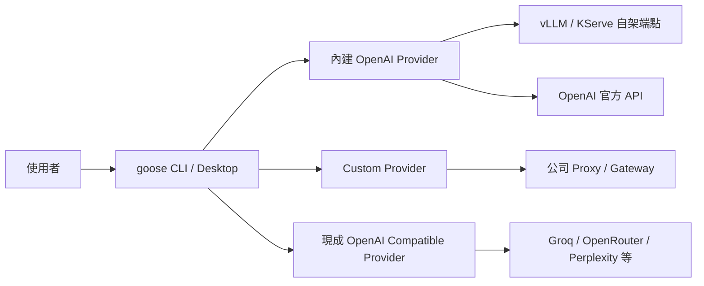

# goose 設定 OpenAI Compatible API 作為 LLM Provider

> 調查日期：2026-09-09
> 關鍵字：goose、OpenAI Compatible、Custom Provider、LLM Provider 設定

---

## 概述

goose 是一款開放原始碼的 AI Agent（人工智慧代理），由區塊鏈支付公司 Block 開發，並於 2026 年 4 月 7 日捐贈給 Linux Foundation 旗下新成立的 Agentic AI Foundation（AAIF，代理人工智慧基金會），與 Anthropic 的 Model Context Protocol（MCP）及 OpenAI 的 AGENTS.md 一同成為該基金會錨定專案[^aaif][^press]。捐贈後原始碼儲存庫由 `block/goose` 遷移至 `https://github.com/aaif-goose/goose`，官方文件網域改為 `https://goose-docs.ai/`，舊網址會自動轉址[^aaif]。

goose 支援多種 LLM Provider，其中 **OpenAI** 內建 Provider 可直接連接 OpenAI 官方 API 或任何 **OpenAI Compatible**（OpenAI 相容）端點，例如自架 vLLM、KServe、私有 OpenAI 相容伺服器、企業部署或 OpenAI API 代理／閘道（proxy／gateway）等[^providers]。此外也提供 **Custom Provider** 機制，讓使用者定義多個自訂的 OpenAI 相容端點並自由切換[^providers]。

goose 高度依賴模型的工具呼叫（tool calling）能力，目前官方文件建議以 Claude 4 系列模型獲得最佳效果，並可參考 Berkeley Function-Calling Leaderboard 作為模型選用指南[^providers]。



---

## 方法一：使用內建 OpenAI Provider（最簡單）

直接將 OpenAI Provider 指向自訂端點即可連接任何 OpenAI 相容 API。當只需要連接**單一**端點時，這是最快的做法[^providers]。

### 設定參數

| 參數 | 必要 | 說明 |
|------|------|------|
| `OPENAI_API_KEY` | 是 | API 金鑰 |
| `OPENAI_HOST` | 否 | 自訂 API 網址，預設 `https://api.openai.com` |
| `OPENAI_BASE_PATH` | 否 | 附加在 Host 後的請求路徑，預設 `v1/chat/completions`。少數代理服務掛在 `chat/completions`（無 `v1`）時需調整；若收到 `404`，通常代表此路徑設定錯誤 |
| `OPENAI_ORGANIZATION` | 否 | 組織 ID，用於用量追蹤與治理 |
| `OPENAI_PROJECT` | 否 | 專案 ID，用於資源管理 |
| `OPENAI_CUSTOM_HEADERS` | 否 | 自訂 Header，格式：`HEADER_A=VALUE_A,HEADER_B=VALUE_B`，可透過環境變數、設定檔或 CLI 設定 |
| `OPENAI_STORE` | 否 | 是否儲存 Responses API 回應以便日後查詢，預設 `false` |

以上參數表整理自官方文件[^providers]。

### 設定步驟

**CLI 方式：**執行 `goose configure`，選擇 `Configure Providers`，選取 `OpenAI`，接著依提示輸入 API Key、Host URL、Organization ID 與 Project 等欄位即可[^providers]。

**Desktop 方式：**開啟側邊欄的 `Settings` → `Models` 分頁 → `Configure providers` → 點選 `OpenAI` → 填入 API Key 與 Host URL 等資訊 → `Submit`[^providers]。

### 情境範例

| 情境 | 設定 |
|------|------|
| vLLM 自架 | `OPENAI_HOST=https://your-vllm-endpoint.internal` |
| KServe 部署 | `OPENAI_HOST=https://kserve-gateway.your-cluster`，另可加上 `OPENAI_ORGANIZATION` 與 `OPENAI_PROJECT` |
| 企業 OpenAI 治理 | 加上 `OPENAI_ORGANIZATION` 與 `OPENAI_PROJECT` |
| 需要自訂 Header | 設定 `OPENAI_CUSTOM_HEADERS="X-Header-A=abc,X-Header-B=def"` |

以上範例整理自官方文件[^providers]。

> **注意**：若要連接 LiteLLM proxy，有兩種方式（**二選一，不可混用**）[^providers]：
> 1. 使用 OpenAI Provider：設 `OPENAI_HOST` 為 proxy root（不帶尾端路徑），`OPENAI_BASE_PATH` 為該 proxy 服務的路徑（通常是 `v1/chat/completions`）。
> 2. 使用專屬 LiteLLM Provider：設 `LITELLM_HOST`、`LITELLM_BASE_PATH`（選用）、`LITELLM_API_KEY`（選用）、`LITELLM_CUSTOM_HEADERS`（選用）與 `LITELLM_TIMEOUT`（選用）。
>
> 若收到 `401` 且訊息為 `No api key passed in`，代表 API Key 未被載入（例如把 Key 放在 `config.yaml`，而該檔案會被忽略），請參閱官方文件的 Security Considerations 說明[^providers]。

---

## 方法二：建立 Custom Provider（推薦，可管理多個端點）

當需要連接多個 OpenAI 相容端點、或希望自訂顯示名稱以便在 UI 切換時，使用 Custom Provider。Custom Provider 必須使用 OpenAI、Anthropic 或 Ollama 相容的 API 格式，每個 Custom Provider 對應一個 JSON 設定檔[^providers]。

### 優點

- 可同時設定多個端點（如 vLLM、公司 Proxy、OpenAI 官方），並自由切換[^providers]
- 可預先儲存模型清單[^providers]
- 可自訂名稱（例如顯示「公司內部 API」而非「OpenAI」）[^providers]
- 設定檔為 JSON，可團隊共享或納入版控[^providers]
- 每個 Provider 擁有獨立 API Key[^providers]

### ① CLI 互動式設定

執行 `goose configure`，選取 `Custom Providers`，再選 `Add A Custom Provider`，依提示輸入[^providers]：

1. **API Type** → 選擇 `OpenAI Compatible`（最常見），另有 `Anthropic Compatible` 與 `Ollama Compatible`
2. **Name** → 自訂名稱（如 `custom_corp_api`）
3. **API URL** → 端點 Base URL
4. **Authentication Required** → 是否需要 API Key
   - 是：可選擇 **Static API key**（靜態，儲存於系統 keychain，keyring 停用或無法存取時改存 `secrets.yaml`）或 **Command (refreshable)**（指令動態取得，適合 IdP 或 key vault 核發的短期憑證）
   - 否：跳過 API Key 提示（例如本機 Ollama、vLLM 或內部 API）
5. **Available Models** → 逗號分隔的模型名稱
6. **Streaming Support** → 是否支援串流
7. **Custom Headers** → 額外的 Header（目前僅 OpenAI Compatible 類型的 Provider 可在 CLI 中設定；Anthropic 與 Ollama 型需事後編輯設定檔）

### ② Desktop UI 方式

`Settings` → `Models` → `Configure providers` → 畫面底部 `Add Custom Provider` → 選擇 **OpenAI Compatible** → 填寫 Provider Type、Display Name、API URL、Authentication（API Key，若無需授權則取消勾選「This provider requires an API key」）、Available Models（逗號分隔）與 Streaming Support → `Create Provider`[^providers]。

> **限制**：目前 goose Desktop 無法定義 Custom Headers，需在建立後編輯 Provider 設定檔[^providers]。

### ③ 直接寫設定檔

在 Custom Provider 目錄下建立 JSON 檔案（目錄位置見下方「設定檔位置」節），範例如下[^providers]：

```json
{
  "name": "custom_corp_api",
  "engine": "openai",
  "display_name": "Corporate API",
  "description": "Custom Corporate API provider",
  "api_key_env": "CUSTOM_CORP_API_API_KEY",
  "base_url": "https://api.company.com/v1/chat/completions",
  "models": [
    {
      "name": "gpt-4o",
      "context_limit": 128000
    },
    {
      "name": "gpt-3.5-turbo",
      "context_limit": 16385
    }
  ],
  "headers": {
    "x-origin-client-id": "YOUR_CLIENT_ID",
    "x-origin-secret": "YOUR_SECRET_VALUE"
  },
  "supports_streaming": true,
  "requires_auth": true
}
```

**使用方式：**利用 `api_key_env` 指定的環境變數設定 Key，再以 `--provider` 旗標啟動 session[^providers]：

```sh
export CUSTOM_CORP_API_API_KEY="your-api-key"
goose session start --provider custom_corp_api
```

> 若要將 API Key 安全存入 keychain，可在 goose Desktop 中更新該 Provider 並輸入 Key，即可讓 goose 原生連接該 Provider[^providers]。

### 指令式動態認證（Command-Based Authentication）

若使用短期憑證（如 IdP 或 key vault 核發的 token），可在 Provider 的 JSON 設定中加入 `auth` 物件（**與 `api_key_env` 互斥，只能擇一**），讓 goose 在憑證過期時自動重新執行指令取得新憑證，而不需重啟[^providers]：

```json
{
  "name": "custom_corp_api",
  "engine": "openai",
  "display_name": "Corporate API",
  "base_url": "https://api.company.com/v1/chat/completions",
  "models": [{ "name": "gpt-4o", "context_limit": 128000 }],
  "requires_auth": true,
  "auth": {
    "command": "/path/to/get-token.sh",
    "args": [],
    "refresh_interval": 3600,
    "timeout_seconds": 10
  }
}
```

| 參數 | 說明 |
|------|------|
| `command` | 執行檔路徑。直接 spawn，不經 shell 展開，`command`／`args` 皆不會做 shell 插值。若腳本需要 shell 功能，請明確呼叫直譯器（如 `"command": "/bin/bash", "args": ["-c", "..."]`）。不含路徑分隔符的裸名稱（如 `"get-token"`）會在 `PATH` 中查詢；相對路徑（如 `"./scripts/get-token.sh"`）會以 `cwd` 為基準解析 |
| `args` | 選用，傳給指令的參數 |
| `refresh_interval` | 選用，憑證快取時間（秒），預設 `3600`。設 `0` 表示關閉主動更新，僅在被 API 以驗證錯誤拒絕時被動重新取得 |
| `timeout_seconds` | 選用，指令超時秒數，預設 `10` |
| `cwd` | 選用，指令的工作目錄，同時也是相對 `command` 路徑的解析基準。預設為 goose 目前的目錄 |

指令的 trim 後標準輸出即為憑證值。指令必須成功結束並輸出非空內容；失敗時 goose 會回報錯誤，而非默默沿用過期憑證。指令繼承 goose 的完整環境變數。以上整理自官方文件[^providers]。

### 更新與移除 Custom Provider

| 操作 | Desktop | CLI | 直接編輯 |
|------|---------|-----|----------|
| 更新 | `Configure providers` → 點選 Provider → 修改欄位 → `Update Provider` | `goose configure` → `Configure Providers` → 選取該 Provider → 依提示更新 | 編輯 `custom_providers` 目錄下的 JSON 檔，於下次 session 生效 |
| 移除 | `Configure providers` → 點選 Provider → `Delete Provider` → `Confirm Delete` | `goose configure` → `Custom Providers` → `Remove Custom Provider` → 選取要移除的 Provider | 刪除 JSON 檔 |

CLI 移除動作會一併刪除設定檔與 keychain 中儲存的 Key；若 Provider 的 API Key 儲存在 keychain，建議使用 CLI 移除以確保 Key 一併清除[^providers]。

### 已知問題：CLI 更新 Custom Provider 顯示 base engine 欄位

截至 2025 年 12 月，goose CLI 的 `Configure Providers` 流程中，選取 Custom Provider 後會顯示其底層 engine 的設定變數（例如 OpenAI 相容型會顯示 `OPENAI_HOST`、`OPENAI_BASE_PATH`），而非建立時使用的 `API URL` 等欄位；對這些底層變數的修改不會寫入 Custom Provider 的 JSON 設定檔。目前的 workaround 為：移除後重建 Provider、改用 goose Desktop，或直接編輯 `custom_providers` 目錄下的 JSON 設定檔[^issue6049]。

---

## 方法三：使用其他現成 Provider（不需設定端點）

部分現成 Provider 本質上就是 OpenAI Compatible，直接設定 API Key 即可使用[^providers]：

| Provider | 環境變數 |
|----------|----------|
| AI/ML API | `AIMLAPI_API_KEY` |
| Atomic Chat（本機） | 無（預設連接 localhost:1337） |
| Avian | `AVIAN_API_KEY`（`AVIAN_HOST` 選用） |
| Docker Model Runner（本機） | `OPENAI_HOST`、`OPENAI_BASE_PATH` |
| EmpirioLabs AI | `EMPIRIOLABS_API_KEY` |
| FuturMix | `FUTURMIX_API_KEY` |
| Gondola | `GONDOLA_API_KEY`（`GONDOLA_HOST` 選用） |
| Groq | `GROQ_API_KEY` |
| LM Studio（本機） | 無（預設連接 localhost:1234） |
| Novita AI | `NOVITA_API_KEY` |
| Ollama（本機） | `OLLAMA_HOST` |
| OpenRouter | `OPENROUTER_API_KEY`（`OPENROUTER_HOST`、`OPENROUTER_PARAMETERS` 選用） |
| Perplexity | `PERPLEXITY_API_KEY` |
| Routstr | `ROUTSTR_API_KEY`（`ROUTSTR_HOST` 選用，預設 `https://api.routstr.com`） |
| SayGM | `SAYGM_API_KEY` |
| TrustedRouter | `TRUSTEDROUTER_API_KEY` |
| Venice AI | `VENICE_API_KEY`（`VENICE_HOST`、`VENICE_BASE_PATH`、`VENICE_MODELS_PATH` 選用） |
| xAI | `XAI_API_KEY`（`XAI_HOST` 選用） |

其中 Atomic Chat、Docker Model Runner、LM Studio 與 Ollama 屬本機執行，需先下載模型才能使用[^providers]。完整清單隨版本持續擴充，請以官方文件的 Available Providers 表格為準[^providers]。

---

## 設定檔位置

| 項目 | 路徑 |
|------|------|
| Custom Provider JSON（macOS／Linux） | `~/.config/goose/custom_providers/` |
| Custom Provider JSON（Windows） | `%APPDATA%\Block\goose\config\custom_providers\` |
| 主要設定檔 config.yaml（macOS／Linux） | `~/.config/goose/config.yaml` |
| 主要設定檔 config.yaml（Windows） | `%APPDATA%\Block\goose\config\config.yaml` |

以上路徑整理自官方文件[^providers][^config]。

goose 的主要設定檔為 YAML 格式，Provider 設定存放在 `active_provider` 與 `providers` 兩個 key 之下，例如：

```yaml
active_provider: anthropic
providers:
  anthropic:
    enabled: true
    model: claude-sonnet-4-5-20250929
    configured: true
```

`GOOSE_PROVIDER` 與 `GOOSE_MODEL` 仍可作為環境變數覆寫設定檔內容（僅對當前程序生效）。API Key 與機密存放於 `secrets.yaml`（當 goose 使用檔案式機密儲存時）或系統 keychain[^config]。

### 模型名稱限制

`goose configure` 不支援輸入自訂模型名稱；若要使用 Provider 清單以外的模型，請改用 goose Desktop，或直接在 `config.yaml` 中編輯 `GOOSE_MODEL` 變數[^providers]。

---

## 其他相關功能

### Multi-Model：Planner 與執行模型分離

goose 支援替規劃模式（planning mode）指定不同的 Provider 與模型，讓策略規劃與任務執行可使用不同模型（例如規劃用較強模型、執行用較快較便宜的模型），可藉由環境變數設定[^env]：

```sh
export GOOSE_PLANNER_PROVIDER="openai"
export GOOSE_PLANNER_MODEL="gpt-4"
```

若未設定 `GOOSE_PLANNER_PROVIDER`／`GOOSE_PLANNER_MODEL`，規劃模式會回退使用主要的 `GOOSE_PROVIDER`／`GOOSE_MODEL`[^env]。在 CLI 中可透過 `/plan` 進入規劃模式、以 `/endplan` 結束並交由執行模型實作[^multi-model]。過去的 Lead/Worker 自動分工機制已移除，由上述 Planning Mode 取代[^multi-model]。

### Subagents：隔離 Session 委派任務

Subagent 是獨立的 goose 實例，用於執行任務並讓主對話保持乾淨聚焦，可依序或平行執行（平行執行需等待全部完成，若有任一失敗僅保留成功的結果；預設逾時 5 分鐘）[^subagent]。goose 在自動權限模式下可自主決定生成 subagent，也可用自然語言要求（例如「Use 2 subagents to create hello.html and goodbye.html in parallel」）[^subagent]。

內部 subagent 使用目前 session 的 context 與 extensions，且**繼承父 agent 的 Provider 設定**；官方曾收到功能請求，希望透過 `GOOSE_SUBAGENT_PROVIDER` 等環境變數讓 subagent 使用不同 Provider 或模型（orchestrator-worker 模式），該 issue 已關閉，目前 subagent 仍沿用父 agent 的 Provider 組態[^subagent][^issue3938]。

### 模型推理過程（思考鏈）查看

goose CLI 可顯示模型的內部推理過程，啟用方式為設定 `GOOSE_CLI_SHOW_THINKING=1`；goose Desktop 則會自動以可收合的「Show reasoning」切換鈕顯示，不需設定環境變數[^env]。部分模型（如 DeepSeek-R1、Kimi、Gemini）會暴露其內部推理過程[^env]。

Claude 模型另有 `CLAUDE_THINKING_TYPE`（`adaptive`／`enabled`／`disabled`，支援 Anthropic 與 Databricks Provider）控制推理模式，且需搭配 `GOOSE_CLI_SHOW_THINKING=1` 才能在 CLI 顯示思考輸出[^env]。

> **已知限制**：截至 2026 年 8 月，有使用者回報透過 OpenRouter 使用 DeepSeek V4 Flash 時，即便設定 `GOOSE_CLI_SHOW_THINKING=1`，CLI 仍未顯示思考 tokens，但同一 session 在 Desktop 上可正常顯示，此問題仍在處理中[^issue11138]。

---

## 參考資料

[^providers]: goose 官方文件. (2026). Configure LLM Provider. Retrieved 2026-09-09, from https://goose-docs.ai/docs/getting-started/providers/
[^env]: goose 官方文件. (2026). Environment Variables. Retrieved 2026-09-09, from https://goose-docs.ai/docs/guides/environment-variables/
[^config]: goose 官方文件. (2026). Configuration Files. Retrieved 2026-09-09, from https://goose-docs.ai/docs/guides/config-files/
[^subagent]: goose 官方文件. (2026). Subagents. Retrieved 2026-09-09, from https://goose-docs.ai/docs/guides/context-engineering/subagents/
[^multi-model]: goose 官方文件. (2026). Multi-Model Configuration. Retrieved 2026-09-09, from https://goose-docs.ai/docs/guides/multi-model/
[^aaif]: goose 官方部落格. (2026, April 7). goose has moved to the Agentic AI Foundation (AAIF). Retrieved 2026-09-09, from https://goose-docs.ai/blog/2026/04/07/goose-moves-to-aaif/
[^press]: Linux Foundation. (2026, April 7). Linux Foundation Announces the Formation of the Agentic AI Foundation (AAIF), Anchored by New Project Contributions Including Model Context Protocol (MCP), Goose, and AGENTS.md. Retrieved 2026-09-09, from https://aaif.io/press/linux-foundation-announces-the-formation-of-the-agentic-ai-foundation-aaif-anchored-by-new-project-contributions-including-model-context-protocol-mcp-goose-and-agents-md/
[^issue6049]: dianed-square. (2025, December 10). CLI: Configure Providers shows base engine fields (OPENAI_HOST) for custom providers. Retrieved 2026-09-09, from https://github.com/aaif-goose/goose/issues/6049
[^issue3938]: vibinash. (2025, August 8). Custom Provider Configurations for Subagents. Retrieved 2026-09-09, from https://github.com/aaif-goose/goose/issues/3938
[^issue11138]: vishesh-sarinDXB. (2026, August 11). GOOSE_CLI_SHOW_THINKING not working for DeepSeek model through OpenRouter. Retrieved 2026-09-09, from https://github.com/aaif-goose/goose/issues/11138