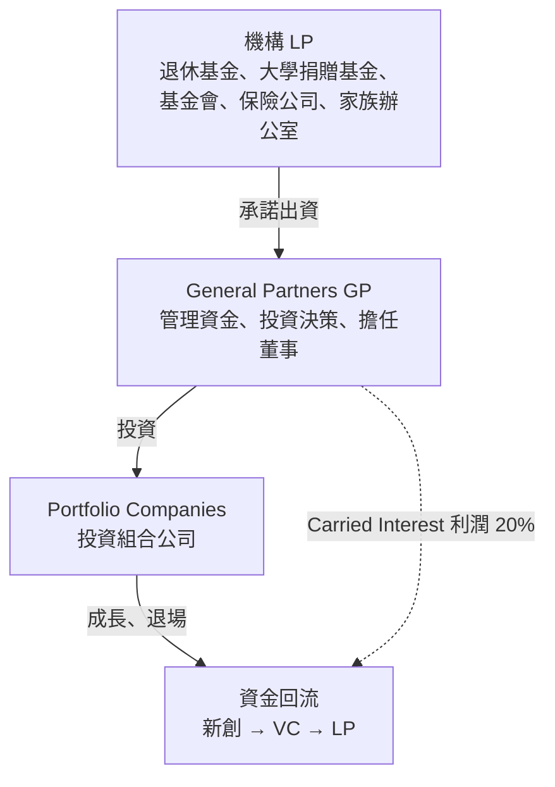
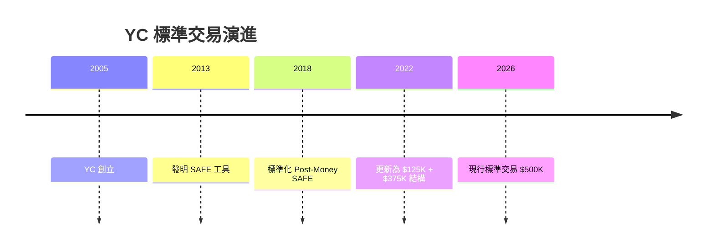
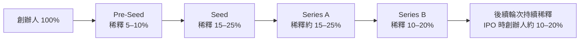
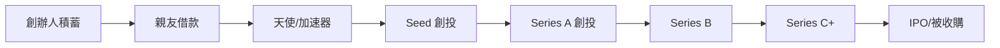
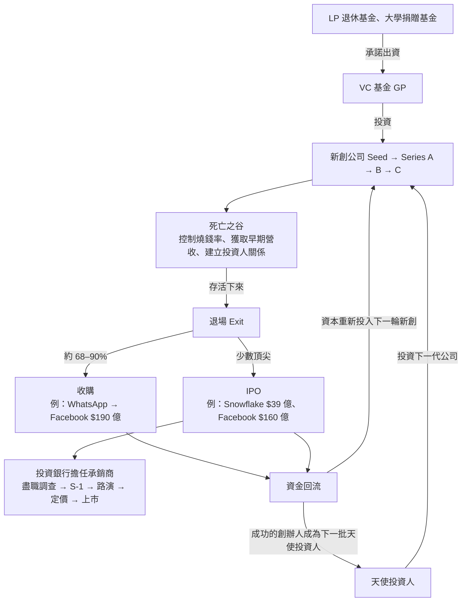

# 美國新創與金融體系完整解析

> 調查日期：2026-09-09
> 關鍵字：新創生態系、創投（Venture Capital）、Y Combinator、募資輪次、死亡之谷、IPO、投資銀行

---

## 目錄

1. [美國新創生態系總覽](#1-美國新創生態系總覽)
2. [主要參與者](#2-主要參與者)
3. [YC（Y Combinator）是什麼？](#3-ycy-combinator是什麼)
4. [什麼是「輪」（Rounds）？](#4-什麼是輪rounds)
5. [資金如何流動？](#5-資金如何流動)
6. [死亡之谷（Valley of Death）](#6-死亡之谷valley-of-death)
7. [退場機制：收購 vs. IPO](#7-退場機制收購-vs-ipo)
8. [投資銀行的角色](#8-投資銀行的角色)
9. [完整資金循環](#9-完整資金循環)
10. [參考資料](#10-參考資料)

---

## 1. 美國新創生態系總覽

美國的新創生態系是全球規模最大、運作最成熟的創業金融體系，核心在**矽谷（Silicon Valley）**。這是一個由創辦人、投資人、律師、銀行、加速器共同構成的網絡，目標是將創新的點子轉化為可規模化的商業公司[^siliconvalley]。

### 矽谷模式成功的關鍵支柱

- **頂尖大學**：史丹佛（Stanford）與柏克萊（UC Berkeley）位居創業人才的主要來源，矽谷與這兩所大學的緊密連結是其生態系的重要基礎[^siliconvalley]
- **創投合夥模式**：有限合夥（Limited Partnership）制度讓 GP（創投合夥人）能向 LP（機構投資人）募集大筆資金，同時保有投資決策權；此模式是創投產業專業化與動員機構資金的關鍵[^lp]
- **專業集中度**：新創律師、有經驗的 CFO、已退場的前創辦人天使投資人、高階獵頭，全都集中在矽谷一帶，形成高度聚集的專業網絡[^siliconvalley]
- **風險容忍文化**：「快速失敗、快速學習」的矽谷文化讓失敗過的創辦人往往能再次獲得投資，因為市場重視他們的經驗
- **網絡效應**：每當有創辦人成功退場（Exit），就會誕生新的天使投資人，這些人手上有現金的前創辦人再投資下一代公司，形成自我循環

> **具體案例**：Peter Thiel 在 eBay 於 2002 年以 **15 億美元** 收購 PayPal 後獲利了結[^thiel]，2004 年以 **50 萬美元** 天使投資 Facebook，成為其首位外部投資人[^facebookangels]，後來與其他 PayPal 校友共同創立創投公司 **Founders Fund**，投資了 SpaceX、Airbnb 與 Stripe 等公司。

---

## 2. 主要參與者

| 角色 | 說明 | 典型投資/服務規模 |
|------|------|-------------------|
| **天使投資人（Angel Investors）** | 高資產淨值個人，用自己的錢投資最早期的新創 | $25K – $500K |
| **創投公司（VCs）** | 向機構投資人募資後，專業投資高成長新創 | $500K – $500M+ |
| **加速器（Accelerators）** | 短期的育成計畫，提供資金、導師與人脈 | $125K + $375K（YC）、換 7% 股權 |
| **特殊銀行（SVB）** | 矽谷銀行（Silicon Valley Bank）長期為尚未獲利的新創提供貸款和銀行服務；2023 年 3 月倒閉後，其存款與貸款由 **First Citizens Bank** 接手[^svb] | 額度依公司狀況 |
| **律師事務所** | 負責公司設立（Delaware C-Corp）、SAFE 發行、Term Sheet 談判、智慧財產權、IPO S-1 文件 | 按時計費或收取成功費 |

### 知名創投公司

- **Sequoia Capital** — 投資了 Apple、Google、WhatsApp、Stripe、DoorDash
- **Andreessen Horowitz（a16z）** — 投資了 Coinbase、Airbnb、Facebook
- **Benchmark** — 投資了 Uber、eBay、Twitter
- **Accel** — 投資了 Facebook、Atlassian、Slack

### 創投的內部結構（有限合夥制）

VC 基金採用**有限合夥（Limited Partnership）**結構：機構投資人作為有限合夥人（LP）出資但不參與決策，創投專業人士作為普通合夥人（GP）管理資金並做出投資決策[^lp]。典型結構如下：

**資金承諾（Capital Commitment）**：LP 並非一次性放款，而是「承諾」出資，依 GP 的投資需求分期注入。VC 基金的生命週期通常約 **10 年**，期間將資金配置到投資組合公司，退場後收益依比例回流 LP，GP 則保留約 **20% 的利潤**作為績效報酬（Carried Interest / Carry）[^vcfund]。

---

## 3. YC（Y Combinator）是什麼？

### 基本介紹

**Y Combinator（YC）** 是美國的科技新創加速器兼創投公司，2005 年 3 月由 **Paul Graham、Jessica Livingston、Robert Tappan Morris、Trevor Blackwell** 創立，以「一次性同時投資一批新創」的新模式開啟創業融資的新頁[^ycstart][^wikipedia]。

截至 2026 年，YC 已投資超過 **5,600 家公司**，合計估值超過 **6,000 億美元**[^wikipedia]。

### 著名 YC 校友公司

| 公司 | 行業 |
|------|------|
| Airbnb | 住宿共享 |
| Stripe | 支付處理 |
| DoorDash | 美食外送 |
| Coinbase | 加密貨幣交易所 |
| Reddit | 社群論壇 |
| Dropbox | 雲端儲存 |
| Instacart | 生鮮雜貨外送 |
| Twitch | 遊戲直播 |
| Scale AI | AI 數據標註 |

YC 已培育超過 **100 家獨角獸**（估值 $10 億美元以上的公司）；截至 2026 年，YC 投資組合中已有 **113 家** 美國公司在達到 10 億美元估值前獲得其支持[^unicorns]。

YC 現任 CEO 是 **Garry Tan**，他於 2023 年 1 月接任總裁兼執行長，同時是 YC 的 General Partner[^garrytan]。YC 也營運 **Hacker News**（知名科技新聞社群）。

---

### YC 的加速器運作方式

#### 批次結構（Batch）

YC 每年舉辦**四批次**（冬季、春季、夏季、秋季），每期約 **3 個月**，在舊金山實體進行[^ycsite]。2025 年起 YC 從每年兩批改為四批，每批錄取約 150–200 家公司[^acceptance]。

#### 課程期間發生什麼事

| 環節 | 說明 |
|------|------|
| **小組與導師** | 新創被分成小組，由一位 YC 合夥人帶領 |
| **Office Hours** | 一對一或小組會議，與 YC 合夥人定期開會 |
| **每週晚餐/聚會** | 由知名創辦人（Airbnb、Stripe、OpenAI、DoorDash）主講，嚴禁錄音外洩 |
| **Bookface** | YC 創辦人間的專屬社群網絡 — 結合了 Facebook、Quora 和 LinkedIn 的功能，也是創辦人與合夥人預約 Office Hours 與取得資源的主要管道[^bookface] |
| **三天啟動營** | 實體新生訓練，設定目標、建立社群感 |
| **公開發表協助** | 協助在 Product Hunt、Hacker News 和媒體上發表 |
| **首批客戶** | 許多 B2B 新創的前 40–50 位付費客戶來自 YC 社群 |
| **$1,200 萬+ 免費額度** | 來自 OpenAI、Anthropic、AWS、Google Cloud、Azure、Stripe 等 100+ 廠商 |
| **Demo Day** | 期末活動，創辦人向約 1,000+ 位受邀投資人簡報 |

#### 校友網絡

YC 校友社群是創業界最強大的網絡之一 — 5,000+ 位創辦人，有著強烈的互惠文化，且 **Office Hours 在課程結束後仍持續提供，終生有效**。

---

### YC 申請流程

#### 步驟 1：線上申請表

創辦人透過 [apply.ycombinator.com](https://www.ycombinator.com/apply) 提交詳細申請，每個批次限投一件[^faq]。YC 尋找的關鍵特質：

- **真實的 traction（動能）** — 用戶數、營收、成長數據（不是只有計畫）
- **清晰度** — 你能用一句話解釋你的點子嗎？
- **強大的創辦團隊** — 技術能力、互補技能
- **執行速度** — 每隔幾天就推出新功能

#### 步驟 2：短影片

創辦人介紹自己和共同創辦人，展現團隊默契和真實性。YC 想看團隊如何協作以及如何呈現產品。

#### 步驟 3：面試（Interview）

有潛力的申請者受邀進行約 **10 分鐘的視訊面試**，由 2–3 位 YC 合夥人進行[^interview]。YC 合夥人會深入了解客戶理解、迭代速度和團隊動態。

#### 截止與錄取率

YC 的錄取率約 **1%**，每年四批各有 10,000–20,000 件申請，每批錄取 150–200 家[^acceptance]。申請全年接受，滾動式審核[^faq]。

---

### Demo Day

Demo Day 是每批 YC 的期末重點活動，創辦人向**僅限受邀的頂尖投資人和媒體**進行簡報[^demodayfaq]。

**格式**：每家新創進行 **60 秒簡報** — 精簡且高衝擊，Demo Day 投影片建議僅 5–7 頁[^pitchdeck]。投資人在舊金山現場觀看也有遠端入口；真正重要的投資人會議大多集中在簡報後的 72 小時內發生[^stackmatix]。

**Demo Day 之後**：YC 會密切協助新創進行募資，幫忙解讀投資人訊號、創造投資人之間的價格競爭。由於 YC 新創是「已知品質」，通常能獲得比同儕更高的估值。

---

### YC 標準交易條件（2026 年）

YC 的標準交易是**不可議價的**，提供給每一家錄取的公司[^deal]：

#### $500K 拆分

| 部分 | 金額 | 條件 |
|------|------|------|
| **第一部分** | **$125,000** | 轉換為 **7% 固定股權**（Post-Money SAFE） |
| **第二部分** | **$375,000** | **無上限最優惠條款 SAFE**（Uncapped MFN SAFE）— 在你下一輪有價格的募資輪中，以最優惠條件轉換 |

#### 稀釋計算

- $125K 部分立即給 YC **7%**
- $375K MFN 部分在後續輪次稀釋。例如：若你以 $2,000 萬 Post-Money 估值完成種子輪，則 $375K 轉換為較低比例
- **YC 的總稀釋通常在約 8–9%**

#### 關鍵條款

- **無董事席次** — YC 不佔董事會席位
- **無費用** — YC 不收課程費用（不像某些其他加速器）
- **Pro Rata 權** — YC 有權在未來輪次繼續投資以維持持股比例
- **錄取即投資** — 無里程碑延遲
- **SAFE 工具** — 簡單未來股權協議（Simple Agreement for Future Equity），由 YC 於 **2013 年**發明（由律師 Carolynn Levy 起草），2018 年標準化為 Post-Money SAFE[^safe][^safe2018]

### 時間軸

---

## 4. 什麼是「輪」（Rounds）？

美國新創的募資分為不同階段，每個階段稱為一「輪」（Round）。每一輪代表公司發展到某個成熟度，需要特定規模的資金來達成下一階段的里程碑。

### Pre-Seed（預種子輪）

| 項目 | 數值 |
|------|------|
| **典型募資金額** | $50K – $2M |
| **估值（Pre-Money）** | $1M – $10M |
| **稀釋比例** | 10–20% |
| **投資人** | 親友、天使投資人、Pre-Seed 基金、加速器（含 YC） |
| **使用工具** | SAFE Notes、Convertible Notes[^safe] |
| **需要具備** | 有說服力的團隊、清晰的問題定義、初步驗證（訪談、Waitlist、原型） |
| **公司階段** | 點子階段、無產品或早期 MVP；1–3 人團隊；營收極少或零 |

### Seed（種子輪）

| 項目 | 數值 |
|------|------|
| **典型募資金額** | $500K – $5M |
| **估值（Pre-Money）** | $5M – $25M |
| **稀釋比例** | 15–25% |
| **投資人** | Seed 階段創投、微型創投、天使團、加速器跟投 |
| **使用工具** | SAFE Notes 或 Priced Equity[^safe] |
| **投資人看什麼** | 運作中的產品（MVP/Beta）、早期客戶、初期 Traction 訊號 |
| **公司階段** | 產品已在市場上，有早期用戶；正在驗證 Product-Market Fit |

### Series A（A 輪）

| 項目 | 數值 |
|------|------|
| **典型募資金額** | $5M – $20M |
| **估值（Pre-Money）** | $25M – $100M |
| **稀釋比例** | 15–25% |
| **投資人** | 頂級創投（Sequoia、a16z、Benchmark、Accel） |
| **使用工具** | Priced Equity Round（Preferred Stock） |
| **董事席次** | 主投投資人通常取得一席董事 |
| **投資人看什麼** | 已驗證的 Product-Market Fit、可複製的 Go-to-Market 模式 |
| **公司階段** | PMF 已確認，正在擴張銷售引擎 |
| **關鍵轉換率** | 只有約 **15–40%** 的 Seed 階段公司成功募到 Series A。CB Insights 的歷史數據顯示約 **42–46%** 的種子輪公司會續募 A 輪；2022 年早期募集的種子輪公司中，**僅 15.4%** 在兩年內成功募到 A 輪[^seriesacrunch][^cbinsights] |

### Series B（B 輪）

| 項目 | 數值 |
|------|------|
| **典型募資金額** | $20M – $60M |
| **估值（Pre-Money）** | $100M – $400M |
| **稀釋比例** | 10–20% |
| **投資人** | Growth 階段創投、多階段基金 |
| **預期營收（SaaS）** | $5M – $20M ARR |
| **團隊規模** | 50–200 人 |
| **投資人看什麼** | 已被驗證的可規模化商業模式且單位經濟效益強勁 |
| **公司階段** | 成長引擎已驗證，正在擴張到新市場、新地區或新產品線 |
| **關鍵轉換率** | 約 **35%** 的 Series A 公司未能募到 Series B[^cbinsights] |

### Series C 以上（C 輪+）

| 項目 | 數值 |
|------|------|
| **典型募資金額** | $50M – $200M+ |
| **估值（Pre-Money）** | $500M – $5B+ |
| **稀釋比例** | 5–15% |
| **投資人** | Growth Equity 基金、對沖基金、主權財富基金、企業創投 |
| **預期營收** | $30M – $100M+ ARR |
| **投資人看什麼** | 市場領導地位、競爭護城河、機構級財務報表、通往獲利的路徑 |
| **公司階段** | 已站穩市場領導者；資金用於國際擴張、併購（M&A）、建立護城河 |

### Series D 及以後

| 項目 | 數值 |
|------|------|
| **典型募資金額** | $100M – $500M+ |
| **估值（Pre-Money）** | $1B+ |
| **稀釋比例** | 5–15% |
| **投資人** | 晚期基金、對沖基金、共同基金（如 T. Rowe Price、Fidelity） |
| **公司階段** | 準備 IPO 前的最終衝刺，或等待更有利的上市窗口 |
| **關鍵** | 盡職調查比任何前輪都嚴格 — 常涉及外部審計和顧問 |

### IPO（首次公開發行）

創投融資的最終階段 — 公司在公開交易所上市。典型 IPO 規模：$100M – $1B+ 募資金額，通常需要 **$100M+ 年營收** 且有明確的獲利路徑。

---

### 所有募資輪次比較表

| 階段 | 典型募資金額 | Pre-Money 估值 | 稀釋比例 | 主要投資人 | 必須證明 |
|------|-------------|---------------|----------|-----------|---------|
| **Pre-Seed** | $50K–$2M | $1M–$10M | 10–20% | 天使、Pre-Seed 基金 | 團隊、點子、初步驗證 |
| **Seed** | $500K–$5M | $5M–$25M | 15–25% | 微型創投、Seed 基金 | MVP、早期客戶、初期 Traction |
| **Series A** | $5M–$20M | $25M–$100M | 15–25% | 頂級創投 | Product-Market Fit |
| **Series B** | $20M–$60M | $100M–$400M | 10–20% | Growth 創投 | 已驗證成長、強單位經濟 |
| **Series C+** | $50M–$200M+ | $500M–$5B+ | 5–15% | Growth Equity、對沖基金 | 市場領導地位 |
| **IPO** | $100M–$1B+ | $1B+ | 5–15% | 公開市場 | 穩定營收、獲利路徑 |

### 各輪之間的典型時間間隔

- Pre-Seed → Seed：**12–18 個月**
- Seed → Series A：**18–24 個月**
- Series A → Series B：**18–24 個月**
- Series B → Series C：**12–18 個月**

### 創辦人到 IPO 的典型累積稀釋

創辦人在 IPO 時通常僅保留**約 10–20%** 的公司股份（實務上大多數創辦人持有的中位數約 8–10%，兩位共同創辦人合計約 24%[^dilution]）。整個過程的稀釋大致如下：

---

## 5. 資金如何流動？

資金透過一系列逐步的募資輪次流動，每一輪都進一步降低公司的風險：

### LP → VC → 新創 的資金鏈

1. **機構 LP**（退休基金、大學捐贈基金、基金會、保險公司）向創投基金承諾出資
2. **VC（GP）** 在基金約 10 年的生命週期內，將資金配置到新創公司
3. 新創公司利用資金發展，直到**退場（Exit）**
4. 退場後（被收購或 IPO），資金回流：**新創 → VC → LP**
5. VC（GP）保留約 **20% 利潤**（Carried Interest / Carry）作為報酬

---

## 6. 死亡之谷（Valley of Death）

**死亡之谷**是指新創公司在耗盡初始資金（種子輪/天使投資）之後，到達成穩定營收或成功募到下一機構輪（Series A）之前的關鍵資金缺口。此概念描述新創在產品開發與永續營收之間的特殊營運階段，之所以稱為「谷」，是因為**大多數新創都在這裡失敗**[^vod]。

### 關鍵數據

- 此階段通常持續 **12–24 個月**
- **約 90% 的新創失敗**，多數在募到正式機構輪之前就倒下
- 只有約 **15–40% 的 Seed 階段公司**成功募到 Series A（見第四章）；近年在市場緊縮下，2022 年初的種子輪公司僅 **15.4%** 在兩年內續募 A 輪成功[^seriesacrunch][^vod]
- 關鍵公式：**Runway（跑道）= 現有現金 ÷ 每月淨燒錢率（Burn Rate）**[^runway]

### 為何新創跌入死亡之谷？

他們把初始資金用於建立產品、招募團隊、嘗試獲取客戶 — 但營收還沒進來，同時尚未展現足夠的 Traction（營收、成長數據、用戶採用）來說服機構創投在 Series A 階段投資[^vod]。

### 如何存活？

1. **嚴格控制燒錢率** — 取消不必要的訂閱、延緩非必要的招募、使用自由接案者
2. **早期專注於付費客戶** — 即使小額營收也能驗證模式
3. **建立最小可行產品（MVP）** — 不要等完美
4. **多元化資金來源** — 天使投資人、加速器、營收基礎融資、政府補助、策略合作
5. **提早建立投資人關係** — 在真正需要資金之前就開始對話
6. **必要時轉型（Pivot）** — Instagram 最初是地點簽到 App（Burbn）；Slack 最初是遊戲公司（Glitch）[^pivot]

> **具體案例**：**Dropbox** 在編寫大量程式碼之前，先用一支簡單的解說影片當作 MVP，影片迅速引發大量需求並累積了約 **75,000 名**候補使用者[^dropbox]；2007 年秋天 Sequoia 領投其種子輪（$120 萬）[^dropbox2]。這讓他們能在保留資金的同時驗證需求，成功存活並成長。

---

## 7. 退場機制：收購 vs. IPO

每一筆創投投資的最終目標都是達成**流動性事件（Liquidity Event）**，讓投資人和創辦人可以將股權變現。

### 收購（Acquisition）— 預設退場路徑

**絕大多數成功的創業退場是收購**，而非 IPO：併購（M&A）持續主導退場市場，例如 2026 年第一季約 **68%** 的新創退場是透過收購完成[^exitstat]，在美國以外的 EMEA 市場更高達 **85% 以上**[^jpmorgan]。

#### 買家類型

- **策略性買家**（Google、Meta、Microsoft、Apple）— 為了新創能為其既有業務帶來的價值，通常願意支付溢價
- **財務買家**（私募股權）— 根據公司本身的數據（營收 × 倍數）來估值

#### 著名收購案例

| 新創 | 被收購方 | 年份 | 價格 |
|------|---------|------|------|
| **WhatsApp** | Facebook | 2014 | $190 億[^whatsapp] |
| **Instagram** | Facebook | 2012 | $10 億[^instagram] |
| **YouTube** | Google | 2006 | $16.5 億 |
| **Slack** | Salesforce | 2021 | $277 億 |

#### Acquihire（人才收購）

一種變形：買方主要收購的是**團隊/人才**，而非產品。產品通常會被關閉，團隊重新簽約在新的組織下。這種模式通常對投資人回報極微，但團隊獲得新的工作機會和些微流動性。

---

### IPO（首次公開發行）— 罕見的頂尖路徑

只有極少數創投支持的公司能走到 IPO。門檻極高：需有經審計的財報、上市公司治理水準、可預測的營收、能承受每季的市場檢視。

#### IPO 流程

1. **聘請承銷商（Underwriters）**（投資銀行）
2. **審計財務報表**並準備 **S-1 註冊聲明**（提交給 SEC 美國證券交易委員會）
3. **路演（Roadshow）** — 公司高層與銀行家走訪多個城市向機構投資人簡報
4. **定價（Pricing）** — 根據需求設定初始股價（Book-Building）
5. **首日交易** — 股票開始在 NYSE 或 NASDAQ 交易
6. **鎖定期（Lockup Period）** — 內部人（創辦人、員工、早期投資人）90–180 天內不得賣股

#### 著名 IPO 案例

| 公司 | IPO 年份 | IPO 估值 | 主承銷商 |
|------|---------|----------|---------|
| **Facebook** | 2012 | $1,040 億 | Morgan Stanley |
| **Uber** | 2019 | $824 億 | Morgan Stanley、Goldman Sachs |
| **Snap** | 2017 | $240 億 | Morgan Stanley、Goldman Sachs |
| **Snowflake** | 2020 | $333 億 | Goldman Sachs、Morgan Stanley |

#### IPO 的典型時間線

從創立到 IPO 通常需 **7–10 年以上**（近年美國公司 IPO 時的中位年齡已上升到約 12–14 歲[^timetoipo]）。IPO 流程本身通常耗時 **6–18 個月**（從決定上市到首日交易）[^ipoprocess]。

---

## 8. 投資銀行的角色

投資銀行如 **Goldman Sachs（高盛）** 和 **Morgan Stanley（摩根士丹利）** 是 IPO 過程中至關重要的中介角色 — **承銷商（Underwriters）**。

### 投資銀行在 IPO 中的五個核心任務

#### 1. 盡職調查與估值

主承銷商（Bookrunner）對公司進行全面的財務與業務盡職調查，然後透過分析公司財務、可比上市公司、市場狀況與成長前景，決定 **IPO 估值區間**[^ipoprocess]。

#### 2. S-1 申報

承銷商與律師和會計師合作，準備提交給 SEC 的 **S-1 註冊聲明**。內容包括詳細的 Prospectus（公開說明書），記載業務描述、風險因素、財務數據、管理層和資金用途[^ipoprocess]。

#### 3. 路演（Roadshow）

公司高層與主承銷商進行多城市行銷之旅，向機構投資人簡報。承銷商的聲譽和關係在此極為關鍵 — **Goldman Sachs 或 Morgan Stanley 作為主承銷商**代表品質和市場信心。

#### 4. 詢價圈購與定價（Book-Building & Pricing）

承銷商收集機構投資人的意向來衡量需求，並據此設定 **最終 IPO 價格** — 通常在開始交易的前一晚決定[^ipoprocess]。目標是定價夠高以最大化募資金額，但要夠低以確保首日有好的「上市行情（Pop）」。

#### 5. 穩定價格與售後支持

IPO 後，主承銷商可能買入股票以穩定價格。他們也會指派研究分析師持續追蹤該股票，並在未來協助**增發（Secondary Offering）**。

---

### 具體案例：Facebook 的 IPO（2012）

**Morgan Stanley** 為主承銷商（Left Bookrunner），**Goldman Sachs、JPMorgan、Bank of America** 為共同經理人。

- **2012 年**：Facebook 提交 S-1，初始價格區間 **$28–$35**[^fbipo]
- 由於需求龐大，價格提高到 **每股 $38**（估值約 **$1,040 億**）[^fbipo2]
- **首日交易**：2012 年 5 月 18 日，收在 $38.23 — 近乎持平[^fbipo2]
- 儘管起步不穩，Facebook 的 IPO 仍募得 **$160 億**，是當時美國史上最大的科技 IPO[^fbipo2]

承銷商的報酬一般為募資金額的 **3.5–7%**[^ipoprocess]。

---

### 具體案例：Snowflake 的 IPO（2020）

**Goldman Sachs** 和 **Morgan Stanley** 共同主導 Snowflake 在 2020 年 9 月的 IPO[^snowflake]。

- 定價 **每股 $120**（高於初始 $100–$110 區間），發行 **2,800 萬股**，募得約 **$34–39 億**[^snowflake][^snowflake2]
- 首日開盤 **$245**，幾乎翻倍（開盤漲幅 **111%**），為 IPO 史上最大的首日漲幅之一[^snowflake2][^snowflake3]
- 成為當時**史上最大的軟體 IPO**（按上市首日估值約 $333 億）[^snowflake4]

---

### 主要投資銀行在 IPO 中的角色

| 投資銀行 | 角色 | 著名主導 IPO |
|---------|------|-------------|
| **Goldman Sachs（高盛）** | 承銷、併購顧問 | Alibaba、Twitter、Snowflake |
| **Morgan Stanley（摩根士丹利）** | 承銷、股票研究 | Facebook、Uber、Snap |
| **JPMorgan Chase（摩根大通）** | 承銷、債務融資 | Lyft、Pinterest |
| **Credit Suisse（瑞士信貸）** | 承銷 | Atlassian、Box |

---

## 9. 完整資金循環

以下是美國新創金融體系如何串聯的總結：

### 總結重點

1. **YC** 是全球最頂尖的新創加速器 — 以 $125K 換 7% 股權 + $375K MFN SAFE，提供 3 個月密集課程、終生 Office Hours 和強大的校友網絡
2. **輪（Round）** 是募資的階段名稱 — Pre-Seed → Seed → Series A, B, C → IPO，每一輪代表不同的公司成熟度和投資人期望
3. **死亡之谷** 是新創最危險的時期，多數公司在 Seed 輪和 Series A 之間倒下
4. **創投（VC）** 是整個系統的心臟，連接機構資本與新創公司
5. **退場** 是投資人的最終目標 — 絕大多數靠收購，極少數靠 IPO
6. **投資銀行（Goldman Sachs、Morgan Stanley）** 在 IPO 中扮演不可或缺的角色，從盡職調查到路演到定價與售後支持

---

## 10. 參考資料

[^siliconvalley]: Startup Genome. (n.d.). Silicon Valley. Retrieved 2026-09-09, from https://startupgenome.com/ecosystems/silicon-valley

[^lp]: 英國劍橋大學與產業文獻曾指出，有限合夥模式透過動員機構資金與專業化，徹底改變了創投產業。See Lerner, J. (2009). Boulevard of Broken Dreams. Retrieved 2026-09-09, from https://www.academia.edu/41641977/Understanding_Silicon_Valley_and_Startup_Ecosystems

[^thiel]: Wikipedia. (n.d.). Peter Thiel. Retrieved 2026-09-09, from https://en.wikipedia.org/wiki/Peter_Thiel

[^facebookangels]: ABC News. (2011, May 27). PayPal Founder and Facebook Backer Peter Thiel. Retrieved 2026-09-09, from https://abcnews.com/Business/peter-thiel-paypal-founder-facebook-backer-technology-key/story?id=13702907

[^svb]: Wikipedia. (n.d.). Silicon Valley Bank. Retrieved 2026-09-09, from https://en.wikipedia.org/wiki/Silicon_Valley_Bank

[^vcfund]: Investopedia. (n.d.). Venture Capital Funds. Retrieved 2026-09-09, from https://www.investopedia.com/terms/v/vcfund.asp

[^ycstart]: Graham, P. (n.d.). How Y Combinator Started. Retrieved 2026-09-09, from https://paulgraham.com/ycstart.html

[^wikipedia]: Wikipedia. (n.d.). Y Combinator. Retrieved 2026-09-09, from https://en.wikipedia.org/wiki/Y_Combinator

[^unicorns]: LinkedIn / Ilya Strebulaev. (2026, July 10). Y Combinator has backed 113 US unicorns. Retrieved 2026-09-09, from https://www.linkedin.com/posts/ilyavcandpe_y-combinator-has-backed-113-us-unicorns-before-activity-7481408353034928128-CLz2

[^garrytan]: Y Combinator. (n.d.). Garry Tan: YC Partner. Retrieved 2026-09-09, from https://www.ycombinator.com/people/garry-tan

[^ycsite]: Y Combinator. (n.d.). Y Combinator. Retrieved 2026-09-09, from https://www.ycombinator.com/

[^acceptance]: Value Add VC. (2026, May 21). YC's ~1% Acceptance Rate. Retrieved 2026-09-09, from https://valueaddvc.com/blog/how-to-get-into-y-combinator-the-application-interview-and-what-actually-works

[^faq]: Y Combinator. (n.d.). Frequently Asked Questions. Retrieved 2026-09-09, from https://www.ycombinator.com/faq

[^interview]: Round Funded. (2026, July 6). The YC Interview in 2026. Retrieved 2026-09-09, from https://www.roundfunded.com/en/blogs/yc-interview-guide-2026

[^demodayfaq]: Y Combinator. (n.d.). Demo Day FAQ. Retrieved 2026-09-09, from https://www.ycombinator.com/demoday/faq

[^pitchdeck]: Y Combinator. (n.d.). How to design a better pitch deck. Retrieved 2026-09-09, from https://www.ycombinator.com/library/4T-how-to-design-a-better-pitch-deck

[^stackmatix]: Stackmatix. (2026, August 14). YC Demo Day Explained. Retrieved 2026-09-09, from https://www.stackmatix.com/blog/yc-demo-day-explained

[^deal]: Y Combinator. (n.d.). The Y Combinator Deal. Retrieved 2026-09-09, from https://www.ycombinator.com/deal

[^bookface]: YC PrepApp. (2025, December 22). What's YC Bookface. Retrieved 2026-09-09, from https://ycprepapp.com/blog/bookface

[^safe]: Y Combinator. (n.d.). The SAFE — the open standard for startup fundraising. Retrieved 2026-09-09, from https://www.ycombinator.com/safe

[^safe2018]: Wyrick. (2024, June 28). SAFE Financing – a Deep Dive on the Evolution of the SAFE. Retrieved 2026-09-09, from https://www.wyrick.com/news-insights/safe-financing-a-deep-dive-on-the-evolution-of-the-safe

[^seriesacrunch]: Scaleup.finance. (2026, August 25). The Series A Crunch. Retrieved 2026-09-09, from https://www.scaleup.finance/article/the-series-a-crunch-is-back-why-85-of-seed-stage-startups-now-fail-to-raise-series-a-and-how-to-beat-the-odds

[^cbinsights]: CB Insights. (n.d.). The Venture Capital Funnel. Retrieved 2026-09-09, from https://www.cbinsights.com/research/venture-capital-funnel-2/

[^vod]: Horizon Capital. (2024, October 30). The "Valley of Death" for Startups. Retrieved 2026-09-09, from https://horizoncap.vc/the-valley-of-death-for-startups/

[^runway]: Corporate Finance Institute. (2025, May 27). Cash Runway Explained. Retrieved 2026-09-09, from https://corporatefinanceinstitute.com/resources/valuation/cash-runway-explained/

[^pivot]: Glauser, O. (2025, August 28). The pivot that changed everything. Retrieved 2026-09-09, from https://www.glauser.com/thoughts/the-pivot-that-changed-everything

[^dropbox]: Big Framework. (n.d.). The story of how Dropbox turned rejection to mega success. Retrieved 2026-09-09, from https://www.big-framework.com/think-outside-the-box-the-story-of-how-dropbox-turned-rejection-to-mega-success-with-a-small-batch-mvp/

[^dropbox2]: Sequoia Capital. (2025, January 9). Dropbox: Crucible Moments. Retrieved 2026-09-09, from https://sequoiacap.com/podcast/crucible-moments-dropbox

[^exitstat]: Zabella, Y. (2026, May 8). Startup Exit Statistics: 2026 Report. Retrieved 2026-09-09, from https://www.zabella.net/blog/startup-exit-statistics

[^jpmorgan]: JPMorgan. (2025, October 6). M&A Dominates EMEA Startup Exits as IPOs Hit Decade Low. Retrieved 2026-09-09, from https://www.jpmorgan.com/insights/business-planning/m-a-dominates-emea-startup-exits-as-ipos-hit-decade-low

[^whatsapp]: BBC. (2014, February 20). Facebook to buy messaging app WhatsApp for $19bn. Retrieved 2026-09-09, from https://www.bbc.com/news/business-26266689

[^instagram]: Investopedia. (n.d.). Top Companies Owned by Facebook (Meta). Retrieved 2026-09-09, from https://www.investopedia.com/articles/personal-finance/051815/top-11-companies-owned-facebook.asp

[^fbipo]: Baidu Baike. (n.d.). Facebook IPO Event. Retrieved 2026-09-09, from https://baike.baidu.com/en/item/Facebook%20IPO%20Event/4586582

[^fbipo2]: History.com. (n.d.). Facebook raises $16 billion in largest tech IPO in U.S. history. Retrieved 2026-09-09, from https://www.history.com/this-day-in-history/may-18/facebook-raises-16-billion-in-largest-tech-ipo-in-u-s-history

[^snowflake]: Fortune. (2020, September 16). Snowflake CEO: Doubling of stock price after IPO reflects 'frothy market'. Retrieved 2026-09-09, from https://fortune.com/2020/09/16/snowflake-ceo-doubling-of-stock-price-after-ipo-reflects-frothy-market/

[^snowflake2]: Financial Times. (2020, September 15). Snowflake doubles in first trades after largest-ever software IPO. Retrieved 2026-09-09, from https://www.ft.com/content/eb8e37c9-b4a5-4b4c-a3cf-2eeac98a8f2b

[^snowflake3]: Global Capital Network. (n.d.). Snowflake's 111% Pop. Retrieved 2026-09-09, from https://globalcapitalnetwork.com/insights/snowflakes-111-percent-pop-the-other-way-to-misprice-an-ipo

[^snowflake4]: Axios. (2020, September 16). Snowflake is largest software IPO ever. Retrieved 2026-09-09, from https://www.axios.com/2020/09/16/snowflake-ipo

[^timetoipo]: Finance X Magazine. (2026, June 22). Time to IPO – why Founders should plan for 10+ years. Retrieved 2026-09-09, from https://www.financexmagazine.com/post/time-to-ipo-why-founders-should-plan-for-10-years-us-vs-asia

[^ipoprocess]: Value Add VC. (2026, June 4). The IPO Process: From S-1 Filing to First Day of Trading. Retrieved 2026-09-09, from https://valueaddvc.com/blog/the-ipo-process-explained-from-s-1-filing-to-first-day-of-trading

[^dilution]: Startupage. (2026, March 19). Startup Equity Dilution: How Funding Rounds Work. Retrieved 2026-09-09, from https://startupa.ge/blog/startup-equity-dilution-guide

*報告最後更新：2026-09-09*