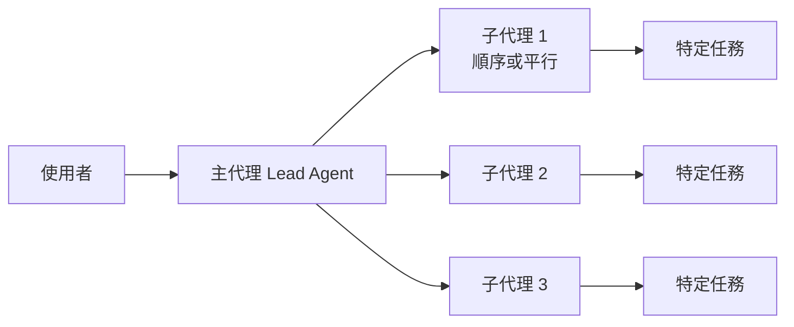

# goose 子代理（Subagent）功能完整解析

> 調查日期：2026-09-09
> 關鍵字：goose、subagent、子代理、recipe、summon、MCP、平行執行

---

## 概述

goose 是一款開放原始碼的 AI 代理（AI agent）工具，於 2026 年移轉至 Linux Foundation 旗下的 Agentic AI Foundation（AAIF）進行維護[^docs-subagents]。其子代理（subagent）功能是**第一級（first-class）支援**的核心功能，具備專屬的官方文件、完整教學、可重用配方（recipe）系統與原生程式碼實作[^docs-subagents][^docs-tutorial]。

子代理是**獨立的 goose 實例（independent instances）**，用來執行特定任務，同時讓主對話保持乾淨與聚焦。可以把它們想像成臨時助理：透過把工作卸載到獨立實例，達到「程序隔離（process isolation）」與「上下文保存（context preservation）」的效果[^docs-subagents]。



---

## 一、運作模式

goose 可以依序或平行執行多個子代理，並可用自然語言觸發[^docs-subagents]：

| 模式 | 說明 | 觸發關鍵字 | 範例 |
|------|------|-----------|------|
| **順序（Sequential，預設）** | 任務依序執行 | "first...then"、"after" | "First analyze the code, then generate documentation" |
| **並行（Parallel）** | 多個任務同時執行 | "parallel"、"simultaneously"、"at the same time"、"concurrently" | "Create three HTML templates in parallel" |

並行執行時，goose 會等待**所有**任務完成；若有任一子代理失敗，僅保留成功的結果[^docs-subagents]。若子代理失敗或逾時（預設 5 分鐘），主對話不會收到該子代理的任何輸出[^docs-subagents]。

---

## 二、子代理類型

### 2.1 內部子代理（Internal Subagents）

內部子代理會生成 goose 實例，使用**目前 session 的上下文與擴充套件**來處理任務，有兩種設定執行方式[^docs-subagents]：

#### 直接提示（Direct Prompts）

用自然語言描述的一次性任務，主代理會自動依請求配置子代理[^docs-subagents]。範例：

```
Use 2 subagents to create hello.html with 'Hello World' content
and goodbye.html with 'Goodbye World' content in parallel
```

呼叫後 goose 會回傳結構化的執行摘要，例如 `execution_summary`（total/successful/failed tasks 與執行秒數）以及每個 task 的結果[^docs-subagents]。

#### 配方（Recipes）

可重複使用的結構化配置檔，定義特定子代理行為所需的指令、擴充套件與參數，可依名稱被引用或共享[^docs-subagents]。配方檔位置可由 `GOOSE_RECIPE_PATH` 環境變數指定，或放在當前工作目錄[^docs-subagents]。

官方文件中的配方範例結構[^docs-subagents]：

```yaml
id: code-reviewer
version: 1.0.0
title: "Code Review Assistant"
description: "Specialized subagent for code quality and security analysis"
instructions: |
  You are a code review assistant. Analyze code and provide feedback on:
  - Code quality and readability
  - Security vulnerabilities
  - Performance issues
  - Best practices adherence
activities:
  - Analyze code structure
  - Check for security issues
  - Review performance patterns
extensions:
  - type: builtin
    name: developer
    timeout: 300
    bundled: true
    parameters:
      - key: focus_area
        input_type: string
        requirement: optional
        default: "general"
prompt: |
  Please review the following code focusing on {{focus_area}} aspects.
```

使用時只要在提示中引用配方名稱，例如："Use the 'code-reviewer' recipe to analyze the authentication feature I implemented"[^docs-subagents]。

### 2.2 外部子代理（External Subagents）

外部子代理讓 goose 協調其他供應商或平台的 AI 代理，方法是把該代理以 **MCP 伺服器**（如 `mcp-server` 模式）包裝後加入 goose 設定檔。官方文件示範以 Codex 作為子代理[^docs-subagents]：

```yaml
subagent:
  args:
    - mcp-server
  bundled: true
  cmd: codex
  description: OpenAI Codex CLI Subagent
  enabled: true
  env_keys:
    - OPENAI_API_KEY
  envs: {}
  name: subagent
  timeout: 300
  type: stdio
```

---

## 三、配置與控制

子代理使用以下預設設定，並可用自然語言覆寫任何預設值[^docs-subagents]：

| 參數 | 預設值 | 自訂方式 |
|------|--------|---------|
| **最大回合數（Max Turns）** | 25 | 自然語言指定（如 "limit each to 5 turns"）、`GOOSE_SUBAGENT_MAX_TURNS` 環境變數、配方 `settings.max_turns` 或子代理工具呼叫參數 |
| **超時（Timeout）** | 5 分鐘 | 在提示中要求更長超時（如 "20-minute timeout"） |
| **擴充套件（Extensions）** | 繼承自父代理 | 在提示中指定要使用的擴充套件 |
| **回傳模式（Return Mode）** | 完整詳細資訊 | 在提示中指定摘要模式 |

### 環境變數

| 環境變數 | 用途 | 預設值 |
|----------|------|--------|
| `GOOSE_SUBAGENT_MAX_TURNS` | 子代理在逾時前可執行的最大回合數；可被配方 `settings.max_turns` 或子代理工具呼叫覆寫 | 25 |
| `GOOSE_MAX_BACKGROUND_TASKS` | 可同時執行的背景子代理任務數上限 | 5 |
| `GOOSE_CACHE_TTL` | Anthropic prompt-cache TTL 設定；無頭執行（`goose run`、子代理、排程配方）一律使用 5m | 5m |

以上整理自官方環境變數文件[^docs-env]。

### 優先順序（程式碼實作）

在原始碼中，max_turns 的解析順序為：**配方 `settings.max_turns` → `GOOSE_SUBAGENT_MAX_TURNS` 環境變數 → 預設 25**，且 max_turns 最少必須為 1[^code-summon][^code-test]。

### 擴充套件控制（Extension Control）

預設情況下子代理**繼承主 session 的所有擴充套件**，但可限制存取以提升安全、聚焦或效能[^docs-subagents]：

```
"Create a subagent to write a summary, but don't give it file access"
"Use a subagent with only code editing tools to refactor main.py"
```

提供 `delegate` 與 `load` 工具的 **summon** 平台擴充套件預設啟用；若配方含有明確的 `extensions` 區塊，**必須把 summon 加入清單**，否則 `delegate` 工具不可用；定義 `sub_recipes` 的配方會自動注入 summon[^docs-subagents]。summon 從 **v1.25.0 起**可用，可用自然語言呼叫或直接呼叫工具：`delegate(instructions: ...)`、`delegate(source: "release-notes", async: true)` 等，`delegate(..., async: true)` 會回傳 task id，`load(source: "<task_id>")` 可等待結果[^docs-summon][^code-summon]。

### 回傳模式控制（Return Mode Control）

| 模式 | 說明 | 範例提示 |
|------|------|---------|
| **完整詳細（Full Details，預設）** | 顯示所有工具執行與推理步驟 | "Create a subagent to debug this issue - I want to see the full investigation process" |
| **僅摘要（Summary Only）** | 只回傳最終結果，保持對話簡潔 | "Use a subagent to research this topic and summarize the key findings" |

---

## 四、執行監控

子代理的工具呼叫會即時顯示[^docs-subagents]：

- **CLI**：以行內視覺指示呈現，例如 `[subagent:16] text_editor | developer`，包含子代理識別碼（subagent:16）、工具名稱（text_editor）與提供該工具的擴充套件（developer）
- **Desktop UI**：以可展開的區塊呈現，可展開查看工具名稱、傳入參數與工具輸出結果

---

## 五、安全限制

子代理以受限的工具存取執行，確保安全且不干擾主 session[^docs-subagents]：

### 允許的操作
- **擴充套件探索**：搜尋可用擴充套件以了解可用的工具
- **資源存取**：從已啟用的擴充套件讀取與列出資源
- **擴充套件工具**：使用配方指定或繼承自父 session 的擴充套件工具

### 限制的操作（防止影響整體系統狀態）
- **禁止再產生子代理**（subagent spawning）：防止無限遞迴
- **禁止管理擴充套件**（extension management）：不能啟用、停用或修改擴充套件
- **禁止管理排程**（schedule management）：不能建立、修改或刪除排程任務

子代理可以瀏覽擴充套件做建議，但無法啟用它們，以免修改父 session[^docs-subagents]。此限制亦寫入子代理系統提示模板中（"Cannot spawn additional subagents"）[^code-prompt]。

---

## 六、建議使用時機與生命週期

官方文件依用途分為三類建議[^docs-subagents]：

| 使用情境 | 說明 |
|----------|------|
| **獨立作業（Independent Operations）** | 建立多個結構相似的檔案、基本資料處理、檔案轉換與生成 |
| **上下文保存（Context Preservation）** | 會產生大量工具輸出的複雜分析、適合由專門代理處理的任務、讓主對話專注於高階決策 |
| **程序隔離（Process Isolation）** | 可能失敗但不影響主要流程的任務、需要不同配置的操作、實驗性或探索性工作 |

**生命週期**：子代理是暫時實體，僅存在於任務執行期間；任務完成後無需手動清理[^docs-subagents]。

**觸發方式**：在**自主權限模式（autonomous permission mode，預設）**下，goose 判斷任務有利時會自動決定使用子代理；子代理在手動批准（manual approval）、智慧批准（smart approval）與純聊天（chat-only）模式中**停用**[^docs-subagents]。

---

## 七、核心程式碼架構

以下檔案路徑與名稱皆已於 `aaif-goose/goose` 儲存庫的 main 分支驗證存在，並輔以 Sourcegraph 程式碼檢索確認功能[^code-tree]：

| 檔案 | 功能 |
|------|------|
| `crates/goose/src/agents/subagent_handler.rs` | 子代理生命週期與訊息處理核心（`OnMessageCallback`、任務執行）[^code-handler] |
| `crates/goose/src/agents/subagent_task_config.rs` | 任務配置；定義 `DEFAULT_SUBAGENT_MAX_TURNS = 25`，自 `GOOSE_SUBAGENT_MAX_TURNS` 讀取覆寫值[^code-taskconfig] |
| `crates/goose/src/agents/subagent_execution_tool/` | 工具呼叫式建立介面與通知事件（`TaskStatus`、`TaskInfo`、`TaskExecutionStats`）[^code-exectool] |
| `crates/goose/src/agents/platform_extensions/summon.rs` | Summon 平台擴充套件，提供 `delegate` 與 `load` 工具；`DelegateParams` 支援 instructions、source、parameters、extensions、provider、model、max_turns、context、working_dir、async 等參數[^code-summon] |
| `crates/goose/src/prompts/subagent_system.md` | 子代理系統提示模板（Jinja2），注入 max_turns、subagent_id、task_instructions、工具清單等變數；內容包含「不可再產生子代理」與工具效率準則[^code-prompt] |
| `documentation/docs/mcp/summon-mcp.md` | Summon 擴充套件官方文件（v1.25.0+）[^code-summon-doc] |

系統提示模板（`subagent_system.md`）亦可由使用者自訂，以調整子代理行為[^docs-subagents]。

---

## 八、相關教學與社群資源

官方提供完整的實作教學：**"Using Subagents"** 教學（2026 年 1 月 27 日更新，約 1 小時）逐步引導使用者以一支由 Planner、Project Manager、Architect、前後端開發者、QA 與 Tech Writer 組成的子代理團隊，打造一個完整的全端應用程式「AI BriefMe」，涵蓋平行執行與多代理分工[^docs-tutorial]。同一頁面亦建議在 `.goosehints` 中加入專案準則（如禁止執行阻塞型伺服器指令）以引導子代理行為[^docs-tutorial]。

其他官方與社群資源[^docs-subagents]：

- **Blog：Agents, Subagents, and Multi Agents: What They Are and When to Use Them**（2025-08-14，4 分鐘）
- **影片：How I Built an App with 6 Subagents**（2025-10-01，6:53）
- **Blog：How to Choose Between Subagents and Subrecipes in goose**（2025-09-26，6 分鐘）
- **Blog：Advent of AI - Day 11: Goose Subagents**（Nick Taylor，2025-12-17）— 第三方介紹，內容與官方文件一致[^blog-nick]

---

## 九、結論

goose **原生且全面支援**子代理，是其核心架構的一環：具備專屬的程式碼模組、官方文件與完整教學，支援順序／平行執行、內部（直接提示與配方）與外部（MCP）子代理、即時監控、可自訂的預設值（回合數、超時、擴充套件、回傳模式），並內建防止無限遞迴等安全限制[^docs-subagents][^code-tree]。

---

## 參考資料

[^docs-subagents]: goose 官方文件. (2026). Subagents. Retrieved 2026-09-09, from https://goose-docs.ai/docs/guides/context-engineering/subagents/
[^docs-tutorial]: goose 官方文件. (2026). Using Subagents. Retrieved 2026-09-09, from https://goose-docs.ai/docs/tutorials/subagents/
[^docs-env]: goose 官方文件. (2026). Environment Variables. Retrieved 2026-09-09, from https://goose-docs.ai/docs/guides/environment-variables/
[^docs-summon]: goose 官方文件. (2026). Summon Extension. Retrieved 2026-09-09, from https://goose-docs.ai/docs/mcp/summon-mcp/
[^code-tree]: aaif-goose/goose. (2026). Repository git tree (main branch). Retrieved 2026-09-09, from https://github.com/aaif-goose/goose/tree/main
[^code-handler]: aaif-goose/goose. (2026). subagent_handler.rs. Retrieved 2026-09-09, from https://github.com/aaif-goose/goose/blob/main/crates/goose/src/agents/subagent_handler.rs
[^code-taskconfig]: aaif-goose/goose. (2026). subagent_task_config.rs. Retrieved 2026-09-09, from https://github.com/aaif-goose/goose/blob/main/crates/goose/src/agents/subagent_task_config.rs
[^code-exectool]: aaif-goose/goose. (2026). subagent_execution_tool. Retrieved 2026-09-09, from https://github.com/aaif-goose/goose/tree/main/crates/goose/src/agents/subagent_execution_tool
[^code-summon]: aaif-goose/goose. (2026). summon.rs (platform_extensions). Retrieved 2026-09-09, from https://github.com/aaif-goose/goose/blob/main/crates/goose/src/agents/platform_extensions/summon.rs
[^code-summon-doc]: aaif-goose/goose. (2026). summon-mcp.md. Retrieved 2026-09-09, from https://github.com/aaif-goose/goose/blob/main/documentation/docs/mcp/summon-mcp.md
[^code-prompt]: aaif-goose/goose. (2026). subagent_system.md. Retrieved 2026-09-09, from https://github.com/aaif-goose/goose/blob/main/crates/goose/src/prompts/subagent_system.md
[^blog-nick]: Nick Taylor. (2025, December 17). Advent of AI - Day 11: Goose Subagents. Retrieved 2026-09-09, from https://www.nickyt.co/blog/advent-of-ai-day-11-goose-subagents/