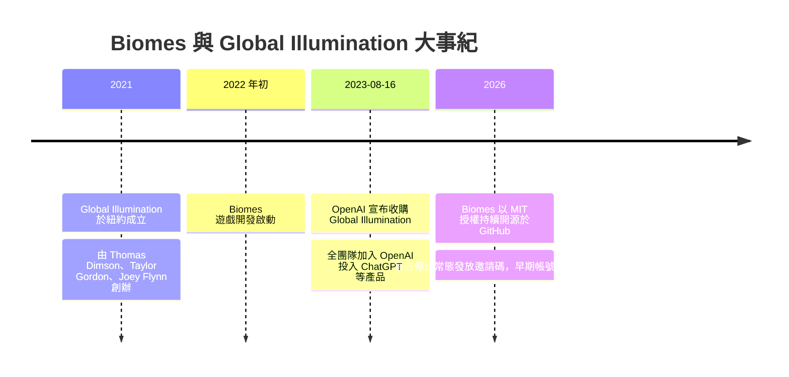

# Biomes 遊戲 — 背景調查報告

> 調查日期：2026-09-09
> 關鍵字：Biomes、Global Illumination、開源遊戲、MMORPG、OpenAI 收購、網頁沙盒遊戲

---

## 目錄

1. [專案概述](#1-專案概述)
2. [開發公司：Global Illumination, Inc.](#2-開發公司global-illumination-inc)
3. [遊戲內容與技術架構](#3-遊戲內容與技術架構)
4. [遊玩方式與服務現況](#4-遊玩方式與服務現況)
5. [OpenAI 收購事件](#5-openai-收購事件)
6. [收購後的狀況與影響](#6-收購後的狀況與影響)
7. [GitHub 社群指標](#7-github-社群指標)
8. [重要時間軸](#8-重要時間軸)
9. [參考資料](#9-參考資料)

---

## 1. 專案概述

**Biomes** 是一款**開源沙盒 MMORPG**（大型多人線上角色扮演遊戲），完全在網頁瀏覽器中運行，玩家可以建造、採集、遊玩小遊戲[a:biomes]。遊戲由 **Global Illumination, Inc.** 開發，採用 **MIT 授權條款**[a:github][a:faq]。

- 官方網站：https://www.biomes.gg[a:biomes]
- 原始碼倉庫：https://github.com/ill-inc/biomes-game[a:github]
- 官方文件：https://docs.biomes.gg[a:faq]

---

## 2. 開發公司：Global Illumination, Inc.

### 2.1 基本資訊

| 項目 | 內容 |
|------|------|
| 公司名稱 | Global Illumination, Inc.（簡稱 ill.inc） |
| 成立時間 | 2021 年[a:siliconangle] |
| 所在地 | 美國紐約[a:techcrunch][a:siliconangle] |
| 團隊規模 | 8 名員工[a:verge] |
| 定位 | 運用 AI 打造創意工具、基礎設施與數位體驗的「數位產品公司」[a:openai][a:siliconangle] |

### 2.2 三位創辦人

| 姓名 | 職位 | 背景 |
|------|------|------|
| **Thomas Dimson** | 工程師 & CEO | 曾任 Instagram 工程總監，主導平台探索（Explore）頁籤、動態與限時動態（Stories）排序等演算法與資料工程[a:techcrunch] |
| **Taylor Gordon** | 工程師 & CTO | 曾在 Instagram、Facebook 及 YouTube、Google、Pixar、Riot Games 等公司參與產品開發[a:openai][a:techcrunch] |
| **Joey Flynn** | 設計師 & CPO | 同上，早期在 Instagram 與 Facebook 設計並打造產品[a:openai][a:techcrunch] |

### 2.3 完整團隊名單

Biomes 官方網站列出的主要團隊成員共 8 人：

| 姓名 | 角色 |
|------|------|
| Thomas Dimson | 工程師 & CEO |
| Joey Flynn | 設計師 & CPO |
| Taylor Gordon | 工程師 & CTO |
| Alexei Karpenko | 工程師 |
| Andrew Top | 工程師 |
| Nick Cooper | 工程師 |
| Ian Silber | 設計師 |
| Brandon Wang | 工程師 |

- **美術**：Luis Gustavo Barbosa Tavares、Thais Torres、Lotto
- **音樂**：Kyle Flynn、Morgan Herrell
- **額外貢獻**：Matthew Haines、Tanson Lee、Devin Leamy、Enid Hwang

以上名單出自 Biomes 官方網站頁尾的致謝區[a:biomes]，而 The Verge 亦報導其官方網站列出 8 名員工[a:verge]。

### 2.4 募資狀況

根據 Pitchbook 的資料，Global Illumination 共募得 **1400 萬美元**，投資人包括 **Paradigm Capital LP**、**Benchmark Capital Corp.** 與 **Slow Ventures LLC**[a:siliconangle]。其中 Benchmark 是早期投資 Uber、eBay、Twitter 的知名矽谷創投，Paradigm 則以加密貨幣與區塊鏈投資聞名。TechCrunch 同樣披露其背後有 Paradigm、Benchmark 與 Slow 三家創投[a:techcrunch]。

---

## 3. 遊戲內容與技術架構

### 3.1 遊戲類型與玩法

Biomes 是一款**沙盒 MMORPG**，建立在開放且可完全破壞的體素（voxel）世界之中。玩家可以建造、合成（craft）、耕作、抵禦「muckers」怪物、承接任務，還有小遊戲、隊伍系統等內容[a:faq]。

其畫面風格與遊玩方式與《Minecraft》高度相似，被媒體描述為「Minecraft 的仿製版」或「Minecraft-like」遊戲[a:verge][a:siliconangle][a:techcrunch]。

### 3.2 技術堆疊

Biomes 使用現代網頁技術打造，包括 **Next.js、TypeScript、React 與 WebAssembly（WASM）**，並採用 React 的反應式（reactive）程式設計典範來實現遊戲玩法[a:github]。其 GitHub 主題標籤（topics）包含 browser、browser-game、engine、games、mmo、mmorpg-game、mmorpg-server、nextjs、nodejs、react、reactjs[a:github]。

### 3.3 開發時程

遊戲開發始於 **2022 年初**，並持續至今[a:faq]。

### 3.4 支援平台

Biomes 在瀏覽器中運行，支援 **macOS、Windows、Linux**，官方以 **Chrome** 為主要開發目標；Safari、Firefox、Edge、Arc 等其他瀏覽器雖可運行，但不屬於官方正式支援範圍[a:faq]。

---

## 4. 遊玩方式與服務現況

- **早期測試帳號**：若在 Biomes 早期測試（Early Access）時期建立帳號，隨時可以登入繼續遊玩[a:faq]。
- **邀請碼**：官方已無法持續發放邀請碼，最新的邀請碼政策須以官方 Discord 伺服器公告為準[a:faq]。
- **自行架設**：沒有帳號的人可以依照官方文件在本機（locally）運行遊戲伺服器遊玩[a:faq]。架設過程涉及 Google Cloud Platform 與 Kubernetes 等技術，官方形容為「繁複但對熟悉相關技術者可行」的過程[a:faq]。

---

## 5. OpenAI 收購事件

### 5.1 收購概要

**2023 年 8 月 16 日**，OpenAI 宣布收購 Global Illumination，全團隊加入 OpenAI，參與包括 **ChatGPT** 在內的核心產品開發[a:openai]。這是 **OpenAI 成立約七年以來首次公開收購**[a:techcrunch]，收購金額**未公開**[a:openai][a:techcrunch][a:verge]。

| 項目 | 內容 |
|------|------|
| 宣布日期 | 2023 年 8 月 16 日[a:openai][a:techcrunch][a:verge] |
| 收購方 | OpenAI[a:openai] |
| 收購對象 | Global Illumination, Inc.[a:openai] |
| 收購性質 | OpenAI 首次公開收購[a:techcrunch] |
| 金額 | 未公開[a:techcrunch][a:verge] |
| 團隊去留 | 全團隊加入 OpenAI，投入 ChatGPT 等核心產品[a:openai] |

### 5.2 官方聲明與背景脈絡

OpenAI 在官方部落格表示：「Global Illumination 是一家運用 AI 打造創意工具、基礎設施與數位體驗的公司。團隊先前在 Instagram 與 Facebook 早期階段設計並打造產品，也曾在 YouTube、Google、Pixar、Riot Games 等知名公司做出重要貢獻。」[a:openai][a:techcrunch]

此收購發生當時，OpenAI 正處於巨額花費階段：據 The Information 報導，OpenAI 去年（2022 年）為開發 ChatGPT 花費超過 **5.4 億美元**（含向 Google 等公司挖角人才的費用），而全年營收僅 **3000 萬美元**。執行長 Sam Altman 據報曾向投資人表示，公司目標是當年（2023 年）營收達 **2 億美元**、隔年達 **10 億美元**[a:techcrunch]。

### 5.3 產業解讀

- **人才收購（Acqui-hire）**：媒體普遍將此案解讀為人才收購，因為 OpenAI 並無經營 MMORPG 遊戲事業的跡象。SiliconANGLE 指出：「除非 OpenAI 有祕密計畫進軍 MMORPG 遊戲事業，否則這是一樁人才收購——即大公司為人才而非公司本身與其產品而收購小公司」[a:siliconangle]。
- **收購價格推測**：SiliconANGLE 推測收購價可能落在公司先前募資金額（約 1400 萬美元）上下[a:siliconangle]。
- **遊戲的命運不明**：TechCrunch 直言遊戲的未來不明朗，「可以想見團隊在 OpenAI 的工作會與娛樂性質較無關連」[a:techcrunch]。

---

## 6. 收購後的狀況與影響

收購後 Bioomes 相關專案與團隊經歷的變化：[a:openai][a:faq][a:github]

- **團隊轉任**：原 Global Illumination 團隊現隸屬 OpenAI，投入 ChatGPT 等核心產品開發[a:openai]。
- **服務模式改變**：官方已停止以連續方式發放邀請碼；早期測試期間建立的帳號仍可登入[a:faq]。
- **原始碼持續開源**：Biomes 原始碼仍以 MIT 授權公開於 GitHub，任何人可自行下載、貢獻或架設[a:github]（僅供遊玩與開發參考）。

---

## 7. GitHub 社群指標

以下數據取自 GitHub 倉庫頁面（擷取日期 2026-09-09）[a:github]：

| 指標 | 數值 |
|------|------|
| Stars | 2.7k+ |
| Forks | 345 |
| Watchers | 29 |
| Commits（main） | 84 |
| 授權條款 | MIT |

- 倉庫包含 `src/`、`voxeloo/`、`deploy/`、`ecs/` 等目錄，並使用 Bazel 建置系統與 Rust（Cargo.lock、Cargo.Bazel.lock）[a:github]。
- 官方歡迎社群貢獻，並以 Discord 作為開發者社群的主要交流管道，採用 conventional pull-request 工作流程[a:github][a:faq]。

---

## 8. 重要時間軸

---

## 9. 參考資料

[a:openai]: OpenAI. (2023, August 16). OpenAI acquires Global Illumination. Retrieved 2026-09-09, from https://openai.com/index/openai-acquires-global-illumination/

[a:techcrunch]: Wiggers, K. (2023, August 16). OpenAI acquires AI design studio Global Illumination. TechCrunch. Retrieved 2026-09-09, from https://techcrunch.com/2023/08/16/openai-acquires-ai-design-studio-global-illumination/

[a:verge]: Peters, J. (2023, August 16). OpenAI bought the makers of a Minecraft clone. The Verge. Retrieved 2026-09-09, from https://www.theverge.com/2023/8/16/23834645/openai-global-illumination-acquisition-minecraft-clone-chatgpt

[a:siliconangle]: Riley, D. (2023, August 16). OpenAI acquires digital products company Global Illumination for undisclosed price. SiliconANGLE. Retrieved 2026-09-09, from https://siliconangle.com/2023/08/16/openai-acquires-digital-products-company-global-illumination-undisclosed-price/

[a:github]: ill-inc/biomes-game. (n.d.). Biomes README [GitHub repository]. Retrieved 2026-09-09, from https://github.com/ill-inc/biomes-game

[a:biomes]: Global Illumination, Inc. (n.d.). Biomes — Join the community shaping a new world. Retrieved 2026-09-09, from https://www.biomes.gg

[a:faq]: Global Illumination, Inc. (n.d.). F.A.Q. [Online documentation]. Retrieved 2026-09-09, from https://docs.biomes.gg/faq