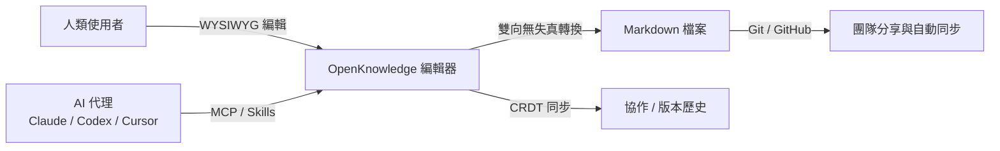
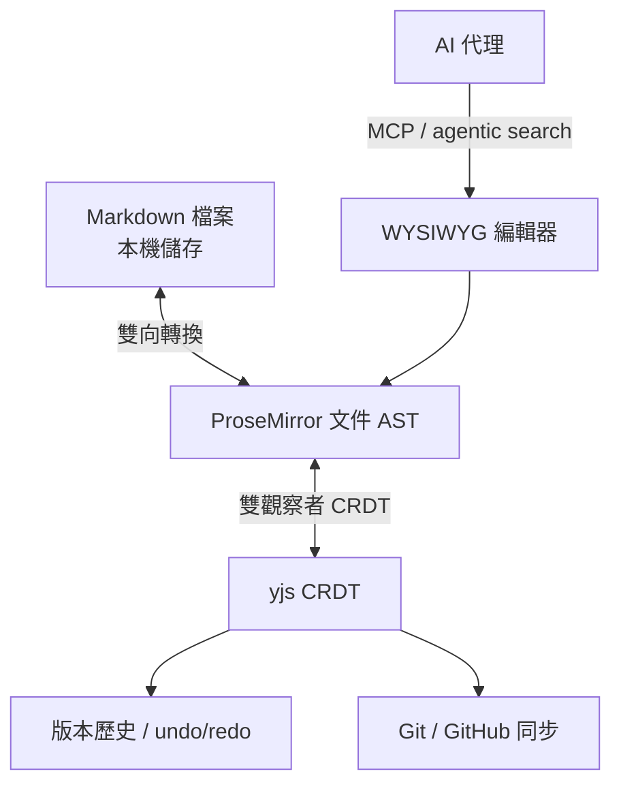
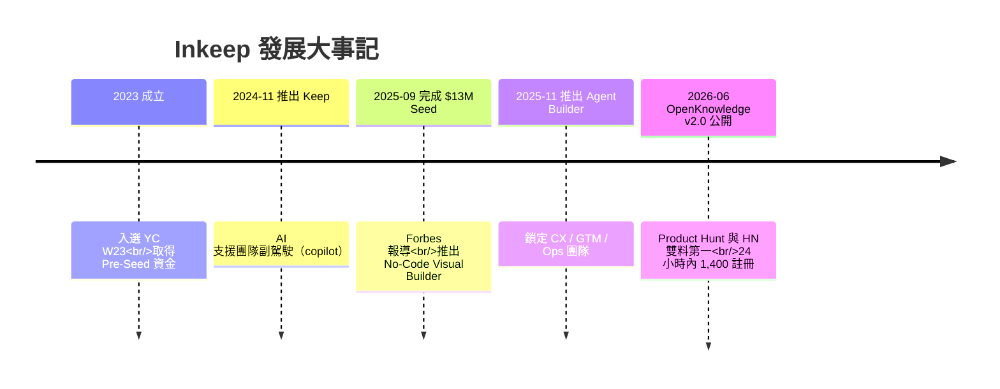

# OpenKnowledge 專案與開發公司 Inkeep 完整解析

> 調查日期：2026-09-09
> 關鍵字：OpenKnowledge、Inkeep、markdown 編輯器、LLM Wiki、CRDT、MCP、agentic search、Y Combinator、Khosla Ventures、AI Agent 平台

---

## 概述

**OpenKnowledge** 是 **Inkeep** 公司開發並開源的「AI 原生」markdown 編輯器與知識庫，定位為 Obsidian／Notion 的開源替代品[^github]。它提供「所見即所得（WYSIWYG）」的排版編輯體驗，讓 markdown 檔案的編輯感受接近 Google Docs 或 Notion，同時內建與 Claude、Codex、Cursor 等 AI harness 的整合，是專為「人類與 AI 代理共同編輯同一份文件」而設計的工具[^site][^hn]。

官方以 **「給人類與代理的富文字編輯器（A rich text editor for you and your agents）」** 形容自家產品，並強調 **隱私（local-first，檔案只存在本機）、開源與免費**[^site]。

| 項目 | 內容 |
|------|------|
| 開發商 | Inkeep（Inkeep, Inc.）[^github] |
| 定位 | AI 原生 markdown 編輯器、LLM Wiki、知識庫[^github] |
| 授權 | **GPL-3.0-or-later**[^github] |
| GitHub 星數 | 約 **4,100**（2026-09-09 查詢時）[^github] |
| 語言／技術 | TypeScript（monorepo）、Tiptap/ProseMirror、yjs CRDT、Electron、Orama[^hn] |
| 支援平台 | macOS、Windows、Linux 桌面版；Web UI + CLI[^github] |

---

## 一、產品功能與技術架構

### 1.1 核心編輯體驗

OpenKnowledge 的核心是**完整的 WYSIWYG 編輯器**：編輯 markdown 檔案時直接呈現排版結果，而非原始語法，號稱「讓編輯 markdown 檔案感覺像在編輯 Google Doc 或 Notion 頁面」[^github]。文件中可嵌入 Callout、手風琴、分頁（Tabs）、Mermaid 圖表、圖片、影片與可嵌入的 HTML 元件，適合撰寫工程規格與視覺化報告[^github][^site]。

### 1.2 技術架構

創辦人 Nick Gomez 在 Hacker News 的 Show HN 貼文揭露了主要技術棧，並指出兩個最具挑戰性的工程問題[^hn]：

- **技術棧**：Tiptap／ProseMirror（編輯核心）、CodeMirror（原始碼模式）、**yjs（CRDT 協作資料結構）**、Electron（macOS 桌面版）、Orama（全文搜尋）、remark／rehype／micromark／mdast（markdown 解析生態）、@pierre/trees（樹狀資料結構工具）[^hn]。
- **挑戰一：ProseMirror 與 markdown 的雙向無失真轉換**。ProseMirror 使用 AST（抽象語法樹），並非設計為 byte-fidelity（位元組級保真），要讓排版狀態與 markdown 原始檔互轉且不流失資訊非常困難[^hn]。
- **挑戰二：雙觀察者 CRDT（dual-observer CRDT）**，用於讓 ProseMirror 狀態與 markdown 狀態保持同步。CRDT 加上 git，同時支撐「顯示 AI 代理在 markdown 中做了什麼」的協作體驗、復原／重做（undo/redo）與版本歷史[^hn][^aiweekly]。

### 1.3 Agent 整合（AI 原生）

OpenKnowledge 的差異化在於「AI 活在文件裡」，而非側邊聊天窗[^kompozy]：

- **原生 MCP（Model Context Protocol）**：可把知識庫接進 Claude、Cursor、Codex、OpenCode、Pi 等代理，甚至透過 MCP/CLI 使用任何 harness[^github]。
- **Agent Skills**：開箱即用的技能，讓代理知道如何瀏覽、編輯與擴充知識庫[^github][^site]。
- **Agentic Search（代理式搜尋）**：以 embeddings 與階層式 RAG（hierarchical RAG）協助代理找到正確內容[^site][^github]。

安裝並初始化後，程式會自動偵測電腦上已安裝的 agent harness，並為其設定 MCP 與 skills，用於「豐富搜尋 + 文件編寫」[^github]。

### 1.4 儲存、分享與平台支援

- **Local-first**：所有文件都是純 markdown 檔案，存在使用者自己的機器上，不是專屬資料庫[^github][^aiweekly]。
- **團隊分享**：透過 git／GitHub 達成 no-code 團隊分享與自動同步，歷史與所有權都留在使用者的 repo[^github][^site]。
- **桌面版**：macOS（Apple Silicon）、Windows 10+（x64／Arm64，免管理員權限安裝）、Linux（deb／rpm 套件）[^github]。
- **Web UI + CLI**：`npm install -g @inkeep/open-knowledge` 後以 `ok init` 建立專案並接線 AI 編輯器，`ok start --open` 啟動網頁編輯器（需要 Node.js 24+ 與 git）[^github]。

---

## 二、開發公司：Inkeep

### 2.1 基本資料

| 項目 | 內容 |
|------|------|
| 公司名稱 | Inkeep（Inkeep, Inc.）[^github][^yc] |
| 成立年份 | **2023** 年[^yc][^startupintros] |
| 總部 | **舊金山（San Francisco, CA）**[^yc] |
| 商業定位 | AI Agent 平台，協助客戶體驗（CX）、營運（Ops）等面向客戶的團隊打造與部署 AI 代理[^yc][^funding] |
| 孵化器 | **Y Combinator Winter 2023（W23）** 批次[^yc] |
| 員工人數 | 約 17–18 人（2026 年中資料）[^yc][^startupintros] |
| 官網 | <https://inkeep.com> |
| 狀態 | Active（營運中），未上市[^startupintros] |

### 2.2 創辦團隊

| 姓名 | 角色 | 背景 |
|------|------|------|
| **Nick Gomez** | 共同創辦人 & CEO | 於 MIT 主修商業與電腦科學（Business & Computer Science）。曾在 Microsoft 帶領開發者體驗（DevEx）團隊，專注自服務開發者體驗與 no-code builder[^yc][^about]。 |
| **Robert Tran** | 共同創辦人 & CTO | MIT 電腦科學與數學背景（學士），擁有 MIT 電腦科學碩士。曾任 illumis（後被 ComplySci 收購）的 early employee 與 Head of Engineering，負責打造匯整大量分散公眾資料來源的軟體[^yc][^about]。 |

### 2.3 募資歷程

根據官方募資公告與第三方資料庫，Inkeep 兩輪募資的軌跡如下[^funding][^tracxn]：

| 輪次 | 日期 | 金額 | 主要投資方 |
|------|------|------|-----------|
| **Pre-Seed** | 2023 年（YC W23 入選當年度） | 約 **$50 萬美元** | Y Combinator |
| **Seed** | 2025-09-05 宣布 | **$1,300 萬美元** | Khosla Ventures、GreatPoint Ventures、Y Combinator 共同領投 |

**累計募資約 $1,350 萬美元**（Tracxn 記載為 2 輪、總額 $13.5M）[^tracxn]。

Seed 輪的參與投資人，除三家共同領投機構外，還包括 Coho VC、Myelin VC，以及多位知名創辦人與 CEO 天使投資人，官方公告點名者包括[^funding]：Vercel CEO **Guillermo Rauch**、Fingerprint CEO **Dan Pinto**、Clerk CEO **Colin Sidoti**、Paymentology 創辦人 **Rowan Brewer**、Guilded 創辦人 **Eli Brown**。

### 2.4 客戶與產品線

- **客戶規模**：超過 **200 家企業**應用 Inkeep 建置 AI 代理[^forbes]。
- **公開客戶**：**Anthropic、Midjourney、Pinecone、PostHog、Postman、Solana、Clay** 等 AI 原生與開發者公司[^yc][^funding]。
- **產品線**：No-Code Visual Builder（視覺化建立、管理 AI 代理）[^nobuilder] 與 Developer SDK（官方開源 `@inkeep/agents-sdk`，支援 TypeScript，與 No-Code 編輯器雙向同步）[^agents-repo][^funding]。平台包含 MCP 與工具支援、RAG 與資料連接器、UI 元件庫、統一搜尋與 agent 效能監控[^funding][^yc]。

### 2.5 公司大事記

大事記細節[^funding][^bw][^aiweekly]：

1. **2023** — Nick Gomez 與 Robert Tran 創立 Inkeep，入選 Y Combinator W23 批次[^yc]。
2. **2024-11-01** — 推出 **Keep**，一款面向高接觸（high-touch）人工支援的 AI 副駕駛[^funding]。
3. **2025-09-05** — 宣布 **$1,300 萬美元 Seed 輪**，由 Khosla Ventures、GreatPoint Ventures 與 Y Combinator 共同領投，獲 Forbes 報導；同步推出 **No-Code Visual Builder**[^funding][^forbes]。
4. **2025-11-11** — 推出 **Agent Builder**，鎖定客戶體驗、Go-to-Market 與營運團隊，透過 Business Wire 公開[^bw]。
5. **2026-06-03** — **OpenKnowledge v2.0 公開上線**，登上 Product Hunt 與 Hacker News 第一名，24 小時內獲得 **1,400 註冊**[^site][^aiweekly]。6 月 25–26 日再以 Show HN 貼文登上 Hacker News 首頁（381 分、173 則留言）[^hn]。

---

## 三、開源與社群

- **授權**：GPL-3.0-or-later（OSI 核准的開源授權）[^github]。此授權完全開放原始碼，但可能限制需要把該工具嵌入專屬商業產品的團隊[^aiweekly]。
- **開源狀態**：2026-06 開源之初約 296 stars、613 commits、170 releases（當時最新 v0.18.0）[^aiweekly]；2026-09-09 查詢時成長至約 **4.1k stars、271 forks、2,073 commits**[^github]。
- **版本節奏**：開源後快速迭代，官方文件 changelog 已記錄至 v0.62.0，反映高度活躍的發布週期[^changelog]。
- **社群**：Discord（<https://discord.gg/VRKk2EaGHN>）、X（<https://x.com/OpenKnowledge>）、GitHub Issues；官方網站於調查期間正進行「Launch week（2026-08-17～21）」活動，產品持續加入協作編輯、一鍵分享等新功能[^github][^github-issues][^site]。
- **貢獻**：公開接受 Pull Request 與 Issue，並附有 CONTRIBUTING.md 與 CLA[^github]。

### 命名區隔：與 Google「Open Knowledge Format」無關

OpenKnowledge 與 Google 於 **2026 年 6 月**發表的「Open Knowledge Format（OKF，知識表示規範）」是**完全不同的兩個專案**：前者是 Inkeep 的 markdown 編輯器產品，後者是 Google Cloud 提出的資料分享與協作標準化規範[^hn-comment][^okf-guide]。搜尋時需留意兩者名稱相近。

---

## 四、分析總結

1. **「AI 就是產品核心」而非附加功能** — 多數 Notion／Obsidian 替代品把 AI 以側邊聊天窗形式外掛，OpenKnowledge 則讓 Claude、Codex、Cursor 等代理直接讀寫文件，配合原生 MCP、skills 與 agentic search，構成完整的「AI 第二大脑」閉環[^kompozy][^site]。
2. **本地優先設計** — 純 markdown 檔案、git-backed、可自行架設，回應企業對資料主權與隱私的需求；同步與分享以 git／GitHub 為底層，資料永遠留在使用者端[^github][^aiweekly]。
3. **母公司商業策略互補** — Inkeep 的商業產品（AI Agent 平台 + No-Code Visual Builder）面向企業客戶收費，開源 OpenKnowledge 則作為開發者社群的入口與生態護城河，兩者共享品牌與 AI 基礎技術[^github][^nobuilder]。
4. **資金與背書強勁** — Khosla Ventures、GreatPoint Ventures 與 Y Combinator 共同領投 $13M Seed，並有 Vercel、Clerk、Fingerprint 等 CEO 天使投資人參與；客戶含 Anthropic、PostHog、Postman 等 AI 頂尖公司[^funding][^forbes]。
5. **開源動能明顯** — 上線兩個多月即從約 300 顆星成長至 4.1k stars，登上 Product Hunt 與 Hacker News 雙料第一，社群迴響熱烈，但產品仍在 pre-1.0 階段，功能與平台支援（macOS 優先）持續快速變動[^aiweekly][^kompozy]。
6. **授權是商業整合的最大考量** — GPL-3.0-or-later 對想將之嵌入專屬商業產品的團隊是實務上的限制，評估時須納入決策[^aiweekly]。

---

## 參考資料

[^github]: Inkeep. (n.d.). open-knowledge. Retrieved 2026-09-09, from https://github.com/inkeep/open-knowledge
[^site]: OpenKnowledge. (n.d.). OpenKnowledge — Beautiful, AI-native markdown editor. Retrieved 2026-09-09, from https://openknowledge.ai/
[^hn]: Gomez, N. (2026, June 26). Show HN: OpenKnowledge – open source AI-first alternative to Obsidian/Notion. Hacker News. Retrieved 2026-09-09, from https://news.ycombinator.com/item?id=48675435
[^hn-comment]: westurner. (n.d.). 留言於 Show HN: OpenKnowledge。 Hacker News. Retrieved 2026-09-09, from https://news.ycombinator.com/item?id=48675435
[^aiweekly]: Dufresne, A. (2026, June 25). Inkeep open-sources OpenKnowledge, an LLM wiki and local editor. AI Weekly. Retrieved 2026-09-09, from https://aiweekly.co/alerts/inkeep-open-sources-openknowledge-an-llm-wiki-and-local-editor
[^funding]: Gomez, N. (2025, September 5). Inkeep raises $13M so every team can ship AI Agents they trust. Inkeep Blog. Retrieved 2026-09-09, from https://inkeep.com/blog/inkeep-funding-announcement
[^yc]: Y Combinator. (n.d.). Inkeep: Build AI Agent teammates and automations in code or no-code. Retrieved 2026-09-09, from https://www.ycombinator.com/companies/inkeep
[^about]: Inkeep. (n.d.). About Inkeep - AI Agent Platform for CX & Ops. Retrieved 2026-09-09, from https://inkeep.com/about
[^startupintros]: Startup Intros. (2026, July 13). Inkeep: Funding, Team & Investors. Retrieved 2026-09-09, from https://startupintros.com/orgs/inkeep
[^tracxn]: Tracxn. (2026). Inkeep - 2026 Company Profile, Team, Funding & Competitors. Retrieved 2026-09-09, from https://tracxn.com/d/companies/inkeep/__P1ebt4WEUMSWie8DV3IXAJFKPdA7Hhx-jt8ZpJeQDN8
[^forbes]: Hasan, Z. (2025, September 5). This startup just raised $13 million to make AI agents easy for any team. Forbes. Retrieved 2026-09-09, from https://www.forbes.com/sites/zoyahasan/2025/09/05/this-startup-just-raised-13-million-to-make-ai-agents-easy-for-any-team/
[^bw]: Inkeep. (2025, November 11). Inkeep launches Agent Builder for customer experience, go-to-market and operations teams. Business Wire. Retrieved 2026-09-09, from https://www.businesswire.com/news/home/20251111421694/en/Inkeep-Launches-Agent-Builder-For-Customer-Experience-Go-To-Market-and-Operations-Teams
[^nobuilder]: Inkeep. (n.d.). No-Code Agent Builder. Retrieved 2026-09-09, from https://inkeep.com/no-code-agent-visual-builder
[^agents-repo]: Inkeep. (n.d.). agents. Retrieved 2026-09-09, from https://github.com/inkeep/agents
[^kompozy]: Ameen, M. (2026, June 25). OpenKnowledge review 2026: Honest verdict on Inkeep's open-source AI markdown wiki. Kompozy. Retrieved 2026-09-09, from https://kompozy.io/reviews/openknowledge
[^changelog]: OpenKnowledge. (n.d.). Changelog. Retrieved 2026-09-09, from https://openknowledge.ai/docs/changelog
[^github-issues]: Inkeep. (n.d.). open-knowledge Issues. Retrieved 2026-09-09, from https://github.com/inkeep/open-knowledge/issues
[^okf-guide]: WitsCode. (2026, June 18). Open Knowledge Format (OKF): The complete 2026 guide. Retrieved 2026-09-09, from https://witscode.com/open-knowledge-format