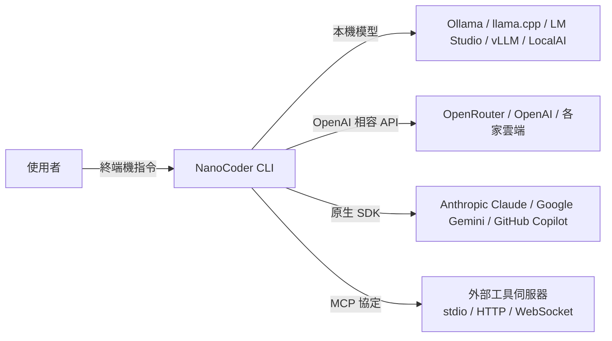
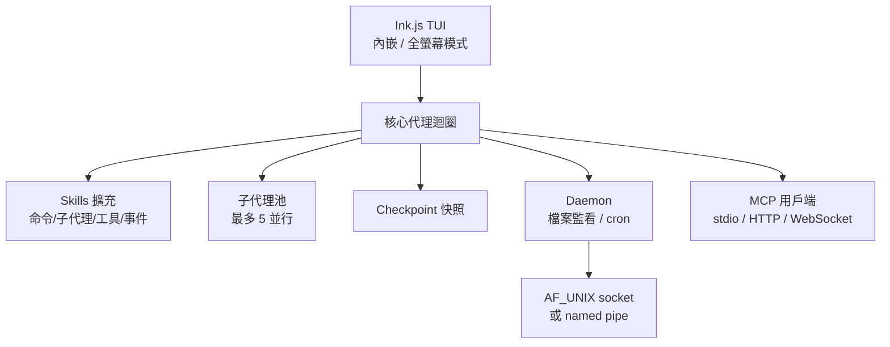

# NanoCoder 專案背景調查報告

> 調查日期：2026-09-09
> 關鍵字：NanoCoder、Nano Collective、終端機編碼代理、local-first、OpenCode、Anthropic、CLI、MCP

---

## 概述

**NanoCoder** 是一款開源的終端機編碼代理（coding agent），由社群集體 **Nano Collective** 而非公司打造，主打「自帶模型（Bring Your Own Model）、程式碼留在本機、不欠任何人」[^github]。它可在使用者自選的模型上執行代理式編碼任務：透過 Ollama 使用本機模型，或透過任何 OpenAI 相容 API（如 OpenRouter、Anthropic、Google）使用雲端模型[^github]。

官方描述將自己定位為「由社群集體而非公司打造的終端機開放編碼代理」，並強調**無付費階級（no paid tiers）**、無閉源功能、尊重隱私、本機優先（local-first）[^github]。

| 項目 | 內容 |
|------|------|
| 開發者 | Nano Collective（非營利社群集體，非公司）[^github] |
| 定位 | 終端機編碼代理、AI 編碼助手[^github] |
| 授權 | **MIT License**（無 CLA 重新授權條款）[^github][^disc30] |
| 主要語言 | TypeScript[^nanoorg] |
| 建立時間 | 2025-07-30[^nanoorg] |
| GitHub Stars | 約 **2.5k**（2026-09-09 查詢時）[^github] |
| Forks | 314[^github] |
| 提交數 | 3,065 commits[^github] |
| 最新版本 | v1.30.0（2026-08-27 發布）[^nanoorg][^docs] |
| 安裝方式 | npm、Homebrew、Nix Flakes[^github] |

---

## 一、Nano Collective 組織

### 1.1 組織性質

**Nano Collective** 是一個**非營利社群集體**，**不是公司**——沒有投資人、沒有股權結構、沒有人從專案中獲利[^github][^disc30]。財務由 **[Open Source Collective](https://opencollective.com/nano-collective)** 作為 fiscal host 托管，所有收支即時公開透明[^nanoorg]。

其價值主張可濃縮為三原則：**尊重隱私（Privacy-Respecting）**、**本機優先（Local-First）**、**對所有人開放（Open for All）**[^docs]。

> 「NanoCoder 由 Nano Collective 打造：沒有投資人、沒有退出壓力、沒有股權結構表。你的 AI 工具，不屬於任何人，只屬於使用它的人。」[^disc30]

### 1.2 核心人物

GitHub 可見的主要成員包括 **Will Lamerton**（will-lamerton）、**Ben Parry**（followbenparry）、**Matthew Spence**（mrspence）等人，其中 Ben Parry 與 Will Lamerton 同時是 Open Collective 的管理員[^nanoorg]。指名團隊成員與角色分工的完整名單並未在官方網站公開，但可見成員多為跨專案工程開發與社群經營角色[^nanoorg]。

### 1.3 旗下其他專案

| 專案 | 說明 | Stars | 狀態 |
|------|------|-------|------|
| **NanoTune** | 本機 LoRA/QLoRA 微調 LLM 的工具 | ~30 | 活躍（v1.7.0，2026-08-31）[^nanoorg] |
| **get-md** | HTML 轉 Markdown 轉換器，針對 LLM 消費優化 | ~90 | 活躍[^nanoorg] |
| **json-up** | 基於 Zod 的型別安全 JSON 遷移工具 | ~18 | 活躍[^nanoorg] |
| **prompt-scrub** | 本機 PII 清洗工具 for LLM 提示詞 | ~16 | 活躍[^nanoorg] |
| **Sentinel** (alpha) | 自動化安全／程式碼審計 for GitHub 組織 | ~10 | Alpha[^nanoorg] |

---

## 二、資金來源

### 2.1 明確拒絕創投

Nano Collective **明確拒絕創投資金**，開發經費來自捐贈與諮詢工作，而非日後將使用者轉化為訂閱戶[^disc30]。根據其 Economics Charter，付費貢獻（scoped paid bounties）有明確規範，且設有 ring-fenced 社群基金[^docs]。

### 2.2 實際財務狀況

截至 2026-09-09 查詢，Open Collective 上的財務資訊[^nanoorg]：

| 項目 | 數值 |
|------|------|
| 目前餘額 | $3.76 USD |
| 累計募得 | $3.76 USD |
| 累計支出 | $0.00 USD |
| 預估年度預算 | $5.00 USD |
| 貢獻者 | 3 人（首筆為 2026-07-23 的 $5 捐款） |

### 2.3 Atlas Cloud 贊助

**Atlas Cloud** 是 NanoCoder 的正式贊助商，提供單一 AI API 存取的**全模態推理平台**（影片生成、圖片生成、LLM），號稱可串接 300+ 精選模型[^github]。其設有專供編碼代理使用的 coding plan 促銷方案[^github]。

---

## 三、產品功能與技術架構

### 3.1 核心功能

- **多供應商支援**：本機（Ollama、llama.cpp、LM Studio、Atomic Chat、MLX Server、vLLM、LocalAI、llama-swap）、雲端 OpenAI 相容（OpenRouter、Requesty、Together AI、Groq、OpenAI、Mistral AI、GitHub Models、Atlas Cloud 等）、原生 SDK（Anthropic Claude、Google Gemini、GitHub Copilot、ChatGPT/Codex 等），並可透過 `/provider` 於工作階段中切換[^docs]。
- **四種開發模式**：`normal`（逐步確認每項工具）、`auto-accept`（快速執行）、`yolo`（全自動不確認）、`plan`（僅建議不執行）[^docs][^disc30]。
- **Skills 擴充模型**：統一的擴充單元，整合自訂命令、子代理、自訂工具與事件觸發。單檔形式放於 `.nanocoder/commands|agents|tools/`，bundle 形式放於 `.nanocoder/skills/<name>/`[^docs]。
- **子代理（Subagents）**：主代理可委派給具獨立對話、個別系統提示詞、過濾後工具集的子代理，支援不同模型或供應商，最多 5 個並行；內建 `explore` 子代理[^docs]。
- **MCP 整合**：支援 stdio、HTTP（StreamableHTTP）、WebSocket 三種傳輸，可於專案級 `.mcp.json` 或全域設定，並有 `/settings mcp` 互動設定精靈[^docs]。
- **Checkpointing**：可對工作階段（對話歷史、修改過的檔案、模型設定）建立快照並隨時回滾，存放於 `.nanocoder/checkpoints/`[^docs]。
- **專案級 Daemon**：背景程序，托管檔案監看與 cron 觸發的事件訂閱；macOS（LaunchAgent）、Linux（systemd user unit）、Windows（Task Scheduler）皆可自動啟動[^docs]。
- **工作階段管理**：每 30 秒自動儲存，保留 30 天，可 `/resume` 或 `--continue` 恢復[^docs]。
- **其他**：`/compact` 上下文壓縮、`/tasks` 任務管理、`!command` 殼層指令、`@file` 模糊搜尋引用檔案、`--vscode` 模式在 VS Code 中預覽 diff、`--acp` 以 Agent Client Protocol 服務 Zed 等編輯器、圖片貼上支援、桌面通知[^docs]。

### 3.2 技術架構

NanoCoder 是以 **React 為基礎的 CLI**，使用 **Ink.js 框架**渲染，具有低 CPU 開銷的優勢（對比部分終端機 AI 工具閒置時消耗 30–50% CPU）[^disc30]。支援兩種畫面模式：內嵌模式（inline，預設，輸出直接印入終端機原生 scrollback）與全螢幕模式（`--alt-screen`，固定高度版面、程式內捲動）[^github]。

開發環境需求：Node.js 22+、pnpm（Corepack 管理）[^docs]。建議 context window 32K+ tokens[^docs]。

---

## 四、誕生背景：OpenCode 事件

NanoCoder 的定位直接回應了 **OpenCode 事件**——一個由創投驅動工具風險構成的典型案例[^disc30]。

### 4.1 事件經過

OpenCode 是 Anomaly Innovations（前 SST team）開發的開源終端機 AI 編碼代理。其用戶可透過**偽造 Claude Code HTTP header**（`claude-code-20250219` beta header）欺騙 Anthropic 伺服器，讓請求被視為官方 Claude Code CLI，從而以消費者 Claude Max 訂閱（$200/月）的固定費率使用 Anomaly 的 API 計費，形成套利[^venturebeat]。

### 4.2 Anthropic 封鎖與後續

**2026-01-09 02:20 UTC**，Anthropic 部署伺服器端防護，阻擋訂閱 OAuth token 在官方 Claude Code CLI 之外使用，用戶收到「此憑證僅授權用於 Claude Code」的錯誤[^venturebeat]。Anthropic Claude Code 技術人員 Thariq Shihipar 表示，此舉是為了打擊冒用 Claude Code harness 的行為，並稱「使用 Claude 訂閱的第三方 harness 為使用者製造問題，且被我們的服務條款禁止」[^venturebeat]。

同一天，OpenCode 推出 **OpenCode Black**——$200/月的高階方案，透過企業 API gateway 繞過消費者 OAuth 限制[^venturebeat]。該方案旋即售罄[^venturebeat]。

### 4.3 Nano Collective 的回應

Nano Collective 將此事件視為「依賴建構在漏洞或創投資金之上的工具」的風險示範[^disc30]。Will Lamerton 在官方討論區闡述：NanoCoder 追求「在各方面都無聊得恰到好處——穩定、私密、建構在合法協定之上」[^disc30]。其長遠目標是讓雲端供應商完全成為選配，使編碼代理能運行於個人硬體上，脫離「訂閱費、API 上限與政策變動」[^disc30]。

---

## 五、社群與市場概況

### 5.1 社群指標

| 指標 | 數值 |
|------|------|
| GitHub Stars | 2.5k[^github] |
| Forks | 314[^github] |
| Watchers | 21[^github] |
| Contributors | 111（網站列舉）[^nanoorg] |
| Pull Requests 總數 | 1.4k+[^nanoorg] |
| Open Issues | 152[^nanoorg] |
| npm 月下載量 | 8,529（2026-08-08 至 09-06）[^nanoorg] |

### 5.2 媒體與第三方評測

- **Bright Coding Blog**：《Stop Overpaying for Cloud AI Agents! Run Nanocoder Locally Instead》（2026-06-24），肯定其資料主權、成本可控、離線運作與社群治理，形容「這不是另一個等著掏空你錢包的創投產品」[^brightcoding]。
- **Terminal Trove**：收錄 NanoCoder 並提供與 OpenCode 的功能比較（Terminal-Bench 2.0 分數 51.7%，與以 Claude Opus 4.5 測試的 OpenCode 同分）[^terminaltrove]。
- **Dev.to 評比**：2026 年最佳開源 CLI 編碼代理盤點中列入 NanoCoder[^devto]。

### 5.3 生態定位與比較

| 特性 | NanoCoder | Claude Code | Gemini CLI | Copilot CLI | OpenCode |
|------|-----------|-------------|------------|-------------|----------|
| 開源 | ✅ 完全 MIT | ❌ 專屬 | ❌ 專屬 | ❌ 專屬 | ✅ MIT |
| 多供應商 | ✅ 多家 | ❌ Anthropic 獨佔 | ❌ Google 獨佔 | ❌ OpenAI 獨佔 | ✅ 多家 |
| 費用模型 | 免費 + API 成本 | 訂閱制 | 訂閱制 | 訂閱制 | 免費 BYOK／訂閱 |
| 本機執行 | ✅ 原生 | ❌ 僅雲端 | ❌ 僅雲端 | ❌ 僅雲端 | ✅ |
| 離線運作 | ✅ 搭配 Ollama | ❌ | ❌ | ❌ | ✅ |
| 治理模式 | 非營利集體 | 企業 | 企業 | 企業 | 企業（Anomaly Innovations） |

資料來源：[^brightcoding][^terminaltrove][^docs]

---

## 六、風險與限制

1. **資金可持續性**：捐贈收入極低（$3.76），主要依賴 Atlas Cloud 贊助與團隊諮詢工作，長期的獨立性有待觀察[^nanoorg][^disc30]。
2. **專案尚在早期**：2025-07-30 才建立，Open Issues 仍有 152 個[^nanoorg]。
3. **與前沿模型的競爭**：團隊坦承本機小模型無法與雲端 frontier 模型在原始能力上匹敵，因此著重以 harness 架構（context 管理、工具編排）彌補小模型能力的不足[^disc30]。
4. **市場規模相對小**：2.5k Stars 與 8.5k 月下載量，對比 OpenCode 的 20 萬+ Stars，生態影響力仍有限[^github][^nanoorg][^terminaltrove]。

---

## 七、總結

NanoCoder 是由 **Nano Collective** 社群集體打造的開源終端機編碼代理，**拒絕創投**、採用 **MIT 授權**，以**隱私優先**、**本機優先**、**對所有人開放**為核心定位。其誕生直接回應 2026 年 1 月的 OpenCode 事件，旨在提供「真正可持續、不被企業利益綁架」的 AI 編碼工具。技術上支援多供應商、MCP、子代理、Skills、Checkpoint 與專案級 Daemon，並以 Ink.js 維持低 CPU 開銷。目前處於早期成長階段（2.5k Stars、v1.30.0），資金主要依賴贊助與捐贈，社群賞金制度尚待成熟。

---

## 註腳

[^github]: Nano Collective (n.d.). *An open coding agent for your terminal* [GitHub repository]. Retrieved 2026-09-09, from https://github.com/Nano-Collective/nanocoder
[^disc30]: will-lamerton. (2026, February 3). *Why we're building Nanocoder: A local-first coding agent for the terminal* [Online forum post]. Retrieved 2026-09-09, from https://github.com/Nano-Collective/organisation/discussions/30
[^docs]: Nano Collective. (2026). *Nanocoder v1.30.0 documentation*. Retrieved 2026-09-09, from https://docs.nanocollective.org/nanocoder/docs/v1.30.0
[^nanoorg]: Nano Collective. (n.d.). *Nano Collective - Powerful AI tools, open for all*. Retrieved 2026-09-09, from https://nanocollective.org/
[^venturebeat]: Wiggers, K. (2026, January 9). *Anthropic cracks down on unauthorized Claude usage by third-party harnesses*. VentureBeat. Retrieved 2026-09-09, from https://venturebeat.com/technology/anthropic-cracks-down-on-unauthorized-claude-usage-by-third-party-harnesses
[^brightcoding]: Bright Coding. (2026, June 24). *Stop overpaying for cloud AI agents! Run Nanocoder locally instead*. Retrieved 2026-09-09, from https://www.prompts.brightcoding.dev/blog/stop-overpaying-for-cloud-ai-agents-run-nanocoder-locally-instead
[^terminaltrove]: Terminal Trove. (n.d.). *Nanocoder vs OpenCode comparison*. Retrieved 2026-09-09, from https://terminaltrove.com/compare/ai-coding-agents/nanocoder-vs-opencode/
[^devto]: lightningdev123. (2026, May 25). *Best AI coding assistants for the terminal in 2026*. dev.to. Retrieved 2026-09-09, from https://dev.to/lightningdev123/best-open-source-cli-coding-agents-to-explore-in-2026-5bn7