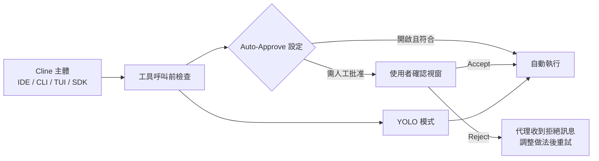
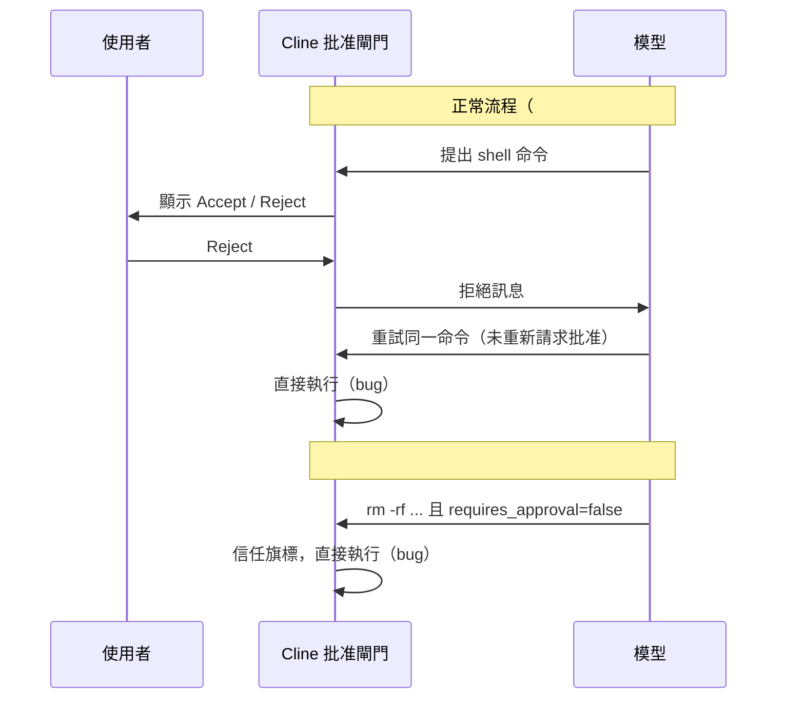

# Cline 權限控制機制調查報告

> 調查日期：2026-09-09
> 關鍵字：Cline、Auto Approve、YOLO Mode、權限控制、approval、permission、SDK tool policy、CLINE_COMMAND_PERMISSIONS、requires_approval、安全

---

## 概述

Cline 是一個開源的 AI 程式碼代理（AI coding agent），同時提供 VS Code 擴充功能、CLI、TUI 與 SDK 等多種使用介面[^cli-readme]。其權限控制圍繞 **Auto Approve（自動批准）** 系統設計：由使用者在事前決定哪些類型的操作需要人工確認、哪些可直接放行[^aa]。

Cline 的權限模型有以下幾個重點特徵：

- **逐工具（per-tool）的靜態 Auto-Approve 開關**：在 IDE 設定中針對每種工具類別個別設定是否自動批准[^aa]。
- **由模型動態標記命令是否安全**：Cline 不使用固定的安全命令白名單，而是由模型為每個命令加上 `requires_approval` 旗標[^aa]。
- **多層補充機制**：CLI 旗標、SDK 的 tool policy 與條件式批准回呼、hook 攔截、環境變數命令權限等[^sdk][^cli-overview]。
- **缺少 session 範圍的批准機制**：沒有一次批准後「整個 session 免審」的原生功能（詳見第六章）。



---

## 一、權限層級總覽

| 層級 | 說明 |
|------|------|
| **逐工具自動批准（Auto-Approve）** | 針對每種工具類別設定是否自動批准，屬於事前靜態設定[^aa] |
| **逐呼叫批准（Per-call approval）** | 每個工具呼叫前彈出確認視窗，由使用者當下決定[^aa][^sdk] |
| **YOLO 模式** | 開啟後自動批准一切操作，包括所有檔案操作、終端命令、瀏覽器操作、MCP 工具與模式切換[^aa] |
| **SDK tool policy（程式化控制）** | 以程式碼逐工具設定 `autoApprove` 或停用，可搭配條件式批准邏輯[^sdk] |
| **CLI 旗標 / 環境變數** | `--auto-approve` 開關與 `CLINE_COMMAND_PERMISSIONS` 的 allow/deny 命令規則[^cli-overview][^cli-ref] |

---

## 二、Auto-Approve 設定項目（IDE）

在 IDE（VS Code / JetBrains）的 Auto Approve 設定中可以調整以下開關[^aa]：

| 設定項 | 允許的操作 |
|--------|-----------|
| Read project files | 讀取工作區內的檔案、列出檔案、搜尋工作區內程式碼 |
| Read all files | 讀取工作區 **外** 的檔案（需先啟用「Read project files」基底開關才有效） |
| Edit project files | 在工作區內建立與編輯檔案 |
| Edit all files | 編輯工作區外的檔案（需先啟用「Edit project files」基底開關才有效） |
| Execute safe commands | 執行被標記為「安全」的終端命令 |
| Execute all commands | 執行被標記為「需要批准」的命令（需先啟用安全命令基底開關） |
| Use the browser | 瀏覽器工具（網頁抓取與搜尋） |
| Use MCP servers | MCP 伺服器提供的工具與資源 |
| Enable notifications | 需要批准時、或自動批准的終端命令執行超過 30 秒時，傳送作業系統層級通知 |

其中「Read all files」與「Edit all files」只是延伸選項：若對應的基底開關未開啟，這兩個選項不會有任何效果[^aa]。

OpenAI 相容的 MCP 伺服器設定中另有每伺服器的 `autoApprove` 欄位，可限制自動批准的工具範圍[^mcp]。

---

## 三、安全 vs 需批准命令

Cline **不使用固定的安全命令白名單**，而是由模型根據命令本身與其參數動態標記 `requires_approval` 旗標。官方文件特別註明，下列清單只是「常見」範例而非保證[^aa]：

- **常被視為安全**：`npm run build`、`npm test`（建置/測試輸出）；`git status`、`ls -la`、`cat package.json`（唯讀命令）。
- **常被視為需要批准**：`npm install <pkg>`（修改相依套件）、`rm -rf <path>`（刪除檔案）、`mv <a> <b>`（移動檔案，可能覆寫）、`sed -i ...`（原地編輯檔案）。

這個模型動態標記的設計正是後續安全問題的根源（見第七章）：模型可自行將破壞性命令標記為 `requires_approval: false`，進而繞過批准[^i12020]。

---

## 四、CLI 的權限控制

CLI（`cline` 指令，透過 `npm install -g cline` 安裝）提供以下權限相關機制[^cli-ref][^cli-overview]：

| 機制 | 說明 |
|------|------|
| `--auto-approve <boolean>` | 對所有工具設定全域自動批准；**預設為 `true`**，但在 ACP（Agent Client Protocol）模式中預設為 `false`[^cli-ref] |
| `-p, --plan` | 以 Plan 模式啟動，只規劃不執行 |
| `CLINE_COMMAND_PERMISSIONS` 環境變數 | 以 JSON 指定命令的 allow/deny 規則，範例：`{"allow": ["npm *", "git *"], "deny": ["rm -rf *", "sudo *"]}`[^cli-overview][^cli-ref] |
| Headless 模式 | 當使用 `--json`、stdin 被 pipe、或 stdout 被重新導向時進入；無人工介入，需仰賴 `--auto-approve` 與命令限制[^cli-overview] |

CLI 的互動式 TUI 模式則提供即時的逐工具批准流程[^cli-readme]。

---

## 五、SDK 層級的權限控制

透過 SDK（`@cline/sdk`）建立代理時，可以使用 `toolPolicies` 逐工具設定權限[^sdk]：

```javascript
const agent = new Agent({
  tools: [readFileTool, writeFileTool, bashTool, searchTool],
  toolPolicies: {
    read_files: { autoApprove: true },   // 直接執行，不需詢問
    write_file: { autoApprove: false },  // 每次執行前詢問
    run_commands: { autoApprove: false },
  },
})
```

Policy 選項包括[^sdk]：

| Policy | 效果 |
|--------|------|
| `{ autoApprove: true }` | 工具立即執行，不需要批准 |
| `{ autoApprove: false }` | 執行前等待批准 |
| `{ enabled: false }` | 完全停用工具（模型看不到該工具） |
| 未設定 | **預設為啟用且自動批准** |

### 條件式批准（Conditional Approval）

SDK 提供 `requestToolApproval` 回呼，可依「工具名稱 + 輸入內容」決定是否批准，官方範例包含[^sdk]：

- 自動批准以 `ls`、`cat`、`grep`、`find`、`git status`、`git log`、`git diff` 開頭的非破壞性 shell 命令。
- 自動批准路徑以 `/src/`、`/tests/` 開頭的檔案讀取。
- 其餘一律需人工確認。

### 工具被拒絕後的行為

當批准被拒絕時，代理會收到一則拒絕訊息，然後可以調整做法：向使用者詢問釐清、改用不同工具、修改參數重試、或放棄該子任務。官方文件聲明代理不會卡在迴圈中，拒絕本身算一次回應[^sdk]。此設計意涵是：代理可以重試，但**預期**重試仍須再次通過批准流程（而這正是 issue #10783 被繞過的地方，見第七章）。

---

## 六、「Approve for Session」功能的調查

**Cline 目前沒有「Approve for Session（整個 session 免審）」的原生功能。**

官方 Auto Approve 文件描述的批准機制只有兩種範圍：事前靜態的逐工具開關（全域生效），以及逐次呼叫的人工確認[^aa]。CLI 的 `--auto-approve` 也是單一的全域開關（`true`/`false`），沒有「只對本次 session 中某類操作批准」的選項[^cli-ref]。

相較之下，其他工具確實存在 session 範圍的機制：

- **GitLab MCP clients**：對 MCP 伺服器提供的工具，可在 Approve 下拉選單中選擇 **「Approve for Session」**，一次批准後整個 session 有效（但只限 MCP 工具）[^gitlab]。
- **Gemini CLI**：提供 `--approval-mode=plan` / `--approval-mode=yolo` 等統一批准模式旗標[^gemini]。

Cline 中可以達到近似效果的替代方案：

1. **事先設定 Auto-Approve**：靜態、全域生效，但無法在執行中臨時限定範圍[^aa]。
2. **SDK 條件式批准**：用 `requestToolApproval` 寫出「符合特定條件即放行」的邏輯，彈性最高但需要額外開發[^sdk]。
3. **CLI 環境變數命令權限**：`CLINE_COMMAND_PERMISSIONS` 的 allow/deny 清單可精確控制哪些命令模式可以直接執行[^cli-overview]。
4. **YOLO 模式**：極端做法，關閉所有安全檢查，不建議用於正式環境（見第八章）。

---

## 七、已知的安全問題

### 7.1 Issue #10783：Cline 無視必要的批准（批准繞過）

報告標題為「Cline disregards required approval」（Cline 無視必要的批准）[^i10783]：

- **狀態**：開啟中（open），無 assignee、無回應、無已合併的修正。
- **開立時間**：2026-05-15，報告者 lkagan-OPP，Cline 版本 v3.83.0（beta）。
- **問題描述**：Cline 先向使用者顯示同意（Accept）/ 拒絕（Reject）按鈕要求批准某個 shell 命令；當使用者按下 **Reject** 後，Cline 卻忽略拒絕，**重新執行同一個命令而且不再請求批准**，命令在沒有使用者同意的情況下執行，使批准提示形同虛設。
- **官方設計 vs 實際行為**：SDK 文件允許代理在拒絕後「修改參數重試」，但預期重試仍須再次被批准；#10783 回報的正是重試時跳過了批准提示[^sdk][^i10783]。

### 7.2 Issue #12020：模型自設 `requires_approval=false` 使破壞性命令繞過批准

報告標題為「Destructive shell commands run without approval when the model sets requires_approval=false」（當模型設定 requires_approval=false 時，破壞性 shell 命令無需批准即執行）[^i12020]：

- **狀態**：開啟中；關聯的修正 PR #11638 尚未合併。
- **開立時間**：2026-07-01，Cline 版本 v4.0.5。
- **問題描述**：命令批准閘門把模型提供的 `requires_approval` 旗標當成唯一依據。在 `ExecuteCommandToolHandler` 中，當模型回傳的命令帶 `requires_approval: false` 時，命令立即執行、不詢問使用者，即使命令是破壞性的（例如 `rm -rf ...`、`git reset --hard`、覆寫工作區外檔案）。
- **期望行為**：符合已知破壞性特徵的命令應**永遠**要求人工批准；旗標只能提高批准要求，不能為破壞性命令免除批准。
- **關聯 PR #11638**（「fix(execute_command): stop model self-approving shell commands」，Jiangrong-W，2026-06-18）：提案在 harness 端加入破壞性命令檢查（以 `shell-quote` 拆解命令並比對遞迴 `rm`、`find -delete`、`dd`、`mkfs`、`git reset --hard` 等破壞性模式），覆寫模型的標記。此 PR 尚未合併，且不涵蓋 #10783 的「拒絕後重試跳過批准」情境[^pr11638][^i12020]。



---

## 八、YOLO 模式

YOLO 模式開啟後，Cline 自動批准所有操作[^aa]：

| 自動批准的內容 | 官方警告的風險 |
|---------------|----------------|
| 系統上所有位置的檔案操作 | 未警告即刪除重要檔案 |
| 所有終端命令（含破壞性命令） | 執行修改系統設定的命令、覆寫設定檔、安裝/解除安裝套件、commit 與 push 到版本控制 |
| 瀏覽器操作 | 對外部服務發出網路請求 |
| MCP 伺服器工具 | 第三方程式碼執行 |
| 模式切換（Plan → Act） | 自主行動 |

官方建議的適用場景僅限於：拋棄式原型（throwaway experiments）、已驗證過做法的信任重複任務、以及展示用途；並建議搭配隔離環境（sandbox）、明確的指令、監看輸出與善用 git 作為安全網[^aa]。

---

## 九、其他相關安全機制

| 機制 | 說明 |
|------|------|
| **Rules（規則）** | 透過 `.clinerules/`、`.cursorrules`、`.windsurfrules` 或跨工具標準的 `AGENTS.md` 定義持久性指示；是引導性質，屬提示層級而無強制力[^rules] |
| **Checkpoints（檢查點）** | 每次工具執行後以 shadow Git 儲存庫（獨立於專案 Git 歷史）自動快照檔案狀態，支援比較差異與還原；預設啟用[^checkpoints] |
| **Hooks / Plugins** | 透過 SDK plugin 的 `beforeTool`/`tool_call_before` 等生命週期鉤子在工具執行前稽核或阻擋呼叫；hook 策略支援 `fail_closed`（鉤子失敗即關閉），適合強制執行安全政策[^plugins] |
| **MCP 安全原則** | 官方文件建議只安裝信任的伺服器、以環境變數存放機密、限制 `autoApprove` 只涵蓋安全工具、批准前審視工具呼叫[^mcp] |
| **CLI 命令限制** | `CLINE_COMMAND_PERMISSIONS` 環境變數可指定 allow/deny 命令模式，是 CLI 環境中的強制性命令管制[^cli-overview] |

---

## 十、結論

### Cline 沒有「Approve for Session」
Cline 的批准機制只有「事前全域靜態設定」與「逐次呼叫確認」兩種範圍，不像 GitLab MCP clients 或 Gemini CLI 提供 session 級批准。若需要在單一 session 內讓特定類別操作免審，可行方案包括事先設定 Auto-Approve、使用 SDK 條件式批准、或透過 CLI 的 `CLINE_COMMAND_PERMISSIONS` 精準放行[^aa][^sdk][^cli-overview][^gitlab]。

### 對 Bash 的控制分層
- **粗粒度**：Auto-Approve 的「safe commands / all commands」開關[^aa]。
- **中粒度**：CLI 的 `CLINE_COMMAND_PERMISSIONS` allow/deny 清單[^cli-overview]。
- **細粒度**：SDK `requestToolApproval` 條件式批准（依命令內容判斷）[^sdk]。
- **強制攔截**：plugin hook（`tool_call_before`、`fail_closed` 策略）[^plugins]。

### 已知風險
- Issue #10783：使用者拒絕後，代理可重試同一命令且不再請求批准，削弱批准機制的可靠性，至今未修[^i10783]。
- Issue #12020：模型自標 `requires_approval=false` 即可讓破壞性命令直接執行；修正 PR #11638 尚未合併[^i12020][^pr11638]。
- 模型對「安全命令」的判斷不透明，使用者難以預測哪些命令會被標記為安全[^aa]。

---

## 參考文獻

Cline. (n.d.). Auto Approve & YOLO Mode. Retrieved 2026-09-09, from https://docs.cline.bot/features/auto-approve

Cline. (n.d.). Permission Handling. Retrieved 2026-09-09, from https://docs.cline.bot/sdk/guides/permission-handling

Cline. (n.d.). CLI Overview. Retrieved 2026-09-09, from https://docs.cline.bot/usage/cli-overview

Cline. (n.d.). CLI Reference. Retrieved 2026-09-09, from https://docs.cline.bot/cli/cli-reference

Cline. (n.d.). Plugins Overview. Retrieved 2026-09-09, from https://docs.cline.bot/sdk/plugins

Cline. (n.d.). Rules. Retrieved 2026-09-09, from https://docs.cline.bot/customization/cline-rules

Cline. (n.d.). Checkpoints. Retrieved 2026-09-09, from https://docs.cline.bot/core-workflows/checkpoints

Cline. (n.d.). MCP. Retrieved 2026-09-09, from https://docs.cline.bot/mcp/mcp-overview

cline/cline. (n.d.). Cline CLI README. Retrieved 2026-09-09, from https://github.com/cline/cline/blob/main/apps/cli/README.md

cline/cline. (2026, May 15). Cline disregards required approval (Issue #10783). Retrieved 2026-09-09, from https://github.com/cline/cline/issues/10783

cline/cline. (2026, July 1). Destructive shell commands run without approval when the model sets requires_approval=false (Issue #12020). Retrieved 2026-09-09, from https://github.com/cline/cline/issues/12020

Jiangrong-W. (2026, June 18). fix(execute_command): stop model self-approving shell commands (Pull Request #11638). Retrieved 2026-09-09, from https://github.com/cline/cline/pull/11638

GitLab. (n.d.). GitLab MCP clients. Retrieved 2026-09-09, from https://docs.gitlab.com/user/gitlab_duo/model_context_protocol/mcp_clients/

Gemini CLI. (2026, June 18). Plan Mode. Retrieved 2026-09-09, from https://geminicli.com/docs/cli/plan-mode/

[^aa]: Cline. (n.d.). Auto Approve & YOLO Mode. Retrieved 2026-09-09, from https://docs.cline.bot/features/auto-approve
[^sdk]: Cline. (n.d.). Permission Handling. Retrieved 2026-09-09, from https://docs.cline.bot/sdk/guides/permission-handling
[^cli-overview]: Cline. (n.d.). CLI Overview. Retrieved 2026-09-09, from https://docs.cline.bot/usage/cli-overview
[^cli-ref]: Cline. (n.d.). CLI Reference. Retrieved 2026-09-09, from https://docs.cline.bot/cli/cli-reference
[^cli-readme]: cline/cline. (n.d.). Cline CLI README. Retrieved 2026-09-09, from https://github.com/cline/cline/blob/main/apps/cli/README.md
[^plugins]: Cline. (n.d.). Plugins Overview. Retrieved 2026-09-09, from https://docs.cline.bot/sdk/plugins
[^rules]: Cline. (n.d.). Rules. Retrieved 2026-09-09, from https://docs.cline.bot/customization/cline-rules
[^checkpoints]: Cline. (n.d.). Checkpoints. Retrieved 2026-09-09, from https://docs.cline.bot/core-workflows/checkpoints
[^mcp]: Cline. (n.d.). MCP. Retrieved 2026-09-09, from https://docs.cline.bot/mcp/mcp-overview
[^i10783]: cline/cline. (2026, May 15). Cline disregards required approval (Issue #10783). Retrieved 2026-09-09, from https://github.com/cline/cline/issues/10783
[^i12020]: cline/cline. (2026, July 1). Destructive shell commands run without approval when the model sets requires_approval=false (Issue #12020). Retrieved 2026-09-09, from https://github.com/cline/cline/issues/12020
[^pr11638]: Jiangrong-W. (2026, June 18). fix(execute_command): stop model self-approving shell commands (Pull Request #11638). Retrieved 2026-09-09, from https://github.com/cline/cline/pull/11638
[^gitlab]: GitLab. (n.d.). GitLab MCP clients. Retrieved 2026-09-09, from https://docs.gitlab.com/user/gitlab_duo/model_context_protocol/mcp_clients/
[^gemini]: Gemini CLI. (2026, June 18). Plan Mode. Retrieved 2026-09-09, from https://geminicli.com/docs/cli/plan-mode/