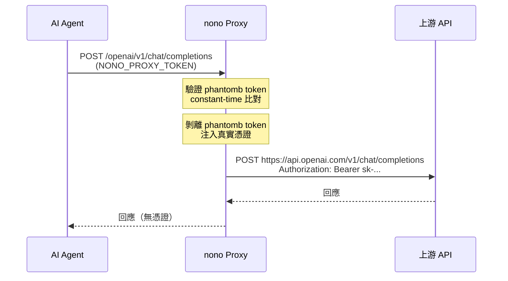
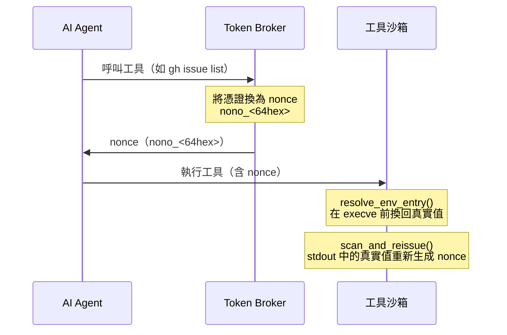
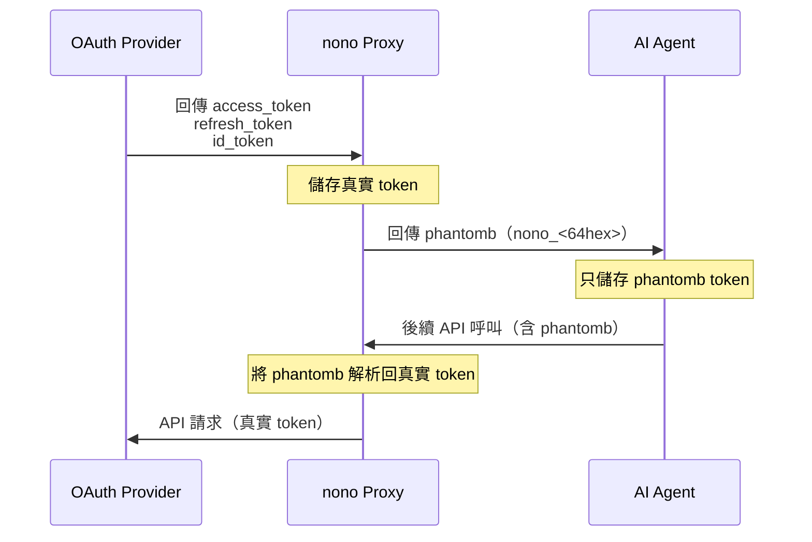
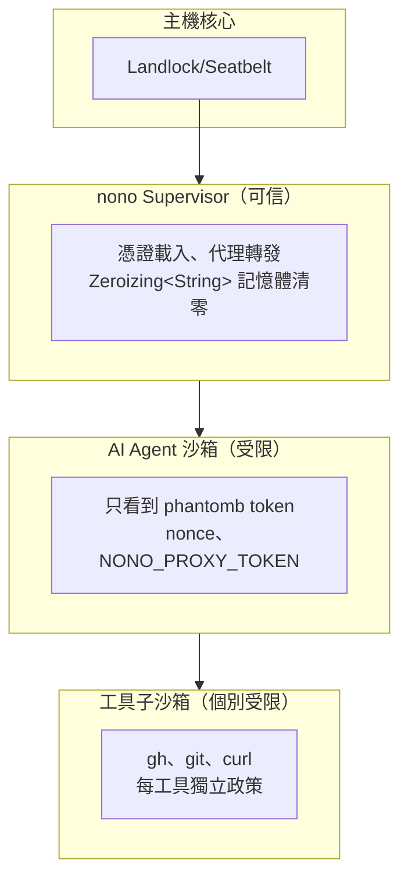

# nono：AI Agent 憑證安全沙箱機制

## 概述

[nono](https://github.com/nolabs-ai/nono) 是一個開源、核心層級（kernel-level）強制的 AI Agent 沙箱工具，由 Sigstore 團隊成立的 nolabs 公司開發[^nolabs-blog]。它能在數秒內、零設定、零延遲地將 Claude Code、Codex、OpenCode 等 AI Agent 放入沙箱，並透過 **細粒度的能力控制（capability control）** 限制 Agent 的檔案系統、網路、憑證與工具存取權限，而非依賴傳統 VM 或容器的隔離模型[^github]。

---

## 核心問題

AI Agent（如 Claude Code、Codex、OpenCode）需要 API Key 才能呼叫 LLM 服務或操作 GitHub/GitLab 等外部平台。然而，這些憑證若直接暴露給 Agent，一旦 Agent 遭受注入攻擊（prompt injection）或遭挾持，就可能外洩機密[^starlog]。

nono 的核心挑戰是：

> 如何讓 Agent 能夠使用憑證完成工作，同時讓憑證永遠不在 Agent 的記憶體或環境變數中出現？

---

## 解決方案架構

nono 使用 **Kernel-Level Sandboxing** 配合 **三層憑證隔離機制** 解決此問題。

### Kernel-Level Sandboxing 基礎

nono 的核心是依靠作業系統核心（kernel）的強制存取控制，而非使用者空間的軟體過濾[^nolabs-blog]：

- **Linux**：使用 **Landlock**（Linux 5.13+ 內建的可堆疊 LSM），限制檔案系統與網路存取
- **macOS**：使用 **Seatbelt**（Apple 的沙箱框架）
- **Windows**：支援 WSL2

一旦呼叫沙箱強制函數，核心保證沒有任何後續程式碼——即便擁有 root 權限——能夠放寬這些權限。這種**不可逆性**防止了 TOCTOU（Time-of-Check-Time-of-Use）攻擊，因為惡意程式碼無法在取得控制權後移除限制[^starlog]。

```python
# Python bindings 範例
from nono import Sandbox, ProxyConfig

proxy = ProxyConfig()
proxy.intercept(
    pattern="api.github.com",
    inject_header="Authorization",
    from_keychain="github_agent_token"
)

sandbox = Sandbox(
    allow_network=["api.github.com:443"],
    proxy=proxy
)

with sandbox:
    agent.run()
```

### 1. Proxy Injection（代理注入）—— 主要方案

這是 nono **推薦的主要方案**，適用於 LLM API Key 等網路憑證[^github-readme]。

**運作流程：**



**關鍵實作細節**：

- 憑證在 Supervisor 程序啟動時從系統鑰匙圈載入，存放在 `Zeroizing<String>` 中，drop 時自動清零記憶體[^starlog]
- Agent 只收到一個 `NONO_PROXY_TOKEN`（256-bit 隨機 phantomb token）
- 本機 HTTP reverse proxy 攔截 Agent 的所有 API 呼叫
- Proxy 以 constant-time 比對驗證 phantomb token，防止 timing attack
- 憑證**從未進入沙箱**，連環境變數形式都沒有

### 2. Token Broker（令牌經紀人）—— 工具沙箱隔離

當 Agent 呼叫受控工具（如 `git`、`gh`、`curl`）時，nono 使用 Token Broker 來隔離憑證[^github-readme]。

**運作流程：**



**Capability-bound nonce（能力綁定 nonce）**：

每個 nonce 攜帶一個 `GrantSet`，只有特定消費者可以兌換：
- `"cmd.<command_name>"` —— 命令環境變數提升路徑
- `"proxy.<route_id>"` —— L7 表頭注入路徑

```rust
pub(crate) enum GrantSet {
    All,                              // 任何消費者可兌換（向後相容）
    Specific(Vec<String>),           // 僅限列出的消費者
}
```

這確保了即使一個非授權程序取得了 `nono_<64hex>`，也無法兌換成真實憑證[^starlog]。

### 3. 沙箱化 OAuth 登入（Sandboxed OAuth Logins）

對於使用 OAuth 流程的 Agent（如 Codex、Claude Code 的帳號登入），nono 提供 OAuth Capture 機制[^github-readme]。

**運作流程：**



**關鍵實作細節**：

- Agent 執行 OAuth 登入流程（如 `codex login --device-auth`）
- nono proxy 透過 TLS 攔截攔截 token endpoint 的回應
- Proxy 將 `access_token`、`refresh_token`、`id_token` 全部改寫為 `nono_<64hex>`
- Agent 儲存 phantomb token
- 當 Agent 後續透過 proxy 呼叫 API 時，proxy 將 phantomb 解析回真實 token
- Phantomb 只能在 nono proxy 的特定路由上兌現

**多種來源支援**：
- 系統鑰匙圈（macOS Keychain / Linux Secret Service）
- 1Password（`op://` URI）
- Bitwarden（`bw://` URI）
- Apple Passwords（`apple-password://` URI）
- 檔案（`file://` URI）
- 主機環境變數（`env://` URI）
- CLI 命令捕獲（`cmd://` URI，如 `gh auth token`）
- AWS SigV4 簽章（AWS 憑證鏈解析）

---

## 與 Sandboxed Tool Execution 的整合

nono 不會只將 Agent 放進沙箱就結束。Agent 會委託實際工作給工具：`git`、`gh`、`curl`、`kubectl`、套件管理器、建置腳本、MCP clients/servers 等。這些工具通常正是機密、網路和副作用出現的地方。nono 為此提供了**工具子沙箱機制**[^github-readme]：

nono 可以將委託工具放入各自獨立的子沙箱（child sandbox），與 Agent 的控制範圍隔離。Agent 有自己的會話沙箱；當它呼叫受控工具時，nono 的 broker 會以獨立的政策、檔案系統權限、網路規則和憑證啟動該工具。工具不會繼承 Agent 的廣泛授權。

```json
{
  "command_policies": {
    "credentials": {
      "github-api": {
        "type": "proxy",
        "upstream": "https://api.github.com",
        "credential_key": "keyring://gh:github.com/example?decode=go-keyring",
        "env_var": "GH_TOKEN",
        "inject_header": "Authorization",
        "credential_format": "Bearer {}"
      }
    },
    "commands": {
      "gh": {
        "from": {
          "session": {
            "sandbox": {
              "fs_read": ["."],
              "credentials": [
                {
                  "name": "github-api",
                  "endpoint_policy": {
                    "default": "deny",
                    "allow": [
                      { "method": "GET", "path": "/repos/nolabs-ai/nono/issues/**" }
                    ]
                  }
                }
              ]
            },
            "invocation_policy": {
              "default": "deny",
              "allow": [
                { "argv": { "prefix": ["issue", "list"] } },
                { "argv": { "prefix": ["issue", "view"] } }
              ]
            }
          }
        }
      }
    }
  }
}
```

這意味著：
- Agent 可以呼叫 `gh`，但 `gh` 只能取得 GitHub token
- token 只能對特定 API 路徑使用（L7 過濾）
- Agent 可以要求呼叫工具，但不能擴大該工具的沙箱或偽造新金鑰
- `git` 可以呼叫 `ssh` 於鏈式政策之下，但直接從 Agent 呼叫 `ssh` 仍被拒絕

---

## 四種方案的適用場景比較

| 方案 | 適用場景 | 憑證是否進入沙箱 | 複雜度 |
|------|---------|-----------------|--------|
| Proxy Injection | LLM API Key（OpenAI、Anthropic 等） | 否 | 低 |
| Token Broker | 工具沙箱內的憑證注入（gh、git 等） | 否（僅在 execve 前瞬間注入） | 中 |
| OAuth Capture | OAuth 登入流程 | 否（自始至終 phantomb） | 高 |
| Env Injection | 非網路憑證（資料庫密碼等） | 是（在環境變數中） | 最低 |

---

## 安全模型摘要



**關鍵安全宣稱**[^starlog][^github-readme]：

1. **憑證永不進入沙箱** —— 即使 Agent 被攻陷也無法提取
2. **Session token 隔離** —— phantom token 只有 nono proxy 能解析
3. **不可逆沙箱強制** —— 一旦執行，無法放寬，防止 TOCTOU 攻擊
4. **記憶體清零** —— `Zeroizing<String>` 確保 drop 時自動抹除
5. **Fail-closed** —— 任何錯誤（proxy 崩潰、驗證失敗）都會拒絕存取
6. **無特權升級** —— Supervisor 以一般使用者權限執行，不是 root
7. **路徑清理** —— 憑證解析時會從 PATH 移除沙箱可寫入的目錄，防止放置惡意程式
8. **供應鏈安全** —— 可透過 Sigstore 對政策檔案進行簽章驗證[^starlog]

---

## 與容器方案對比

nono 不使用 Docker 或 microVM，而是直接使用作業系統核心的原生沙箱能力。這帶來了幾個關鍵優勢[^starlog]：

- **零延遲啟動**：無容器啟動時間，Agent 可在數秒內啟動
- **零磁碟空間**：無需下載容器映像檔
- **in-process 限制**：無需 fork、namespace、虛擬化開銷
- **內容定址快照**：以 Merkle tree 記錄檔案系統狀態，SHA-256 去重複，即時還原

```typescript
// TypeScript bindings 快照範例
import { Sandbox, Snapshot } from '@nono/sdk';

const sandbox = new Sandbox({
  workspace: '/tmp/agent-session',
  snapshot: true
});

const checkpoint = await sandbox.createSnapshot();
try {
  await agent.executeUserPrompt(untrustedInput);
} catch (error) {
  await sandbox.restoreSnapshot(checkpoint); // O(1) 指標交換
}
```

**限制**[^starlog]：

- 非 VM 等級隔離（同一個核心，共享使用者權限）
- Linux `/proc/PID/environ` 對同使用者程序可見
- OAuth Capture 的持久化儲存在使用者可讀的檔案中
- Supervisor 的 Rust `unsafe` 區塊仍可能存在漏洞（但範圍極小）
- Alpha 階段，尚未經過正式安全審計
- 不支援動態權限提升（政策不可逆）
- 原生 Windows 支援尚在規劃中

---

## 產業採用

nono 受到多家大型科技公司採用[^github-readme]：

- **Datadog**（James Carnegie, Staff Security Engineer）：使用 nono 實現每個命令的細粒度政策和複雜的憑證管理
- **Okta**（Leonardo Zanivan, Principal Engineer）：在高度安全的政策控制沙箱中隔離 Agent 執行，確保憑證鎖定

截至 2026 年 9 月，nono 在 GitHub 上擁有 4,000+ 星標、263 個 Fork，Claude Code nono 套件已超過 50,000 次下載。

---

## 參考資料

[^nolabs-blog]: Hinds, L. (2026, February 12). Why I built nono. NoLabs Blog. Retrieved 2026-09-09, from https://nolabs.ai/blog/why-i-built-nono

[^github]: nolabs-ai. (2026). nono: secure multiplexed execution paths for agents. GitHub. Retrieved 2026-09-09, from https://github.com/nolabs-ai/nono

[^github-readme]: nolabs-ai. (2026). nono README. GitHub. Retrieved 2026-09-09, from https://github.com/nolabs-ai/nono#readme

[^starlog]: Ragan, R. (2026, May 7). Nono: Kernel-Level Sandboxing for AI Agents Without the Container Tax. Starlog. Retrieved 2026-09-09, from https://starlog.is/articles/ai-agents/always-further-nono/