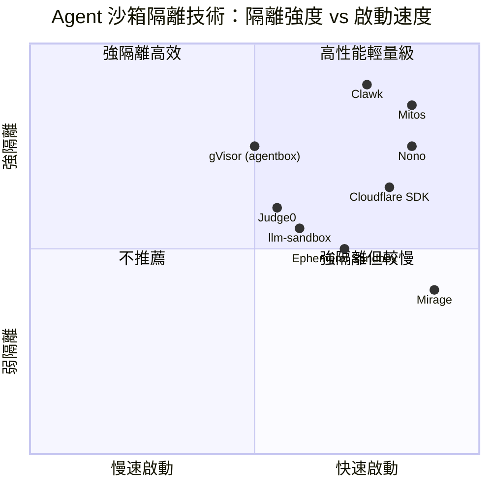
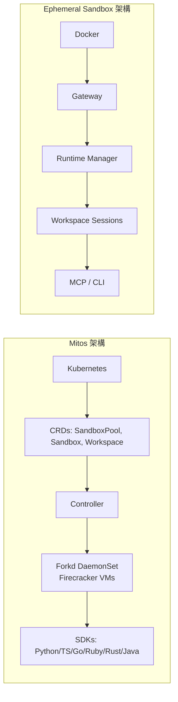

# AI Agent 沙箱與隔離工具調查報告

> 調查日期：2026-09-09
> 範圍：GitHub 上開源且專注於 AI Agent 沙箱（Sandbox）／隔離（Isolation）環境的工具
> 目標：提供最新選型參考，協助選擇適合不同場景的沙箱方案

## 一、調查結果總覽

| # | 專案名稱 | Stars ⭐ | 授權 | 主要語言 | 隔離技術 | 焦點 |
|---|---------|---------|------|---------|---------|------|
| 1 | **judge0/judge0** | 4.4k | GPL-3.0 | Ruby | 容器（Docker） | 通用線上程式碼執行 |
| 2 | **nolabs-ai/nono** | 4.0k | Apache-2.0 | Rust | Rust 多路徑執行隔離 | 零信任 Agent 執行路徑 |
| 3 | **strukto-ai/mirage** | 3.6k | Apache-2.0 | TypeScript | 虛擬終端機（FUSE VFS） | Agent 專用虛擬終端 |
| 4 | **cloudflare/sandbox-sdk** | 1.1k | 自訂 | TypeScript | 邊緣容器 | Cloudflare Edge 沙箱 |
| 5 | **vndee/llm-sandbox** | 1.1k | MIT | Python | Docker 容器 | LLM Code Interpreter 沙箱 |
| 6 | **clawkwork/clawk** | 1.0k | Apache-2.0 | Go | 微型 VM（Firecracker／Virtualization.framework） | 程式碼 Agent 專用一次性 VM |
| 7 | **sandbaseai/sandbase-harness** | 643 | Apache-2.0 | TypeScript | Docker 沙箱會話 | Agent Runtime + MCP Bridge |
| 8 | **FootprintAI/Containarium** | 277 | Apache-2.0 | Go | LXC／K8s + eBPF | SSH 原生隔離 Agent Runtime |
| 9 | **agent-sandbox/agent-sandbox** | 213 | Apache-2.0 | Go | Kubernetes 容器 | 企業級 Agent 沙箱平台 |
| 10 | **mattolson/agent-sandbox** | 204 | Apache-2.0 | Go | Docker／iptables 防火牆 | 本地 Agent 協作開發環境 |
| 11 | **rcarmo/agentbox** | 148 | MIT | Dockerfile | Docker 容器 | 容器化 Coding Agent |
| 12 | **aws-samples/sample-autonomous-cloud-coding-agents** | 137 | Apache-2.0 | TypeScript | AWS 隔離執行環境 | 自主背景 Coding Agent |
| 13 | **langgenius/mosoo** | 132 | Apache-2.0 | TypeScript | Cloudflare Workers | Agent Gallery & Gateway |
| 14 | **Ephemeral-AI-Lab/ephemeral-sandbox** | 92 | MIT | Rust | Docker 隔離工作區 | 平行 Coding Agent 沙箱 |
| 15 | **mitos-run/mitos** | 89 | Apache-2.0 | Go | Firecracker microVM | 毫秒級 microVM Forking |
| 16 | **Michaelliv/agentbox** | 49 | MIT | Python | gVisor | Agent 隔離程式碼執行 |

## 二、重點工具詳細介紹

### 2.1 Judge0 ⭐ 4.4k — 最成熟的開源程式碼執行沙箱

- **倉庫**: <https://github.com/judge0/judge0>[^judge0]
- **授權**: GPL-3.0
- **核心能力**: 支援 60+ 語言的線上程式碼執行系統，專為 AI Agent 和競賽平台設計
- **隔離方式**: Docker 容器隔離，支援同步／非同步執行
- **適合場景**: LeetCode 風格平台、AI 產生的程式碼執行、教育評測
- **優勢**: 社群龐大（931 forks）、部署文件完善、支援 MCP Server
- **劣勢**: 非長期 Agent 會話設計，每次執行為短生命週期
- **建立時間**: 2017-01，為最成熟的專案

### 2.2 Nono ⭐ 4.0k — 零信任 Agent 執行路徑

- **倉庫**: <https://github.com/nolabs-ai/nono>[^nono]
- **授權**: Apache-2.0
- **核心能力**: 安全多工執行路徑，零信任、零設定、零延遲。由打造 **Sigstore** 的團隊建立
- **隔離方式**: Rust 實作的多路徑隔離，強調供應鏈安全與 Sigstore。支援工具層級子沙箱，可對 `git`、`gh`、`curl` 等工具分別設定不同的檔案系統、網路、憑證政策
- **適合場景**: 需要高安全性 Agent 執行的企業環境
- **優勢**: 安全性優先設計、活躍開發（1,711 commits）、已有 Datadog 和 Okta 等企業採用
- **獨特功能**: 提供命令級別沙箱，Agent 無法繞過工具的政策限制

### 2.3 Mirage ⭐ 3.6k — 世界首個 Agent 虛擬終端

- **倉庫**: <https://github.com/strukto-ai/mirage>[^mirage]
- **授權**: Apache-2.0
- **核心能力**: 為 AI Agent 打造的虛擬終端機，透過 FUSE 提供虛擬檔案系統
- **隔離方式**: 虛擬終端 + VFS，Agent 看見隔離的檔案系統和環境
- **適合場景**: Claude Code、OpenAI Agents 等需要安全終端環境的 Agent
- **優勢**: 創新概念、快速成長（2,291 commits）、支援多種後端（S3、Gmail、Slack、Redis 等）
- **建立時間**: 2026-05，不到 4 個月達到 3.6k stars

### 2.4 Cloudflare Sandbox SDK ⭐ 1.1k — 邊緣沙箱

- **倉庫**: <https://github.com/cloudflare/sandbox-sdk>[^sandbox-sdk]
- **授權**: Cloudflare 自訂授權
- **核心能力**: 在 Cloudflare 邊緣網路執行沙箱化程式碼環境
- **隔離方式**: Cloudflare 容器基礎設施
- **適合場景**: 需要全球邊緣部署的 Agent 沙箱
- **注意**: 依賴 Cloudflare 生態系，授權非標準 OSI 授權

### 2.5 llm-sandbox ⭐ 1.1k — 輕量 LLM Code Interpreter

- **倉庫**: <https://github.com/vndee/llm-sandbox>[^llm-sandbox]
- **授權**: MIT
- **核心能力**: 輕量便攜的 LLM 沙箱執行環境，Python 函式庫
- **隔離方式**: Docker 容器，支援容器池預熱、客製映像、K8s 與 Podman 後端
- **適合場景**: 需要為 LLM 提供安全程式碼執行能力的 Python 專案
- **優勢**: MIT 授權最寬鬆、API 簡潔、與 LangChain 等框架整合容易

### 2.6 Clawk ⭐ 1.0k — 一次性 VM 給 Coding Agent

- **倉庫**: <https://github.com/clawkwork/clawk>[^clawk]
- **授權**: Apache-2.0
- **核心能力**: 為程式碼 Agent 提供一次性 Linux VM，用完即棄
- **隔離方式**: macOS 上使用 Apple Virtualization.framework，Linux 上使用 Firecracker microVM
- **適合場景**: Claude Code、Codex 等需要強隔離的 Coding Agent
- **優勢**: VM 層級隔離最強、啟動快速

### 2.7 Mitos ⭐ 89 — 毫秒級 Firecracker microVM Forking

- **倉庫**: <https://github.com/mitos-run/mitos>[^mitos]
- **授權**: Apache-2.0
- **核心能力**: 基於 Firecracker 的毫秒級 microVM 沙箱 Forking，支援記憶體快照還原與 Copy-on-Write
- **隔離方式**: Firecracker KVM microVM，硬體層級隔離
- **特色**:
  - 將一個執行中的 VM Fork 成 N 份複本，共用記憶體頁面
  - 溫池啟動時間 P50 ~27 ms（裸機參考節點）
  - Durable Workspace CRDs，可版本化、Forkable 的工作區
  - 支援 Python、TypeScript、Go、Ruby、Rust、Java 六種 SDK
- **適合場景**: 需要毫秒級啟動與大量並行 Agent 沙箱的 Kubernetes 環境
- **專案狀態**: 早期開發（v0.3.0），需注意未經外部安全性審查
- **2,706 commits**（含 ephemeral-sandbox，此為 Ephemeral-AI-Lab 專案）

> 更正：以上 2,706 commits 為 Ephemeral-AI-Lab/ephemeral-sandbox[^ephemeral] 的資料。Mitos 本身有 **1,611 commits**。

### 2.8 Ephemeral Sandbox ⭐ 92 — 平行 Coding Agent 基礎設施

- **倉庫**: <https://github.com/Ephemeral-AI-Lab/ephemeral-sandbox>[^ephemeral]
- **授權**: MIT
- **核心能力**: 開源 Agent 沙箱基礎設施，支援平行 Coding Agent 在同一程式碼庫上工作
- **隔離方式**: Docker 隔離工作區，每個 Agent 擁有私有可寫工作階段
- **特色**: 支援 MCP／CLI 控制、可觀測性、原子化發布
- **適合場景**: 多 Agent 協作架構

### 2.9 其他值得關注的工具

- **sandbase-harness**（sandbaseai）⭐ 643: 本地優先的 Agent Runtime，含沙箱會話和 MCP Bridge[^sandbase]
- **Containarium**（FootprintAI）⭐ 277: SSH 原生隔離、eBPF 出口策略、GPU 透傳、MCP 原生 CLI[^containarium]
- **agent-sandbox**（agent-sandbox）⭐ 213: 企業級 Agent 沙箱平台，支援程式碼執行、瀏覽器使用、Computer Use、網站部署，Kubernetes 原生[^agent-sandbox-org]
- **mattolson/agent-sandbox** ⭐ 204: Docker/Colima 基礎搭配 sidecar proxy、iptables 防火牆、機密注入的本地開發沙箱[^mattolson]
- **rcarmo/agentbox** ⭐ 148: Docker 容器化 Coding Agent，含 Debian 基礎環境、預裝 Agent、Docker-in-Docker、SSH/RDP 存取[^rcarmo]
- **aws-samples/sample-autonomous-cloud-coding-agents** ⭐ 137: AWS 上的自主背景 Coding Agents，將任務轉換為 Pull Request，具隔離執行環境[^aws-sample]
- **langgenius/mosoo** ⭐ 132: 開源 Agent Gallery & Gateway，為 Codex、Claude Agent SDK、OpenCode 等提供統一的雲端沙箱執行 API[^mosoo]
- **Michaelliv/agentbox** ⭐ 49: gVisor 隔離容器搭配 gRPC API、出口代理、Python/TS SDKs[^michaelliv]

## 三、隔離技術對比

| 隔離方式 | 代表工具 | 隔離強度 | 啟動速度 | 資源開銷 |
|---------|--------|---------|---------|---------|
| **Firecracker microVM** | Clawk, Mitos | ★★★★★（核心層級） | 毫秒級 | 中 |
| **gVisor** | Michaelliv/agentbox | ★★★★（使用者空間核心） | 毫秒級 | 低-中 |
| **Docker 容器** | Judge0, llm-sandbox, rcarmo/agentbox | ★★★（程序層級） | 秒級 | 低 |
| **虛擬終端 + VFS** | Mirage | ★★★（檔案系統層級） | 即時 | 極低 |
| **Kubernetes + LXC + eBPF** | Containarium | ★★★★（多層級） | 秒級 | 中-高 |
| **Rust 多路徑隔離** | Nono | ★★★★（執行路徑層級） | 即時 | 極低 |
| **iptables + sidecar 代理** | mattolson/agent-sandbox | ★★★（網路層級） | 即時 | 低 |

## 四、Mitos 與 Ephemeral Sandbox — 新興競爭者深入分析

2026 年第二、三季出現了兩個值得深入關注的新專案：

### 4.1 Mitos（mitos-run/mitos）

Mitos 的技術定位極為特殊 — 它是目前唯一同時滿足以下四點的開源專案：

1. **開源且可自託管**: Apache-2.0 授權，可在任何 KVM 節點的 Kubernetes 叢集上運行
2. **Kubernetes 原生**: 使用 CRDs（SandboxPool、Sandbox、Workspace）宣告式管理
3. **Live Snapshot Fork**: 執行中的 VM 可透過 Copy-on-Write Fork 成 N 份獨立複本
4. **毫秒級溫啟動**: P50 ~27 ms 的溫池啟動速度

其效能數據在同類工具中表現突出：
- Fork 到首次執行：P50 ~104 ms（裸機參考節點）
- Warm-claim activate：P50 ~27 ms
- CoW 記憶體密度：8 個 Fork 僅耗費 ~35 MiB 常駐記憶體

### 4.2 Ephemeral Sandbox（Ephemeral-AI-Lab/ephemeral-sandbox）

Ephemeral Sandbox 定位為「平行 Coding Agent 基礎設施」，與 Mitos 不同之處在於：
- 不追求硬體層級隔離，而是提供工作區會話層級的隔離
- 專注於多 Agent 協作場景：多個 Agent 在同一程式碼庫上平行工作
- 使用 Docker 作為隔離邊界
- 提供原子化發布機制，確保變更不會衝突

## 五、選擇建議

### 依使用場景

| 場景 | 推薦工具 | 理由 |
|-----|---------|------|
| **通用程式碼執行** | Judge0 | 最成熟、語系支援最廣、社群最大 |
| **LLM Code Interpreter** | llm-sandbox | MIT 授權、Python 原生整合、輕量 |
| **Coding Agent 強隔離** | Clawk 或 Mitos | Firecracker microVM 層級隔離 |
| **企業級 Agent Runtime** | Nono 或 agent-sandbox | 安全性優先、企業級功能 |
| **快速原型／本地開發** | rcarmo/agentbox 或 mattolson/agent-sandbox | Docker 簡單部署 |
| **邊緣部署** | Cloudflare Sandbox SDK | 全球邊緣網路分發 |
| **並行大量 Agent** | Mitos | 毫秒級 microVM Fork + CoW |
| **零信任安全需求** | Nono | 零信任架構 + Sigstore + 工具層級子沙箱 |
| **多 Agent 協作** | Ephemeral Sandbox | 工作區會話隔離 + 原子化發布 |
| **MCP 整合** | sandbase-harness | 原生 MCP Bridge 支援 |

### 依授權偏好

- **MIT**（最寬鬆）：llm-sandbox, rcarmo/agentbox, Michaelliv/agentbox, Ephemeral Sandbox
- **Apache-2.0**（專利授權保護）：Nono, Mirage, Clawk, agent-sandbox, Mitos, Containarium, mosoo, aws-samples
- **GPL-3.0**（Copyleft）：Judge0

## 六、開發活躍度

| 專案 | 建立時間 | 提交數 | 近期活動 |
|-----|---------|-------|---------|
| judge0/judge0 | 2017-01 | — | 活躍（931 forks，最大社群） |
| nolabs-ai/nono | 2026-01 | 1,711 | 極活躍（263 forks，企業採用中） |
| strukto-ai/mirage | 2026-05 | 2,291 | 極活躍（261 forks） |
| cloudflare/sandbox-sdk | 2025-06 | — | 活躍（113 forks） |
| vndee/llm-sandbox | 2024-06 | — | 活躍（104 forks） |
| clawkwork/clawk | 2026-07 | — | 中等（38 forks） |
| mitos-run/mitos | 2026-05 | 1,611 | 極活躍（71 issues，積極開發中） |
| Ephemeral-AI-Lab/ephemeral-sandbox | 2026 | 2,706 | 極活躍 |
| Michaelliv/agentbox | 2025-11 | — | 低（僅初始提交） |

> 注意：Agent 沙箱領域在 2025–2026 爆發式增長，多數專案建立不到一年[^nono][^mirage][^mitos]。Nono 和 Mirage 快速成長的同時，Mitos 以獨特的 microVM Fork 技術和 Ephemeral Sandbox 以平行協作路線成為值得關注的新進者。

## 參考資料

[^judge0]: judge0/judge0 (n.d.). Judge0 — Robust, fast, scalable, and sandboxed open-source online code execution system. Retrieved 2026-09-09, from https://github.com/judge0/judge0

[^nono]: nolabs-ai/nono (n.d.). Nono — Secure multiplexed execution paths for agents - zero trust, zero setup, zero latency. Retrieved 2026-09-09, from https://github.com/nolabs-ai/nono

[^mirage]: strukto-ai/mirage (n.d.). Mirage — The World's First Virtual Terminal for AI Agents. Retrieved 2026-09-09, from https://github.com/strukto-ai/mirage

[^sandbox-sdk]: cloudflare/sandbox-sdk (n.d.). Cloudflare Sandbox SDK — Run sandboxed code environments on Cloudflare's edge network. Retrieved 2026-09-09, from https://github.com/cloudflare/sandbox-sdk

[^llm-sandbox]: vndee/llm-sandbox (n.d.). LLM Sandbox — Lightweight and portable LLM sandbox runtime Python library. Retrieved 2026-09-09, from https://github.com/vndee/llm-sandbox

[^clawk]: clawkwork/clawk (n.d.). Clawk — Give coding agents a disposable Linux VM, not your laptop. Retrieved 2026-09-09, from https://github.com/clawkwork/clawk

[^mitos]: mitos-run/mitos (n.d.). Mitos — Millisecond microVM sandbox forking for AI agents on Kubernetes. Retrieved 2026-09-09, from https://github.com/mitos-run/mitos

[^ephemeral]: Ephemeral-AI-Lab/ephemeral-sandbox (n.d.). Ephemeral Sandbox — Open-source agent sandbox infrastructure for parallel coding agents. Retrieved 2026-09-09, from https://github.com/Ephemeral-AI-Lab/ephemeral-sandbox

[^sandbase]: sandbaseai/sandbase-harness (n.d.). Sandbase Harness — Local-first, self-hosted AI agent runtime and MCP bridge with sandboxed sessions. Retrieved 2026-09-09, from https://github.com/sandbaseai/sandbase-harness

[^containarium]: FootprintAI/Containarium (n.d.). Containarium — Open-source agent runtime with SSH-native isolation, eBPF egress policy, Kubernetes + LXC backends. Retrieved 2026-09-09, from https://github.com/FootprintAI/Containarium

[^agent-sandbox-org]: agent-sandbox/agent-sandbox (n.d.). Agent Sandbox — Enterprise-grade sandbox platform for AI Agents. Retrieved 2026-09-09, from https://github.com/agent-sandbox/agent-sandbox

[^mattolson]: mattolson/agent-sandbox (n.d.). Agent Sandbox — Secure local dev environment for collaboration with AI coding agents. Retrieved 2026-09-09, from https://github.com/mattolson/agent-sandbox

[^rcarmo]: rcarmo/agentbox (n.d.). Agentbox — Contain your coding agents (literally). Retrieved 2026-09-09, from https://github.com/rcarmo/agentbox

[^aws-sample]: aws-samples/sample-autonomous-cloud-coding-agents (n.d.). Autonomous Cloud Coding Agents — AWS sample for autonomous background coding agents. Retrieved 2026-09-09, from https://github.com/aws-samples/sample-autonomous-cloud-coding-agents

[^mosoo]: langgenius/mosoo (n.d.). Mosoo — Open-source Agent Gallery and Gateway. Retrieved 2026-09-09, from https://github.com/langgenius/mosoo

[^michaelliv]: Michaelliv/agentbox (n.d.). Agentbox — A computer for your agent: sandboxed code execution for AI agents with gVisor. Retrieved 2026-09-09, from https://github.com/Michaelliv/agentbox