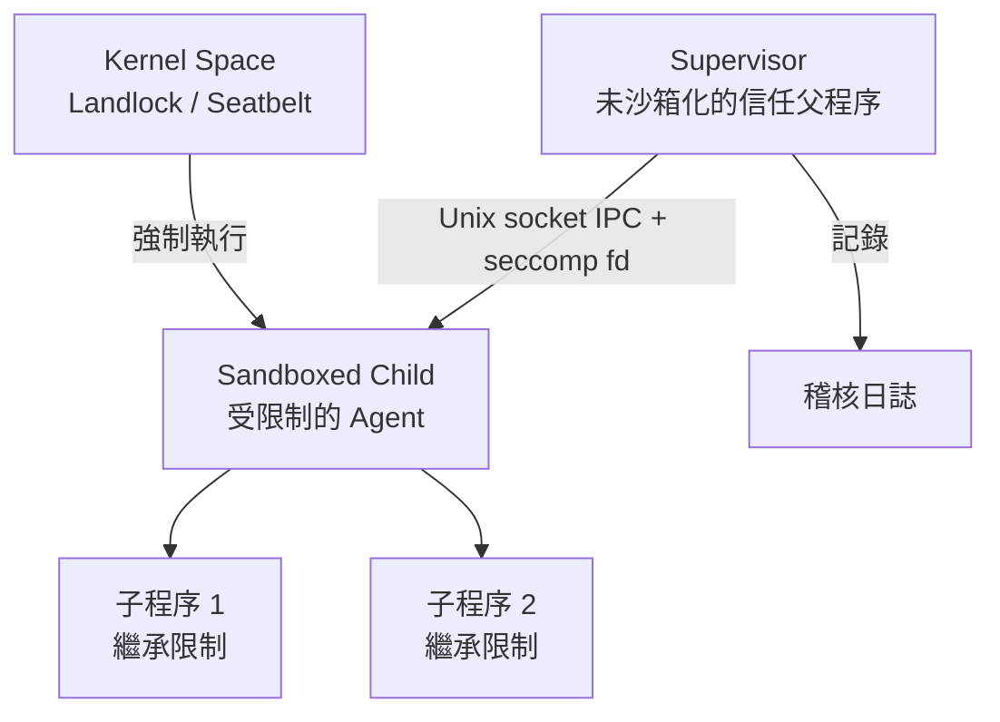
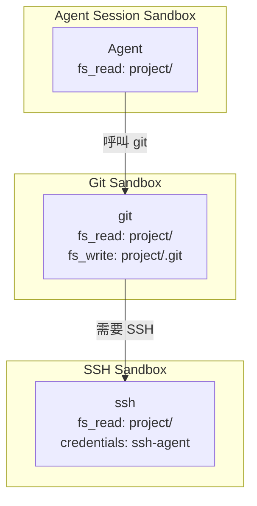

# Nono：AI Agent 檔案系統沙箱機制

> 最後更新：2026-09-09

Nono 是一套基於**能力（Capability-based）** 的安全沙箱系統，採用「預設拒絕，明確允許」的原則，在程序執行層級以作業系統核心原生機制限制 AI Agent 可存取的資源[^intro]。不同於虛擬機器或容器的完整隔離模型，nono 提供的是細粒度的能力控制沙箱（capability control sandbox），政策可強制到單一檔案／資料夾存取、網路存取，甚至特定系統呼叫的層級[^security-model]。

---

## 核心架構

Nono 的架構由三層元件構成：在外層的 Supervisor（未沙箱化的信任父程序）負責解析政策、管理 session 生命週期並處理稽核；中間透過 Unix socket IPC 與 seccomp notification fd 通訊；內層的 Sandboxed Child（受限制的 Agent 程序）在核心層級的限制下執行，所有子程序繼承相同的限制[^overview]。



---

## 檔案系統權限控制模型

### 政策層級的控制欄位

在 Profile JSON 中，透過以下欄位定義 Agent 的檔案系統能力[^profile-authoring]：

| 欄位 | 意義 |
|------|------|
| `filesystem.allow` | 目錄層級完整讀寫 |
| `filesystem.read` | 目錄層級唯讀 |
| `filesystem.write` | 目錄層級只寫 |
| `filesystem.allow_file` | 單一檔案完整讀寫 |
| `filesystem.read_file` | 單一檔案唯讀 |
| `filesystem.write_file` | 單一檔案只寫 |
| `filesystem.deny` | 明確封鎖的路徑 |
| `filesystem.bypass_protection` | 繞過預設的敏感路徑保護 |

### 三種存取模式（AccessMode）

Nono 將上述欄位對應到核心層級的三種存取模式[^landlock]：

```rust
pub enum AccessMode {
    Read,       // 唯讀 → Landlock: ReadFile + ReadDir + Execute
    Write,      // 只寫 → Landlock: WriteFile + Make* + Remove* + Refer + Truncate
    ReadWrite,  // 讀寫 → 前兩者合併
}
```

---

## Linux 上的實作機制：Landlock + Seccomp-Notify

### Landlock LSM（靜態地板）

Landlock 是 Linux 5.13+ 核心提供的**非特權 LSM**（Linux Security Module），無需 root 即可讓程序自行限制自己[^landlock-kernel]。Nono 使用 `landlock` Rust crate：

1. 根據 Profile 建立 ruleset，為每個允許的路徑加入 `PathBeneath` 規則
2. 呼叫 `restrict_self()` — **此後不可逆**，所有子程序繼承限制
3. 綁定的是 **inode** 而非路徑字串，防止 symlink 逃逸

#### Landlock ABI 版本與能力

Nono 會自動偵測可用最高 ABI 版本[^landlock]：

| 核心版本 | ABI | 新增能力 |
|----------|-----|----------|
| 5.13+ | v1 | 基本檔案系統存取控制 |
| 5.19+ | v2 | `REFER` — 跨目錄重新命名/連結 |
| 6.2+ | v3 | `TRUNCATE` — 檔案截斷 |
| 6.7+ | v4 | TCP `bind`/`connect` 過濾 |
| 6.10+ | v5 | `IOCTL_DEV` — 裝置 ioctl 過濾 |
| 6.12+ | v6 | Signal 和抽象 UNIX socket 範圍限制 |

#### Read Access 的 Landlock 映射

```
AccessFs::ReadFile
AccessFs::ReadDir
AccessFs::Execute
```

#### Write Access 的 Landlock 映射

```
AccessFs::WriteFile
AccessFs::MakeChar
AccessFs::MakeDir
AccessFs::MakeReg
AccessFs::MakeSock
AccessFs::MakeFifo
AccessFs::MakeBlock
AccessFs::MakeSym
AccessFs::RemoveFile  // 檔案刪除（原子寫入必需）
AccessFs::RemoveDir   // 目錄刪除（rename() 必需）
AccessFs::Refer       // ABI v2+
AccessFs::Truncate    // ABI v3+
```

注意：`RemoveFile` 和 `RemoveDir` 皆包含在內，因為 `rename()` 需要在來源端具有刪除權限。這使得原子寫入模式（寫入 `.tmp` 再 rename 回目標）在檔案和目錄層級都能運作。Landlock 規則繫結的是 ruleset 套用時開啟的 inode，而非路徑字串——因此**檔案層級的授權**若外部以原子寫入方式取代檔案，新的 inode 不帶有規則，存取會失敗並回傳 `EACCES`，可使用 `nono why` 檢視 `stale_file_grant` 錯誤。目錄層級的授權不受此影響，因為目錄規則涵蓋所有子項目，包括沙箱啟動後建立的檔案[^landlock]。

### Seccomp-Notify（動態中介層）

當 Landlock 無法處理的動態存取需求出現時（如「按需詢問」），nono 使用 `SECCOMP_RET_USER_NOTIF`[^overview]：

- **只攔截 `openat` 和 `openat2`** 兩個 syscall
- 所有其他 syscall（`read`/`write`/`close`/`stat`/`connect`）直接放行，零開銷
- 每次 seccomp trap 的 overhead 僅 **3-10 微秒**

#### Notification 流程

1. Child 執行 `openat(path)` → 核心攔截並通知 Supervisor
2. Supervisor 透過 `/proc/<pid>/mem` 讀取 child 記憶體中的路徑字串
3. 解析相對路徑，檢查是否在允許範圍內
4. 若允許：Supervisor 自行 `open()` 該檔案，透過 `SCM_RIGHTS` 將 fd 注入 child
5. 若不允許：回傳 `EPERM`（或觸發 approval 流程）

---

## macOS 上的實作機制：Seatbelt

macOS 上使用 Apple 的私有 `sandbox_init()` API，根據 capability flags 產生 Seatbelt profile（Scheme-like DSL）[^seatbelt]：

```
(version 1)
(deny default)
(allow file-read* (subpath "/Users/luke/project"))
(allow file-read-metadata (subpath "/Users/luke/.ssh"))
(deny file-read-data (subpath "/Users/luke/.ssh"))
```

同樣不可逆：一旦 `sandbox_init()` 成功，無法移除或擴展。

### macOS 特殊策略：允許探索，拒絕內容（Allow Discovery, Deny Content）

| 操作 | Seatbelt 規則 | 結果 |
|------|---------------|------|
| `stat ~/.ssh` | file-read-metadata | 允許 |
| `test -d ~/.ssh` | file-read-metadata | 允許 |
| `ls ~/.ssh` | file-read-data (readdir) | 封鎖 |
| `cat ~/.ssh/id_rsa` | file-read-data | 封鎖 |

這種方法**防止資料外洩**（無法讀取實際檔案內容）、**允許優雅錯誤處理**（程式可檢查檔案是否存在而不崩潰）、並**模仿 TCC 行為**（對 macOS 使用者而言感覺原生）[^seatbelt]。

---

## 敏感路徑自動保護

即使 parent 目錄被允許存取，nono 也會**自動封鎖**以下敏感路徑[^security-model]：

- `~/.ssh/` — SSH 私鑰
- `~/.aws/` — AWS 憑證
- `~/.gnupg/` — GPG 密鑰
- `~/.kube/` — Kubernetes 配置
- `~/.docker/` — Docker 憑證
- `~/.npmrc`、`~/.netrc`、`~/.git-credentials` — 各種 token
- `~/.bash_history`、`~/.zsh_history` — 指令歷史
- `~/.bashrc`、`~/.zshrc` — shell 設定檔（可能包含機密）

---

## 安全的檔案存取決策流程

當 sandboxed child 試圖打開檔案時，經過三層決策：

```mermaid
flowchart LR
    A[Sandboxed Child<br/>嘗試 openat(path)] --> B[Landlock 層<br/>毫秒級]
    B -->|路徑在允許清單內| C[直接允許<br/>by 核心]
    B -->|路徑不在允許清單| D[Seccomp-Notify 層<br/>微秒級]
    D -->|Supervisor 判定允許| E[SCM_RIGHTS<br/>fd 注入]
    D -->|Supervisor 判定拒絕| F[EPERM]
    D -->|政策設為需批准| G[Approval 層<br/>使用者交互]
    G -->|使用者批准| E
    G -->|使用者拒絕| F
```

**所有決策點皆是 fail-closed**：任何環節出錯，child 無法取得存取權限[^security-model]。

---

## Tool Sandbox：工具的獨立隔離

Nono 最關鍵的創新：**每個工具（git/curl/gh/kubectl）在自己獨立的 child sandbox 中執行，不繼承 Agent 外層的權限**[^tool-sandbox]。



### Tool Sandbox 動態 Token

| Token | 效果 |
|-------|------|
| `@git:config-files` | 解析全域/系統 Git 配置及 `include.path` 指向的檔案 |
| `@git:common-dir` | Git 共用目錄（`.git` 或 worktree 主倉庫） |
| `@git:toplevel` | 當前 checkout root |
| `@git:hooks-path` | Git hooks 目錄 |

### 工具鏈範例：安全性先原則

Nono 的 Tool Sandbox 支援工具鏈（chaining）。以 `npm install` 為例，npm 可啟動 `node`，但 `sh` 在 `npm` 的上下文中被封鎖，防止生命週期指令碼逃逸[^dangerous-commands]：

```json
{
  "command_policies": {
    "commands": {
      "npm": {
        "can_use": ["node", "sh"],
        "sandbox": {
          "fs_read": ["."],
          "fs_write": ["."]
        }
      },
      "sh": {
        "from": {
          "npm": "deny",
          "session": "deny"
        }
      }
    }
  }
}
```

---

## Session 生命週期與管理

Nono 可管理長時間執行的沙箱 session 作為一個執行環境。每個 session 由 supervisor 使用 PTY-backed 終端機管理，支援分離與重新連接[^session-lifecycle]：

| 指令 | 用途 |
|------|------|
| `nono ps` | 列出執行中的 session |
| `nono attach <id>` | 連接到執行中 session 的終端機 |
| `nono detach <id>` | 中斷終端機連接但不停止 session |
| `nono stop <id>` | 要求 supervisor 終止 session |
| `nono inspect <id>` | 顯示 session 中繼資料與狀態 |
| `nono prune` | 清除舊 session 記錄 |

---

## 稽核軌跡

每個 `nono run` session 預設會被記錄。Supervisor 記錄指令、事件、選擇性的檔案系統變更與網路事件，並以 Merkleized 完整性結構保護事件日誌[^audit]：

| 欄位 | 意義 |
|------|------|
| **Command** | 指令與參數（含機密脫敏處理） |
| **Timestamps** | 開始時間、結束時間、持續時間 |
| **Exit code** | 程序終止碼 |
| **Audit events** | Session 起迄 + supervisor 觀察到的事件 |
| **Network events** | Proxy 稽核日誌 |
| **Tracked paths** | 可寫入的政策根路徑 |
| **Merkle roots** | 檔案系統狀態承諾 |
| **Command policy summary** | 每個指令的允許/拒絕決策彙整 |

---

## 與傳統容器技術的比較

Nono 與 Docker 容器在不同層級互補：容器提供命名空間與資源隔離；nono 增加細粒度的路徑級檔案系統控制[^containers]。

| 面向 | Nono | Docker 容器 |
|------|------|-------------|
| 啟動時間 | **~0ms** | 100-500ms+ |
| 設定需求 | 無（`brew install` + 直接執行） | Dockerfile, daemon, image pull |
| 檔案系統模型 | **路徑級 allow/deny**（主機原生） | 獨立檔案系統，需 volume mount |
| 主機檔案操作 | **直接** | 需 volume mount（可能 UID/GID 不匹配） |
| 憑證保護 | **自動**阻擋敏感路徑 | **手動**（不要 mount 敏感目錄） |
| 網路隔離 | 開/關 | 完整命名空間 |
| 資源限制 | 記憶體上限（cgroup v2, Linux） | 完整 cgroups |
| 程序隔離 | 無 | 有（PID 命名空間） |

### Nono 無法防護的攻擊面

Nono 的安全模型明確說明不防護的事項[^security-model]：

- **Kernel 漏洞**：若核心本身有漏洞，攻擊者可能逃脫沙箱
- **隱蔽通道**（Covert Channels）：Agent 可能透過 timing 旁路、CPU 使用模式等洩漏少量資訊
- **資源耗盡**：Linux 上可透過 cgroup v2 限制記憶體與程序數，但 macOS 上無對等機制
- **允許路徑內的資料**：若授權了目錄存取，Agent 可讀寫該目錄內所有內容
- **TOCTOU 競爭**：路徑正規化與沙箱套用之間的小窗口可能存在 time-of-check-time-of-use 競爭

---

## 原始碼結構重點

Nono 的 Rust 原始碼採用 crate 架構[^github]：

```
crates/
├── nono/                     # 核心庫（policy-free sandbox primitives）
│   ├── src/sandbox/
│   │   ├── mod.rs            # Sandbox struct（通用 API）
│   │   ├── linux.rs          # Landlock + Seccomp 實作（6206 行）
│   │   └── macos.rs          # Seatbelt 實作
│   ├── capability.rs         # CapabilitySet, AccessMode（3896 行）
│   ├── supervisor/           # Supervisor IPC + ApprovalBackend
│   ├── keystore.rs           # 憑證載入（1Password, Bitwarden, keyring）
│   └── net_filter.rs         # 網路主機過濾
├── nono-cli/                 # CLI（策略解析、profile、session、exec_strategy）
└── nono-proxy/               # 網路代理（L7 filtering, TLS interception）
```

---

## 總結

| 面向 | 實作方式 |
|------|----------|
| **Linux 隔離** | **Landlock LSM**（檔案系統、網路、IPC 作用域）+ **Seccomp-Notify**（動態能力擴展，僅 trap `openat`/`openat2`） |
| **macOS 隔離** | **Seatbelt**（`sandbox_init()`，MAC 框架） |
| **檔案系統權限** | Profile 中的 `filesystem.read`/`write`/`allow`，映射到核心層級的對應存取標誌 |
| **敏感路徑保護** | 預設封鎖 `~/.ssh`、`~/.aws`、`~/.kube` 等 |
| **工具隔離** | Tool Sandbox：每個工具在獨立的 child sandbox 中執行，不繼承 agent 權限 |
| **不可逆性** | `restrict_self()` / `sandbox_init()` 後無法撤銷，所有子程序繼承限制 |
| **Fail-closed** | 所有決策點錯誤皆導致存取被拒絕 |
| **Session 管理** | 支援 attach/detach、長時間執行、完整性稽核 |
| **設定複雜度** | 零設定，單一 binary，無 daemon 依賴 |

---

## 參考來源

[^intro]: Nono Docs. (n.d.). Introduction. Retrieved 2026-09-09, from https://nono.sh/docs/introduction
[^overview]: Nono Docs. (n.d.). Architecture Overview. Retrieved 2026-09-09, from https://nono.sh/docs/cli/internals/overview
[^security-model]: Nono Docs. (n.d.). Security Model. Retrieved 2026-09-09, from https://nono.sh/docs/cli/internals/security-model
[^landlock]: Nono Docs. (n.d.). Linux Landlock. Retrieved 2026-09-09, from https://nono.sh/docs/cli/internals/landlock
[^landlock-kernel]: Linux Kernel. (n.d.). Landlock: unprivileged access control. Retrieved 2026-09-09, from https://docs.kernel.org/userspace-api/landlock.html
[^seatbelt]: Nono Docs. (n.d.). macOS Seatbelt. Retrieved 2026-09-09, from https://nono.sh/docs/cli/internals/seatbelt
[^tool-sandbox]: Nono Docs. (n.d.). Sandboxed Tool Execution. Retrieved 2026-09-09, from https://nono.sh/docs/cli/features/tool-sandbox
[^dangerous-commands]: Nono Docs. (n.d.). Dangerous Command Blocking. Retrieved 2026-09-09, from https://nono.sh/docs/cli/features/dangerous-command-blocking
[^profile-authoring]: Nono Docs. (n.d.). Profile Authoring. Retrieved 2026-09-09, from https://nono.sh/docs/cli/features/profile-authoring
[^session-lifecycle]: Nono Docs. (n.d.). Session Lifecycle. Retrieved 2026-09-09, from https://nono.sh/docs/cli/features/session-lifecycle
[^audit]: Nono Docs. (n.d.). Audit Trail. Retrieved 2026-09-09, from https://nono.sh/docs/cli/features/audit
[^containers]: Nono Docs. (n.d.). nono and containers. Retrieved 2026-09-09, from https://nono.sh/docs/cli/internals/containers
[^github]: nolabs-ai. (n.d.). nono: secure multiplexed execution paths for agents. Retrieved 2026-09-09, from https://github.com/nolabs-ai/nono
[^nolabs-blog]: Hinds, L. (2026, February 12). Why I built nono. NoLabs Blog. Retrieved 2026-09-09, from https://nolabs.ai/blog/why-i-built-nono