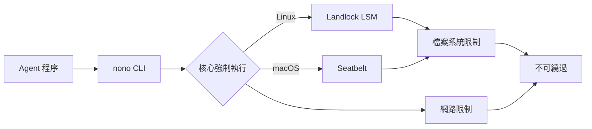

# nono（nolabs-ai/nono）專案背景調查報告

> 調查日期：2026-09-09

---

## 一、專案概述

**nono** 是一個開源（Apache 2.0）的 AI Agent 沙箱執行環境，基於 OS 核心層級（Linux Landlock / macOS Seatbelt）提供零延遲、零設定的隔離機制。專案託管於 [github.com/nolabs-ai/nono](https://github.com/nolabs-ai/nono)[^github-repo]，以 Rust 語言撰寫，目前擁有 **4,000+ GitHub Stars**、**263 Forks**、**1,711 Commits**、**179 項開放 Issues**，並已通過 OpenSSF Best Practices 認證[^helpnet-article]。

nono 的特色在於不依賴容器、VM 或背景服務（daemon），而是直接透過作業系統核心的安全機制（Landlock LSM / Seatbelt）對程序施加不可繞過的權限限制[^huggingface-blog]。2026 年 9 月已發佈 v0.75.0，正朝向 1.0.0 GA 邁進[^stars-blog]。

---

## 二、公司背景

| 項目 | 內容 |
|------|------|
| **公司名稱** | nolabs, Inc（原名 **Always Further, Inc.**，2026 年更名）[^funding-blog] |
| **英國註冊實體** | NOLABS AI LTD（Companies House #16866578）[^companies-house] |
| **成立時間** | 2025 年 |
| **總部** | 英國倫敦（遠端優先） |
| **員工人數** | 2-10 人（持續招聘中）[^github-readme] |
| **定位** | AI 信任基礎設施（Trust Infrastructure for AI） |
| **旗艦產品** | nono（開源核心 + 企業平台開發中） |

---

## 三、創辦團隊

### Luke Hinds — 共同創辦人暨 CEO

- **Sigstore 創作者**——業界標準的軟體供應鏈簽章專案，被 PyPI、npm、Homebrew、Maven Central 等生態廣泛採用[^helpnet-article]
- 前 **Red Hat 傑出工程師**（Distinguished Engineer，隸屬 CTO 辦公室），在 Red Hat 期間創建 Sigstore
- 共同創辦 **Stacklok**（2023，與 Kubernetes 共同創作者 Craig McLuckie 創立），專注 Sigstore 商業化
- 現任 Sigstore Technical Steering Committee 主席
- 出生 1971 年 7 月，居住英國倫敦

### Stephen Parkinson — 共同創辦人暨 CPO/COO

- 曾創辦多家 AI/ML 新創公司
- 超過 20 年早期科技公司建構與規模化經驗
- 2025 年 11 月 20 日被任命為 NOLABS AI LTD 董事

### Aleksy Siek — 創始工程師

- **Sigstore Maintainer**
- 前 Red Hat 軟體工程師（Sigstore 團隊）
- 被 Luke Hinds 從 Red Hat 招募加入 nolabs
- 居住於愛爾蘭科克郡
- 於 2026 年 9 月發表 nono 4,000 Stars 里程碑回顧[^stars-blog]

### Conor Gannon（@connrg）— 創始維護者

- 列於 nono 專案的 Founding Maintainers 名單

### 其他已知團隊成員

- **Máté Saáry**——來自 Red Hat（Managed OpenShift SRE），負責 Kubernetes 整合
- **Sal Kimmich**——Solution Architect，nolabs.ai 部落格作者
- **Rowan Scranage**——LinkedIn 可見成員

---

## 四、創投與資金

| 項目 | 內容 |
|------|------|
| **輪次** | Pre-Seed（PitchBook 分類為 Seed） |
| **金額** | **$180 萬美元**（約 £135 萬英鎊）[^funding-blog] |
| **領投方** | **Surface Ventures**[^funding-blog] |
| **公告日期** | 2025 年 12 月 1 日 |
| **狀態** | 創投支持、私人持有 |

Surface Ventures 是一家專注基礎設施、開源、Agentic AI 與開發者工具的創投基金[^funding-blog]。

---

## 五、Sigstore 淵源

nolabs 團隊與 Sigstore 有深厚的血緣關係，這也是該專案最大的技術信譽來源：

- **Luke Hinds** 在 Red Hat 期間創建 Sigstore，該專案已成為 **CNCF 畢業專案**，是全球軟體供應鏈簽章的標準[^helpnet-article]
- **Aleksy Siek** 是 Sigstore maintainer
- **Máté Saáry** 同樣來自 Red Hat Sigstore 團隊
- 官網自述：「Secured the software supply chain by creating Sigstore... now focused on bringing the same innovation and rigor to agents.」[^github-readme]
- nono 整合 Sigstore 進行 skill 簽署驗證[^dailydev-podcast]

---

## 六、關鍵技術

### 6.1 核心隔離機制

nono 使用作業系統內建的核心安全模組強制執行政策：



- **Linux**：Landlock LSM（核心 5.13+ 支援檔案系統，6.7+ 支援網路）[^huggingface-blog]
- **macOS**：Seatbelt（10.5+ 支援）[^huggingface-blog]
- **Windows**：透過 WSL2 支援（原生 Windows 支援仍在研究中）[^helpnet-article]

### 6.2 Agent Tool Sandboxing（工具層級微沙箱）

nono 不僅將 Agent 放進沙箱，還對 Agent 呼叫的每個工具建立獨立的微沙箱[^helpnet-article]：

- 每個工具呼叫獲得獨立的範圍權限
- 使用**幽靈憑證（Phantom Credential）**取代真實密鑰
- 請求透過受信任代理發送，代理從安全儲存（系統鑰匙圈、1Password、Bitwarden、Kubernetes Secrets）取出真實憑證注入請求
- 權限在呼叫完成後立即失效

### 6.3 可組合政策設定檔

nono 使用 JSON 格式的描述檔，支援繼承與複合（profile composition）[^user-blog]：

```json
{
  "extends": "base",
  "filesystem": {
    "allow": ["$HOME/.cache", "/tmp"],
    "read": ["/proc"],
    "read_file": []
  },
  "network": {
    "allow_domain": ["claude.ai"]
  }
}
```

### 6.4 平台支援

| 平台 | 機制 | 核心需求 | 狀態 |
|------|------|----------|------|
| Linux | Landlock LSM | 5.13+ | ✅ 檔案系統 |
| Linux | Landlock LSM | 6.7+ | ✅ 檔案系統 + 網路 |
| macOS | Seatbelt | 10.5+ | ✅ 檔案系統 + 網路 |
| Windows (WSL2) | Landlock（透過 Linux 核心） | — | ✅ |
| Windows (原生) | — | — | 🚧 研究中 |
| gVisor | — | — | 🚧 尚不支援 |

---

## 七、專案發展里程碑

| 日期 | 事件 |
|------|------|
| 2025-12-01 | Always Further 宣佈 $180 萬 Pre-Seed 募資[^funding-blog] |
| 2026-01-31 | nono 首次提交至 GitHub[^github-api] |
| 2026-02-02 | Luke Hinds 在 HuggingFace 發表 nono 介紹文章[^huggingface-blog] |
| 2026-03 | Reddit 社群發現 4 項重大安全性問題[^reddit-issues] |
| 2026-05-17 | Justin Lam 發表 nono 使用心得部落格[^user-blog] |
| 2026-07-21 | UK Tech News 報導 Sigstore Creator Launches nolabs[^funding-blog] |
| 2026-07-27 | Help Net Security 專題報導 nono[^helpnet-article] |
| 2026-08-11 | nono 整合至 Kubernetes agent-sandbox 專案[^k8s-blog] |
| 2026-08-21 | daily.dev 播出 Luke Hinds 專訪 podcast[^dailydev-podcast] |
| 2026-09-03 | nono 突破 4,000 GitHub Stars，發佈 v0.75.0[^stars-blog] |
| 2026-09-09 | GitHub Stars 4,023、Forks 263、Commits 1,711[^github-api] |

---

## 八、社群與生態

### GitHub 指標（截至 2026-09-09）

| 指標 | 數值 |
|------|------|
| Stars | 4,023 |
| Forks | 263 |
| 開放 Issues | 179 |
| Commits | 1,711 |
| 外部貢獻者 | 90+（截至 9 月）[^stars-blog] |
| 主要語言 | Rust |

### 知名使用者／背書

| 人物 | 職位 | 機構 |
|------|------|------|
| James Carnegie | Staff Security Engineer | **Datadog**[^github-readme] |
| Leonardo Zanivan | Principal Engineer | **Okta**[^github-readme] |
| Clint Gibler | Member of Technical Staff | **OpenAI**[^old-report] |
| Andrew Martin | CEO | **Control Plane** |

### 媒體報導

- **Help Net Security** ——〈Nono: Open-source sandbox for AI agents〉（2026-07-27）[^helpnet-article]
- **UK Tech News** ——〈Sigroot Creator Launches nolabs〉（2026-07-21）[^funding-blog]
- **The New Stack** —— 提及 nono
- **Datadog Security Labs** —— GuardDog 3.0 整合 nono 沙箱
- **HuggingFace Blog** ——〈Introducing nono: A Secure Sandbox for AI Agents〉（2026-02-02）[^huggingface-blog]
- **daily.dev Podcast** ——〈AI Agent Sandboxing with Nono〉（2026-08-21）[^dailydev-podcast]
- **OpenUK** —— AI Openness Report 2026.1.1 引用 nono（2026-07-23）[^openuk-report]
- **Justin Lam Blog** ——〈How I Sandbox my AI Agents〉（2026-05-17）[^user-blog]

---

## 九、第三方安全稽核與安全性事件

### OSTIF 第三方安全稽核

**OSTIF**（Open Source Technology Improvement Fund）於 2026 Q3 排定對 nono 進行全面第三方安全稽核，結果將完全公開[^old-report]。

### 已知安全性事件

2026 年 3 月，Reddit r/cybersecurity 社群使用者回報 nono 存在 4 項以上重大問題[^reddit-issues]，社群反應顯示專案仍在快速迭代中，安全性測試持續進行。

---

## 十、專案治理

| 項目 | 內容 |
|------|------|
| **治理模式** | Maintainer Council（透明的小型維護者委員會）[^github-repo] |
| **目前維護者** | 3 位 Founding Maintainers：Luke Hinds、Aleksy Siek、Conor Gannon |
| **決策原則** | 公開討論、安全優先、維護者以個人身份參與而非公司代表 |
| **授權** | Apache 2.0[^github-repo] |
| **貢獻者協議** | 所有 commits 需包含 DCO sign-off |
| **組織遷移** | nono registry namespace 從 `always-further` 遷移至 `nolabs-ai`[^github-readme] |

---

## 十一、商業模式

- **開源核心（Open Core）**：nono CLI 與核心函式庫完全開源（Apache 2.0）[^github-repo]
- **企業平台（開發中）**：Fleet-wide policy 管理、即時 observability、人機協同審批、合規證據（SOC 2 / ISO 27001）、SSO/SCIM、Hosted Agents
- **設計夥伴計畫**：正在招募設計合作夥伴

---

## 十二、競爭定位

nono 的核心差異在於：

1. **零延遲、零容器、零 VM**——直接使用 OS 核心安全機制（Landlock / Seatbelt），無需 daemon、無需 image、無需 build time[^huggingface-blog]
2. **每個工具呼叫獨立沙箱（Agent Tool Sandboxing）**——不同於其他方案只給 Agent 一個大範圍權限[^helpnet-article]
3. **憑證代理（Credential Proxy）**——Agent 永遠拿不到真實憑證，L7 過濾可限制 API 端點[^helpnet-article]
4. **可組合原則（Composable Policy）**——JSON 描述，可版本控制、繼承、共用[^user-blog]
5. **與容器/VMM 互補**——非競爭關係，提供多層次防護（Pod 層級隔離 + 程序內部限制）[^k8s-blog]

---

## 十三、總結

nolabs（nono）是由 **Sigstore 創作者 Luke Hinds** 領軍的 AI Agent 安全新創，2025 年成立，獲得 **Surface Ventures 的 $180 萬美元 pre-seed** 投資。團隊核心成員多來自 Red Hat Sigstore 生態，在開源安全領域有深厚的技術信譽。產品定位為 **AI Agent 的執行期安全層**，以 OS 核心隔離取代容器/VM 方案，已在 Datadog、Okta 等大型企業中獲得採用。

截至 2026 年 9 月，nono 已達 v0.75.0、4,000+ GitHub Stars、90+ 外部貢獻者，社群持續快速成長。2026 Q3 的 OSTIF 第三方安全稽核與即將到來的 1.0.0 GA 將是其下一個關鍵里程碑。

---

## 參考資料

[^github-repo]: nolabs-ai (2026). *nono: secure multiplexed execution paths for agents - zero trust, zero setup, zero latency.* Retrieved 2026-09-09, from https://github.com/nolabs-ai/nono

[^github-api]: GitHub API (2026). *Repository nolabs-ai/nono.* Retrieved 2026-09-09, from https://api.github.com/repos/nolabs-ai/nono

[^github-readme]: nolabs-ai (2026). *nono README.* Retrieved 2026-09-09, from https://github.com/nolabs-ai/nono#readme

[^helpnet-article]: Zorz, M. (2026, July 27). *Nono: Open-source sandbox for AI agents.* Help Net Security. Retrieved 2026-09-09, from https://www.helpnetsecurity.com/2026/07/27/nono-open-source-ai-agent-sandboxing/

[^funding-blog]: nolabs Team (2025, December 1). *Announcing Always Further and our Pre-Seed Investment.* nolabs Blog. Retrieved 2026-09-09, from https://nolabs.ai/blog/announcing-always-further

[^stars-blog]: Siek, A. (2026, September 3). *nono just hit 4,000 GitHub stars.* nolabs Blog. Retrieved 2026-09-09, from https://nolabs.ai/blog/nono-4000-github-stars

[^huggingface-blog]: Hinds, L. (2026, February 2). *Introducing nono: A Secure Sandbox for AI Agents.* HuggingFace Blog. Retrieved 2026-09-09, from https://huggingface.co/blog/lukehinds/nono-agent-sandbox

[^user-blog]: Lam, J. (2026, May 17). *How I Sandbox my AI Agents.* justinmklam blog. Retrieved 2026-09-09, from https://www.justinmklam.com/posts/2026/05/sandboxing-with-nono/

[^k8s-blog]: Hinds, L. (2026, August 11). *nono lands in the Kubernetes agent-sandbox.* nolabs Blog. Retrieved 2026-09-09, from https://nolabs.ai/blog/nono-kubernetes-agent-sandbox

[^dailydev-podcast]: Fisher, B. (2026, August 21). *AI Agent Sandboxing with Nono.* daily.dev. Retrieved 2026-09-09, from https://daily.dev/posts/ai-agent-sandboxing-with-nono-jq0gf4jdi

[^openuk-report]: OpenUK (2026, July 23). *AI Openness Report July 2026 1.1.* Retrieved 2026-09-09, from https://openuk.uk/wp-content/uploads/2026/07/AI-Openness-Report-July-2026-1.1.pdf

[^companies-house]: UK Companies House (2026). *NOLABS AI LTD (Company #16866578).* Retrieved 2026-09-09, from https://find-and-update.company-information.service.gov.uk/company/16866578

[^reddit-issues]: r/cybersecurity (2026, March 31). *nono agent security sandbox: 4+ major issues discovered.* Reddit. Retrieved 2026-09-09, from https://www.reddit.com/r/cybersecurity/comments/1s8jzp5/nono_agent_security_sandbox_4_major_issues/

[^old-report]: Mind Palace Legacy Report (2026, September 5). *nono（nolabs-ai/nono）專案背景調查報告* (agent-zone/legacy-reports/05_nono-background-zh.md). Retrieved 2026-09-09, from internal archive.