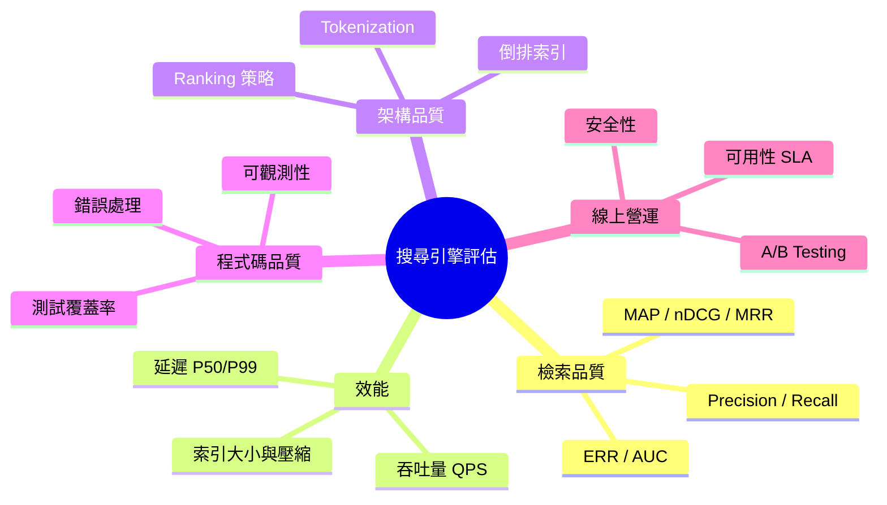

# 搜尋引擎程式碼評估基準與考核清單

本文件建立一套完整、可擴充的搜尋引擎程式碼評估框架，涵蓋檢索品質、效能、架構品質、程式碼品質與線上營運面向。此清單未來可用於考核或評估特定搜尋引擎實作的程式碼。

---

## 1. 檢索與排序品質（離線指標）

這組指標衡量搜尋引擎從索引中檢索與排序結果的好壞，是評估的核心。[^cleverdon]

### 1.1 二元相關性指標（Binary Relevance）

| 指標 | 公式 | 說明 |
|---|---|---|
| **Precision（準確率）** | TP / (TP + FP) | 檢索結果中有多少比例是相關的 |
| **Recall（召回率）** | TP / (TP + FN) | 所有相關文件中有多少比例被檢索出來 |
| **F1-Score** | 2 × (P × R) / (P + R) | Precision 與 Recall 的調和平均數 |
| **Precision@k (P@k)** | 前 k 筆中相關數 / k | 使用者在實際場景中最常看到的指標 |
| **Recall@k (R@k)** | 前 k 筆中相關數 / 總相關數 | 越高代表重要結果越早出現 |
| **R-Precision** | 在第 R 個位置時的 Precision (R = 總相關數) | 與 MAP 高度相關 |

### 1.2 排序感知指標（Rank-Aware）

| 指標 | 說明 | 適用場景 |
|---|---|---|
| **MAP（Mean Average Precision）** | 所有查詢的 Average Precision 平均值 | TREC 標準指標，推薦系統 |
| **nDCG（Normalized Discounted Cumulative Gain）** | 考慮分級相關性 + 位置折扣後正規化 | MTEB Retrieval 預設指標 |
| **MRR（Mean Reciprocal Rank）** | 第一個相關結果出現位置的倒數平均 | Q&A / 單一答案場景 |
| **ERR（Expected Reciprocal Rank）** | 模擬使用者依序掃描、遇到相關即停的滿意度 | 多重相關層級場景 |

> 實務上，**nDCG@10** 是最通用的評估指標，支援分級相關性；**MRR** 適合只有一個正確答案的情境；**Precision@k** 則最貼近真實使用者行為。[^mtel][^manning]

### 1.3 分類感知指標

- **AUC（Area Under ROC Curve）**：系統區分相關與不相關文件的能力
- **bpref**：衡量相關文件在不相關文件之前被排序的程度
- **GMAP（Geometric MAP）**：各主題 MAP 的幾何平均數

---

## 2. 線上與使用者行為指標

這些指標來自真實使用者互動記錄與 A/B 測試。[^kognita]

| 指標 | 說明 | 目標值 |
|---|---|---|
| **CTR（點擊率）** | 點擊結果的使用者比例 | 依產業別 |
| **Zero Result Rate（ZRR）** | 查詢回傳零結果的比例 | < 1% |
| **Session Abandonment Rate** | 無點擊即離開的比例 | 越低越好 |
| **Dwell Time（停留時間）** | 使用者在點擊結果頁面上的停留時間 | > 30 秒 |
| **Bounce Rate（跳出率）** | 點擊後立即離開的比例 | < 40% |
| **Query Reformulation Rate** | 重新查詢的比例 | 越低代表一次到位 |
| **Task Completion Rate** | 使用者首次搜尋即解決問題的比例 | ≥ 85% |

---

## 3. 效能基準

根據 OpenSearch Benchmark、Elasticsearch 與百度雲等業界標準整理。[^osbench][^baiduperf]

### 3.1 核心效能指標

| 指標 | 定義 | 目標值 |
|---|---|---|
| **Query Latency P50** | 50% 的查詢在此時間內完成 | < 100ms |
| **Query Latency P99** | 99% 的查詢在此時間內完成 | < 500ms |
| **Throughput（QPS）** | 每秒可處理的查詢數 | 依規模，應近線性擴展 |
| **Indexing Speed** | 每秒索引的文件數或 MB 數 | 愈高愈好 |
| **Index Size Ratio** | 索引大小與原始資料比 | 理想 1:1 至 1:3 |
| **Error Rate** | 失敗查詢佔比 | < 0.1% |
| **System Availability** | 系統正常運行時間 | ≥ 99.9% |

### 3.2 標準評測資料集

| 資料集 | 來源 | 用途 |
|---|---|---|
| **TREC** | NIST | 標準 IR 評測（1992 至今） |
| **MS MARCO** | Microsoft | Passage/Document Ranking |
| **BEIR** | 多方 | 跨領域檢索泛化評測 |
| **MTEB** | Hugging Face | Embedding-based Retrieval |
| **NYC Taxis / HTTP Logs** | OpenSearch | Log Analytics 基準 |

---

## 4. 架構品質考核清單

### 4.1 核心模組

**Crawler（爬蟲模組，如適用）**：
- [ ] 分散式爬取，URL Frontier 管理
- [ ] Politeness Policy（速率限制、robots.txt 合規）
- [ ] 去重機制（如 Redis + Bloom Filter）
- [ ] 增量/更新爬取（Last-Modified / ETag）
- [ ] 可設定的爬取深度與範圍

**Indexing（索引模組）**：
- [ ] 倒排索引（Term → Posting List）
- [ ] 正排索引（文件儲存）
- [ ] 支援多索引類型：倒排、向量（HNSW/IVF）、正排
- [ ] **Tokenization 管線**：字元濾波 → Tokenizer → Token Filters
- [ ] **多語言支援**：Unicode 感知；中文分詞（jieba、HanLP 或客製詞典）[^chinesetoken]
- [ ] 索引壓縮（Delta Encoding、Variable-Byte、Roaring Bitmaps）
- [ ] 增量索引更新機制
- [ ] Index Merge Policy（如 Tiered Merging）

**Ranking（排序模組）**：
- [ ] TF-IDF 評分（基礎層級）
- [ ] **BM25 評分**（k1, b 參數可調）[^bm25]
- [ ] 向量相似度評分（Cosine / Dot Product / Euclidean）
- [ ] **Hybrid Search**（BM25 + Vector 融合，RRF / Weighted Fusion）
- [ ] Learning to Rank (LTR) 整合
- [ ] 自訂排序函數

**Query Processing（查詢處理模組）**：
- [ ] 查詢解析（Boolean Operators、Phrase、Field-specific）
- [ ] 查詢擴展（同義詞、查詢放寬）
- [ ] 拼字校正 / Typo Tolerance
- [ ] Faceted Search 支援
- [ ] Fuzzy Search（Levenshtein Automata / N-Gram）

### 4.2 軟體架構與程式碼品質

**模組化設計**：
- [ ] 爬取、索引、查詢、排序各模組清晰分離
- [ ] 公開 API 與內部實作分離
- [ ] 依賴注入 / 可交換元件（Analyzer, Scorer, Tokenizer 可抽換）
- [ ] 配置驅動（非硬編碼）
- [ ] Plugin / Extension 架構

**測試覆蓋**：
- [ ] 各模組單元測試（Tokenizer, Scorer, Indexer, Query Parser）
- [ ] 端到端整合測試（Index → Retrieve）
- [ ] 效能回歸測試（Latency, Throughput）
- [ ] 關聯性測試（已知查詢 / 已知結果配對）
- [ ] 邊界情況測試（空查詢、特殊字元、超長文件、Unicode）

**錯誤處理與穩健性**：
- [ ] 格式異常文件/查詢的優雅處理（不崩潰）
- [ ] Timeout 與 Circuit Breaker 機制
- [ ] 優雅降級（回傳部分結果而非崩潰）
- [ ] 有意義的錯誤訊息與 Logging

**可觀測性**：
- [ ] Query Logging（離線分析用）
- [ ] Latency Breakdown 儀表化（Tokenize → Search → Rank → Return）
- [ ] 效能 Metrics 輸出（Prometheus / statsd 格式）
- [ ] Slow Query Logging
- [ ] Index Health Monitoring（Segment 數量、Merge 狀態）

**儲存與記憶體效率**：
- [ ] 增量索引更新無記憶體洩漏
- [ ] 資源正確清理（Close IndexReader/Searcher，釋放 File Handle）
- [ ] Memory-Mapped File 用於大型索引
- [ ] Object Pooling 優化
- [ ] 可設定的記憶體上限（Cache Size, Buffer Pool）

---

## 5. 綜合評估維度（操作營運面）

根據百度開發者指南，評估可歸納為 **七大維度**[^baidu7d]：

| 維度 | 關鍵指標 | 目標 |
|---|---|---|
| **1. 速度** | Query Latency P50/P99, Cache Hit Rate | P50 < 100ms, Cache Hit > 90% |
| **2. 準確性** | Precision, Recall, MAP, nDCG, MRR | 依領域別 |
| **3. 覆蓋率** | 網路覆蓋比、領域覆蓋、新鮮度 | 最大化覆蓋、最小化過時文件 |
| **4. 穩定性** | Uptime, Error Rate, ZRR | Uptime ≥ 99.9%, Error < 0.1% |
| **5. 可擴展性** | QPS Scaling | 近線性擴展 |
| **6. 安全性** | TLS, RBAC, WAF, Encryption-at-rest | TLS 1.3, AES-256 |
| **7. 使用者體驗** | NPS, Task Completion, CTR | Task Completion ≥ 85% |

---

## 6. 完整考核清單（可評分用）

每項以 **0–5 分** 評分，最終計算總分佔比。

### A. 檢索品質（Relevance Quality）
- [ ] Precision@10 / P@50 / P@100 針對 Ground Truth 衡量
- [ ] Recall@10 / R@50 / R@100 衡量
- [ ] MAP 在 ≥ 100 個代表性查詢上計算
- [ ] nDCG@10 / nDCG@100 含分級相關性判斷
- [ ] MRR 對單一正確答案查詢計算
- [ ] F1-Score 報告
- [ ] Zero Result Rate < 1%

### B. 效能與可擴展性（Performance & Scalability）
- [ ] Query Latency P50 < 100ms（標準硬體）
- [ ] Query Latency P99 < 500ms
- [ ] Throughput (QPS) 量化，展示線性擴展
- [ ] Indexing Throughput (docs/sec) 量化
- [ ] Index Size / Raw Data Ratio 報告
- [ ] 長時間負載下無記憶體洩漏
- [ ] Error Rate < 0.1%

### C. 架構品質（Architecture Quality）
- [ ] 倒排索引正確實作
- [ ] BM25 評分含可調參數 (k1, b)
- [ ] Tokenization 支援 Unicode / 多語言（含 CJK 中文分詞）
- [ ] 排序支援 BM25 / Vector / LTR 至少其一
- [ ] 查詢解析支援 Boolean、Phrase、Field-specific
- [ ] Faceted Filtering / Aggregation 支援
- [ ] 模組化架構含 Plugin / Extension Points
- [ ] 配置驅動（非硬編碼）

### D. 程式碼品質（Code Quality）
- [ ] 單元測試覆蓋率 ≥ 70%
- [ ] 端到端搜尋流程整合測試
- [ ] 效能回歸測試
- [ ] 邊界情況處理（空查詢、特殊字元、超長文件）
- [ ] 有意義的 Logging 與 Error Messages
- [ ] 記憶體管理（無洩漏、資源正確清理）
- [ ] 文件（API Doc、架構 Doc、配置指南）

### E. 線上營運就緒（Production Readiness）
- [ ] Query Logging 基礎設施
- [ ] Latency Breakdown 儀表化（每階段分解）
- [ ] Health Check / Readiness Endpoints
- [ ] 高負載下優雅降級
- [ ] Timeout 與 Circuit Breaker 機制

---

## 7. 評分與使用方法

1. 針對每一項打 **0–5 分**：
   - 0 = 未實作
   - 1 = 初步但有重大缺陷
   - 2 = 可運作但明顯不足
   - 3 = 符合業界標準
   - 4 = 優於多數實作
   - 5 = 頂尖水準

2. 可依場景加權（例如搜尋正確性權重 2x，效能權重 1.5x）。

3. **離線 + 線上並行**：永遠結合標註資料集指標與真實 A/B 測試。

4. **避免 Overfitting**：不要只對單一資料集最佳化，應在生產環境驗證。

---

## 8. 學術與業界背景

- **Cranfield Experiments (1960s)**：Cyril Cleverdon 建立了評測範式（測試集 + 查詢 + 預判相關文件 → Precision & Recall）[^cleverdon]
- **TREC (1992–present)**：NIST 主辦的 Text Retrieval Conference，至今仍是 IR 評測標準[^trec]
- **CLEF (2000–present)**：跨語言評測論壇
- **NTCIR (1999–present)**：日本東亞語言 IR 評測
- **MTEB Leaderboard**：預設使用 nDCG@10 作為檢索指標[^mtel]
- **BEIR**：跨領域檢索泛化評測

---

[^cleverdon]: Cleverdon, C. W. (1962). Report on the testing and analysis of an investigation into the comparative efficiency of indexing systems. Retrieved 2026-09-12, from https://catalog.hathitrust.org/Record/001928466
[^manning]: Manning, C. D., Raghavan, P., & Schütze, H. (2008). Introduction to Information Retrieval. Cambridge University Press. Retrieved 2026-09-12, from https://nlp.stanford.edu/IR-book/
[^mtel]: Muennighoff, N., Tazi, N., Magne, L., & Reimers, N. (2022). MTEB: Massive Text Embedding Benchmark. arXiv:2210.07316. Retrieved 2026-09-12, from https://arxiv.org/abs/2210.07316
[^trec]: National Institute of Standards and Technology. (n.d.). Text REtrieval Conference (TREC). Retrieved 2026-09-12, from https://trec.nist.gov/
[^osbench]: OpenSearch Project. (n.d.). OpenSearch Benchmarks. Retrieved 2026-09-12, from https://opensearch.org/benchmarks/
[^baiduperf]: 百度開發者. (n.d.). 深度解析：衡量一個搜索引擎的性能參數. Retrieved 2026-09-12, from https://developer.baidu.com/article/detail.html?id=3753347
[^baidu7d]: 百度雲. (n.d.). 深度解析：衡量搜索引擎性能的核心參數與技術指標. Retrieved 2026-09-12, from https://cloud.baidu.com/article/3753336
[^chinesetoken]: 知乎. (n.d.). 深入理解搜索引擎——搜索評價指標. Retrieved 2026-09-12, from https://zhuanlan.zhihu.com/p/351986117
[^bm25]: Robertson, S. E., & Zaragoza, H. (2009). The Probabilistic Relevance Framework: BM25 and Beyond. Foundations and Trends in Information Retrieval, 3(4), 333-389. Retrieved 2026-09-12, from https://doi.org/10.1561/1500000019
[^kognita]: Kognita. (n.d.). Search Quality Metrics Explained. Retrieved 2026-09-12, from https://kognita.io/blogs/search-quality-metrics-explained