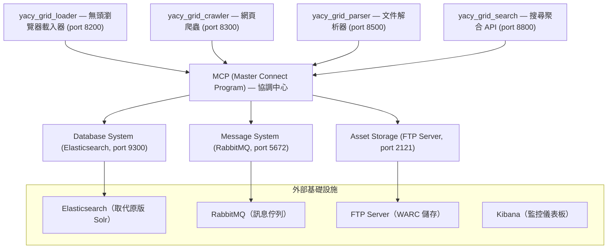
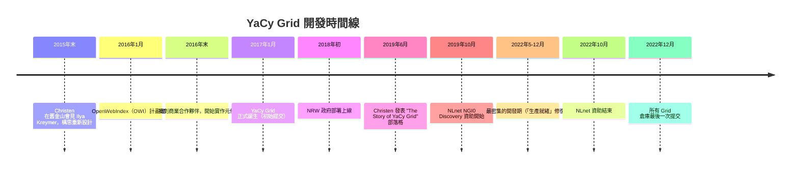

# YaCy Grid 次世代架構調查報告

## 概述

YaCy Grid 是 YaCy 分散式搜尋引擎的**第二代實作**（second-generation implementation），於 2017 年 1 月由原作者 Michael Peter Christen（代號 Orbiter）發起[^yacy_grid_mcp]。不同於第一代 YaCy 的單體 P2P 架構，Grid 採用**微服務架構**，旨在解決原版在穩定性、完整性與速度上的根本缺陷。截至 2026 年 9 月，Grid 所有元件已逾 3.5 年無任何開發活動，實質上已被放棄；而原版 YaCy（yacy_search_server）仍持續活躍開發中[^yacy_search_server]。

## 次世代 Grid 架構詳解

### 設計動機

原版 YaCy 的 P2P 設計存在三大根本問題，Christen 在 2019 年的部落格文章中坦承[^story_yacy_grid]：

- **搜尋結果不穩定**：連續查詢同一關鍵字，結果不一致；不同節點間也不同
- **索引不完整**：索引分佈在遠端節點上，無法控制儲存生命週期，導致召回率低落
- **速度瓶頸**：P2P 搜尋本質上是元搜尋，速度受限於最慢的節點

對個人使用者而言尚可接受，但對專業與商業用戶，這些問題必須解決，因而催生了全面重新設計的 Grid 架構。

### 架構組成

YaCy Grid 的核心元件如下圖所示：

上述元件皆為 Java 微服務，可透過 Docker 或 Kubernetes 部署，實現水平擴展[^yacy_grid_mcp]。另有以下子倉庫已被刪除或設為私有（返回 404）：yacy_grid_indexer、yacy_grid_aggregation、yacy_grid_ui、yacy_grid_enricher[^yacy_grid_crawler]。

### MCP（Master Connect Program）

MCP 是整個 Grid 的核心協調程式，提供三種儲存功能[^yacy_grid_mcp]：

1. **資產儲存**（Asset Storage）—— 元件間的檔案共享，可選用外部 FTP 伺服器
2. **訊息系統**（Message System）—— 基於訊息導向中介軟體的企業整合框架（RabbitMQ）
3. **資料庫系統**（Database System）—— 搜尋引擎檢索功能（Elasticsearch / OpenSearch）

所有外部元件均可省略，MCP 會回退使用內建實作（MapDB、本地資料目錄）。

### 與原版比較

| 面向 | 原版 YaCy (Legacy) | YaCy Grid |
|------|-------------------|-----------|
| 架構 | 單體 P2P | 微服務 |
| 索引引擎 | Solr + RWI | Elasticsearch |
| 部署方式 | 單一 JAR | Docker / Kubernetes 多容器 |
| 搜尋穩定性 | 不一致 | 完全一致 |
| 擴展性 | 受限於 P2P 網路 | 元件可獨立水平擴展 |
| 儲存格式 | 自有格式 | WARC 標準格式 |
| 仲介層 | 無 | RabbitMQ 訊息佇列 |

## 實際部署案例

2018 年初，首個大型 YaCy Grid 部署上線，服務於**德國北萊茵-西發利亞邦（NRW）** 的入口網站 land.nrw，在 Kubernetes 雲端集群中為超過 1000 個城鎮與行政區的公務文件與網頁提供搜尋索引[^story_yacy_grid]。

## 時間線

## 2022 年後擱置的原因

### 1. 外部資助終止（最直接原因）

NLnet NGI0 Discovery 計畫的資助期間為 **2019 年 10 月至 2022 年 10 月**，資助項目為「YaCy Grid SaaS」（即 searchlab 入口網站）[^nlnet]。資助結束後，幾乎所有開發活動同時停止——最後一批提交恰好落在 2022 年 12 月。這是 Grid 專案停擺最直接的財務因素。

### 2. 單一維護者瓶頸

Grid 的絕大多數提交均由 Michael Peter Christen 獨自完成。2021 年 9 月，他在社群論壇中坦承[^story_yacy_grid]：

> 「das Problem liegt aber bei mir weil ich mit Paperwork nicht gut klar komme」
> （問題在我身上，因為我不擅長處理文書工作）
>
> 「es hängt weil ich nicht beikomme」
> （進度卡住了，因為我忙不過來）

外部貢獻者提交的 PR（如 2022 年 6 月的 Elasticsearch 7.10+ 升級）從未被合併或回應。

### 3. 開發重心轉回原版 YaCy

Grid 專案停擺的同時，原版 `yacy_search_server` 至今仍持續活躍開發（2026 年 9 月仍有提交，最新版本 1.942[^yacy_search_server]），包括 Solr 9 遷移、Jetty 12 遷移、AI/LLM 整合等功能。Christen 也轉向了新的 AI 搜尋專案 `yacy_expert`（694 stars）。Grid 被定位為「從原版摘取精華的試驗」，而非完全取代品。

### 4. 微服務架構過於複雜

Grid 的完整部署需要 RabbitMQ、FTP Server、Elasticsearch，以及 MCP、Loader、Crawler、Parser、Search 等多個微服務元件。相比原版 YaCy 單一 JAR 即可運作，Grid 的操作複雜度大幅提高，成為社群採用的主要障礙[^yacy_grid_mcp]。

### 5. 從未達到產品化狀態

- 所有 Grid 元件**從未發布過編譯好的二進位檔案**（README 寫明「not provided in compiled form」）[^yacy_grid_mcp]
- 核心功能（如搜尋聚合）在 search 模組的 README 中自承「尚未實作」[^yacy_grid_search]
- 多個子倉庫（indexer、aggregation、ui、enricher）已被刪除或設為私有（404）
- 安全漏洞（＃44，2020 年 7 月回報）從未被回應

### 6. 社群未能建立

社群論壇（community.searchlab.eu）內容稀少，搜尋結果基本空白[^story_yacy_grid]。searchlab.eu 的 TLS 憑證配置也有問題。外部貢獻者的 Issue 與 PR 長期無人回應。

## 現狀總結（截至 2026 年 9 月）

| 狀態 | 說明 |
|------|------|
| Grid 元件 | 全部停擺，最後提交 2022 年 12 月 |
| 已刪除元件 | yacy_grid_indexer、aggregation、ui、enricher（404） |
| 未正式封存 | 倉庫未被設為 archived，但實質上已無人維護 |
| 原版 YaCy | 持續活躍開發（4,000+ stars，v1.942 於 2026 年 8 月發布） |
| 新專案 | yacy_expert（AI 搜尋，694 stars） |
| Grid Stars | 各元件仍有 600+ stars，但無實際開發 |

## 結論

YaCy Grid 是一個雄心勃勃的次世代搜尋引擎架構嘗試，將 P2P 單體改為微服務設計，並成功在德國 NRW 政府環境中獲得實際驗證。然而，由於外部資助終止、單一開發者瓶頸、開發重心轉移、架構複雜度過高，以及未能達到產品化階段，該專案在 **2022 年 12 月後實際上已被放棄**。原作者 Christen 將精力轉回持續維護原版 YaCy，並投入新的 AI 搜尋領域。

若想使用 YaCy 至今仍在維護的版本，應選擇原版 `yacy_search_server`，而非 Grid。

---

## 參考來源

[^yacy_grid_mcp]: yacy. (2017). *yacy_grid_mcp — Master Connect Program for YaCy Grid* (Version 0.0). Retrieved 2026-09-12, from https://github.com/yacy/yacy_grid_mcp

[^yacy_grid_crawler]: yacy. (2017). *yacy_grid_crawler — Web crawler for YaCy Grid*. Retrieved 2026-09-12, from https://github.com/yacy/yacy_grid_crawler

[^yacy_grid_loader]: yacy. (2017). *yacy_grid_loader — Headless browser loader for YaCy Grid*. Retrieved 2026-09-12, from https://github.com/yacy/yacy_grid_loader

[^yacy_grid_parser]: yacy. (2017). *yacy_grid_parser — Document parser for YaCy Grid*. Retrieved 2026-09-12, from https://github.com/yacy/yacy_grid_parser

[^yacy_grid_search]: yacy. (2017). *yacy_grid_search — Search aggregation API for YaCy Grid*. Retrieved 2026-09-12, from https://github.com/yacy/yacy_grid_search

[^yacy_search_server]: yacy. (2005). *yacy_search_server — Distributed peer-to-peer web search engine*. Retrieved 2026-09-12, from https://github.com/yacy/yacy_search_server

[^story_yacy_grid]: Christen, M. P. (2019, June). The Story of YaCy Grid. *searchlab Community*. Retrieved 2026-09-12, from https://community.searchlab.eu/t/the-story-of-yacy-grid/48

[^nlnet]: NLnet Foundation. (2019). *YaCy Grid SaaS — NGI0 Discovery Fund*. Retrieved 2026-09-12, from https://nlnet.nl/project/YacyGrid/

[^wikipedia_yacy]: Wikipedia. (n.d.). *YaCy — Free distributed search engine*. Retrieved 2026-09-12, from https://en.wikipedia.org/wiki/YaCy