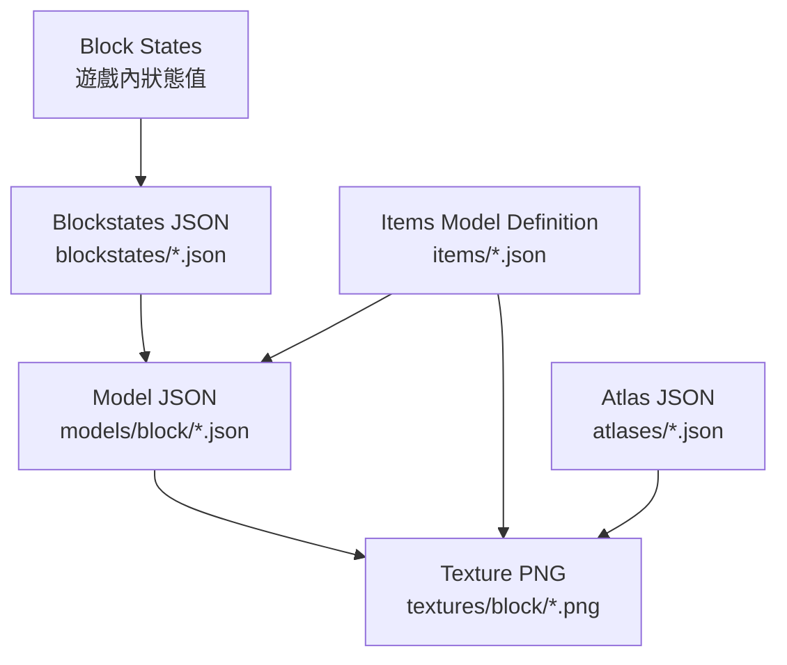

# Minecraft Assets 資料結構研究報告

## 概述

Minecraft Java Edition 的資源包（Resource Pack）系統允許玩家自訂區塊（block）、物品（item）、紋理（texture）、音效、語言等資源，無需修改遊戲原始碼。核心資產資料結構主要包含四大類型：**Blockstates JSON**、**Model JSON**、**Texture PNG**、及自 **1.21.4** 起引入的 **Items Model Definition JSON**[^wiki-model]. 這些檔案透過資源位置（Resource Location）系統互相參照，格式為 `namespace:path`（省略 `minecraft` 命名空間時預設為 Minecraft 內建）[^wiki-tutorials].

## 檔案路徑規則

資源包中資產遵循以下路徑映射[^wiki-tutorials]：

| 資產類型 | 目錄位置 | 副檔名 |
|----------|----------|--------|
| Block States | `assets/<namespace>/blockstates/` | `.json` |
| Models | `assets/<namespace>/models/` | `.json` |
| Textures | `assets/<namespace>/textures/` | `.png` |
| Items Definitions | `assets/<namespace>/items/` | `.json` |

## 一、Blockstates JSON (`blockstates/`)

每個區塊（block）都有一個對應的 Blockstates 定義檔，負責列出該區塊所有變體（variant）並連結至對應模型。支援兩種結構模式[^wiki-model]：

### 1.1 Variants 模式

以 `variants` 物件組織，key 為區塊狀態組合（如 `"facing=east"`），value 為模型定義物件或陣列（隨機選擇）[^wiki-tutorials].

```json
{
  "variants": {
    "facing=east": { "model": "block/wall_torch" },
    "facing=south": { "model": "block/wall_torch", "y": 90 },
    "facing=west": { "model": "block/wall_torch", "y": 180 },
    "facing=north": { "model": "block/wall_torch", "y": 270 }
  }
}
```

**每個模型定義支援的屬性**[^wiki-model]：

| 屬性 | 型態 | 說明 |
|------|------|------|
| `model` | String | 模型資源位置（必要） |
| `x` | Int | X 軸旋轉，增量 90 度 |
| `y` | Int | Y 軸旋轉，增量 90 度 |
| `z` | Int | Z 軸旋轉，增量 90 度 |
| `uvlock` | Boolean | 鎖定紋理不隨模型旋轉 |
| `weight` | Int | 隨機選擇權重（預設 1） |

### 1.2 Multipart 模式

以 `multipart` 陣列組織，適用於可組合的區塊（如柵欄、紅石線）。每一項包含 `when`（條件）與 `apply`（套用模型）[^wiki-tutorials]：

```json
{
  "multipart": [
    { "apply": { "model": "block/oak_fence_post" }},
    { "when": { "north": "true" },
      "apply": { "model": "block/oak_fence_side", "uvlock": true }},
    { "when": { "east": "true" },
      "apply": { "model": "block/oak_fence_side", "y": 90, "uvlock": true }}
  ]
}
```

`when` 支援 `OR` / `AND` 邏輯組合，多個條件值可用 `|` 分隔（如 `"side|up"`）[^wiki-model].

## 二、Model JSON (`models/`)

模型檔案定義區塊或物品的三維形狀，支援 `parent` 繼承機制。若同時指定 `parent` 和 `elements`，子模型的 `elements` 會完全覆蓋父模型的 `elements`[^wiki-model].

### 2.1 根物件屬性

| 屬性 | 型態 | 說明 |
|------|------|------|
| `parent` | String | 繼承父模型資源位置 |
| `ambientocclusion` | Boolean | 是否啟用環境光遮蔽（預設 true） |
| `display` | Object | 不同視角下的顯示變換 |
| `textures` | Object | 紋理變數定義 |
| `elements` | Array | 立方體元素陣列 |

### 2.2 Display 變換

定義物品在不同情境下的旋轉、位移與縮放[^wiki-model]。支援的情境包括：

- `thirdperson_righthand` / `thirdperson_lefthand`
- `firstperson_righthand` / `firstperson_lefthand`
- `gui`、`head`、`ground`、`fixed`（物品框架）、`on_shelf`

每個情境包含：
- `rotation`: `[x, y, z]` 旋轉度數
- `translation`: `[x, y, z]` 位移（範圍 -80 ~ 80）
- `scale`: `[x, y, z]` 縮放（上限 4）

### 2.3 Textures 紋理物件

紋理以變數名稱定義，在 elements 中以 `#變數名` 引用[^wiki-model]：

```json
{
  "textures": {
    "particle": "block/stone",
    "all": "block/stone"
  }
}
```

特殊變數：
- `particle`：定義破壞粒子使用的紋理，也可在 `"#particle"` 中引用
- 自 1.21.4+，紋理變數支援物件格式，可額外指定 `sprite` 和 `force_translucent` 屬性

### 2.4 Elements 元素

每個元素定義一個立方體（cuboid）[^wiki-model]：

| 屬性 | 型態 | 說明 |
|------|------|------|
| `from` | `[x, y, z]` | 起點座標（範圍 -16 ~ 32） |
| `to` | `[x, y, z]` | 終點座標（範圍 -16 ~ 32） |
| `rotation` | Object | 元素旋轉定義 |
| `shade` | Boolean | 是否依方向著色（預設 true；1.21.4+ 為 `optional`）[^upcoming-shade] |
| `light_emission` | Int | 最低光照等級 0-15（1.21.2+） |
| `faces` | Object | 六個面的紋理映射 |

#### 2.4.1 元素旋轉

```json
"rotation": {
  "origin": [8, 8, 8],
  "axis": "y",
  "angle": 45,
  "rescale": true
}
```

- `origin`：旋轉中心（預設 [8, 8, 8]）
- `axis`：旋轉軸（x、y、z）
- `angle`：旋轉角度（23w46a 前限 -45 ~ 45，增量 22.5 度；25w46a 起解除限制[^upcoming-rotation]）
- `rescale`：是否補償旋轉後的縮放
- 25w46a 起支援同時圍繞多軸旋轉（使用獨立 `x`、`y`、`z` 欄位）

#### 2.4.2 Faces 面定義

**六個面**：`down`、`up`、`north`、`south`、`west`、`east`[^wiki-model].

```json
"faces": {
  "north": {
    "uv": [0, 0, 16, 16],
    "texture": "#all",
    "cullface": "north",
    "rotation": 0,
    "tintindex": -1
  }
}
```

| 屬性 | 型態 | 說明 |
|------|------|------|
| `uv` | `[x1, y1, x2, y2]` | 紋理區域，以 16 為單位（非像素）。可省略，省略時自動依元素位置計算 |
| `texture` | String | 引用 texture 變數（前綴 `#`） |
| `cullface` | String | 六個方向之一，當相鄰區塊存在時跳過渲染該面 |
| `rotation` | Int | 紋理順時針旋轉（0、90、180、270） |
| `tintindex` | Int | 著色索引，預設 -1 不著色。用於草地、樹葉等生物群落顏色 |

## 三、Texture PNG (`textures/`)

紋理為標準 PNG 格式圖檔[^wiki-resourcepack]：

- 區塊紋理存放於 `textures/block/`
- 物品紋理存放於 `textures/item/`
- 1.13 起支援非正方形紋理
- 支援半透明、裁切（cutout）與透明三種渲染模式

### 3.1 紋理動畫

以 `texture.png.mcmeta` 定義動畫屬性[^wiki-resourcepack]：

```json
{
  "animation": {
    "interpolate": false,
    "width": 16,
    "height": 16,
    "frametime": 1,
    "frames": [0, 1, 2]
  }
}
```

- `interpolate`：是否在幀之間插值
- `frametime`：每幀顯示的遊戲刻數（預設 1 tick）
- `frames`：未指定時依序顯示所有幀（縱向或橫向排列）
- 支援表格式排列，由 `width` / `height` 定義單幀尺寸

### 3.2 Atlas 紋理圖集

紋理圖集（Atlas）定義哪些紋理被合併為單張大圖。由 `assets/<namespace>/atlases/<id>.json` 控制[^wiki-atlas]：

**支援的圖集類型**[^wiki-atlas]：

| 圖集 ID | 用途 | 支援 Mipmap |
|---------|------|-------------|
| `blocks` | 區塊紋理、地物、鐘、附魔台書 | 是 |
| `items` | 物品紋理、護甲飾紋疊加 | 否 |
| `gui` | GUI 元件、藥水效果圖示 | 否 |
| `chests` | 儲物箱實體 | 否 |
| `particles` | 粒子紋理 | 否 |

**紋理來源類型**[^wiki-atlas]：

- `minecraft:directory`：掃描目錄下所有 PNG
- `minecraft:single`：加入單一紋理
- `minecraft:filter`：以 regex 移除已加入的紋理
- `minecraft:unstitch`：從來源圖中裁切區域
- `minecraft:paletted_permutations`：以調色板動態產生紋理變體（用於護甲飾紋）

## 四、Items Model Definition (`items/`) — 自 1.21.4 (24w45a)

1.21.4 引入全新的物品模型定義系統，取代舊的 `overrides` 機制[^wiki-itemsdef]. 定義檔存放於 `assets/<namespace>/items/`，透過物品元件 `minecraft:item_model` 指定。

### 4.1 根物件屬性

```json
{
  "model": { "type": "minecraft:model", "model": "minecraft:item/stone" },
  "hand_animation_on_swap": true,
  "oversized_in_gui": false
}
```

### 4.2 模型類型

| 類型 | 說明 |
|------|------|
| `minecraft:model` | 渲染一個原始模型 |
| `minecraft:composite` | 疊加渲染多個子模型 |
| `minecraft:condition` | 根據布林屬性選擇模型 |
| `minecraft:select` | 根據離散屬性選擇模型 |
| `minecraft:range_dispatch` | 根據數值區間選擇模型 |
| `minecraft:empty` | 不渲染任何東西 |
| `minecraft:special` | 渲染特殊模型（儲物箱、旗幟、盾牌等） |

### 4.3 Condition 條件類型

布林屬性支援[^wiki-itemsdef]：`broken`、`damaged`、`selected`、`carried`、`using_item`、`fishing_rod/cast`、`extended_view`、`keybind_down`、`has_component`、`component`、`custom_model_data` 等。

### 4.4 Select 選擇屬性

離散屬性支援[^wiki-itemsdef]：`block_state`、`charge_type`、`component`、`context_dimension`、`context_entity_type`、`display_context`、`local_time`、`main_hand`、`trim_material`、`custom_model_data`。

### 4.5 Range Dispatch 數值分派

以閾值決定模型，支援 `scale` 縮放[^wiki-itemsdef]：

```json
{
  "type": "minecraft:range_dispatch",
  "property": "minecraft:compass",
  "entries": [
    { "threshold": 0.125, "model": { "type": "minecraft:model", "model": "minecraft:item/compass_00" } },
    { "threshold": 0.875, "model": { "type": "minecraft:model", "model": "minecraft:item/compass_16" } }
  ],
  "fallback": { "type": "minecraft:model", "model": "minecraft:item/compass" }
}
```

## 五、自訂定義 JSON (Custom Model Data)

自訂模型資料透過物品元件系統實現，提供三種資料類型，可在 Items Model Definition 中的 `condition`、`select` 或 `range_dispatch` 引用[^wiki-itemsdef]：

### 5.1 `custom_model_data`（Condition 布林）

檢查 `flags` 列表中指定索引的值：

```json
{
  "type": "minecraft:condition",
  "property": "minecraft:custom_model_data",
  "index": 0,
  "on_true": { "type": "minecraft:model", "model": "minecraft:item/special_sword" },
  "on_false": { "type": "minecraft:model", "model": "minecraft:item/iron_sword" }
}
```

### 5.2 `custom_model_data`（Select 字串）

從 `strings` 列表中選取值：

```json
{
  "type": "minecraft:select",
  "property": "minecraft:custom_model_data",
  "index": 0,
  "cases": [
    { "when": "magic", "model": { "type": "minecraft:model", "model": "minecraft:item/magic_wand" } }
  ],
  "fallback": { "type": "minecraft:model", "model": "minecraft:item/stick" }
}
```

### 5.3 `custom_model_data`（Range Dispatch 數值）

從 `floats` 列表中取值：

```json
{
  "type": "minecraft:range_dispatch",
  "property": "minecraft:custom_model_data",
  "index": 0,
  "entries": [
    { "threshold": 1, "model": { "type": "minecraft:model", "model": "minecraft:item/netherite_sword" } }
  ],
  "fallback": { "type": "minecraft:model", "model": "minecraft:item/iron_sword" }
}
```

此機制完全取代了 1.21.4 之前舊的 `overrides` / `predicate` / `custom_model_data` 系統[^wiki-model].

## 六、Block States（遊戲內狀態值）

需與 Blockstates JSON 區別：**Block States**（遊戲內的區塊屬性）是每個區塊實體儲存的額外資料，用於描述區塊的行為與外觀，例如 `facing`（朝向）、`age`（生長階段）、`waterlogged`（是否含水）等。截至 1.21.4，Java Edition 共有超過 90 種不同的 block state 屬性[^wiki-blockstates]，包含 `facing`、`powered`、`open`、`axis`、`half`、`level`、`lit` 等。

## 小結

Minecraft 資產資料結構的核心為三層體系：



1. **Blockstates JSON** 定義區塊狀態到模型的映射（variants / multipart）
2. **Model JSON** 以元素（cuboid）與紋理變數定義三維幾何
3. **Texture PNG** 提供實際像素資料，透過 Atlas 系統合併
4. **Items Model Definition**（1.21.4+）提供條件邏輯與資料驅動的物品渲染
5. **自訂模型資料**支援布林、字串、數值三種形式，可在物品定義中靈活引用

## 參考資料

[^wiki-model]: Minecraft Wiki. (n.d.). Model. Retrieved 2026-09-12, from https://minecraft.wiki/w/Model

[^wiki-tutorials]: Minecraft Wiki. (n.d.). Tutorial:Models. Retrieved 2026-09-12, from https://minecraft.wiki/w/Tutorials/Models

[^wiki-blockstates]: Minecraft Wiki. (n.d.). Block states. Retrieved 2026-09-12, from https://minecraft.wiki/w/Block_states

[^wiki-resourcepack]: Minecraft Wiki. (n.d.). Resource pack. Retrieved 2026-09-12, from https://minecraft.wiki/w/Resource_pack

[^wiki-itemsdef]: Minecraft Wiki. (n.d.). Items model definition. Retrieved 2026-09-12, from https://minecraft.wiki/w/Items_model_definition

[^wiki-atlas]: Minecraft Wiki. (n.d.). Atlas. Retrieved 2026-09-12, from https://minecraft.wiki/w/Atlas

[^upcoming-shade]: Minecraft Wiki. (n.d.). Model § Block models (upcoming Java Edition 26.3). Retrieved 2026-09-12, from https://minecraft.wiki/w/Model#Block_models

[^upcoming-rotation]: Minecraft Wiki. (n.d.). Model § History (25w46a). Retrieved 2026-09-12, from https://minecraft.wiki/w/Model#History