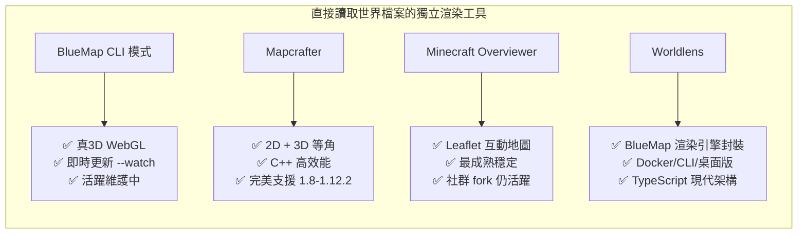

# BlueMap 替代方案調查：Cuberite 相容的地圖渲染工具

## 概述

BlueMap 是一款開源的 Minecraft 互動式 3D 地圖渲染工具，能在瀏覽器中以 WebGL 呈現完整 3D 世界，支援即時玩家追蹤與標記系統[^bluemap]。Cuberite 是以 C++ 撰寫的輕量、高效能 Minecraft 伺服器軟體，相容於 Java Edition 1.8 至 1.12.2，使用 Lua 插件系統[^cuberite]。

截至 2026 年 9 月，**Cuberite 生態系中不存在任何即時網頁地圖插件**（如 BlueMap 或 Dynmap 的等效物）[^forum2356]。2016 年的社群討論中曾有人請求開發 Dynmap 風格的插件，但最終無人實作[^forum2356]。唯一的可行方案是使用**直接讀取世界存檔（MCA/Anvil 格式）的獨立地圖渲染工具**。

## 推薦方案比較

### 核心推薦工具



### 詳細比較表

| 工具 | 地圖類型 | 輸出格式 | MC 版本支援 | Cuberite 相容性 | 語言 | 維護狀態 |
|------|---------|---------|------------|----------------|------|---------|
| **BlueMap CLI** | 真 3D (Three.js/WebGL) | 自託管 Web 伺服器 | 全版本（含 1.8-1.12.2） | ✅ 直接讀 MCA 檔案 | Java | **活躍** |
| **Mapcrafter** | 2D 俯視 + 3D 等角 | Leaflet.js 網頁地圖 | **1.2-1.12**（完美吻合） | ✅ 直接讀 MCA 檔案 | C++ | 維護模式 |
| **Minecraft Overviewer** | 2D 俯視 + 光照陰影 | Leaflet.js 網頁地圖 | 1.2-1.19（fork 支援 1.21） | ✅ 直接讀 MCA 檔案 | Python/C | 原始版停滯，fork 活躍 |
| **MinedMap** | 2D 俯視（含夜間圖層） | Leaflet.js 網頁地圖 | 1.8+ | ✅ 直接讀 MCA 檔案 | Rust | **活躍** |
| **Worldlens** | 真 3D (BlueMap 引擎封裝) | 自託管 Web 伺服器 | 1.12.2+ | ✅ 直接讀 MCA 檔案 | TypeScript/Java | **活躍** |
| **Cubeographer** | 真 3D (WebGL) | 瀏覽器直接渲染 | 1.8.9+ | ✅ 直接讀 MCA 檔案 | Go/TS | 開發中 |
| **Tectonicus** | 3D 模型高細節地圖 | Leaflet.js 網頁地圖 | 全版本 | ✅ 直接讀 MCA 檔案 | Java | **活躍** |

## 各工具詳述

### 1. BlueMap CLI 獨立模式（最推薦）

BlueMap 除了支援 Spigot/Paper/Fabric/Forge 等插件/模組模式外，還提供**獨立 CLI 模式**，可直接讀取磁碟上的世界檔案進行渲染[^bluemap_cli]。

```bash
java -jar bluemap-X.X-cli.jar -r        # 渲染地圖
java -jar bluemap-X.X-cli.jar -r -w     # 渲染並啟動 Web 伺服器
java -jar bluemap-X.X-cli.jar -r -u     # 監聽檔案變更並增量渲染
```

**對 Cuberite 的用法**：
1. Cuberite 儲存世界為標準 Anvil 格式（`.mca` 檔案），路徑在 `world/region/` 目錄下
2. 設定 BlueMap CLI 的 `core.conf` 指向 Cuberite 的世界目錄
3. 使用 `-v` 參數指定 Minecraft 版本（對 1.8-1.12.2 無需特殊處理，因為 Anvil 格式自 MC 1.2 以來未變）
4. BlueMap 支援資源包，可正確渲染各版本的方塊紋理

**限制**：無即時玩家位置追蹤（除非額外實作 Lua 插件定期寫入玩家位置到 BlueMap 的標記系統）。

### 2. Mapcrafter（與 Cuberite 支援範圍完美吻合）

Mapcrafter 是一款 C++ 高效能渲染器，支援 MC 1.2 至 **1.12**，與 Cuberite 的支援範圍完全重疊[^mapcrafter]。

- 支援 2D 俯視與 3D 等角兩種視角（4 個旋轉方向）
- 晝/夜/洞穴三種渲染模式
- 史萊姆區塊與生怪範圍覆蓋圖層
- 多執行緒增量渲染
- 輸出為 Leaflet.js 靜態網頁

### 3. Minecraft Overviewer（最成熟方案）

最歷史悠久的方案，Python + C 實作，輸出靜態 Leaflet.js 網頁地圖[^overviewer]。原始版本於 2023 年宣布進入維護狀態[^overviewer_end]，但社群建立了活躍的 fork（GregoryAM-SP/The-Minecraft-Overviewer）持續支援至 MC 1.21[^overviewer_fork]。

已在 Cuberite 環境中驗證可用：PlanetX Cuberite 伺服器曾使用 Overviewer 渲染其世界地圖[^forum2356]。

### 4. MinedMap（最快渲染速度）

Rust 實作，官方號稱 3GB 世界在單執行緒下 5 分鐘內完成渲染[^minedmap]。支援多執行緒（`-j N` 參數），記憶體使用低於 100MB。

- 明確標示支援 Minecraft 1.8 至 26.1
- 增量渲染（僅重新渲染變更的區塊）
- 夜間照明圖層（可切換日光/夜間視圖）
- PNG 或 WebP 輸出

### 5. Worldlens（BlueMap 的現代化封裝）

Worldlens 是 BlueMap 的 TypeScript 移植版，內部使用 BlueMap 的 Java 渲染引擎（vendored），提供三種使用模式[^worldlens]：

1. **桌面應用**（Electron）— 圖形化操作
2. **CLI 容器**（`worldlens-cli`）— 支援 `--watch` 即時監控
3. **Docker 容器**— 簡易部署

支援 Minecraft 1.12.2 至 26.x。

## 即時玩家位置追蹤的替代方案

所有獨立工具均無法原生提供即時玩家位置（因為不與伺服器進程通訊）。解決方案：

1. **Lua 插件 + 外部工具**：撰寫 Cuberite Lua 插件，定期將玩家位置寫入工具可讀取的格式（如 JSON 檔案、SQLite 資料庫）
2. **WebAdmin API**：Cuberite 內建 WebAdmin 介面，可透過 HTTP API 取得玩家資訊，供地圖前端輪詢
3. **Middleware 代理**：使用 Cuberite 的 `cNetwork` API 建立 WebSocket 連線，將玩家事件推送至地圖前端

## 結論

Cuberite 使用者若需類似 BlueMap 的網頁地圖功能，最佳策略是**使用獨立渲染工具直接讀取 Cuberite 的世界存檔（MCA 格式）**：

| 使用情境 | 推薦工具 | 理由 |
|---------|---------|------|
| 需要真 3D（擬似 BlueMap 體驗） | **BlueMap CLI** | 同樣的渲染引擎、同樣的 Web 前端 |
| 僅需 2D/等角地圖、輕量部署 | **MinedMap** | Rust 實作、最低資源消耗 |
| 需與 Cuberite 版本（1.8-1.12.2）完美對應 | **Mapcrafter** | 官方支援範圍完全吻合 |
| 靜態地圖、無需即時更新 | **Minecraft Overviewer** | 最成熟的方案，社群驗證可用 |

即時玩家位置追蹤需額外撰寫 Cuberite Lua 插件進行整合。

[^bluemap]: BlueColored. (n.d.). BlueMap — 3D Minecraft maps. Retrieved 2026-09-13, from https://github.com/BlueMap-Minecraft/BlueMap
[^cuberite]: Cuberite Contributors. (n.d.). Cuberite — A lightweight, fast and extensible game server for Minecraft. Retrieved 2026-09-13, from https://github.com/cuberite/cuberite
[^forum2356]: Cuberite Forum. (2016-02-08). Dynmap (-like) plugin (thread-2365). Retrieved 2026-09-13, from https://forum.cuberite.org/thread-2365.html
[^bluemap_cli]: DeepWiki. (n.d.). BlueMap CLI usage and options. Retrieved 2026-09-13, from https://deepwiki.com/BlueMap-Minecraft/BlueMap/6.1-cli-usage-and-options
[^mapcrafter]: Mapcrafter Developers. (n.d.). Mapcrafer — High-performance Minecraft map renderer. Retrieved 2026-09-13, from https://github.com/mapcrafter/mapcrafter
[^overviewer]: Overviewer Contributors. (n.d.). Minecraft Overviewer — High-resolution Minecraft maps for the web. Retrieved 2026-09-13, from https://overviewer.org/
[^overviewer_end]: Overviewer Team. (2023-05-09). The End. Retrieved 2026-09-13, from https://overviewer.org/blog/2023/5/9/the-end/
[^overviewer_fork]: GregoryAM-SP. (n.d.). The-Minecraft-Overviewer — Active fork supporting MC 1.21. Retrieved 2026-09-13, from https://github.com/GregoryAM-SP/The-Minecraft-Overviewer
[^minedmap]: Neocturne. (n.d.). MinedMap — Fast Minecraft map renderer in Rust. Retrieved 2026-09-13, from https://github.com/neocturne/MinedMap
[^worldlens]: Ding-Ding-Projects. (n.d.). Worldlens — TypeScript port of BlueMap. Retrieved 2026-09-13, from https://github.com/Ding-Ding-Projects/worldlens
[^mcaselector]: Querz. (n.d.). MCA Selector — Chunk-level world editor. Retrieved 2026-09-13, from https://mcaselector.org/
[^tectonicus]: Tectonicus Contributors. (n.d.). Tectonicus — 3D Minecraft map renderer. Retrieved 2026-09-13, from https://github.com/tectonicus/tectonicus
[^cubeographer]: Rmmh. (n.d.). Cubeographer — Browser-based 3D Minecraft renderer. Retrieved 2026-09-13, from https://github.com/rmmh/cubeographer
[^unmined]: uNmINeD. (n.d.). uNmINeD — Minecraft world renderer. Retrieved 2026-09-13, from https://unmined.net/