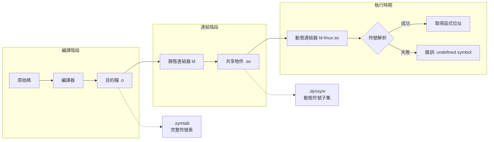
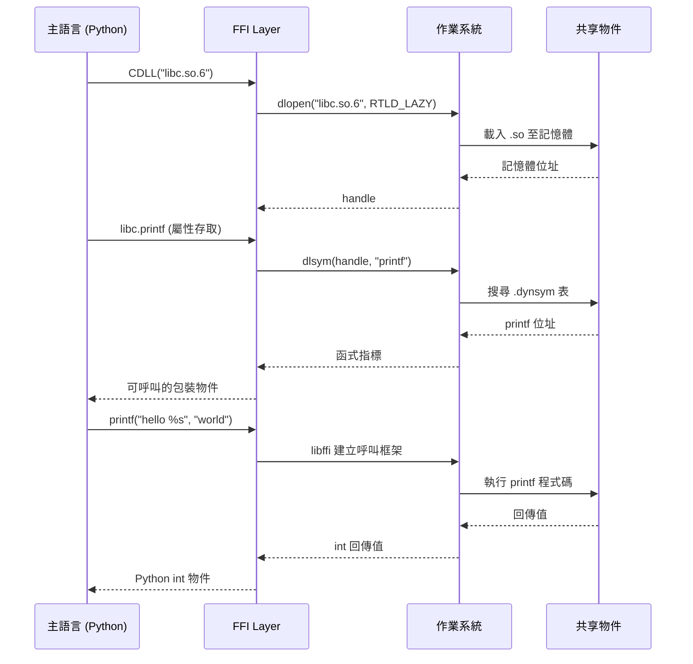

# FFI（Foreign Function Interface）與動態函式庫 Symbol 的關係

## 摘要

FFI（Foreign Function Interface）是一種允許一種程式語言呼叫另一種語言所撰寫函式的機制。這項機制從底層到高層，深度依賴於作業系統層級的動態函式庫符號解析基礎設施——包括動態載入 API（`dlopen`/`dlsym`）、二進位格式的符號表（`.dynsym`）、符號可視性控制、以及呼叫慣例橋接函式庫（`libffi`）。本文將從各個層面剖析這兩者之間的緊密耦合關係。

---

## 1. FFI 是什麼？

**Foreign Function Interface（FFI）** 是一種允許某種程式語言（主語言）呼叫以另一種語言（客端語言）撰寫或編譯的函式的機制。這個術語源自 Common Lisp，但現在已被廣泛使用於各語言生態系，如 Python 的 `ctypes`、Java 的 JNI/JNA、Rust 的 `extern` 區塊、以及 Haskell 的 FFI。[^ffi]

FFI 的核心需要解決三個問題：

1. **定位（Location）**——如何找到外部函式在記憶體中的位置。
2. **慣例（Convention）**——如何呼叫它（引數傳遞、堆疊佈局、暫存器使用，即 **calling convention**）。
3. **轉譯（Translation）**——如何在語言之間轉換資料型別（marshaling）。

Wikipedia 指出：*「FFI 的主要功能是將一種程式語言的語意和呼叫慣例與另一種語言的語意和慣例結合起來。這個過程還必須考慮雙方的執行時期環境和應用程式二進位介面（ABI）。」*[^ffi]

同時也明確點出：*「FFI 常用於呼叫二進位動態連結函式庫的情境中。」*[^ffi]

---

## 2. 動態函式庫的 Symbol（符號）

### 2.1 什麼是 Symbol？

在二進位檔案中，**symbol** 是對一個函式、變數或其他程式實體的有名稱參照。Symbol 是連結器（linker）在不同目的檔與函式庫之間解析參照的核心機制。[^elf-symbol-table]

### 2.2 符號表：`.symtab` vs `.dynsym`

共享物件（shared object）與動態執行檔通常擁有兩個不同的符號表：[^elf-symbol-table]

| 特性 | `.symtab` | `.dynsym` |
|---|---|---|
| 執行時期是否載入記憶體（allocable） | 否 | 是 |
| 是否包含區域符號 | 是 | 通常否 |
| 用途 | 除錯、靜態連結 | **動態連結（執行時期）** |
| 大小 | 較大 | 較小 |

`.dynsym` 是執行時期動態連結所需的子集，而 `.symtab` 包含完整符號資訊（含區域符號、偵錯資訊等），但**不會被載入記憶體**，以減少執行程序的記憶體足跡。[^elf-symbol-table]

每個 ELF64 符號表條目（entry）為 24 bytes，包含：[^elf-symbol-struct]
- `st_name`——字串表（`.dynstr`）的偏移量
- `st_value`——符號位址（未解析的匯入符號為 0）
- `st_size`——符號大小（bytes）
- `st_info`——型別 + 綁定屬性
- `st_other`——可視性
- `st_shndx`——段落索引

### 2.3 Symbol 屬性

**Binding（綁定型別）**[^elf-linkage]：
- `STB_GLOBAL`——全域可見，可被其他模組參照
- `STB_LOCAL`——僅檔案範圍可見
- `STB_WEAK`——可被覆寫

**Visibility（可視性）**[^elf-visibility]：
- `STV_DEFAULT`——預設，完全可見
- `STV_HIDDEN`——隱藏，不匯出至 `.dynsym`
- `STV_PROTECTED`——受保護，可參照但優先使用模組內定義
- `STV_INTERNAL`——內部，與 HIDDEN 類似但處理方式略有不同

透過編譯器旗標 `-fvisibility=hidden` 配合 `__attribute__((visibility("default")))`，可以精確控制哪些符號被匯出。[^elf-visibility]



---

## 3. FFI 如何透過動態函式庫 Symbol 運作

### 3.1 dlopen/dlsym 工作流程（POSIX/Linux）

FFI 實現使用作業系統層級的動態連結 API：[^dlsym]

1. **`dlopen("libfoo.so", flags)`**——將共享函式庫載入程序的位址空間，回傳一個不透明控制代碼（handle）。`dlopen` 會遞迴處理 `DT_NEEDED` 條目，載入所有依賴的共享物件，並解析重定位（relocation）。旗標 `RTLD_LAZY`（首次使用時解析）或 `RTLD_NOW`（立即解析）控制何時進行符號解析。

2. **`dlsym(handle, "function_name")`**——在已載入函式庫的動態符號表（`.dynsym`）中搜尋指定名稱的符號，回傳其記憶體位址。手冊說明：*「dlsym() 的搜尋是透過共享物件的依賴樹以廣度優先（breadth-first）方式進行的。」*[^dlsym]

3. **呼叫函式指標**——FFI 使用取得的位址來呼叫函式，通常是透過 `libffi` 或其他機制，按照平台的 calling convention 建構正確的呼叫框架。[^libffi]



### 3.2 特殊 pseudo-handles

`dlsym` 支援兩個特殊控制代碼：[^dlsym]
- `RTLD_DEFAULT`——全域搜尋符號
- `RTLD_NEXT`——找到*下一個*出現（用於 `LD_PRELOAD` 包裝）

### 3.3 實例：Python ctypes

Python 的 `ctypes` 是標準的 FFI 實作：[^ctypes]
1. `ctypes.CDLL("libc.so.6")` 內部呼叫 `dlopen("libc.so.6", RTLD_LAZY)`
2. 存取 `libc.printf` 時呼叫 `dlsym(handle, "printf")`
3. 回傳值被封裝為可呼叫的 Python 物件，內部使用 `libffi` 來執行原生函式

### 3.4 實例：Rust FFI

Rust 的 `extern "C"` 區塊在編譯時期運作：[^rust-ffi]
- `extern` 區塊宣告外部函式庫的函式簽名
- `#[link(...)]` 屬性指示連結器在編譯時解析符號
- 對於動態載入，Rust 使用 `libloading` crate，內部包裝 `dlopen`/`dlsym`

---

## 4. 關鍵概念

### 4.1 Name Mangling（名稱修飾）

名稱修飾（name mangling）將型別、命名空間等資訊編碼至符號名稱中：[^name-mangling]

| C++ 函式簽名 | Mangled Symbol |
|---|---|
| `int foo::bar(int)` | `_ZN3foo3barEi` |
| `void ns::baz(double)` | `_ZN2ns3bazEd` |

**這對 FFI 至關重要**：FFI 橋接通常要求使用 `extern "C"`，這會停用 C++ 的名稱修飾，產生純 C 連結風格的符號名稱。Wikipedia 指出：*「C++ 可與 C 直接相容，但由於 C++ 使用名稱修飾，共享函式庫中要匯出的符號必須包裝在 extern 'C' 區塊中以防止名稱修飾。」*[^name-mangling]

### 4.2 Symbol Visibility 控制 FFI 的可存取範圍

Symbol visibility 直接決定了哪些函式可被 FFI 呼叫：
- 標記為 `STV_HIDDEN` 的符號不會出現在 `.dynsym` 中
- 因此 `dlsym()` 無法找到這些符號
- 這給予函式庫作者精確控制其 FFI API 表面的能力[^elf-visibility]

### 4.3 PLT 與 GOT：延遲符號解析的硬體機制

PLT（Procedure Linkage Table）與 GOT（Global Offset Table）是動態連結器中實現延遲符號解析（lazy binding）的核心機制：[^elf-plt-got]

1. 首次呼叫 `printf` 時，跳至其 PLT stub
2. PLT stub 跳至 GOT 條目（初始指向 PLT 解析器）
3. 解析器呼叫動態連結器查詢 `.dynsym` 中的符號
4. GOT 條目更新為真實函式位址
5. 後續呼叫直接跳至已解析的函式

```mermaid
flowchart TD
    subgraph 首次呼叫
        A1[程式呼叫 printf] --> A2[跳至 PLT[printf]]
        A2 --> A3[跳至 GOT[printf]]
        A3 --> A4[初始: 跳回 PLT 解析器]
        A4 --> A5[動態連結器查詢 .dynsym]
        A5 --> A6[找到 printf 位址]
        A6 --> A7[更新 GOT[printf]]
        A7 --> A8[執行 printf]
    end
    
    subgraph 後續呼叫
        B1[程式再次呼叫 printf] --> B2[跳至 PLT[printf]]
        B2 --> B3[跳至 GOT[printf]]
        B3 --> B4[已解析: 直接執行 printf]
    end
```

---

## 5. 兩者的關係：FFI 根本性地依賴於動態函式庫 Symbol 機制

**是的，FFI 根本性地依賴於動態函式庫符號機制。** 這不是附帶或偶然的依賴，而是架構性的耦合。

依賴鏈：[^ffi][^dlsym][^libffi]

```
FFI（語言層級抽象）
    ↓ 依賴
動態載入 API（dlopen/dlsym / LoadLibrary/GetProcAddress）
    ↓ 依賴
作業系統層級動態連結器（ld-linux.so / dyld / LdrLoadDll）
    ↓ 依賴
二進位格式符號表（.dynsym, .dynstr）
    ↓ 包含
命名符號條目（函式、變數的 name→address 對應）
```

### 5.1 依賴成立的證據

**（1）執行時期位址解析**
FFI 無法在編譯時期知道外部函式位於何處。它必須依賴符號表作為名稱→位址（name→address）的對應。`dlsym` 本質上就是走訪 `.dynsym` 條目、比對符號名稱的過程。[^dlsym]

**（2）Name Mangling 是 FFI 的障礙**
FFI 要求使用 `extern "C"`（停用名稱修飾）的事實，證明運作機制依賴於可預測的符號名稱。如果 FFI 不使用符號解析，名稱修飾就不會成為問題。[^name-mangling]

**（3）Symbol Visibility 控制 FFI 可存取範圍**
`STV_HIDDEN` 符號不出現在 `.dynsym`，因此 `dlsym` 找不到它們。這讓函式庫作者可以控制 FFI API 表面。[^elf-visibility]

**（4）libffi 是橋接器但非替代品**
`libffi` 提供的是 calling convention 層（如何呼叫函式），但它仍然需要函式的**位址**，而這個位址來自 `dlsym`。Wikipedia 說明：*「libffi 提供了一個 C 語言程式介面，用於在執行時期呼叫原生的編譯函式，前提是已知目標函式的資訊。」*[^libffi] 所謂的「資訊」就包含了透過 `dlsym` 取得的位址。

**（5）所有主流 FFI 實作都使用這個堆疊**[^ffi][^ctypes]
- **Python `ctypes`**：`dlopen` → `dlsym` → `libffi`
- **Ruby `Fiddle`**：包裝 `libffi` + `dlopen`/`dlsym`
- **Java JNA**：`libffi` + 原生函式庫載入
- **Rust `libloading`**：包裝 `dlopen`/`dlsym`
- **Node.js `node-ffi`**：`dlopen` → `dlsym` → `libffi`

### 5.2 總結

FFI 是一個建立在作業系統層級動態符號解析機制之上的**語言層級抽象**：

- 符號表（`.dynsym`）提供了 FFI 所需的 name→address 對應
- 動態連結器提供了載入基礎設施
- `libffi`（或同等機制）提供了 calling convention 的管道

換言之，**動態函式庫的符號是 FFI 之所以可行的底層前提**。沒有匯出的符號、沒有符號表、沒有 `dlopen`/`dlsym` 這樣的 API，FFI 就無法運作。

---

## 6. 結論與啟示

- **設計 API 時**：若要讓函式庫可被 FFI 呼叫，必須確保目標符號被正確匯出（visibility default）、使用 C 連結（`extern "C"`）以避免名稱修飾問題。
- **除錯 FFI 錯誤時**：常見的「undefined symbol」錯誤根源於動態符號表中找不到該名稱——可能是 visibility 設為 hidden、名稱修飾未停用、或函式庫未正確連結。
- **安全考量**：Symbol visibility 控制提供了一個精細的攻擊面縮減機制——僅匯出必要的 FFI API，其餘函式設為 hidden 以減少潛在的濫用風險。

---

[^ffi]: Wikipedia. (n.d.). *Foreign function interface*. Retrieved 2026-09-13, from https://en.wikipedia.org/wiki/Foreign_function_interface

[^elf-symbol-table]: Oracle. (n.d.). *Inside ELF Symbol Tables*. Retrieved 2026-09-13, from https://blogs.oracle.com/solaris/inside-elf-symbol-tables

[^elf-symbol-struct]: CloudedSeal. (n.d.). *Master ELF Sections: Dynamic Link*. Retrieved 2026-09-13, from https://cloudedseal.github.io/blog/master-elf-sections-dynamic-link/

[^elf-linkage]: Noratrieb. (n.d.). *A Tour of ELF Linkage*. Retrieved 2026-09-13, from https://noratrieb.dev/blog/posts/elf-linkage/

[^elf-visibility]: Ian Wienand. (n.d.). *Why symbol visibility is good*. Retrieved 2026-09-13, from https://www.technovelty.org/code/why-symbol-visibility-is-good.html

[^dlsym]: Linux man-pages. (n.d.). *dlsym(3) — Linux manual page*. Retrieved 2026-09-13, from https://www.man7.org/linux/man-pages/man3/dlsym.3.html

[^libffi]: Wikipedia. (n.d.). *Libffi*. Retrieved 2026-09-13, from https://en.wikipedia.org/wiki/Libffi

[^name-mangling]: Wikipedia. (n.d.). *Name mangling*. Retrieved 2026-09-13, from https://en.wikipedia.org/wiki/Name_mangling

[^ctypes]: Python Software Foundation. (n.d.). *ctypes — A foreign function library for Python*. Retrieved 2026-09-13, from https://docs.python.org/3/library/ctypes.html

[^rust-ffi]: The Rust Project. (n.d.). *The Rustonomicon — Foreign Function Interface*. Retrieved 2026-09-13, from https://doc.rust-lang.org/nomicon/ffi.html

[^elf-plt-got]: Shrik3. (n.d.). *ELF: PLT, GOT, and Dynamic Linking*. Retrieved 2026-09-13, from https://shrik3.com/post/sys/elf/