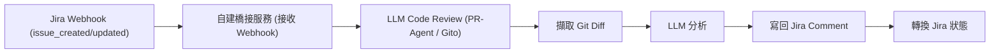

# 開源 LLM 驅動之程式碼審查工具與 Jira 整合調查

## 概述

本文調查能與 LLM 整合以自動執行程式碼審查的開源軟體，**聚焦於 Jira Webhook 觸發 + Jira Service Account 認證**的整合模式。其他 Git 平台整合（GitLab、Gitea 等）不納入評估。考量指標包括 GitHub 星數、授權條款、LLM 相容性及 Jira 整合深度。

## 篩選條件

本次調查以下列條件篩選工具：

1. **開源 (FOSS)** — 原始碼可取得、可自託管
2. **Jira Webhook 觸發** — 工具能接收 Jira 發送的 Webhook 事件（如 `jira:issue_created`、`jira:issue_updated`）做為流程起點
3. **Jira Service Account 認證** — 使用 Jira Bot 帳號（非個人帳號）透過 API Token 或 Basic Auth 認證
4. **LLM 驅動程式碼審查** — 使用 LLM 分析程式碼、產出審查意見
5. **GitHub 星數** — 作為社群活躍度與採用的參考指標

## 完全符合條件的工具

### ahmetozel/jira-autonomous-coding-agent

- **倉庫**: [ahmet-ozel/jira-autonomous-coding-agent](https://github.com/ahmet-ozel/jira-autonomous-coding-agent)
- **GitHub 星數**: 0
- **授權**: MIT
- **LLM 支援**: GPT-4o、Claude（雙層架構：快速模型讀取 + 強模型編碼審查）[^jira-agent-repo]

**Jira Webhook 觸發**: ✅ **原生支援** — 提供 `TRIGGER_MODE=webhook` 模式，FastAPI 伺服器監聽 `POST /webhook/jira` 端點。Jira 可在 Issue Created / Issue Updated 時發送 Webhook。內建 Webhook 簽名驗證 (`src/webhook/validators.py`) 與記憶體內任務去重 (`src/webhook/task_lock.py`)[^jira-agent-repo]。

**Jira Service Account**: ✅ **必備** — 需建立專用 Jira Bot 使用者（如 `ai-developer-bot`），使用 `JIRA_BOT_USERNAME` 與 `JIRA_API_TOKEN` 認證。實際完整流程：

1. Jira Webhook 觸發 → 工具接收 Issue Created/Updated 事件
2. `TaskReader` 讀取 Jira Issue（摘要、描述、驗收標準）
3. `CodeFinder` 定位相關原始碼檔案
4. `CodeWriter` 使用 LLM 產生程式碼變更
5. `CodeReviewer` 審查產生的程式碼
6. 建立 PR（GitHub / GitLab / Bitbucket）
7. **將 PR 連結以評論形式發佈回 Jira Issue**
8. **將 Jira Issue 狀態轉換為「In Review」**[^jira-agent-docs]

**限制**:
- GitHub 星數 0，專案處於早期階段
- 定位為「自主編碼 Agent」而非純程式碼審查工具——它會**產生**程式碼而不僅是審查
- 審查對象是自己產生的程式碼，而非他人提交的 PR

### motart/ai-bug-triage-agent

- **倉庫**: [motart/ai-bug-triage-agent](https://github.com/motart/ai-bug-triage-agent)
- **GitHub 星數**: 1
- **LLM 支援**: Hugging Face 開源模型（預設 GPT-2）[^bug-triage-repo]

**Jira Webhook 觸發**: ✅ — Flask Webhook 伺服器監聽 `/webhook` 端點，僅處理 `issue_created` 事件且限 issue type 為「Bug」。

**Jira Service Account**: ✅ — 使用 `JIRA_URL`、`JIRA_USER`、`JIRA_TOKEN` 以 Basic Auth 連線。

**流程**: Jira Bug 建立 → Webhook 觸發 → LLM 分析 Bug 標題/描述 → GitHub Code Search API 定位受影響檔案 → 產生建議修復 → **建立 GitHub PR**（不將審查結果寫回 Jira）。

**限制**:
- 星數 1，成熟度低
- 僅處理 Bug 類型 Issue
- 不將審查結果寫回 Jira
- 預設使用 GPT-2（過時的弱模型）

## 部分符合條件的工具

### kodus-ai（kodustech/kodus-ai）

- **倉庫**: [kodustech/kodus-ai](https://github.com/kodustech/kodus-ai)
- **GitHub 星數**: 1,400
- **授權**: AGPLv3
- **LLM 支援**: 供應商無關[^kodus-repo]

**Jira Service Account**: ✅ — Plugin 式 Jira 整合，使用 OAuth 或 API Token。支援 Jira Cloud 與 Data Center。

**Jira 功能**: 當 PR 連結至 Jira Ticket 時，自動擷取 ticket 標題、描述與驗收標準，將 PR diff 與需求比對，**回報缺少的實作與差距**，並將商業邏輯驗證結果寫回 Jira。

**不符合點**:
- ❌ **觸發源為 Git Provider Webhook（GitHub/GitLab/Bitbucket/Azure）**，非 Jira Webhook
- Jira 僅作為「上下文來源 + 結果寫回目標」，非觸發起點

### Gito（Nayjest/Gito）

- **倉庫**: [Nayjest/Gito](https://github.com/Nayjest/Gito)
- **GitHub 星數**: 430
- **授權**: MIT
- **LLM 支援**: 供應商無關（OpenAI、Anthropic、Google、Ollama、vLLM）[^gito-repo]

**Jira Service Account**: ✅ — 支援 `JIRA_URL` + `JIRA_USER`/`JIRA_TOKEN`（Basic Auth）或純 Token Auth（Jira Server/Data Center PAT）。

**Jira 功能**: 從分支名稱自動偵測 Jira Issue Key → 擷取 Issue 詳細資訊 → 注入審查摘要產生「Issue Alignment」章節[^gito-jira]。

**不符合點**:
- ❌ **觸發源為 GitHub PR 事件**，非 Jira Webhook
- ❌ **不將審查結果寫回 Jira**（僅讀取上下文）

### SuperscriptSystems/codereview-agent

- **倉庫**: [SuperscriptSystems/codereview-agent](https://github.com/SuperscriptSystems/codereview-agent)
- **GitHub 星數**: 20
- **授權**: Apache 2.0
- **LLM 支援**: OpenAI 相容 API、OpenRouter（預設）、LLM 無關[^codereview-agent-repo]

**Jira Service Account**: ✅ — `JIRA_URL`、`JIRA_USER_EMAIL`、`JIRA_API_TOKEN`。

**Jira 功能**: 擷取 Jira 任務上下文，合併後**將評估結果發佈回 Jira**（使用 ADF 格式、自動清除舊 AI 評論）。`jira_client.py` (316 行) 實作 `add_comment()` 與 `add_assessment_comment()`[^codereview-agent-readme]。

**不符合點**:
- ❌ **觸發源為 Bitbucket/GitHub CI/CD Pipeline**，非 Jira Webhook
- 星數僅 20

## 不符合條件的工具（僅列舉）

| 工具 | 星數 | 不符合原因 |
|------|:----:|:----------|
| Alibaba Open Code Review | 30,200 | 無任何 Jira 整合 |
| PR-Agent (The-PR-Agent) | 13,000 | 無 Jira 整合 |
| ReviewDog | 9,600 | 非 LLM 工具，無 Jira 整合 |
| Sweep AI | 7,700 | 無 Jira 整合 |
| ChatGPT-CodeReview | 4,500 | 僅 GitHub，無 Jira |
| miracodeai/mira | 298 | 無 Jira 整合 |
| codereview.gpt | 609 | Chrome 擴充，僅 GitHub/GitLab |
| Codeball | 325 | 無 Jira 整合 |
| Aider | 30,000+ | IDE 助手，無 Jira 整合 |
| Continue | 25,000+ | IDE 助手，無 Jira 整合 |

## 綜合結論

### 完全命中（Jira Webhook + Service Account + LLM 審查）

| 工具 | 星數 | 授權 | 寫回 Jira | 成熟度 |
|------|:----:|:----:|:--------:|:------:|
| ahmetozel/jira-autonomous-coding-agent | 0 | MIT | ✅ 評論 + 狀態轉換 | 早期 |
| motart/ai-bug-triage-agent | 1 | — | ❌（僅開 PR） | 早期 |

**目前開源社群中尚無成熟（星數 > 100）且完全符合條件的工具。** 若要以 Jira Webhook 為起點觸發 LLM 程式碼審查並將結果寫回 Jira，最可行的路線是自建橋接服務：

### 建議架構

此架構可組合以下既有開源元件實作：

1. **Webhook 接收層**：參照 `ahmetozel/jira-autonomous-coding-agent` 的 FastAPI Webhook 伺服器或 `motart/ai-bug-triage-agent` 的 Flask 實作
2. **LLM 審查引擎**：採用 **PR-Agent** (⭐ 13,000) 或 **Gito** (⭐ 430) 進行實際程式碼審查
3. **Jira 寫回層**：參照 `SuperscriptSystems/codereview-agent` 的 `jira_client.py`（ADF 格式評論、去重、標記清除）

### 關於 Jira Service Account

不論選擇哪個工具，Jira 整合均需預先準備：

- **建立 Jira Bot 使用者**（如 `ai-code-review-bot`），賦予對應專案的 Browse Projects 與 Add Comments 權限
- **產生 API Token**：Jira Cloud 使用 [Atlassian API Token](https://id.atlassian.com/manage-profile/security/api-tokens)，Jira Data Center/Server 使用 Personal Access Token
- **設定 Webhook**：在 Jira 管理介面 → System → WebHooks 中建立，指向工具端點，訂閱 `jira:issue_created`、`jira:issue_updated` 事件

[^jira-agent-repo]: ahmet-ozel. (n.d.). Jira Autonomous Coding Agent. Retrieved 2026-09-13, from https://github.com/ahmet-ozel/jira-autonomous-coding-agent
[^jira-agent-docs]: ahmet-ozel. (n.d.). Jira Autonomous Coding Agent — README. Retrieved 2026-09-13, from https://github.com/ahmet-ozel/jira-autonomous-coding-agent/blob/main/README.md
[^bug-triage-repo]: motart. (n.d.). AI Bug Triage Agent. Retrieved 2026-09-13, from https://github.com/motart/ai-bug-triage-agent
[^kodus-repo]: kodustech. (n.d.). Kodus AI. Retrieved 2026-09-13, from https://github.com/kodustech/kodus-ai
[^gito-repo]: Nayjest. (n.d.). Gito. Retrieved 2026-09-13, from https://github.com/Nayjest/Gito
[^gito-jira]: Nayjest. (n.d.). Gito Jira Integration. Retrieved 2026-09-13, from https://github.com/Nayjest/Gito/blob/main/documentation/jira_integration.md
[^codereview-agent-repo]: SuperscriptSystems. (n.d.). CodeReview Agent. Retrieved 2026-09-13, from https://github.com/SuperscriptSystems/codereview-agent
[^codereview-agent-readme]: SuperscriptSystems. (n.d.). CodeReview Agent README. Retrieved 2026-09-13, from https://raw.githubusercontent.com/SuperscriptSystems/codereview-agent/main/README.md