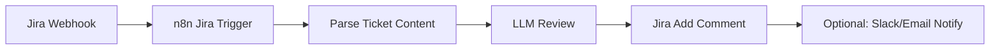
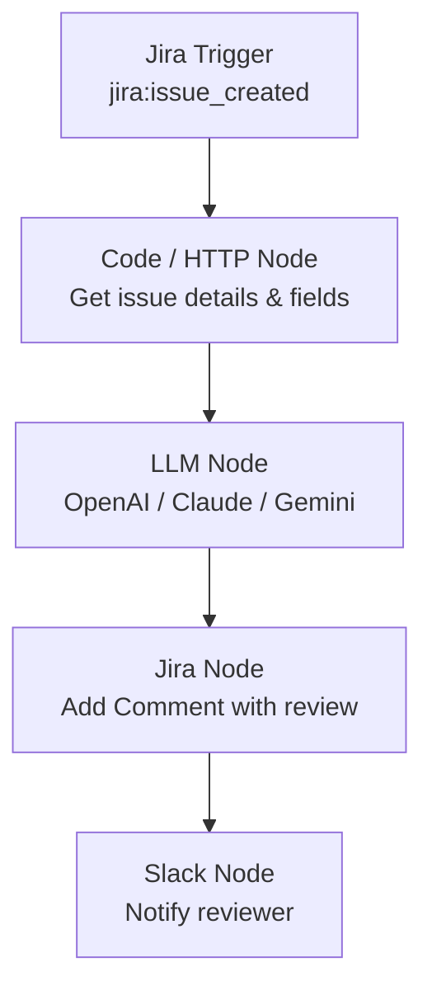

# 以通用型自動化軟體 (n8n) 實現 LLM Auto Review Jira Ticket

## 概述

本報告調查如何以通用型工作流程自動化平台（以 n8n 為代表）搭配 LLM，自動審查 Jira ticket。有別於專為 code review 設計的特種軟體，通用型自動化工具可靈活處理 ticket 審查、issue 分類、comment 回覆等多種場景。

---

## 1. 核心工具：n8n

**n8n**（GitHub: `n8n-io/n8n`）是 Fair-code 授權的工作流程自動化平台，提供視覺化編輯器與 400+ 原生整合。截至 2026 年 8 月，n8n 在 GitHub 上擁有 **~190,000 stars**[^n8n-repo]，為同類開源工具中社群最大的專案。

### 主要特點

- **原生 AI 能力**：內建 AI Agent 節點，可串接 OpenAI、Anthropic Claude、Google Gemini、Ollama 在地端 LLM 等
- **Jira 深度整合**：提供 Jira Software 操作節點（20 種操作）與 Jira Trigger 觸發節點（39 種事件）
- **400+ 整合**：涵蓋 Slack、GitHub、GitLab、Email、資料庫等
- **Self-hosted**：可自行部署於 Docker、Kubernetes

### 類似替代工具比較

| 工具 | GitHub Stars | 語言 | 特點 |
|---|---|---|---|
| **n8n** | ~190k | TypeScript | AI native、400+ 整合、視覺化編輯 |
| Huginn | ~49.7k | Ruby | Agent-based，偏個人監控/通知 |
| Node-RED | ~20k+ | JavaScript | IoT 起家，流程較簡單 |
| Activepieces | ~23.5k | TypeScript | 較新的 n8n 競爭者，也有 AI 整合 |
| Temporal | ~12k+ | Go | 開發者導向的工作流程引擎，無 UI |

n8n 在整合數量、AI 支援深度、社群規模上都顯著領先，是實現此場景的最佳通用型選擇。

---

## 2. 系統架構



### 觸發方式 — Jira Trigger Node

n8n 的 **Jira Trigger** 節點會自動向 Jira 註冊 webhook，支援 39 種事件，關鍵事件包括[^jira-trigger]：

- `jira:issue_created` — 新 ticket 建立時觸發
- `jira:issue_updated` — ticket 更新時觸發
- `jira:issue_deleted` — ticket 刪除時觸發
- `comment_created` — comment 建立時觸發

可透過 **JQL Filter** 限制只監聽特定專案（如 `project = MYPROJ`），確保只審查需要的 ticket。

也可以使用 n8n 的 **Webhook 節點**手動接收 Jira 發出的 webhook（在 Jira 管理介面 System → Webhooks 設定）。

---

## 3. 憑證設定：Jira Service Account

### Jira Cloud 憑證方式[^jira-cred]

| 方式 | 適用場景 | 需求欄位 |
|---|---|---|
| **Cloud API Token** | 最簡易 | Email + API Token（從 Atlassian 帳號 → Security → API tokens 產生）+ Domain |
| **Cloud OAuth2** | 較安全，支援 webhook 驗證 | Client ID + Client Secret（從 Atlassian Developer Console 取得）+ Site URL |
| **Server Account** | Jira Server/Data Center | Email + Password + Domain |

**建議使用 OAuth2**，因為 Jira Trigger 需要 `manage:jira-webhook` scope 才能自動註冊 webhook。

### 服務帳號建議

- 建立一個專用的 Jira Service Account（而非使用個人帳號）
- 該帳號需有目標專案的 **Browse Project** 與 **Add Comment** 權限
- OAuth2 scope 至少需：`read:jira-user`、`read:jira-work`、`write:jira-work`、`manage:jira-webhook`

---

## 4. LLM 審查流程

### 節點組合

n8n worklow 的基本節點順序：

```
Jira Trigger → HTTP Request (get issue details) → OpenAI/LLM Node → Jira (Add Comment)
```

或使用 AI Agent 模式：

```
Jira Trigger → AI Agent (with tools: Jira + LLM)
```

### 審查 Prompt 範例

LLM 節點的 system prompt 可設計為：

```
你是一個 Jira ticket 審查助手。請根據以下準則審查 ticket：

1. Description 是否清楚描述了問題/需求？
2. Acceptance criteria 是否具體可測試？
3. 是否附上相關的 log、截圖或參考資料？
4. 是否有風險或不明確之處需要澄清？

請以專業語氣在 Jira ticket 留下 comment，列出你的審查結果。
```

### LLM 支援

n8n 支援多種 LLM 模型[^n8n-ai]：

- **OpenAI**（GPT-4o, GPT-4.1-mini 等）
- **Anthropic Claude**（Sonnet 4, Opus 4）
- **Google Gemini**
- **Ollama**（在地端部署的開源 LLM，如 Llama 3, Mistral）
- **OpenRouter**（多模型路由）
- **DeepSeek**

### 範例流程架構



---

## 5. 實作步驟摘要

1. **部署 n8n**（Docker 或 n8n Cloud）
2. **建立 Jira Service Account** 並取得 API Token 或 OAuth2 credentials
3. **在 n8n 新增 Jira credential**（選擇對應的認證方式）
4. **建立 workflow**：
   - Jira Trigger（選 `jira:issue_created`，JQL filter 指定專案）
   - 或使用 Webhook 節點（若偏好手動設定 webhook）
5. **設定 LLM 節點**（選擇模型、設計審查 prompt）
6. **使用 Jira Node 的 Add Comment 操作** 將審查結果寫回 ticket
7. **啟用 workflow** — n8n 自動向 Jira 註冊 webhook

---

## 6. 其他通用型自動化工具

除了 n8n，以下工具也可實現類似功能：

- **Activepieces**（~23.5k stars） — n8n 的直接競爭者，也有 AI 節點與 Jira 整合，但整合數量與成熟度仍不及 n8n
- **Huginn**（~49.7k stars） — Ruby 生態，適合個人化監控，但缺乏原生 LLM 支援與 Jira 深度整合
- **Node-RED** — IoT 場景為主，可透過社群套件串接 LLM API，但無原生 AI agent 節點

n8n 因其 **AI native 設計 + Jira 原生整合 + 最大社群**，是目前實現「LLM auto review Jira ticket」最成熟的通用型選擇。

---

## 7. 限制與注意事項

- Jira Trigger 需要 n8n 有**公開可達的 URL**（或使用 tunneling 如 ngrok）才能接收 webhook
- OAuth2 credential 需要在 Atlassian Developer Console 開啟所有要求的 scope，否則授權會被拒絕[^jira-trigger]
- n8n 的 Jira 節點目前僅涵蓋 4 種 resource（Issue、Attachment、Comment、User），若需要 board/sprint 操作需改用 HTTP Request 節點
- LLM API 費用需自行負擔，可考慮使用在地端部署的 Ollama 搭配開源模型降低成本

---

[^n8n-repo]: n8n-io. (n.d.). n8n - Fair-code workflow automation platform with native AI capabilities. GitHub. Retrieved 2026-08-29, from https://github.com/n8n-io/n8n
[^jira-trigger]: n8n. (n.d.). Jira Trigger node documentation. n8n Docs. Retrieved 2026-08-29, from https://docs.n8n.io/integrations/builtin/trigger-nodes/n8n-nodes-base.jiratrigger
[^jira-cred]: n8n. (n.d.). Jira credentials documentation. n8n Docs. Retrieved 2026-08-29, from https://docs.n8n.io/integrations/builtin/credentials/jira
[^n8n-ai]: n8n. (n.d.). AI Agent integrations. n8n Integrations. Retrieved 2026-08-29, from https://n8n.io/integrations/agent/