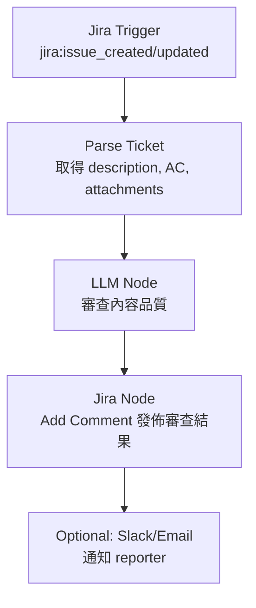

# FOSS 軟體使用 LLM 自動審查 Jira Ticket 內容調查

## 概述

本報告調查開源（FOSS）軟體中，哪些能夠利用 LLM 自動審查 **Jira Ticket 的內容本身**（即 ticket 的描述、驗收標準（Acceptance Criteria）、附件完整性、邏輯清晰度等），而非程式碼層級的 code review。

調查範圍涵蓋兩類工具：(1) 專為 Jira + LLM 審查設計的特種軟體；(2) 可自行配置為此場景的通用型工作流程自動化平台。

## 詞彙定義

本報告區分以下概念：

- **Ticket 內容審查（Content Review）**：檢查 Jira Issue 本身（標題、描述、驗收標準、附件等）的品質、完整度、邏輯一致性
- **程式碼審查（Code Review）**：檢查 PR/MR diff 的程式碼品質

前一份報告 00045 聚焦於以 Jira 為上下文來源的 LLM 程式碼審查工具；本報告聚焦於 **審查 Ticket 內容本身** 的工具，兩者互補。

## 篩選條件

1. **開源（FOSS）** — 原始碼可取得、可自託管
2. **Jira Webhook 觸發** — 工具能接收 Jira 的 `jira:issue_created` / `jira:issue_updated` 事件
3. **Jira Service Account 認證** — 使用 Jira Bot 帳號（非個人帳號）透過 API Token 或 OAuth 認證
4. **LLM 審查** — 使用 LLM 分析 ticket 內容，產出審查意見
5. **結果寫回 Jira** — 將審查結果（comment、建議改進）發佈回 Jira
6. **GitHub 星數** — 作為社群活躍度參考

## 專用工具調查結果

截至 2026-09-13 的調查，**開源社群中不存在星數超過 100 的專用工具**，同時滿足「Jira Webhook 觸發 + Service Account 認證 + LLM 審查 ticket 內容 + 結果寫回 Jira」的完整條件。

### 專用工具比較

| 工具 | GitHub 星數 | 授權 | Jira Webhook | Service Account | 審查對象 | 寫回 Jira |
|------|:-----------:|:----:|:----------:|:--------------:|:--------:|:--------:|
| ahmetozel/jira-autonomous-coding-agent | 0 | MIT | ✅ | ✅ | 程式碼（自產生的） | ✅ 評論+狀態 |
| motart/ai-bug-triage-agent | 1 | — | ✅ | ✅ | 程式碼修復建議 | ❌（僅開 PR） |
| kodustech/kodus-ai | ~1,400 | AGPLv3 | ❌（Git webhook） | ✅（plugin） | 程式碼 diff | ✅ |
| Nayjest/Gito | ~430 | MIT | ❌（GitHub PR 事件） | ✅ | 程式碼 diff | ❌（僅讀取 Jira） |
| SuperscriptSystems/codereview-agent | ~20 | Apache 2.0 | ❌（CI/CD 觸發） | ✅ | 程式碼 diff | ✅ |

以上工具的共通點：**它們都是「程式碼審查工具」，只是將 Jira 作為上下文來源**，並非設計來審查 ticket 內容品質[^previous-research]。

### 最接近的專用工具

#### ahmetozel/jira-autonomous-coding-agent（⭐ 0）[^jira-agent]

- **定位**：自主編碼 Agent，從 Jira task 產生程式碼變更
- **Jira Webhook**：✅ 原生支援 `POST /webhook/jira` 端點 + 簽名驗證
- **Service Account**：✅ Jira Bot 用戶 + API Token
- **審查能力**：內建 CodeReviewer 階段，但審查對象是**該 Agent 自己產生的程式碼**，並非審查 ticket 內容
- **寫回 Jira**：✅ 以 comment 發佈 PR 連結 + 轉換 issue 狀態為「In Review」
- **限制**：星數 0，定位是 coding agent 而非 ticket review tool

## 通用型工作流程自動化平台（推薦路線）

由於專用工具缺乏成熟選項，最務實的方案是利用通用型自動化平台自行搭建審查流程。

### n8n（⭐ ~205,000）[^n8n-repo]

n8n 是 Fair-code 授權的工作流程自動化平台，提供視覺化編輯器與 400+ 整合，是目前最成熟的選擇。

**相關關鍵節點**[^n8n-jira-trigger][^n8n-jira-cred]：

| 節點 | 功能 |
|------|------|
| **Jira Trigger** | 向 Jira 註冊 webhook，支援 39 種事件（`jira:issue_created`、`jira:issue_updated` 等），可透過 JQL 過濾 |
| **LLM 節點** | 支援 OpenAI、Anthropic Claude、Gemini、Ollama（自託管開源模型）、DeepSeek 等 |
| **Jira 節點** | 支援 20 種操作，含 Add Comment、Update Issue |
| **Webhook 節點** | 手動接收 Jira 外發的 webhook（若偏好手動設定） |
| **AI Agent 節點** | 整合工具使用能力的 Agent 模式 |

**工作流程架構**：



**審查 prompt 範例**：

```
你是一個 Jira ticket 審查助手。請根據以下準則審查此 issue：

1. 標題是否清晰且能反映 ticket 內容？
2. Description 是否充分描述了問題或需求？
3. Acceptance Criteria 是否具體、可測試、無遺漏？
4. 是否附上相關的 log、截圖或參考資料（如有需要）？
5. 是否有任何歧義、矛盾或資訊缺失？

請以專業語氣在 Jira ticket 上留下 comment，
列出各項缺失與改進建議。如 ticket 品質良好，請給予正面回饋。
```

### Activepieces（⭐ ~24,500）[^activepieces-repo]

- n8n 的直接競爭者，同樣提供視覺化編輯與 AI 整合
- 也提供 Jira 整合節點與 LLM 節點
- 整合數量（200+）與社群成熟度仍不及 n8n

### Dify（⭐ ~156,000）[^dify-repo]

- 開源 LLM 應用開發平台，具備 workflow、RAG pipeline、Agent 能力
- 可透過 HTTP 節點串接 Jira API，但無原生 Jira Trigger 節點
- 適合搭建「LLM 審查引擎」後端，但需要外部觸發機制

### 綜合比較

| 平台 | GitHub 星數 | 授權 | Jira 原生觸發 | LLM 原生 | 自託管 | 適合此場景 |
|------|:-----------:|:----:|:-----------:|:-------:|:-----:|:--------:|
| **n8n** | ~205k | Fair-code | ✅ Jira Trigger | ✅ AI Agent | ✅ | **最佳** |
| **Dify** | ~156k | Apache 2.0 | ❌（HTTP 節點） | ✅ Workflow | ✅ | 可（搭橋） |
| **Activepieces** | ~24.5k | MIT | ✅ Jira Piece | ✅ AI | ✅ | 次佳 |
| Huginn | ~49.7k | MIT | ❌ | ❌（無原生） | ✅ | 不合適 |
| Node-RED | ~20k+ | Apache 2.0 | ❌（社群套件） | ❌（社群套件） | ✅ | 不合適 |

## Jira Service Account 設定要點[^jira-atlassian-token]

審查流程所需的 Jira 帳號準備事項：

1. **建立專用 Jira Bot 使用者**（如 `ai-ticket-review-bot`）
2. **權限**：賦予目標專案的 Browse Projects、Add Comments、Transition Issues 權限
3. **認證方式**：
   - Jira Cloud：使用 [Atlassian API Token](https://id.atlassian.com/manage-profile/security/api-tokens) + Email
   - Jira Server/Data Center：使用 Personal Access Token
   - n8n 另支援 OAuth2（需 `manage:jira-webhook` scope 才能讓 Jira Trigger 自動註冊 webhook）
4. **Webhook 設定**（如選擇手動方式）：Jira 管理介面 → System → WebHooks → 指向 n8n 的公開 URL

## 推薦實作方案

綜合考量，最可行的路線為：

### 方案 A：n8n 直搭建（推薦）

適合已有或願意部署 n8n 的團隊。

```
n8n Jira Trigger (jira:issue_created)
→ IF 節點（過濾特定專案 issue type）
→ HTTP Request（取得 issue 完整欄位）
→ LLM 節點（審查 prompt，如 GPT-4o-mini 即可夠用）
→ Jira Add Comment（發佈結構化審查結果）
→ （可選）Slack 通知 reporter
```

- **優點**：原生整合、無須開發、視覺化編輯、易於維護
- **星數佐證**：n8n 以 205k ⭐ 為同類最大社群，持續維護中[^n8n-repo]
- **LLM 成本**：可使用 Ollama 在地端部署開源 LLM 以降低 API 成本[^n8n-ai]

### 方案 B：Dify + 橋接服務

適合已使用 Dify 的團隊。

1. 部署輕量 Webhook 接收器（如 Node.js 或 Python Flask）接收 Jira webhook
2. 橋接服務將 ticket 內容傳入 Dify workflow
3. Dify LLM 節點進行審查分析
4. HTTP 節點將結果寫回 Jira API

- **優點**：可整合 Dify 的 RAG Pipeline 豐富審查知識庫
- **缺點**：需要額外開發橋接層

## 結論

目前開源社群**不存在成熟的（⭐ > 100）專用工具**可「由 Jira webhook 觸發 → LLM 審查 ticket 內容 → 結果寫回 Jira」。現有工具均以程式碼審查為主軸，Jira 僅扮演上下文來源的角色。

最務實的實現方式是使用 **n8n（⭐ ~205,000）** 作為工作流程引擎，組合其 Jira Trigger + LLM + Jira 節點搭建審查流程。此方案具備：

- 原生 Jira webhook 註冊與接收
- 支援 Jira Service Account（OAuth2 或 API Token）
- 模型無關的 LLM 整合（可選在地端 Ollama 降低成本）
- 開發與維護成本最低（視覺化編輯、無須從零開發）

[^previous-research]: FlyPie. (2026-09-13). 開源 LLM 驅動之程式碼審查工具與 Jira 整合調查. Agent Zone Research 00045. Retrieved 2026-09-13, from https://github.com/flyskypie/mind-palace/blob/main/agent-zone/researches/00045_foss-llm-code-review-jira-integration-zh.md
[^jira-agent]: ahmet-ozel. (n.d.). Jira Autonomous Coding Agent. Retrieved 2026-09-13, from https://github.com/ahmet-ozel/jira-autonomous-coding-agent
[^n8n-repo]: n8n-io. (n.d.). n8n - Fair-code workflow automation platform with native AI capabilities. GitHub. Retrieved 2026-09-13, from https://github.com/n8n-io/n8n
[^n8n-jira-trigger]: n8n. (n.d.). Jira Trigger node documentation. n8n Docs. Retrieved 2026-09-13, from https://docs.n8n.io/integrations/builtin/trigger-nodes/n8n-nodes-base.jiratrigger
[^n8n-jira-cred]: n8n. (n.d.). Jira credentials documentation. n8n Docs. Retrieved 2026-09-13, from https://docs.n8n.io/integrations/builtin/credentials/jira
[^n8n-ai]: n8n. (n.d.). AI Agent integrations. n8n Integrations. Retrieved 2026-09-13, from https://n8n.io/integrations/agent/
[^activepieces-repo]: activepieces. (n.d.). Activepieces - AI Agents & MCPs & AI Workflow Automation. GitHub. Retrieved 2026-09-13, from https://github.com/activepieces/activepieces
[^dify-repo]: langgenius. (n.d.). Dify - Build Agentic workflows, RAG pipelines. GitHub. Retrieved 2026-09-13, from https://github.com/langgenius/dify
[^jira-atlassian-token]: Atlassian. (n.d.). Manage API tokens for your Atlassian account. Retrieved 2026-09-13, from https://id.atlassian.com/manage-profile/security/api-tokens