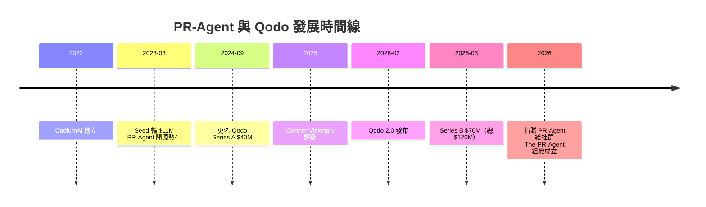

# PR-Agent 專案背景調查報告

## 摘要

PR-Agent 是一款開源的 AI Pull Request 審查工具，最初由以色列公司 Qodo（原名 CodiumAI）於 2023 年創建，2025–2026 年轉交社群維護。本報告調查其背後的組織、創辦團隊、募資歷程、投資人組成、社群規模、授權演變及治理結構。

---

## 1. 專案概述

PR-Agent 是第一個開源的 AI PR 審查工具，可自動審查 GitHub、GitLab、Bitbucket、Azure DevOps 等平台的 Pull Request，提供程式碼品質、安全性、測試覆蓋率等面向的 AI 驅動建議。

- **GitHub 組織**：The-PR-Agent（社群擁有）[^github-org]
- **原始倉庫**：`The-PR-Agent/pr-agent`
- **授權**：Apache 2.0（最初）→ AGPL v3 → 回歸 Apache 2.0；新倉庫實際使用 MIT License [^license]
- **官方網站**：https://www.pr-agent.ai [^website]
- **文檔**：https://docs.pr-agent.ai [^docs]

[^github-org]: The-PR-Agent. (n.d.). GitHub 組織. Retrieved 2026-09-16, from https://github.com/The-PR-Agent
[^license]: The-PR-Agent. (n.d.). pr-agent LICENSE. Retrieved 2026-09-16, from https://github.com/The-PR-Agent/pr-agent/blob/main/LICENSE
[^website]: PR-Agent. (n.d.). 官方網站. Retrieved 2026-09-16, from https://www.pr-agent.ai
[^docs]: PR-Agent. (n.d.). 官方文檔. Retrieved 2026-09-16, from https://docs.pr-agent.ai

---

## 2. GitHub 統計數據

| 指標 | 數值 |
|------|------|
| Stars | ~13,000 |
| Forks | ~1,900 |
| Watchers | 61 |
| 貢獻者 | 353 位 |
| Commits | 5,506 |
| 最新版本 | v0.45.0（2026-09-05 發布） |
| 主要語言 | Python |

[^stats]: GitHub. (n.d.). The-PR-Agent/pr-agent. Retrieved 2026-09-16, from https://github.com/The-PR-Agent/pr-agent

---

## 3. 背後公司：Qodo（原名 CodiumAI）

### 3.1 公司簡介

| 項目 | 內容 |
|------|------|
| 公司名稱 | Qodo（2024-09 由 CodiumAI 更名） |
| 創立時間 | 2022 年 |
| 總部 | 以色列特拉維夫（另有紐約等辦公室） |
| 員工人數 | ~100 人（2025 年） |
| 定位 | AI Code Review 與 Code Governance 平台 |
| 官網 | https://www.qodo.ai |

品牌名稱 "Qodo" 是 "Quality"（品質）與 "Code"（程式碼）的合成詞[^qodo-website]。

[^qodo-website]: Qodo. (n.d.). 官方網站. Retrieved 2026-09-16, from https://www.qodo.ai

### 3.2 品牌演變時間線

| 時間 | 事件 |
|------|------|
| 2022 | CodiumAI 創立 |
| 2023-03 | 發布 PR-Agent 開源專案（Apache 2.0） |
| 2023-03 | Seed 輪募資 $11M |
| 2024-09 | 更名為 Qodo；Series A $40M |
| 2025 | 被 Gartner Magic Quadrant 評為 Visionary |
| 2026-02 | Qodo 2.0 發布（多代理架構） |
| 2026-03 | Series B $70M（總募資 $120M） |
| 2026 | 將 PR-Agent 捐贈給社群，成立 The-PR-Agent 組織 |

[^timeline]: Qodo. (2024, September 30). CodiumAI Rebrands as Qodo. Retrieved 2026-09-16, from https://www.qodo.ai/blog/codiumai-rebrands-as-qodo/

---

## 4. 創辦團隊

### Itamar Friedman（共同創辦人暨 CEO）

- 前阿里巴巴集團以色列 AI Lab（Damo Academy）總監
- 共同創辦 Visualead（被阿里巴巴收購）
- 曾於 Mellanox（被 NVIDIA 收購）從事 ML 驅動的硬體驗證
- 共同撰寫 AlphaCodium 論文

### Dedy Kredo（共同創辦人暨 CPO）

- 前 Explorium 的 VP of Customer Facing Data Science
- 前 VMware 產品與數據科學團隊主管

[^founders]: Qodo. (n.d.). About. Retrieved 2026-09-16, from https://www.qodo.ai/about/

---

## 5. 募資歷程與投資人

### 5.1 募資輪次

| 輪次 | 時間 | 金額 | 領投方 | 其他參與者 |
|------|------|------|--------|-----------|
| Seed | 2023-03 | $11M | Vine Ventures、TLV Partners | OpenAI 天使、VMware 天使 |
| Series A | 2024-09 | $40M | Susa Ventures、Square Peg | Firestreak Ventures、ICON Continuity Fund、TLV Partners、Vine Ventures |
| Series B | 2026-03 | $70M | Qumra Capital | Maor Ventures、Phoenix Venture Partners、S Ventures、Square Peg、Susa Ventures、TLV Partners、Vine Ventures、Peter Welinder（OpenAI）、Clara Shih（Meta） |

[^seed]: PRNewswire. (2023, March 22). CodiumAI Exits Stealth with $11 Million. Retrieved 2026-09-16, from https://www.prnewswire.com/news-releases/codiumai-exits-stealth-with-11-million-to-usher-in-the-era-of-generative-ai-powered-code-integrity-301778496.html
[^series-a]: TechCrunch. (2024, September 30). Qodo raises $40M Series A. Retrieved 2026-09-16, from https://techcrunch.com/2024/09/30/qodo-raises-40m-series-a-to-bring-quality-first-code-generation-to-the-enterprise/
[^series-b]: Park, K. (2026, March 30). Qodo raises $70M for code verification as AI coding scales. TechCrunch. Retrieved 2026-09-16, from https://techcrunch.com/2026/03/30/qodo-bets-on-code-verification-as-ai-coding-scales-raises-70m/

### 5.2 機構投資人一覽

| 投資機構 | 類型 | 參與輪次 |
|----------|------|---------|
| Qumra Capital | 創投（Series B 領投） | Series B |
| Maor Ventures | 機構投資人 | Series B |
| Phoenix Venture Partners | 機構投資人 | Series B |
| S Ventures（Sentinel） | 機構投資人 | Series B |
| Square Peg | 創投 | Series A、Series B |
| Susa Ventures | 創投 | Series A、Series B |
| TLV Partners | 創投 | Seed、Series A、Series B |
| Vine Ventures | 創投 | Seed、Series A、Series B |
| Firestreak Ventures | 創投 | Series A |
| ICON Continuity Fund | 基金 | Series A |

[^investors]: 同上各輪次公告來源。

### 5.3 知名天使投資人

- **Peter Welinder** — OpenAI VP of Product
- **Clara Shih** — Meta VP of AI
- **Danny Grander** — Snyk 共同創辦人
- **Liat Zakay** — Shopify 董事
- **Nitzan Shapira** — Epsagon CEO 兼共同創辦人
- 以及其他多位科技創業者與投資人[^angels]

[^angels]: Qodo. (n.d.). About（Angel Investors 列表）. Retrieved 2026-09-16, from https://www.qodo.ai/about/

---

## 6. 社群化治理與捐贈

### 6.1 轉交社群

2025–2026 年間，Qodo 決定將 PR-Agent 捐贈給開源社群，成立獨立的 GitHub 組織 **The-PR-Agent**[^handover]。

**三個核心變更**：
1. **新組織**：移至社群擁有的 `The-PR-Agent` 組織，獨立於 Qodo
2. **授權回歸**：從 AGPL v3 回到 Apache 2.0（寬鬆授權）
3. **治理委員會成立**：引入外部維護者主導開發

[^handover]: Qodo. (n.d.). Qodo Is Handing PR-Agent Over to the Community. Retrieved 2026-09-16, from https://www.qodo.ai/blog/qodo-is-handing-pr-agent-over-to-the-community/

### 6.2 治理委員會

| 成員 | 角色 | 背景 |
|------|------|------|
| Naor Peled | 首位外部維護者 | TypeORM 維護者，任職於 groundcover；亦為 Qodo Ambassador |
| Ofir Friedman | 核心維護團隊 | 原 Qodo 內部貢獻者 |
| Dana Fine | 社群與開源經理 | Qodo Global Community & Open Source Manager |

長期目標是將專案捐贈給外部基金會[^handover]。

### 6.3 Qodo 的商業模式

- Qodo 專注於企業級 AI Code Review 與 Code Governance 平台
- 提供企業級 SLA、SSO、審計日誌、託管基礎設施
- 對開源專案提供免費使用 Qodo 商業版
- PR-Agent 社群版維持自託管、可客製化[^qodo-platform]

[^qodo-platform]: Wikipedia. (2026). Qodo. Retrieved 2026-09-16, from https://en.wikipedia.org/wiki/Qodo

---

## 7. 社群與生態

- **PyPI 套件**：`pr-agent`（最新版 v0.39+）
- **Docker Hub**：`pragent/pr-agent`（v0.34.2+）
- **金級贊助商**：Qodo（贊助連結指向 Naor Peled 的 GitHub Sponsors）
- **353 位貢獻者** 來自全球社群
- **NPM 整合**、**GitHub Actions** 等多種部署方式

---

## 8. 時間線總覽（Mermaid）

---

## 9. 參考資料總攬

The-PR-Agent. (n.d.). GitHub 組織. Retrieved 2026-09-16, from https://github.com/The-PR-Agent

The-PR-Agent. (n.d.). pr-agent LICENSE. Retrieved 2026-09-16, from https://github.com/The-PR-Agent/pr-agent/blob/main/LICENSE

Qodo. (n.d.). 官方網站. Retrieved 2026-09-16, from https://www.qodo.ai

Qodo. (n.d.). About. Retrieved 2026-09-16, from https://www.qodo.ai/about/

Qodo. (n.d.). Qodo Is Handing PR-Agent Over to the Community. Retrieved 2026-09-16, from https://www.qodo.ai/blog/qodo-is-handing-pr-agent-over-to-the-community/

Park, K. (2026, March 30). Qodo raises $70M for code verification as AI coding scales. TechCrunch. Retrieved 2026-09-16, from https://techcrunch.com/2026/03/30/qodo-bets-on-code-verification-as-ai-coding-scales-raises-70m/

TechCrunch. (2024, September 30). Qodo raises $40M Series A. Retrieved 2026-09-16, from https://techcrunch.com/2024/09/30/qodo-raises-40m-series-a-to-bring-quality-first-code-generation-to-the-enterprise/

PRNewswire. (2023, March 22). CodiumAI Exits Stealth with $11 Million. Retrieved 2026-09-16, from https://www.prnewswire.com/news-releases/codiumai-exits-stealth-with-11-million-to-usher-in-the-era-of-generative-ai-powered-code-integrity-301778496.html

Wikipedia. (2026). Qodo. Retrieved 2026-09-16, from https://en.wikipedia.org/wiki/Qodo