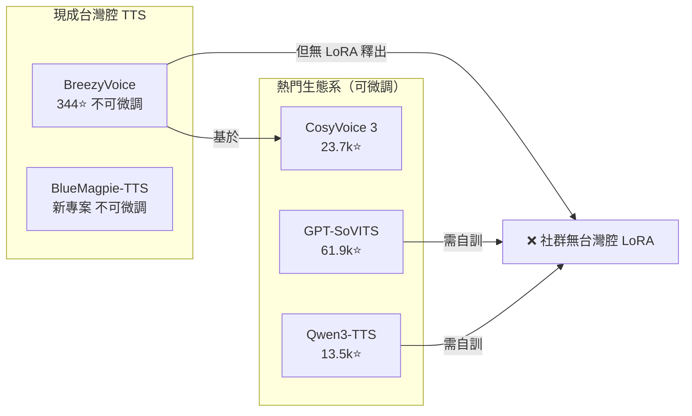

# 台灣腔 TTS 現成微調資源調查：基於熱門生態系的 LoRA / Checkpoint

## 研究背景

尋找 **基於熱門 TTS 生態系（CosyVoice、GPT-SoVITS、Qwen3-TTS），且已經被社群微調好台灣腔的現成 LoRA weights 或完整模型 checkpoint**。

> 注意：本報告不討論「內建台灣腔的冷門模型」（如 BreezyVoice、BlueMagpie-TTS），只關注熱門生態系 + 已被微調的現成資源。

---

## 結論

**社群上沒有任何公開的台灣腔 LoRA adapter 或微調 checkpoint。**

無論是 CosyVoice、GPT-SoVITS 還是 Qwen3-TTS，目前都 **不存在** 任何人公開分享過台灣腔（繁體中文＋台灣華語）的微調權重。如果要台灣腔，只能自己拿音檔訓練。

---

## 詳查結果

### Hugging Face 查詢

搜尋範圍：
- 所有 Taiwanese Mandarin / 台灣腔 TTS 模型
- FormoSpeech 組織的 22 個模型（多為 ASR 或 Hakka TTS）
- MediaTek-Research 的 BreezyVoice（僅推論模型，不可微調）

結果：**沒有任何以熱門生態系為基礎的台灣腔 LoRA / checkpoint**。

### GitHub 查詢

相關專案僅為微調教學工具，非已微調好的權重：

| 專案 | 說明 |
|------|------|
| `instavar/cosyvoice3-lora-finetuning` | CosyVoice 3 LoRA 微調的**教學腳本**，非成品 |
| `instavar/qwen3-tts-lora-finetuning` | Qwen3-TTS LoRA 微調的**教學腳本**，非成品 |
| Mark Ku 部落格 | 比較 CosyVoice 3 vs Qwen3-TTS，但**僅教學**無釋出權重 |

### 現有台灣腔可用的方案（但皆屬冷門）

| 方案 | 基礎模型 | 熱門度 | 現成可用 | 可微調 |
|------|---------|-------|---------|-------|
| **BreezyVoice** | CosyVoice 2 | 冷門（344 ⭐） | ✅ 台灣腔專用 | ❌ 不可 |
| **BlueMagpie-TTS** | VoxCPM | 冷門（新專案） | ✅ 台灣腔專用 | ❌ 不支援 |
| **CosyVoice 3** 原版 | — | 熱門（23.7k ⭐） | ⚠️ 偏接近台灣腔 | ✅ 需自行 LoRA |
| **GPT-SoVITS** 原版 | — | 最熱門（61.9k ⭐） | ❌ 偏中國腔 | ✅ 需自行微調 |
| **Qwen3-TTS** 原版 | — | 熱門（13.5k ⭐） | ❌ 明顯中國腔 | ✅ 需自行 LoRA |

---

## 現實情況

---

## 所以當前唯一路徑

1. **選一個熱門基礎模型**：CosyVoice 3（基線最接近台灣腔）或 GPT-SoVITS（社群最大）
2. **收集 10–30 分鐘台灣腔語者音檔**
3. **自行 LoRA 微調**
4. 結束 — 沒有現成的捷徑

---

## 參考資料

- Hugging Face — MediaTek-Research/BreezyVoice. Retrieved 2026-09-19，from https://huggingface.co/MediaTek-Research/BreezyVoice
- Hugging Face — formospeech organization. Retrieved 2026-09-19，from https://huggingface.co/formospeech
- GitHub — instavar/cosyvoice3-lora-finetuning. Retrieved 2026-09-19，from https://github.com/instavar/cosyvoice3-lora-finetuning
- GitHub — instavar/qwen3-tts-lora-finetuning. Retrieved 2026-09-19，from https://github.com/instavar/qwen3-tts-lora-finetuning
- Mark Ku — AI Voice Clone & LoRA Training Guide. Retrieved 2026-09-19，from https://blog.markkulab.net/post/ai-voice-clone-lora-training-guide
- BreezyVoice GitHub (mtkresearch). Retrieved 2026-09-19，from https://github.com/mtkresearch/BreezyVoice