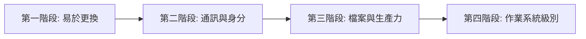

# DeGoogle 具體工作事項與路徑

## 概述

DeGoogle（又稱去谷歌化）是一場草根運動，隱私倡導者因日益增長的隱私疑慮而呼籲使用者完全停止使用 Google 產品[^wiki]。Google 已於 2024 年被美國司法部正式宣告為非法壟斷[^seanpm2001]。本報告系統性整理脫離 Google 生態系所需的工作事項、替代方案、遷移路徑與難度評估。

## 階段性路徑總覽

根據多份指南的共同建議，推薦按以下階段逐步脫離[^tuta][^mundobytes]：

| 階段 | 服務 | 推薦替代 | 難度 | 預計時間 |
|------|------|---------|:----:|:--------:|
| **第一階段**（最易） | Google 搜尋 | DuckDuckGo / Brave Search / Startpage | ⭐ | 1 分鐘 |
| | Google Chrome | Firefox / Brave / LibreWolf | ⭐ | 5 分鐘 |
| | Google 翻譯 | DeepL / LibreTranslate | ⭐ | 5 分鐘 |
| **第二階段** | Gmail | Tuta Mail / Proton Mail | ⭐⭐ | 2–4 週 |
| | Google 密碼管理器 | Bitwarden / KeePassXC | ⭐⭐ | 1–2 小時 |
| | Google Authenticator | Aegis / FreeOTP | ⭐⭐ | 30 分鐘 |
| | Google 日曆 | Proton Calendar / Tuta Calendar | ⭐⭐ | 30 分鐘 |
| **第三階段** | Google Drive | Proton Drive / Nextcloud / Tresorit | ⭐⭐⭐ | 1–2 週 |
| | Google Docs | CryptPad / LibreOffice / OnlyOffice | ⭐⭐⭐ | 視文件量 |
| | Google 相簿 | Ente Photos / Immich | ⭐⭐⭐ | 1–2 週 |
| | YouTube | NewPipe / Invidious / FreeTube（前端） | ⭐⭐ | 立即 |
| | Google 地圖 | OsmAnd / Organic Maps | ⭐⭐ | 立即 |
| **第四階段**（進階） | Android 作業系統 | GrapheneOS / LineageOS / CalyxOS | ⭐⭐⭐⭐ | 2–4 小時 |
| | Google Play 商店 | F-Droid + Aurora Store | ⭐⭐⭐ | 30 分鐘 |

## 各服務詳細替代方案與遷移步驟

### 1. Google 搜尋 → DuckDuckGo / Brave Search / Startpage / Kagi

| 替代方案 | 索引來源 | 追蹤 | 費用 | 適合 |
|---------|---------|:----:|:----:|:----:|
| DuckDuckGo | Bing + 自有 | 無紀錄 | 免費 | 大多數使用者（Tuta 社群 47% 首選）[^tuta] |
| Brave Search | 完全獨立 | 無追蹤 | 免費 | 想完全脫離大科技者 |
| Startpage | Google 索引（匿名化） | 無紀錄 | 免費 | 想念 Google 搜尋品質者 |
| SearXNG | 聚合搜尋 | 自託管 = 最大隱私 | 免費 | 技術使用者 |
| Kagi | 自有索引 | 無廣告無追蹤 | $10/月 | 重視搜尋品質者 |

**遷移步驟**：瀏覽器設定 → 搜尋引擎 → 變更預設搜尋引擎。耗時 60 秒。[^livingguide]

### 2. Google Chrome → Firefox / Brave / LibreWolf / Tor Browser

| 替代方案 | 核心 | 隱私功能 | 適合 |
|---------|:----:|---------|:----:|
| Firefox | Gecko（自有引擎） | 加強型追蹤保護、支援 uBlock Origin | 大多數使用者（Tuta 社群 37% 首選）[^tuta] |
| Brave | Chromium | 內建廣告/追蹤封鎖、Tor 模式 | Chrome 使用者無縫轉換 |
| LibreWolf | Firefox（強化） | 預設最大化隱私、移除遙測 | 極致隱私 |
| Tor Browser | Firefox（強化） | 洋蔥路由、反指紋辨識 | 匿名需求 |

**遷移步驟**：下載新瀏覽器 → 匯入書籤/密碼 → 安裝 uBlock Origin → 設為預設瀏覽器。[^livingguide]

### 3. Gmail → Proton Mail / Tuta / Mailbox.org

| 替代方案 | 加密 | 司法管轄區 | 費用 |
|---------|:----:|:---------:|:----:|
| Proton Mail | 端對端（PGP） | 瑞士 | 免費（1GB）– $10/月 |
| Tuta | 端對端 + 後量子 | 德國 | 免費（1GB）– $3/月 |
| Mailbox.org | 靜態加密 | 德國 | €3/月 |
| Fastmail | 僅 TLS（非端對端） | 澳洲（五眼聯盟） | $3–9/月 |

**遷移步驟**[^vucense]：
1. 在新供應商建立帳戶
2. 使用 Google Takeout 匯出 Gmail 聯絡人與郵件
3. 在 Gmail 設定 → 轉寄 → 新增轉寄地址
4. 匯入聯絡人（Google 匯出 VCF → 新供應商匯入）
5. 依優先順序更新帳戶：銀行 → 關鍵服務 → 其他
6. 設定自動回覆：「我已遷移至 [新郵箱]」
7. 保留 Gmail 活躍 2–3 個月以捕獲遺漏郵件，然後刪除

### 4. Google Drive → Proton Drive / Nextcloud / Tresorit / Sync.com

| 替代方案 | 加密 | 控制方式 | 費用 |
|---------|:----:|:-------:|:----:|
| Proton Drive | 端對端 | 託管（瑞士） | 免費（1GB）– $10/月 |
| Nextcloud | 伺服器端 + 可選端對端 | 自託管 / 託管 | 免費（自託管） |
| Tresorit | 端對端 | 託管（瑞士/匈牙利） | $10/月 |
| Sync.com | 端對端 | 託管（加拿大） | $8/月 |

**遷移步驟**：Google Takeout 下載所有檔案 → 上傳至新服務（大檔案用 rclone）→ 安裝同步客戶端 → 驗證 → 刪除 Google Drive。[^livingguide]

### 5. Google 日曆 → Proton Calendar / Tuta Calendar / Nextcloud Calendar

**遷移步驟**：Google 日曆設定 → 匯出 .ics → 匯入新日曆供應商 → 刪除 Google 日曆資料。[^livingguide]

### 6. Google 相簿 → Ente Photos / Immich / PhotoPrism

| 替代方案 | 加密 | 控制方式 | 費用 |
|---------|:----:|:-------:|:----:|
| Ente Photos | 端對端 | 託管 | 免費 / $3–10/月 |
| Immich | 伺服器端 | 自託管 | 免費 |
| PhotoPrism | 伺服器端 | 自託管（AI 相片分類） | 免費 |

**遷移步驟**：Google Takeout 下載照片 → Ente 支援直接匯入 Takeout 檔案 → 安裝手機自動備份 → 驗證 → 刪除。[^livingguide]

### 7. Google Docs / Sheets / Slides → LibreOffice / CryptPad / OnlyOffice / Nextcloud Office

| 替代方案 | 離線/線上 | 協作 | 費用 |
|---------|:--------:|:----:|:----:|
| LibreOffice | 離線 | 無 | 免費 |
| CryptPad | 線上 | 端對端加密協作 | 免費 / 付費 |
| OnlyOffice | 兩者 | 伺服器端加密 | 免費 / 付費 |
| Nextcloud Office（Collabora） | 線上 | 可端對端加密 | 免費（自託管） |

### 8. YouTube → 前端替代方案（非取代平台）

YouTube 沒有真正的內容替代平台，但可以透過隱私前端大幅降低追蹤[^livingguide]：

| 替代方案 | 平台 | 功能 |
|---------|:----:|------|
| Invidious | Web | 無廣告、無追蹤的 YouTube 前端 |
| NewPipe | Android | 無 Google 服務的 YouTube 客戶端（F-Droid 下載） |
| FreeTube | Desktop | 在地訂閱、無帳號需求 |
| Piped | Web | 替代前端 |

### 9. Google 地圖 → OsmAnd / Organic Maps / Magic Earth

| 替代方案 | 離線導航 | 資料來源 | 費用 |
|---------|:-------:|:-------:|:----:|
| OsmAnd | ✅ 完整離線地圖 | OpenStreetMap | 免費 / 付費 |
| Organic Maps | ✅ 完整離線 | OpenStreetMap | 免費 |
| Magic Earth | ✅ | OpenStreetMap | 免費 |

### 10. Android 作業系統 → 三個層級的去 Google 化

#### 層級 1：最小化 Google（簡易，30 分鐘）
- 逐一取代 Google 應用程式
- 使用 **F-Droid** 和 **Aurora Store** 取代 Google Play Store
- 關閉位置紀錄和廣告個人化
- **隱私提升：約 30%**

#### 層級 2：不含 Google 的自訂 ROM（進階，2–3 小時）
- 刷入 **LineageOS**（廣泛裝置支援）或 **CalyxOS**（僅 Pixel）
- 使用 **MicroG** 維持應用程式相容性（推播通知等）
- **隱私提升：約 70%**

#### 層級 3：GrapheneOS（專家，4+ 小時）
- **GrapheneOS** — 僅 Pixel 裝置 — 最強化的 Android
- 可選沙盒化 Google Play（應用程式無法互相存取）
- **隱私提升：約 95%**

#### Android 應用程式替代對照表

| Google 應用程式 | 替代方案 | 取得方式 |
|---------------|---------|:-------:|
| Play Store | F-Droid + Aurora Store | F-Droid 官網 |
| Google 地圖 | OsmAnd / Organic Maps | F-Droid |
| Chrome | Firefox / Brave / Bromite | F-Droid |
| YouTube | NewPipe / LibreTube | F-Droid |
| Gmail | Tuta / Proton Mail | F-Droid |
| Google 日曆 | Etar / Simple Calendar | F-Droid |
| Google Keep | Standard Notes / Joplin | F-Droid |
| Google 相簿 | Ente Photos | F-Droid |
| Google 雲端硬碟 | Nextcloud | F-Droid |
| Google Authenticator | Aegis Authenticator | F-Droid |
| Google 密碼管理器 | Bitwarden / KeePassXC | F-Droid |
| Google 鍵盤（GBoard） | AnySoftKeyboard / OpenBoard | F-Droid |
| Google 訊息 | Signal / Session / Element（Matrix） | F-Droid |
| Google 相機 | Open Camera | F-Droid |

### 11. Google 分析（Analytics）→ Plausible / Matomo / Fathom / Umami

| 替代方案 | 託管方式 | 隱私 | 費用 |
|---------|:-------:|:----:|:----:|
| Plausible | 雲端或自託管 | 無 Cookie、GDPR 合規 | 免費（自）/ $10/月 |
| Matomo | 雲端或自託管 | 完整資料所有權 | 免費（自）/ 付費雲端 |
| Fathom | 僅雲端 | 輕量、無 Cookie | $14/月 |
| Umami | 自託管 | 簡潔快速 | 免費 |

### 12. Google 廣告 → 倫理廣告網絡或替代獲利模式

- 無直接等價替代品 — 商業模式本質不同
- 替代方案：EthicalAds / Carbon Ads / BuySellAds（追蹤較少）
- 更佳方式：透過訂閱（Liberapay / Ko-fi）或聯盟行銷獲利[^livingguide]

### 13. Google Meet → Signal / Jitsi Meet / Wire / Brave Talk

備註：Signal 支援最多 40+ 人且具端對端加密，Jitsi Meet 可自託管且無參與者上限[^tuta]。

## 30 天遷移衝刺計畫

根據 Vucense 指南提出的架構[^vucense]：

| 週次 | 焦點 | 具體行動 | 所需時間 |
|:---:|------|---------|:-------:|
| **第 1 週** | 搜尋與瀏覽器 | 切換至 Firefox + DuckDuckGo/Brave Search，安裝 uBlock Origin，移除 Google 擴充功能 | 1–2 小時 |
| **第 2 週** | 通訊 | 建立 Proton/Tuta 帳戶，匯出聯絡人，設定 Gmail 轉寄，遷移日曆 | 1–2 小時 |
| **第 3 週** | 檔案與相片 | Google Takeout 匯出雲端硬碟與相簿，上傳至 Nextcloud/Ente/Proton Drive，確認同步 | 2–3 小時 |
| **第 4 週** | 手機作業系統與地圖 | 安裝 GrapheneOS/LineageOS（可選），切換至 Organic Maps/OsmAnd，改用 F-Droid 與 Aurora Store | 2–4 小時 |

**總投入時間**：約 6–8 小時，分散在一個月內完成。

## 必須接受的現實妥協

沒有任何指南聲稱 100% 去 Google 化對所有人都是可行的。誠實的指南承認以下現實[^livingguide][^vucense]：

- **YouTube** 沒有真正的內容替代平台 — 使用 Invidious/NewPipe 作為隱私包裝層
- **Google 地圖**在許多區域仍擁有最佳資料 — 可在不登入的情況下使用，或在少數複雜行程時保留
- **Gmail 聯絡人不願更換** — 端對端加密僅在雙方都使用時才有效
- **依賴 Google Play 服務的 Android 應用程式**在 GrapheneOS 上可能無法運作
- **工作需求** — 僱主使用 Google Workspace 意味著工作資料留在 Google
- **備用帳戶** — 保留一個休眠的 Google 帳戶用於舊網站的登入

Kashmir Hill 在 2019 年和 2020 年的兩次實測中發現，完全脫離 Google 導致她錯過會議、無法使用 Uber/Lyft/Yelp 等服務，並將 Amazon 和 Google 描述為「深植於數位世界架構中，連競爭對手都必須依賴它們的服務」[^wiki]。

**目標應是 Google 獨立，而非 Google 消滅。** 如果 Google 明天封鎖你的帳戶而你什麼都不會損失，那才是真正的成功。

## 參考資料

[^wiki]: Wikipedia. (n.d.). DeGoogle. Retrieved 2026-09-20, from https://en.wikipedia.org/wiki/DeGoogle

[^seanpm2001]: seanpm2001. (n.d.). Degoogle-your-life — A repository for general degoogling info. GitHub. Retrieved 2026-09-20, from https://github.com/seanpm2001/Degoogle-your-life

[^tycrek]: tycrek. (n.d.). degoogle — A huge list of alternatives to Google products. GitHub. Retrieved 2026-09-20, from https://github.com/tycrek/degoogle

[^tuta]: Tuta. (2026). Degoogle list — Best private alternatives to Google. Retrieved 2026-09-20, from https://tuta.com/blog/degoogle-list

[^mundobytes]: MundoBytes. (n.d.). Google 產品所有替代方案完整列表. Retrieved 2026-09-20, from https://mundobytes.com/zh-TW/Google-%E7%94%A2%E5%93%81%E6%89%80%E6%9C%89%E6%9B%BF%E4%BB%A3%E6%96%B9%E6%A1%88%E5%AE%8C%E6%95%B4%E5%88%97%E8%A1%A8/

[^livingguide]: Various authors. (2026). The degoogle living guide. Retrieved 2026-09-20, from degoogle community resources

[^vucense]: Vucense. (n.d.). How to completely de-Google your life in 30 days. Retrieved 2026-09-20, from https://vucense.com/privacy-sovereignty/digital-independence/how-to-completely-de-google-your-life-in-30-days/

[^nomoregoogle]: No More Google. (n.d.). Crowd-voted alternatives to Google products. Retrieved 2026-09-20, from https://nomoregoogle.com/

[^freecomtw]: 免費資源網. (n.d.). No More Google 替代方案網站介紹. Retrieved 2026-09-20, from https://free.com.tw/no-more-google/

[^isuperman]: 超人行銷. (n.d.). 台灣用什麼取代 Google 的最佳解決方案. Retrieved 2026-09-20, from https://www.isuperman.tw/%E5%8F%B0%E7%81%A3%E7%94%A8%E4%BB%80%E9%BA%BC-alternatives-%E5%8F%96%E4%BB%A3-google-%E7%9A%84%E6%9C%80%E4%BD%B3%E8%A7%A3%E6%B1%BA%E6%96%B9%E6%A1%88/