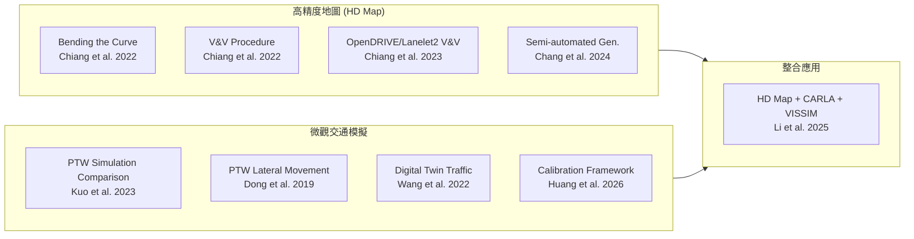

# 台灣交通模擬與高精度地圖相關論文調查

## 摘要

本報告針對台灣地區交通相關之**微觀交通模擬**與**高精度地圖 (HD Map)** 領域進行系統性論文調查。調查範圍涵蓋使用微觀交通模擬軟體（SUMO、VISSIM、CARLA）、高精度地圖（OpenDRIVE、Lanelet2）、數位雙生 (Digital Twin) 技術，以及針對台灣特有機車混合車流 (Mixed Traffic with Powered Two-Wheelers) 的建模研究。共收錄 9 篇核心論文，涵蓋 2019 年至 2026 年之研究成果，主要研究單位集中於國立成功大學測量系與交通管理系、國立陽明交通大學運輸與物流管理學系、以及國立臺灣大學。

---

## 1. 研究背景

台灣的交通環境具有高度混合車流的特性——機車 (Powered Two-Wheelers, PTWs) 比例極高，且其駕駛行為與汽車有顯著差異，如車道共享 (Lane Sharing)、同車道超車、兩段式左轉、機車停等區等特殊設施。傳統由歐美發展的微觀交通模擬軟體難以完整捕捉這些行為[^ptw-compare]。

同時，台灣自 2020 年代起積極投入自駕車與高精度地圖的發展。內政部地政司與國立成功大學測量系合作，建立「高精地圖研究中心」，制定台灣本土的 HD Map 標準與驗證程序[^bending-curve][^v-and-v]。

本報告將上述兩條研究脈絡——微觀交通模擬與高精度地圖——之台灣相關論文進行整合調查。

---

## 2. 微觀交通模擬 (Microscopic Traffic Simulation)

### 2.1 機車混合車流模擬軟體比較

**論文：A comparison of microscopic traffic simulation systems for Powered-Two-Wheeler traffic[^ptw-compare]**

- **作者：** P.F. Kuo, J.D. Chen, K.I. Wong
- **年份：** 2023
- **出版：** Proceedings of the Eastern Asia Society for Transportation Studies, Vol. 14 (The 15th Conference in Shah Alam), Paper ID: PP3613
- **單位：** 國立成功大學測量系 / 國立陽明交通大學運輸與物流管理系

此論文比較了台灣常用的兩款微觀交通模擬軟體——**VISSIM**（商用）與**SUMO**（開源）——在模擬機車混合車流時的表現。研究使用空拍機 (Drone) 收集車輛軌跡資料進行模型校正。結果發現：
- 兩者在處理車道內法規（如禁止變換車道）時均能複製觀測結果
- 但在模擬**機車停等區**、**兩段式左轉待轉區**等台灣特有設施時，兩者均存在限制
- 當機車流量升高時，兩者的建模結果不一致性顯著增加
- 建議未來應發展針對高密度混合車流的強健模型

### 2.2 機車橫向移動決策模型

**論文：Lateral movement decision model for powered two-wheelers in Taiwan[^ptw-lateral]**

- **作者：** Han Dong, Yen-Yu Chen, Cinzia Cirillo, K. I. Wong
- **年份：** 2019
- **出版：** Transportation Research Record, Vol. 2673, No. 2, pp. 686–697
- **DOI：** 10.1177/0361198118822820
- **單位：** University of Maryland / 國立陽明交通大學

此研究針對台灣機車的**非車道-based**駕駛行為進行建模。使用台北市一條四線道市區幹道的真實微觀軌跡資料，提出一個**動態離散選擇模型 (Dynamic Discrete Choice Model)** 來捕捉機車的橫向移動決策。模型考量的行為包括：
- 車道濾行 (Lane filtering)
- 並排行駛 (Moving abreast)
- 斜向跟車 (Oblique following)
- 同車道超車 (Overtaking from same lane)

該模型有潛力改善高機車比例環境下的微觀交通模擬準確度，對台灣道路幾何設計與混合車流控制策略有實際應用價值。

### 2.3 為自駕車數位雙生打造的自動化交通建模

**論文：Automatic traffic modelling for creating digital twins to facilitate autonomous vehicle development[^digi-twin]**

- **作者：** Shao Hua Wang, Chia Heng Tu, Jyh Ching Juang
- **年份：** 2022
- **出版：** Connection Science, Vol. 34, No. 1, pp. 1018–1037
- **DOI：** 10.1080/09540091.2021.1997914
- **單位：** 國立成功大學資訊工程系 / 電機工程系

此論文提出一套**自動化方法論**，從感測器資料中建模真實交通條件，並在數位雙生 (Digital Twin) 環境中重現。工具基於 KITTI 資料集驗證有效性，並展示如何在東南亞道路上捕捉、建模並重現**二輪車交通情境**。此外，研究將模擬結果與 SUMO 進行比較，證明此方法能減少人工建模的勞動時間。

### 2.4 高精度地圖 + CARLA + VISSIM 自駕車安全模擬

**論文：Utilizing High-Definition Maps and Simulation Software to Enhance Autonomous Vehicle Safety[^hd-carla-vissim]**

- **作者：** Yi-Ting Li, Pei-Fen Kuo, Kai-Wei Chiang, Brawiswa Putra, Febrian Fitryanik Susanta
- **年份：** 2025
- **出版：** ISPRS-Archives, Volume XLVIII-G-2025, pp. 929–935
- **DOI：** 10.5194/isprs-archives-XLVIII-G-2025-929-2025
- **單位：** 國立成功大學測量系；Universitas Gadjah Mada, Indonesia

此研究的關鍵亮點在於結合**CARLA**（自駕車模擬器）與**VISSIM**（交通流模擬），並以**真實 HD Map**作為橋樑。研究場域位於**台南高鐵站周邊**，分析包含 **3 個路口**與 **4 個道路段**的網路，透過緊急煞車事件來評估自駕車安全性。

主要發現：
- 緊急煞車熱點集中於**路口、彎道及安全島附近的急彎**
- 自駕車由於複雜的感知與計算模型，決策比人類駕駛員**更慢**
- 強調 HD Map 與交通流分析在自駕車模擬中的重要性
- 建議：簡化道路配置、減少急彎、限制任意變換車道

### 2.5 微觀交通模擬系統校正框架

**論文：A Systematic Calibration Framework for Microscopic Simulations Modeling Complex Systems for Control and Operations[^calib-framework]**

- **作者：** Yen-Lin Huang, Yen-Hsiang Chen, Po-Hao Huang, Wen-Yu Chen
- **年份：** 2026
- **出版：** IEEE Transactions on Intelligent Transportation Systems, pp. 1–15
- **DOI：** 10.1109/TITS.2026.3709347
- **單位：** 國立臺灣大學

本研究提出基於**同步擾動隨機逼近 (SPSA) 演算法**的標準化校正框架，整合敏感度引導的參數選擇機制與變異數縮減技術。透過高速公路事故管理案例進行驗證，校正後的模型與實地觀測值的一致性顯著提升，可應用於交通控制與營運分析。

---

## 3. 高精度地圖 (High-Definition Maps)

### 3.1 台灣 HD Map 生產曲線彎曲

**論文：Bending the curve of HD maps production for autonomous vehicle applications in Taiwan[^bending-curve]**

- **作者：** Kai-Wei Chiang, Jhih-Cing Zeng, Meng-Lun Tsai, Hatem Darweesh, Pin-Xu Chen, Chi-Kuei Wang
- **年份：** 2022
- **出版：** IEEE Journal of Selected Topics in Applied Earth Observations and Remote Sensing, Vol. 15, pp. 8346–8359
- **DOI：** 10.1109/JSTARS.2022.3204306
- **單位：** 國立成功大學測量系

此論文為台灣 HD Map 領域的標竿研究。在內政部支持下，針對 HD Map 的三大挑戰提出解決方案：
1. **格式標準化**：制定台灣 HD Map 標準與指南（TAICS 規範）
2. **格式轉換**：開發不同格式間（OpenDRIVE、Lanelet2）的轉換工具
3. **自動化生產**：開發半自動化 HD Map 生產工具提升效率

此研究不僅促進台灣自駕車產業發展，也提升國際競爭力。

### 3.2 台灣 HD Map 驗證與確認程序

**論文：Verification and validation procedure for high-definition maps in Taiwan[^v-and-v]**

- **作者：** Kai-Wei Chiang, Chi-Kuei Wang, Jung-Hong Hong, Pei-Ling Li, Chin-Sung Yang, Meng-Lun Tsai, Jeffrey Lee, Sean Lin
- **年份：** 2022
- **出版：** Urban Informatics, Vol. 1, No. 1, Article 18
- **DOI：** 10.1007/s44212-022-00014-0
- **單位：** 國立成功大學測量系

此論文建立了台灣 HD Map 的精度標準：**水平精度 20 公分**、**垂直精度 30 公分**。同時規範 HD Map 必須包含自駕車可使用的道路屬性資訊（如車道線、中心線、交通標誌、號誌等）。

### 3.3 以 OpenDRIVE 與 Lanelet2 格式進行 HD Map 驗證

**論文：Establishment of HD Maps Verification and Validation Procedure with OpenDRIVE and Autoware Lanelet2 Formats[^v-and-v2]**

- **作者：** K.W. Chiang, M.L. Tsai, J.H. Zeng, H. Darweesh, C.K. Wang, J.H. Hong
- **年份：** 2023
- **出版：** ISPRS-Annals X-1-W1-2023, pp. 621–628
- **DOI：** 10.5194/isprs-annals-X-1-W1-2023-621-2023
- **單位：** 國立成功大學測量系

在此論文中，研究團隊針對 OpenDRIVE 與 Lanelet2（Autoware 使用）兩種主流 HD Map 格式，建立了對應的驗證策略與程序，確保台灣產製的 HD Map 在不同自駕車平台上皆能正確使用。

### 3.4 半自動化 HD Map 生成與驗證（深度學習輔助）

**論文：Semi-automated approach towards efficient HD Maps generation and verification with Lanelet2 formats[^semi-auto-hd]**

- **作者：** Yi-Feng Chang, Yen-En Huang, Meng-Lun Tsai, Hatem Darweesh, Kai-Wei Chiang, Mengchi Ai, Naser El-Sheimy
- **年份：** 2024
- **出版：** ISPRS-Archives, Volume XLVIII-1-2024, pp. 79–84
- **DOI：** 10.5194/isprs-archives-XLVIII-1-2024-79-2024
- **單位：** 國立成功大學測量系；Nagoya University；University of Calgary

此研究提出一個結合深度學習與行動雷射掃描點雲的半自動化 HD Map 生成流程：
- 使用 **VoxelNet** 進行 3D 點雲物件偵測
- 使用 **Yolact++** 進行即時實例分割
- 可識別路面標線、交通標誌、交通號誌等特徵
- 輸出格式可轉換為 **OpenDRIVE**、**Lanelet2** 等標準
- 提取的車道線可與人工測繪資料進行比對驗證

此方法能顯著減少 HD Map 生產的人力與成本。

### 3.5 台灣 HD Map 於智慧行動測繪技術之發展與應用

**論文：The development and application of Taiwan HD Maps for smart mobile mapping technology[^tw-hd-smart]**

- **作者：** （研究團隊，待確認完整名單）
- **年份：** 2025
- **出版：** ISPRS-Archives, Volume XLVIII-G-2025, pp. 625–632
- **DOI：** 10.5194/isprs-archives-XLVIII-G-2025-625-2025
- **單位：** 國立成功大學測量系

此論文探討台灣 HD Map 的發展與在智慧行動測繪技術中的應用，包含建立室內外無縫 HD Map 的成果[^tw-hd-smart]。

---

## 4. 綜合分析

### 4.1 研究脈絡圖

### 4.2 主要研究群分布

| 研究單位 | 領域 | 代表學者 |
|---------|------|---------|
| 國立成功大學測量系 | HD Map 生產/驗證/自駕車模擬 | Kai-Wei Chiang, Pei-Fen Kuo |
| 國立成功大學資工/電機系 | 數位雙生/自動化交通建模 | Chia Heng Tu, Jyh Ching Juang |
| 國立陽明交通大學 | 機車行為建模/混合車流 | K. I. Wong |
| 國立臺灣大學 | 微觀模擬校正框架 | Yen-Lin Huang |

### 4.3 研究缺口與未來方向

1. **SUMO 對台灣機車行為的支援不足**：Kuo et al. (2023) 明確指出 SUMO 與 VISSIM 在模擬機車停等區、兩段式左轉等台灣特有設施時均有侷限[^ptw-compare]。
2. **HD Map 與模擬的整合仍在初期**：Li et al. (2025) 的 CARLA+VISSIM 整合是一個起步，但僅限於單一研究場域[^hd-carla-vissim]。
3. **缺乏端到端 pipeline**：目前尚未有研究將 HD Map 生產 → 交通模擬 → 自駕車驗證串聯為完整自動化流程。
4. **數位雙生技術在台灣交通的應用**：Wang et al. (2022) 展示了從感測器資料到數位雙生的自動化路徑，但應用場景有待擴展[^digi-twin]。

---

## 5. 結論

台灣在交通模擬與高精度地圖領域已累積相當的研究能量，尤其以國立成功大學測量系為核心的 HD Map 研究群最具代表性。在機車混合車流建模方面，台灣學者也提出了多項原創性貢獻。然而，將 HD Map 與微觀交通模擬（如 SUMO、VISSIM、CARLA）進行深度整合的研究仍相對稀少，此方向值得後續投入。

---

[^ptw-compare]: Kuo, P. F., Chen, J. D., & Wong, K. I. (2023). A comparison of microscopic traffic simulation systems for Powered-Two-Wheeler traffic. *Proceedings of the Eastern Asia Society for Transportation Studies, 14*, PP3613. Retrieved 2026-09-20, from https://easts.info/on-line/proceedings/vol.14/pdf/PP3613.pdf

[^ptw-lateral]: Dong, H., Chen, Y. Y., Cirillo, C., & Wong, K. I. (2019). Lateral movement decision model for powered two-wheelers in Taiwan. *Transportation Research Record, 2673*(2), 686–697. Retrieved 2026-09-20, from https://doi.org/10.1177/0361198118822820

[^digi-twin]: Wang, S. H., Tu, C. H., & Juang, J. C. (2022). Automatic traffic modelling for creating digital twins to facilitate autonomous vehicle development. *Connection Science, 34*(1), 1018–1037. Retrieved 2026-09-20, from https://doi.org/10.1080/09540091.2021.1997914

[^hd-carla-vissim]: Li, Y. T., Kuo, P. F., Chiang, K. W., Putra, B., & Susanta, F. F. (2025). Utilizing High-Definition Maps and Simulation Software to Enhance Autonomous Vehicle Safety. *ISPRS-Archives, XLVIII-G-2025*, 929–935. Retrieved 2026-09-20, from https://doi.org/10.5194/isprs-archives-XLVIII-G-2025-929-2025

[^calib-framework]: Huang, Y. L., Chen, Y. H., Huang, P. H., & Chen, W. Y. (2026). A Systematic Calibration Framework for Microscopic Simulations Modeling Complex Systems for Control and Operations. *IEEE Transactions on Intelligent Transportation Systems*, 1–15. Retrieved 2026-09-20, from https://doi.org/10.1109/TITS.2026.3709347

[^bending-curve]: Chiang, K. W., Zeng, J. C., Tsai, M. L., Darweesh, H., Chen, P. X., & Wang, C. K. (2022). Bending the curve of HD maps production for autonomous vehicle applications in Taiwan. *IEEE Journal of Selected Topics in Applied Earth Observations and Remote Sensing, 15*, 8346–8359. Retrieved 2026-09-20, from https://doi.org/10.1109/JSTARS.2022.3204306

[^v-and-v]: Chiang, K. W., Wang, C. K., Hong, J. H., Li, P. L., Yang, C. S., Tsai, M. L., Lee, J., & Lin, S. (2022). Verification and validation procedure for high-definition maps in Taiwan. *Urban Informatics, 1*(1), Article 18. Retrieved 2026-09-20, from https://doi.org/10.1007/s44212-022-00014-0

[^v-and-v2]: Chiang, K. W., Tsai, M. L., Zeng, J. H., Darweesh, H., Wang, C. K., & Hong, J. H. (2023). Establishment of HD Maps Verification and Validation Procedure with OpenDRIVE and Autoware Lanelet2 Formats. *ISPRS-Annals X-1-W1-2023*, 621–628. Retrieved 2026-09-20, from https://doi.org/10.5194/isprs-annals-X-1-W1-2023-621-2023

[^semi-auto-hd]: Chang, Y. F., Huang, Y. E., Tsai, M. L., Darweesh, H., Chiang, K. W., Ai, M., & El-Sheimy, N. (2024). Semi-automated approach towards efficient HD Maps generation and verification with Lanelet2 formats. *ISPRS-Archives, XLVIII-1-2024*, 79–84. Retrieved 2026-09-20, from https://doi.org/10.5194/isprs-archives-XLVIII-1-2024-79-2024

[^tw-hd-smart]: (2025). The development and application of Taiwan HD Maps for smart mobile mapping technology. *ISPRS-Archives, XLVIII-G-2025*, 625–632. Retrieved 2026-09-20, from https://doi.org/10.5194/isprs-archives-XLVIII-G-2025-625-2025