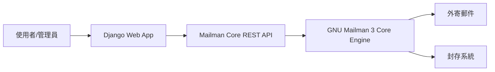

# Postorius：GNU Mailman 3 的 Web 管理介面

Postorius 是 GNU Mailman 3 郵件列表系統的官方 Web 使用者介面，以 Django Python Web 框架開發，提供現代化的圖形化管理功能。[^proj]

## 概覽

Postorius 的核心定位是「The New Mailman Web UI」——取代舊版 Mailman 2 基於 Python CGI 的 Web 介面，為郵件列表管理員與一般使用者提供直觀的操作面板。[^proj]

Postorius 透過 Mailman Core 的 REST API 進行通訊，這是一個僅限 localhost 存取的 admin API，不直接暴露於公網。[^arch]

## 歷史與背景

Postorius 最初由 Anna Senarclens de Grancy 與 Benedict Stein 在 2010 與 2011 年的 Google Summer of Code 期間開發。[^docs] 專案於 2015 年 6 月 8 日建立 GitLab 儲存庫，至今累積超過 3,286 次提交、5 個分支、35 個標籤與 5 個釋出版本。[^proj]

## 技術架構

- **語言**：Python（84.9%）、HTML（13.4%），少量 Makefile、JavaScript、CSS[^proj]
- **框架**：Django 4.2+[^docs]
- **Python 版本**：3.9+[^docs]
- **後端需求**：GNU Mailman 3.3.10+[^docs]
- **授權**：GNU GPLv3[^proj]
- **通訊方式**：透過 Mailman Core 的 REST API 進行管理操作[^arch]

## 核心功能

| 功能類別 | 說明 |
|---------|------|
| 郵件列表管理 | 建立、刪除、設定 mailing list 的各項參數 |
| 會員管理 | 管理訂閱者、 moderator、擁有者等角色 |
| 審核管理 | 處理待審核郵件、管理審核規則鏈 |
| 領域管理 | 管理多個 email domain 的列表配置 |
| 模板系統 | 自訂郵件樣板與通知內容 |
| 使用者設定 | 個人偏好、密碼管理、訂閱清單 |

Postorius 管理的對象對應到 Mailman Core 的資料模型：
- **Mailing List**——郵件列表的核心配置物件，關聯到特定 domain[^arch]
- **User**——代表一個人，可連結多個 email address[^arch]
- **Address**——單一 email 地址，需驗證後才能收信[^arch]
- **Member**——使用者訂閱列表的關係，包含 regular、digest、owner、moderator 等角色[^arch]

## 與 HyperKitty 的關係

在 GNU Mailman 3 生態系中，Postorius 與 **HyperKitty** 分工明確：
- **Postorius**：專注於列表管理（建立、設定、會員、審核）
- **HyperKitty**：專注於郵件封存瀏覽與搜尋

兩者皆為 Django 應用，共用同一套使用者認證系統。

## 部署方式

Postorius 通常作為 GNU Mailman Suite 的一部分部署，官方推薦透過 pip 安裝並搭配 Gunicorn / uWSGI 等 WSGI 伺服器運行。詳細安裝說明請參閱 [docs.mailman3.org](https://docs.mailman3.org/)。[^docs]

## 參考資料

[^proj]: Free Software Foundation. (n.d.). *GNU Mailman / Postorius*. GitLab. Retrieved 2026-09-20, from https://gitlab.com/mailman/postorius
[^docs]: Free Software Foundation. (n.d.). *Postorius - Web UI for GNU Mailman*. Retrieved 2026-09-20, from https://docs.mailman3.org/projects/postorius/en/latest/
[^arch]: Free Software Foundation. (n.d.). *Mailman 3 Core architecture*. Retrieved 2026-09-20, from https://docs.mailman3.org/projects/mailman/en/latest/src/mailman/docs/architecture.html