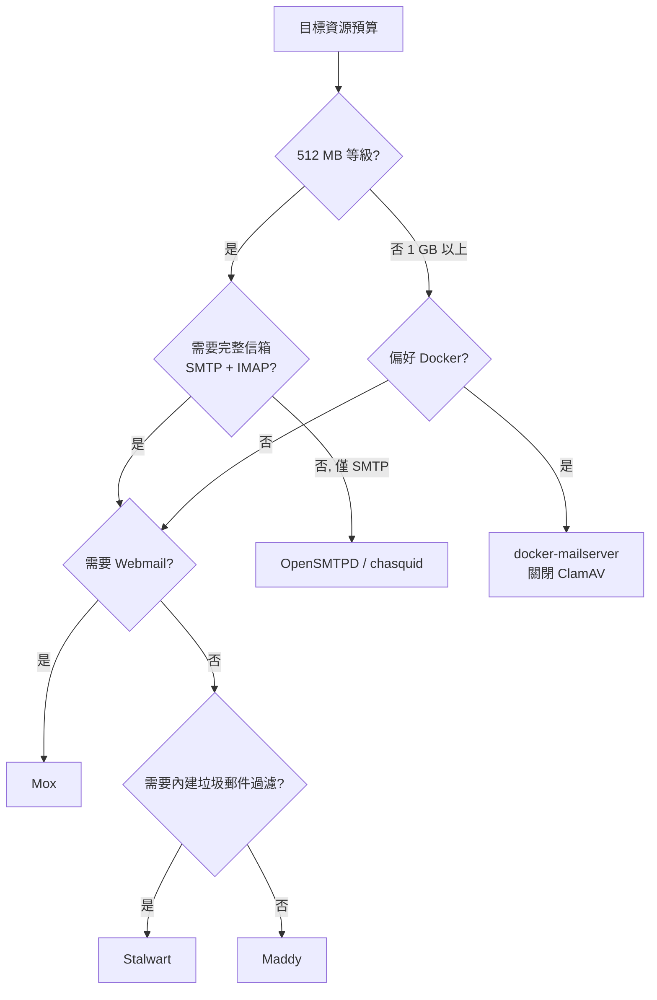

# 輕量級 FOSS 郵件伺服器研究報告（低資源取向）

## 概述

本報告聚焦於**低資源環境**（如 512 MB – 1 GB RAM 的 VPS、樹莓派、迷你主機）可运行的自由開源（FOSS）郵件伺服器。評估重點依序為：記憶體使用量、單一二進位/零依賴程度、功能完整性（SMTP/IMAP/POP3/Webmail），以及部署複雜度。

**核心結論**：若目標是完整信箱（SMTP + IMAP）且資源有限，**Stalwart** 與 **Maddy** 是目前最務實的兩個選擇；需要內建 Webmail 且不想外掛元件時選 **Mox**；若只求極簡 SMTP 轉送則 **OpenSMTPD** 或 **chasquid** 最省資源。所有 DNS/DKIM/SPF/DMARC 設定與寄送信譽（deliverability）問題會消耗比軟體本身更多的精力，此部分與軟體選擇無關[^maddy-faq]。

---

## 資源消耗關鍵事實

低資源維度下的主要記憶體殺手並非郵件伺服器本身，而是**附加元件**：

- **ClamAV 防毒**：將完整病毒特徵庫載入 RAM，光此一項約 **850 MB 且持續成長**；docker-mailserver 官方警告若完全無法使用 swap，則需 3 GB RAM[^dms-faq]。
- **Rspamd 垃圾郵件過濾**：約需額外 200–500 MB RAM（maddy 官方建議整合 rspamd 作為 spam 檢查時會帶來此開銷）[^maddy-faq]。
- **資料庫服務**（MySQL/PostgreSQL/MongoDB）：單獨一個 daemon 即可吃掉數百 MB，是低資源環境的大敵。

因此「單一二進位、無外部資料庫依賴」的伺服器，在低資源場景具有決定性優勢。

---

## 候選方案比較

### 1. Stalwart Mail Server — 低資源完整方案首選

- **語言/授權**：Rust / AGPL v3.0（社群版）
- **部署形態**：單一二進位、Docker、Kubernetes
- **記憶體**：閒置約 **100 MB**；官方文件明示「5–10 個使用者的典型部署，1 GB RAM 即足夠」[^stalwart-req]
- **功能**：SMTP + IMAP4 + POP3 + **JMAP** + ManageSieve；內建垃圾郵件過濾（不需外掛 rspamd/SpamAssassin）；SPF/DKIM/DMARC/DANE/MTA-STS；內建 Web 管理後台；可插拔儲存（SQLite/PostgreSQL/MySQL/RocksDB 等）；全文檢索
- **限制**：AGPL 授權較嚴格；記憶體可透過縮減並發連線數與 cache 大小進一步調校[^stalwart-req]
- **GitHub Stars**：~14.7k（2026-09 查得）[^gh-stalwart]

**評價**：唯一「把垃圾郵件過濾也內建」的輕量單一程式，省去 rspamd 的記憶體開銷，是 512 MB – 1 GB 環境下功能最完整的選擇。

---

### 2. Maddy Mail Server — 最純粹的單一守護行程

- **語言/授權**：Go / GPL v3.0
- **部署形態**：單一二進位（預設組態除 libc 外**無任何依賴**，不需 Docker、不需資料庫服務，SQLite 為選用）[^maddy-faq]
- **記憶體**：維護者 foxcpp 於 2021 年明確表示：「預設組態下建議至少提供 **800 MB**，但大部分時間只會用到約 **200 MB**」[^maddy-gh359]；官方 FAQ 亦稱個人小伺服器只需約 **1 GiB** RAM 與磁碟空間[^maddy-faq]
- **功能**：SMTP（MTA + MX）+ Submission + IMAP4rev1（**Beta 品質**）；原生 DKIM/SPF/DMARC/DANE/MTA-STS；可整合 rspamd 過濾；Prometheus 指標
- **限制**：無 POP3、無 Webmail、無 Web 管理介面（純 CLI）；IMAP 儲存仍為 Beta，追求極致穩定者官方建議配對 Dovecot 使用；由單一開發者維護（bus factor = 1）[^maddy-faq][^sm]
- **GitHub Stars**：~6.1k

**評價**：行政負擔最低的「一支程式頂替 Postfix+Dovecot+OpenDKIM」方案，適合偏好 CLI 與零依賴的技術使用者。

---

### 3. Mox — 內建 Webmail 的完整方案

- **語言/授權**：Go / MIT
- **部署形態**：單一二進位，**無任何依賴**；`mox quickstart` 指令 10 分鐘內完成設定[^mox]
- **記憶體**：與 Maddy/Stalwart 同屬 Go/Rust 單進程等級，無官方公佈數值，但無資料庫、無外掛服務，實測屬低資源類別
- **功能**：SMTP + IMAP4 + **內建 Webmail** + 名聲式與內容式垃圾郵件過濾；SPF/DKIM/DMARC/MTA-STS/DANE/DNSSEC；ACME/Let's Encrypt 自動 TLS；Web 管理介面
- **限制**：版本號仍為 v0.0.x（最新 v0.0.17，2026-08-19 釋出），屬持續快速演進中的專案[^mox]
- **GitHub Stars**：~5.9k（2026-09 查得）[^gh-mox]

**評價**：想要「單一程式 + 免查設定、開箱即有 Webmail」時的最佳選擇；NLnet 基金會資助、具 fuzz 測試，程式品質受肯定[^mox]。

---

### 4. OpenSMTPD — 極簡 SMTP 轉送

- **語言/授權**：C / ISC（OpenBSD 專案出品，隨 OpenBSD 基礎系統提供）
- **部署形態**：小 C daemon，Linux 上 `apt install opensmtpd` 即可
- **記憶體**：官方設計目標即為「把記憶體、CPU 與磁碟需求壓到最低」[^wiki-osp];實際為數十 MB 等級；樹莓派等級硬體可輕鬆運行
- **功能**：純 **SMTP**（RFC 5321 MTA），無 IMAP/POP3——需自行配對 Dovecot 才成完整信箱；設定檔極簡（約 10 行）；可透過 filter 掛載 rspamd/SpamAssassin
- **限制**：功能面刻意保守（較不適合特殊/冷門需求）；2020 年曾爆出遠端程式碼執行漏洞 CVE-2020-7247（已修復）[^wiki-osp]
- **版本**：7.8（2025-10 釋出）

**評價**：只求 SMTP 收發/轉送的最省資源選項；但要湊齊 IMAP + Webmail 時，節省下來的記憶體會被 Dovecot 等吃掉一部分。

---

### 5. chasquid — 極簡 SMTP（Go）

- **語言/授權**：Go / Apache 2.0
- **部署形態**：單一二進位；官方定位「主要為個人與小團體設計」[^chasquid]
- **功能**：純 SMTP（收/寄/轉送、aliases、virtual domains），無 IMAP——同樣需配對 Dovecot
- **GitHub Stars**：~1.0k

**評價**：OpenSMTPD 的現代 Go 替代品，設定簡單、安全預設值佳；官方文件亦明確提及搭配 Dovecot 的架構[^chasquid]。

---

### 6. docker-mailserver (DMS) — 可接受的 Docker 選項

- **語言/授權**：Shell 設定檔驅動（Postfix + Dovecot）/ MIT
- **部署形態**：單一 Docker 容器；無 SQL 資料庫（檔案系統即資料庫）；無 Web UI[^dms-faq]
- **記憶體（官方 FAQ）**：建議組態 2 GB RAM + swap；**最低 512 MB RAM**（前提：關閉預設停用的 ClamAV 等服務）[^dms-faq]
- **GitHub Stars**：~18.9k（社群最活躍）

**評價**：想用 Postfix/Dovecot 這套 20 年成熟軟體、又偏好 Docker/IaC 時的首選；512 MB 可行但需刻意關閉防毒與垃圾郵件功能。

---

### 7. Mailu — 全功能但偏重

- **語言/授權**：Python + 多容器（Postfix/Dovecot/Rspamd/ClamAV）/ MIT
- **記憶體（官方文件）**：不含 ClamAV → 最低 **1 GB RAM + 1 GB swap**；含 ClamAV → **3 GB RAM + 1 GB swap**[^mailu-req]
- **功能**：SMTP/IMAP/POP3 + Roundcube Webmail + 管理後台 + Rspamd，一套到底
- **評價**：功能完整、設定容易，但 1 GB 地板 + Docker 引擎開銷使其**不適合 512 MB VPS**，1 GB 環境也偏緊。

---

### 8. 不建議用於低資源的方案

| 方案 | 原因 |
|------|------|
| **WildDuck**（Node.js） | 需 MongoDB + Redis + Haraka + ZoneMTA，2 GB+ 起跳；官方明示適合 1000+ 帳號水平擴展場景[^wd] |
| **iRedMail** | 官方要求含防毒/垃圾郵件時至少 **4 GB RAM**[^iredmail]；ClamAV 單獨即可壓垮 4 GB 主機 |
| **Mail-in-a-Box** | 一鍵腳本但佔用整臺機器、最低 2 GB RAM，且極度捆綁 |
| **Mailcow** | 約 15 個容器，建議 4–6 GB RAM |

---

## 低資源決策流程

---

## 記憶體使用量速查

| 方案 | 閒置記憶體 | 1 GB 環境可行性 | 完整信箱 | 內建 Webmail | 內建垃圾郵件過濾 |
|------|------------|----------------|----------|--------------|------------------|
| **Stalwart** | ~100 MB[^stalwart-req] | ✅ 官方背書（5–10 人） | ✅ SMTP/IMAP/POP3/JMAP | ✅ 管理後台 | ✅ 內建 |
| **Maddy** | ~200 MB（建議上限 800 MB）[^maddy-gh359] | ✅ 官方背書（1 GiB） | ✅ SMTP/IMAP（Beta） | ❌ | ❌（可掛 rspamd） |
| **Mox** | 低（單進程，未公佈） | ✅（同級單一程式） | ✅ SMTP/IMAP | ✅ | ✅ 內建 |
| **OpenSMTPD** | 數十 MB[^wiki-osp] | ✅ | ❌ 僅 SMTP（要配 Dovecot） | ❌ | ❌（filter 掛載） |
| **chasquid** | 低（單進程）[^chasquid] | ✅ | ❌ 僅 SMTP（要配 Dovecot） | ❌ | ❌ |
| **docker-mailserver** | 容器 ~350 MB（關防毒）至 850 MB+（開 ClamAV）[^dms-faq] | ⚠️ 最低 512 MB、建議 2 GB | ✅ | ❌ | ❌（Rspamd 可選） |
| **Mailu** | 官方最低 1 GB + swap[^mailu-req] | ⚠️ 偏緊 | ✅ | ✅ Roundcube | ✅ Rspamd |
| **WildDuck** | 2 GB+（Mongo/Redis）[^wd] | ❌ | ✅ | 分離應用 | ❌ |
| **iRedMail** | 4 GB+[^iredmail] | ❌ | ✅ | ✅ | ✅ |

> 註：本表數值皆為廠商/維護者公開發表之估計，網路並無跨方案的同條件記憶體基準測試可資比較。

---

## 注意事項

1. **垃圾郵件/防毒是最大記憶體開銷**：低資源部署建議關閉 ClamAV、或使用 Stalwart 的內建過濾來取代 Rspamd[^dms-faq][^maddy-faq]。
2. **寄送信譽（deliverability）與軟體無關**：PTR、SPF、DKIM、DMARC、IP 暖身、埠 25 開放與否，才是自架郵件的成敗關鍵[^maddy-faq]。
3. **成熟度取捨**：Maddy/Stalwart/Mox 皆為「比較新但記憶體安全語言撰寫」的程式，官方均坦言可能比 20 年歷史的 Postfix/Dovecot 有較多 bug[^maddy-faq]；追求極致穩定者可選擇 Postfix+Dovecot 組合（各自約數十 MB）但需自行整合 DKIM 等元件。

---

## 參考資料

[^maddy-faq]: Maddy Mail Server. (n.d.). *Frequently Asked Questions*. Retrieved 2026-09-20, from https://maddy.email/faq/

[^maddy-gh359]: foxcpp. (2021). *Comment on "What is the minimal requirement to run maddy?"* (GitHub Discussion #359, 2021-06-20). Retrieved 2026-09-20, from https://github.com/foxcpp/maddy/discussions/359

[^stalwart-req]: Stalwart Labs. (n.d.). *System Requirements — Stalwart Documentation*. Retrieved 2026-09-20, from https://stalw.art/docs/install/requirements/

[^mox]: Mox. (n.d.). *Mox — modern, secure, all-in-one email server*. Retrieved 2026-09-20, from https://www.xmox.nl/

[^gh-mox]: GitHub — mjl-/mox. (n.d.). *mox repository metadata*. Retrieved 2026-09-20, from https://api.github.com/repos/mjl-/mox

[^gh-stalwart]: GitHub — stalwartlabs/stalwart. (n.d.). *stalwart repository metadata*. Retrieved 2026-09-20, from https://api.github.com/repos/stalwartlabs/stalwart

[^wiki-osp]: Wikipedia. (n.d.). *OpenSMTPD*. Retrieved 2026-09-20, from https://en.wikipedia.org/wiki/OpenSMTPD

[^chasquid]: Chasquid. (n.d.). *chasquid — SMTP server with a focus on simplicity & security* (blitiri.com.ar). Retrieved 2026-09-20, from https://blitiri.com.ar/p/chasquid/

[^dms-faq]: Docker Mailserver. (n.d.). *FAQ — What are the system requirements?*. Retrieved 2026-09-20, from https://docker-mailserver.github.io/docker-mailserver/latest/faq/

[^mailu-req]: Mailu. (n.d.). *Docker compose requirements — Hardware considerations*. Retrieved 2026-09-20, from https://mailu.io/master/compose/requirements.html

[^wd]: GitHub — zone-eu/wildduck. (n.d.). *WildDuck Mail Server*. Retrieved 2026-09-20, from https://github.com/zone-eu/wildduck

[^iredmail]: iRedMail. (n.d.). *iRedMail Easy Installation*. Retrieved 2026-09-20, from https://docs.iredmail.org/install.ee.html

[^sm]: GitHub — foxcpp/maddy. (n.d.). *Maddy Mail Server*. Retrieved 2026-09-20, from https://github.com/foxcpp/maddy