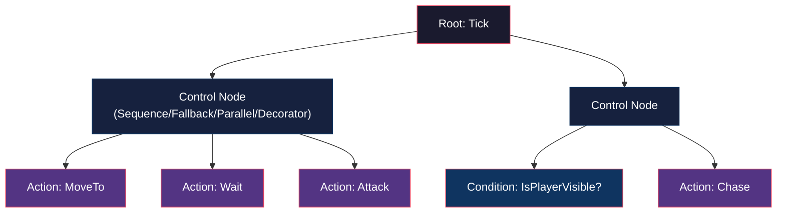
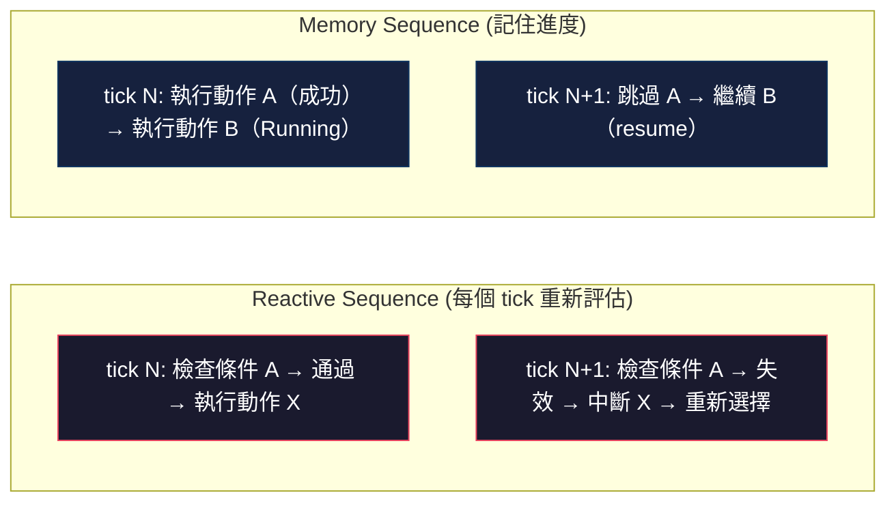
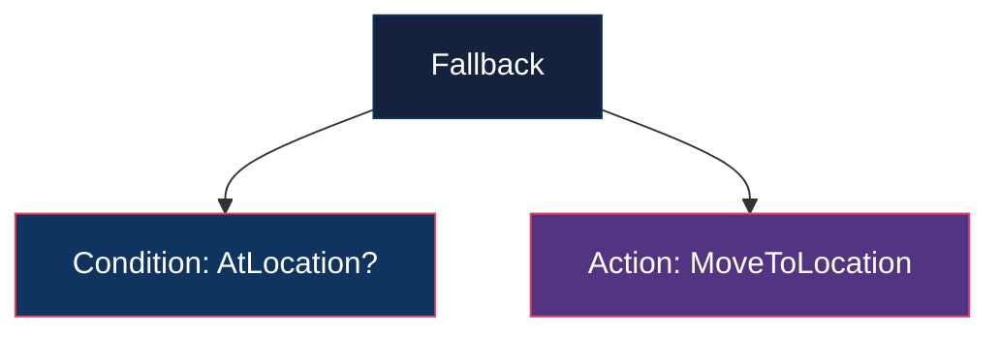
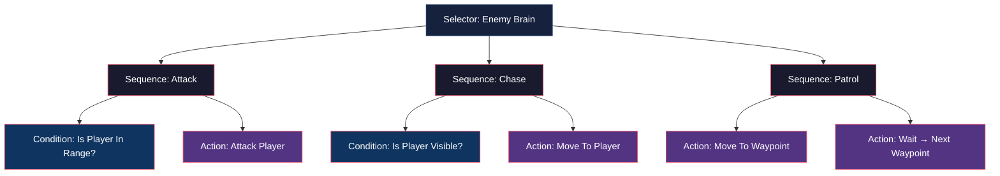
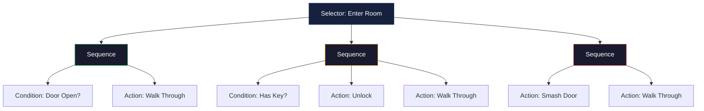
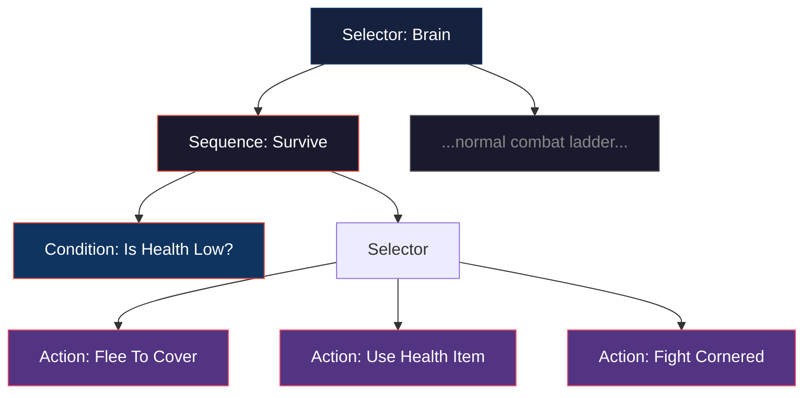
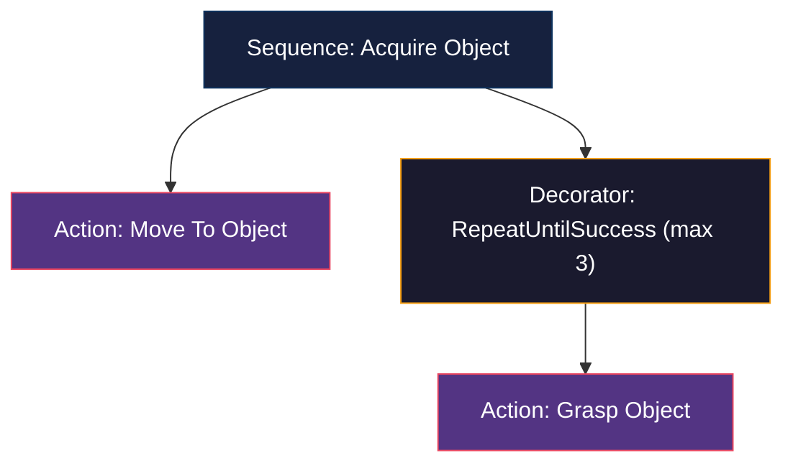
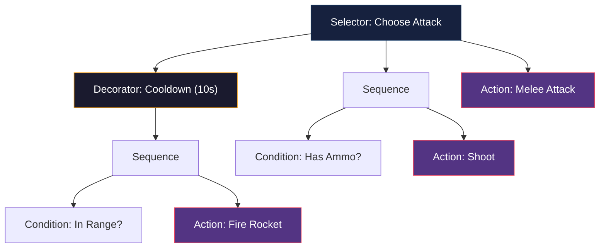
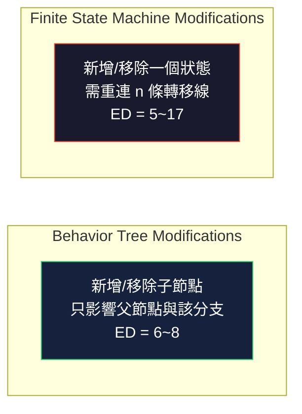

# Behavior Tree 領域知識調查報告

> 本報告聚焦 Behavior Tree（行為樹）作為一種**控制架構與設計方法論**的領域知識，而非特定引擎或框架的實作 API。所有事實均以 Web 搜尋及來源閱讀為基礎，依改良版 APA 格式（ISO 8601 日期）標記引用[^robohub-intro][^btree-learn]，完整參考資料見文末。

---

## 什麼是 Behavior Tree？

Behavior Tree（BT）是一種用於建構自主代理人（autonomous agent）決策邏輯的控制架構，最初源自電腦遊戲產業（NPC AI 建模），後來被機器人學領域廣泛採用，作為有限狀態機（FSM）的替代方案[^robohub-intro][^arxiv-bt-vs-fsm][^colledanchise-book]。它是一棵有向樹（directed rooted tree），由根節點開始，以**深度優先前序走訪**的方式被週期性地 **tick**（時脈驅動的遞迴走訪），直到抵達終端狀態；樹中的每個節點在被 tick 後會向其父節點回傳 **Success**、**Failure** 或 **Running** 三種狀態之一[^robohub-intro][^arxiv-bt-vs-fsm][^colledanchise-book]。

BT 的核心價值在於其**模組性（modularity）** 與**反應性（reactivity）**：由於每個節點都有相同的回傳介面，每一棵子樹都可視為獨立的建構單元，可任意搬移、重用而不破壞整體政策結構；Running 狀態則允許整棵樹在每次 tick 時被邏輯性地重新評估，使高優先級行為能自動中斷（preempt）正在執行的低優先級行為[^robohub-intro][^arxiv-bt-vs-fsm][^bt-cpp-docs][^colledanchise-book]。

---

# 第一部分：核心知識模組

## 1. 節點類型與語義

BT 的節點可區分為內部節點（控制節點）與葉節點（執行節點）兩大類[^robohub-intro][^colledanchise-book]。

### 控制節點（Control Nodes）——內部節點，決定走訪邏輯

| 節點 | 行為 | 邏輯類比 |
|------|------|----------|
| **Sequence（序列）** | 依序執行所有子節點；任一子節點回傳 Failure 即回傳 Failure；全部成功才回傳 Success | AND[^robohub-intro][^arxiv-bt-vs-fsm][^alpha-bionic-guide] |
| **Fallback / Selector（選擇器）** | 依序嘗試子節點；任一子節點回傳 Success 即停止並回傳 Success；全部失敗才回傳 Failure。是設計復原行為（recovery behavior）的關鍵節點 | OR，用於表達優先級[^robohub-intro][^arxiv-bt-vs-fsm][^alpha-bionic-guide] |
| **Parallel（並行）** | 在每次 tick 中依序 tick 所有子節點；依設定的 M-of-N 閾值（1 到 N 之間）決定成功/失敗 | 並行閘控[^robohub-intro][^colledanchise-book] |
| **Decorator（修飾器）** | 只有一個子節點，以自訂政策修改其回傳值或行為（如反轉 invert、重試 retry、逾時 timeout、限制頻率等） | 策略注入[^robohub-intro][^colledanchise-book] |

### 執行節點（Execution Nodes）——葉節點，連接實際行為

| 節點 | 行為 | 關鍵特性 |
|------|------|----------|
| **Action（動作）** | 執行具體行為（移動、抓取、攻擊等），可跨多個 tick | 回傳 Running 表示進行中[^robohub-intro][^arxiv-bt-vs-fsm][^colledanchise-book] |
| **Condition（條件）** | 在單一 tick 內瞬間檢查狀態（感測器回饋、內部變數），僅回傳 Success/Failure | 需快速、無副作用[^robohub-intro][^arxiv-bt-vs-fsm][^alpha-bionic-guide] |

> **關鍵區別**：Action 可以跨 tick 執行（回傳 Running），Condition 必須在單一 tick 內完成[^robohub-intro][^colledanchise-book]。這正是 BT 與 Decision Tree（決策樹）最根本的差異——Decision Tree 每次評估後立即結束，而 Running 狀態讓 BT 能執行跨越多個 tick 的長期任務[^arxiv-bt-vs-fsm][^colledanchise-book]。

## 2. Reactive vs Memory 節點

| 類型 | 行為 | 使用時機 |
|------|------|----------|
| **Reactive（反應式）** | 每次 tick 都從頭重新評估所有子節點 | 前置條件必須持續成立的場合（如「定位是否可靠？」）[^bt-cpp-docs][^alpha-bionic-guide] |
| **Memory（有記憶）** | 記住上次執行到哪個子節點，直接 resume 該子節點 | 已完成的工作不需要重複檢查（如「已走到門口」）[^bt-cpp-docs][^alpha-bionic-guide] |

**設計取捨**：Reactive 節點提高反應速度，但頻繁重估可能浪費計算資源或重啟進行中的動作；Memory 節點提高效率與連續性，但可能基於過時的假設繼續執行。核心語義問題是：「這個條件在動作執行期間是否必須持續成立？」若是，則應重新評估（Reactive）或透過獨立的監督機制監控[^alpha-bionic-guide]。

## 3. Blackboard（黑板）——節點間資料共享

所有節點透過一個共享的「黑板」傳遞資料[^btree-learn][^bt-cpp-docs][^alpha-bionic-guide]：

- 內容包括：目標座標、錯誤碼、狀態資訊、感測器讀數、路徑等
- Key-Value 儲存；在 BehaviorTree.CPP 中由型別安全的 **Typed Ports** 實作，Unreal Engine 亦內建 Blackboard 機制[^bt-cpp-docs][^unreal-bt]
- 生命週期管理：全域作用域 vs 子樹作用域（key scoping）[^btree-learn]

Blackboard 是所有嚴肅 BT 框架的標準資料通訊模式，正確使用 Blackboard（以及避免其常見陷阱：共享可變狀態、key 命名衝突、作用域洩漏）是設計大型 BT 的關鍵[^btree-learn][^bt-cpp-docs][^alpha-bionic-guide]。

---

# 第二部分：進階設計知識與模式

## 4. Explicit Success Conditions（明確成功條件）

經典設計原則（定義於 Colledanchise & Ögren 的教科書）：**執行前先檢查（check before you act）**[^robohub-intro][^colledanchise-book]。使用 Fallback 節點將條件節點放在 Action 之前：

當條件已滿足時（例如機器人已位於目標位置），條件節點回傳 Success，Fallback 直接回傳 Success，跳過耗時的 Action。這個模式大幅減少不必要的執行[^robohub-intro]。

## 5. Priority Ladder（優先級階梯）——最常見的 BT 模式

遊戲 AI 中最基本的敵人行為骨架：根節點是 Selector，子樹依優先度從高到低排列[^btree-patterns]：

每一個分支都由其條件守衛（guard condition）保護；先通過守衛的分支贏得本次 tick[^btree-patterns]。最低優先級分支無前置條件，是不受條件保護的兜底分支，因此整棵樹永不失敗[^btree-patterns]。

## 6. Fallback Chain（選擇鏈）——逐步升級策略

當一個目標有多種達成方式時，將策略由最便宜/最安全向最昂貴/最危險排列[^btree-patterns]：

機器人學中的**復原子樹（recovery subtree）** 採用完全相同的結構（以 ROS 2 Nav2 導航堆疊為代表）：先 replan（重新規劃路線）→ 再清除 sensor 地圖 → 最後備份重試，每一層都包在 Selector（Fallback）下，依序升級嘗試[^btree-patterns][^alpha-bionic-guide]。

## 7. Survival Override（生存中斷）

最高優先級的獨立分支，檢查生命/電量等關鍵資源，自動中斷所有低優先級行為[^btree-patterns]：

由於 Selector 每個 tick 都重新評估（Reactive），一旦血量降低，樹會自動放棄正在執行的戰鬥子樹，此機制不需要任何手動轉換邏輯——這正是 BT 在處理中斷上優於狀態機的原因[^btree-patterns]。（若希望在逃跑期間禁止攻擊，可再以 Inverter 包覆血量檢查條件。）[^btree-patterns]

## 8. Retry with Limits（限制重試）

使用 Retry/RepeatUntilSuccess 等 Decorator 控制重試次數，而非在程式碼中寫迴圈[^btree-patterns][^alpha-bionic-guide]：

此模式可層層組合：單一抓取包在重試 Decorator 下 → 包在會先重新定位的 Sequence 內 → 再包在重試耗盡後轉向求助的 Selector 之下。每一層錯誤處理都透過樹的結構可視化，而非隱藏在實作程式中[^btree-patterns]。

## 9. Cooldown-Gated Actions（冷卻閘控）

使用 Limiter/Cooldown Decorator 控制昂貴/特殊行為的觸發頻率，使選擇節點依「可用性」自動偏好高價值行為[^btree-patterns]：

AI 在冷卻結束時自動「偏好」使用特殊技能，否則退而求其次使用普通攻擊。設計師只需調整冷卻時間與子節點順序即可調校遊戲體驗，不需修改程式碼[^btree-patterns]。注意：Cooldown 應掛在 Sequence 上而非條件上，否則失敗的範圍檢查也會觸發冷卻[^btree-patterns]。

---

# 第三部分：Behavior Tree vs Finite State Machine

## 比較總表

| 面向 | Behavior Tree | Finite State Machine |
|------|---------------|---------------------|
| **模組化** | 優異：每棵子樹獨立可重用；Cyclomatic Complexity = 1[^arxiv-bt-vs-fsm][^ieee-modularize] | 差：狀態轉移是 GoTo 式（Dijkstra 視為有害的結構），難以獨立增刪狀態[^arxiv-bt-vs-fsm] |
| **反應性** | 原生支援：每次 tick 從樹根重新評估，高優先級自然中斷[^arxiv-bt-vs-fsm][^colledanchise-book] | 需手動添加大量轉移線，反應式 FSM 常常變成全連接圖（fully connected graphs）[^arxiv-bt-vs-fsm] |
| **可讀性** | 高：樹狀結構直觀反映決策邏輯與條件，圖形表示即具語意[^robohub-intro][^arxiv-bt-vs-fsm][^bt-cpp-docs] | 中：少量狀態時直觀，複雜時轉移圖難以追蹤[^arxiv-bt-vs-fsm][^queenofsquiggles] |
| **擴展性** | 強：子樹可任意組合，增刪不影響其他分支；同質介面使每棵子樹可獨立測試[^robohub-intro][^arxiv-bt-vs-fsm][^colledanchise-book] | 弱：新狀態需處理所有相關轉移；HFSM 的階層常需手工建構，只是把模組化問題移到內層[^arxiv-bt-vs-fsm] |
| **中斷行為** | 自動透過重新評估與優先級機制處理搶佔[^btree-patterns][^arxiv-bt-vs-fsm] | 需明確定義優先級與搶佔轉移[^arxiv-bt-vs-fsm] |
| **執行模型** | 函式呼叫式：子節點完成後返回父節點繼續執行[^arxiv-bt-vs-fsm] | GoTo 跳躍式：執行流在狀態之間直接跳轉[^arxiv-bt-vs-fsm] |
| **並行處理** | Parallel 節點原生支援[^robohub-intro][^colledanchise-book] | 需平行組合（parallel composition），組合後狀態數呈組合爆炸，常只能以符號形式表示、喪失可讀性[^arxiv-bt-vs-fsm] |

## 形式化分析

Colledanchise & Ögren 於 2016 年在 IEEE Transactions on Robotics 發表的論文以數學方法證明：BT 具備**結構化介面（structural interfaces）**，每一棵子樹都是一個 BT、單一動作是 BT 的退化情況，因此 BT 轉換為圖形後其 **Cyclomatic Complexity（圈複雜度）為 1**——這是在模組化指標下的最優值[^arxiv-bt-vs-fsm][^ieee-modularize]。相比之下，FSM 缺乏結構化介面，除非強制加上結構（如 HFSM），否則不被視為模組化[^arxiv-bt-vs-fsm][^ieee-modularize]。同一研究亦證明了 BT 如何統括（generalize）subsumption architecture、決策樹與 sequential behavior composition 等既有架構[^ieee-modularize]。

**實證結論**（Iovino et al., 2024）：在以行動操作機器人進行的實作比較中，機器人的任務行為表現與政策表示無關，但在**模組性、反應性、可讀性**三項指標下，隨著任務複雜度增加，維護 BT 比維護 FSM 容易得多[^arxiv-bt-vs-fsm]。另一方面，學術上也承認 FSM 更具表達力（可基於內部變數與過往決策建構行為），而 BT 因每次重新從根評估而更具反應性與可讀性[^arxiv-bt-vs-fsm]。

---

# 第四部分：遊戲 AI vs 機器人學的差異

| 面向 | 遊戲 AI | 機器人學 |
|------|---------|----------|
| **代表性框架** | Unreal Engine 內建 BT、Unity Behavior、Behavior Designer[^btree-learn][^unreal-bt][^millington-ai] | BehaviorTree.CPP、py_trees、ROS 2 Nav2[^bt-cpp-docs][^alpha-bionic-guide][^colledanchise-book] |
| **關鍵挑戰** | 視覺化設計、設計師可用性、非程式設計師協作[^unreal-bt][^millington-ai] | 非同步動作、安全取消（halt）、硬體整合、即時性[^bt-cpp-docs][^alpha-bionic-guide][^colledanchise-book] |
| **通訊機制** | Blackboard（Unreal 內建，可搭配 Service 節點）[^btree-learn][^unreal-bt] | Typed Ports（編譯期型別安全）[^bt-cpp-docs][^alpha-bionic-guide] |
| **重要特性** | Service（服務）節點、Decorator/Condition 之分、視覺化編輯器[^unreal-bt] | 非阻塞 Action、halt/cancellation 語義、logging/profiling 基礎建設[^bt-cpp-docs][^alpha-bionic-guide] |
| **樹的定義** | 編輯器中視覺化編輯，需考量設計師工作流[^btree-learn][^unreal-bt] | XML 定義並在執行期載入，支援 plugin 動態載入[^bt-cpp-docs] |
| **狀態持久化** | 較少關注（NPC 生命週期短）[^millington-ai] | 需要任務恢復、錯誤日誌、狀態重播（replay）[^bt-cpp-docs][^alpha-bionic-guide] |
| **取消語義** | 通常不需精細處理[^millington-ai] | 至關重要：停止 tick 不等於安全中止長期動作[^alpha-bionic-guide][^colledanchise-book] |

> **機器人學延伸需求**：BT 在機器人學中不只是決策邏輯，還需處理非同步感測器輸入、可安全取消的長期動作（halt 語義）、任務恢復與 profiling/重播除錯——這些需求直接催生了 BehaviorTree.CPP 的設計（非同步 Action 為一級公民、XML 執行期載入、logging/profiling 基礎建設）[^bt-cpp-docs][^alpha-bionic-guide]。此外，機器人學文獻強調 BT 應負責「協調」既有能力（感知、規劃、馬達控制、獨立安全系統），而非取代它們[^alpha-bionic-guide]。

---

# 第五部分：常見陷阱與設計原則

## 十大常見錯誤

以下陷阱主要取材自 Game AI Pro 3 第 9 章 *Overcoming Pitfalls in Behavior Tree Design* 與機器人學實務文獻[^alpha-bionic-guide][^gameaipro-pitfalls]：

1. **所有邏輯都用自訂 Decorator / 自訂節點**：應優先使用標準控制節點組合（Sequence、Fallback、Parallel、通用 Decorator），自訂節點降低可讀性與可理解性[^alpha-bionic-guide][^gameaipro-pitfalls]
2. **混淆 Failure 與軟體錯誤**：Failure 是預期的狀態（如「找不到路徑」）；「相機驅動 crash」這種操作錯誤應由日誌、升級機制與任務監控處理，不應混入 BT 的 Failure 狀態[^alpha-bionic-guide]
3. **Long-running Action 未支援取消**：停止 tick 不等於安全中止；需要實作 halt 語義來確保資源正確釋放[^alpha-bionic-guide][^colledanchise-book]
4. **Condition 節點帶副作用**：條件節點不應發起網路請求、修改狀態或阻塞等待感測器；昂貴的感知應在獨立元件中持續更新狀態，BT 條件只讀取該狀態[^alpha-bionic-guide]
5. **過度嵌套 Decorator**：retry → timeout → invert → force-status 層層嵌套後，實際行為在審查時難以推斷[^alpha-bionic-guide]
6. **未區分 Reactive vs Memory**：全部用 Reactive 會浪費計算或重啟動作；全部用 Memory 會忽略必須持續成立的條件變化[^bt-cpp-docs][^alpha-bionic-guide]
7. **單棵樹過大**：超過 30 個節點應抽成子樹（subtree）、參數化葉節點並訂命名慣例，否則無法維護[^btree-learn][^alpha-bionic-guide]
8. **Parallel 節點資源競爭**：兩個子節點同時控制移動底座等共享資源，會把 race condition 偽裝成整齊的圖表；Parallel 分支需要明確的資源歸屬與取消規則[^alpha-bionic-guide]
9. **Condition 順序錯誤**：在 Selector 中應把最安全/最偏好的方案放前面；在 Sequence 中前置條件檢查放前面，避免不必要的動作[^btree-patterns][^alpha-bionic-guide]
10. **在 BT 中實作 ML/規劃演算法**：BT 負責協調，不應替代路徑規劃、馬達控制或獨立安全系統[^alpha-bionic-guide]

## 設計原則

- **明確成功條件（Explicit Success Conditions）**：執行前先檢查[^robohub-intro][^colledanchise-book]
- **子樹獨立測試**：每個子樹應可獨立運作與驗證；模組化確保每個建構單元可單獨測試[^arxiv-bt-vs-fsm][^colledanchise-book]
- **單一職責**：每個 Action 節點負責一項具體行為[^alpha-bionic-guide]
- **窄介面（narrow contract）**：Action 節點應有型別安全的輸入、可觀察的輸出、文件化的失敗原因與可預測的 halt 行為[^alpha-bionic-guide]
- **優先使用標準節點**：Sequence、Fallback、Parallel 和通用 Decorator 即可表達絕大多數邏輯，標準節點應被推到極限再考慮客製[^alpha-bionic-guide][^gameaipro-pitfalls]
- **從 outcome 而非 node type 出發**：先定義「這個行為在什麼條件下成功/失敗」（mission、priorities、failure policy），再選擇節點類型[^alpha-bionic-guide]

---

# 第六部分：推薦學習路徑

## 階段一：基礎概念（1–2 週）

1. 閱讀 Robohub 的 [Introduction to behavior trees](https://robohub.org/introduction-to-behavior-trees/)——最清晰的入門文章，含完整術語表[^robohub-intro]
2. 閱讀 [behaviortrees.com 的入門系列](https://www.behaviortrees.com/learn/)——附線上編輯器，可邊讀邊改真實樹[^btree-learn]
3. 理解 6 種節點的 tick 回傳語義與執行流程[^robohub-intro][^colledanchise-book]
4. 用行為樹編輯器畫一棵簡單的 patrol → chase → attack 樹[^btree-learn][^btree-patterns]

**驗收標準**：能解釋一棵 BT 在每個 tick 的走訪路徑和狀態轉換[^robohub-intro][^colledanchise-book]。

## 階段二：設計模式與框架熟悉（2–3 週）

1. 閱讀 [5 Common Game AI Patterns](https://www.behaviortrees.com/learn/behavior-tree-examples/)[^btree-patterns]
2. 理解 priority ladder、fallback chain、survival override 等模式[^btree-patterns]
3. 學習 Reactive vs Memory 節點的取捨[^bt-cpp-docs][^alpha-bionic-guide]
4. 閱讀 Game AI Pro 的 [Overcoming Pitfalls in Behavior Tree Design](http://www.gameaipro.com/GameAIPro3/GameAIPro3_Chapter09_Overcoming_Pitfalls_in_Behavior_Tree_Design.pdf)[^gameaipro-pitfalls]
5. 比較 FSM 與 BT（閱讀 [Iovino et al. 2024 比較論文](https://arxiv.org/html/2405.16137v1) 或 [behaviortrees.com 比較文章](https://www.behaviortrees.com/learn/behavior-trees-vs-state-machines/)）[^btree-learn][^arxiv-bt-vs-fsm]
6. 選一個框架（py_trees 或 BehaviorTree.CPP）建立第一個實際專案[^bt-cpp-docs][^alpha-bionic-guide]

**驗收標準**：能獨立設計一棵包含條件守衛、復原邏輯和優先級中斷的 BT[^btree-patterns][^alpha-bionic-guide]。

## 階段三：形式理論與比較（3–4 週）

1. **精讀教科書**：Colledanchise & Ögren 的 *Behavior Trees in Robotics and AI: An Introduction*
   - 出版社版本：CRC Press（2018）[^colledanchise-book]
   - arXiv 開放版本：https://arxiv.org/abs/1709.00084[^colledanchise-book]
   - 重點：BT 定義與語義、模組化分析、安全性與穩健性[^colledanchise-book]
2. 理解 BT 的模組化形式分析（Cyclomatic Complexity = 1）[^arxiv-bt-vs-fsm][^ieee-modularize]
3. 理解 BT 如何 Generalize Subsumption Architecture、Decision Tree 與 Sequential Behavior Composition[^ieee-modularize]
4. 閱讀比較論文：[Comparison between BTs and FSMs](https://arxiv.org/html/2405.16137v1)（Iovino et al., 2024）[^arxiv-bt-vs-fsm]
5. 閱讀綜述論文：[A Survey of Behavior Trees in Robotics and AI](https://www.sciencedirect.com/science/article/pii/S0921889022000513)（Iovino et al., 2022）[^survey-bt]

**驗收標準**：能從形式化角度解釋 BT 為何比 FSM 更具模組性，以及 Running 狀態的理論意義[^arxiv-bt-vs-fsm][^colledanchise-book]。

## 階段四：實作與深度應用（平行進行）

1. **手寫迷你 BT runtime**（約 100 行）：Status 列舉、Sequence、Selector（含 Memory 變體）、Invert Decorator[^btree-learn][^bt-cpp-docs]
2. **BehaviorTree.CPP**：學習非同步 Action、XML 定義、Blackboard with ports、logging/profiling[^bt-cpp-docs]
3. **ROS 2 整合**：BT + ROS 2 action server、Nav2 navigation stack[^bt-cpp-docs][^alpha-bionic-guide]
4. **py_trees**：快速原型、ASCII tree 視覺化、py_trees_ros 整合[^btree-learn][^alpha-bionic-guide]
5. **遊戲引擎整合**：Unreal BT（內建系統、含 Service/Decorator/Condition 之分）[^unreal-bt]、Unity Behavior（官方）/ Behavior Designer（第三方）[^btree-learn]

**驗收標準**：能在目標平台上獨立建構一個包含條件守衛、中斷、復原和並行行為的完整系統[^btree-patterns][^alpha-bionic-guide]。

---

# 第七部分：必備參考資源

## 教科書（按優先級排列）[^btree-learn][^colledanchise-book]

| 書名 | 作者 | 適合 |
|------|------|------|
| **Behavior Trees in Robotics and AI: An Introduction** | Michele Colledanchise, Petter Ögren（CRC Press, 2018）[^colledanchise-book] | **必讀**——BT 領域的標準教科書，從形式理論到實作 |
| **AI for Games, Third Edition** | Ian Millington（CRC Press, 2019）[^millington-ai] | 遊戲 AI 領域標準教材，涵蓋決策與行為樹 |
| **Programming Game AI by Example** | Mat Buckland（Wordware, 2005）[^buckland-ai] | 經典動手入門書 |

## 關鍵論文

| 論文 | 作者 | 貢獻 |
|------|------|------|
| [How Behavior Trees Modularize Hybrid Control Systems](https://ieeexplore.ieee.org/document/7790863) | Colledanchise & Ögren（IEEE TRO, 2016）[^ieee-modularize] | 形式證明了 BT 的模組化特性並統括多種既有架構 |
| [A Survey of Behavior Trees in Robotics and AI](https://www.sciencedirect.com/science/article/pii/S0921889022000513) | Iovino et al.（Robotics and Autonomous Systems, 2022）[^survey-bt] | 最全面的 BT 綜述 |
| [Behavior Trees in Robot Control Systems](https://www.annualreviews.org/doi/pdf/10.1146/annurev-control-042920-095314) | Ögren & Petrovskaya（Annual Review of Control, 2021）[^control-survey] | 控制理論視角的 BT 分析（arXiv 開放版）[^control-arxiv] |
| [Comparison between Behavior Trees and Finite State Machines](https://arxiv.org/html/2405.16137v1) | Iovino et al.（arXiv, 2024）[^arxiv-bt-vs-fsm] | 提出反應性/模組性/可讀性指標並實作比較 |

## 線上資源

- [behaviortrees.com](https://www.behaviortrees.com/learn/)——附線上編輯器的實戰指南，12 篇文章從入門到進階[^btree-learn]
- [BehaviorTree.CPP 官方文件](https://www.behaviortree.dev/docs/intro/)——C++ 工業級框架[^bt-cpp-docs]
- [KTH 線上研討會](https://www.kth.se/profile/petter/page/behavior-trees-in-robotics-online-seminars)——Petter Ögren 主辦的學術研討會[^kth-seminars]
- [Unreal Engine 官方 BT 教學（Behavior Tree Theory）](https://dev.epicgames.com/community/learning/tutorials/qzZ2/unreal-engine-behavior-tree-theory)[^unreal-bt]
- [Game AI Pro 系列](http://www.gameaipro.com/)——免費線上遊戲 AI 專業書籍（含 BT 設計陷阱章節）[^gameaipro-pitfalls]

## 開源實作

| 專案 | 語言 | 特色 |
|------|------|------|
| [BehaviorTree.CPP](https://github.com/BehaviorTree/BehaviorTree.CPP) | C++ | 工業級、非同步 Action、XML tree、plugin、ROS 2 整合[^bt-cpp-docs] |
| [py_trees](https://github.com/splintered-reality/py_trees) | Python | 快速原型、ASCII 可視化、py_trees_ros 整合[^btree-learn][^alpha-bionic-guide] |
| [behavior3](https://github.com/behavior3/) | JavaScript | 輕量級、瀏覽器編輯器（behaviortrees.com 編輯器基於 behavior3editor）[^btree-learn] |

## 論壇與社群

- [Reddit r/gamedev：FSM vs BT 討論串](https://www.reddit.com/r/gamedev/comments/11p5cv8/im_currently_studying_on_difference_between_fsm/)
- [Queen of Squiggles：Behaviour Trees versus State Machines](https://queenofsquiggles.github.io/guides/fsm-vs-bt/)[^queenofsquiggles]
- [Opsive：Behavior Trees or Finite State Machines](https://opsive.com/support/documentation/behavior-designer/behavior-trees-or-finite-state-machines/)
- [Game Developer：Behavior trees for AI: How they work](https://www.gamedeveloper.com/programming/behavior-trees-for-ai-how-they-work)（2014 經典入門）
- [Sandgarden：Hierarchical Structures That Govern AI Decision-Making Logic](https://www.sandgarden.com/learn/behavior-trees)

---

# 核心摘要

學習 Behavior Tree 的核心在於理解其**設計哲學**——不是學某個框架的 API，而是學「如何用模組化的樹狀結構來表達決策邏輯」[^robohub-intro][^colledanchise-book]：

- **Tick 驅動**：不是事件驅動，而是週期性評估；每個 tick 都是一次完整的決策重評估[^robohub-intro][^colledanchise-book]
- **三態回傳**：Success / Failure / Running 構成了組合語義，Running 是 BT 表達力與反應性的關鍵[^robohub-intro][^arxiv-bt-vs-fsm][^colledanchise-book]
- **組合優先於客製**：標準控制節點（Sequence、Fallback、Parallel、Decorator）能表達絕大多數邏輯[^alpha-bionic-guide][^gameaipro-pitfalls]
- **層級式設計**：子樹可獨立開發、測試、重用；Cyclomatic Complexity = 1[^arxiv-bt-vs-fsm][^colledanchise-book][^ieee-modularize]
- **形式化基礎**：模組性、反應性、安全性皆可量化和數學證明[^colledanchise-book][^ieee-modularize][^control-survey]
- **失敗優先**：好的 BT 設計從處理失敗開始（Fallback 鏈、復原策略、降級行為），而非只考慮 happy path[^robohub-intro][^btree-patterns][^alpha-bionic-guide]

當你脫離了框架思維、能用一棵樹從 root 到 leaf 推演出整個 agent 的決策路徑、並且知道何時該用 Reactive 何時該用 Memory、知道如何設計復原策略而不讓條件四散各處——那時你就真正理解了 Behavior Tree[^alpha-bionic-guide][^colledanchise-book]。

---

# 參考資料

[^robohub-intro]: Castro, S. (2021). *Introduction to behavior trees*. Robohub. Retrieved 2026-09-20, from https://robohub.org/introduction-to-behavior-trees/

[^btree-learn]: behaviortrees.com. *Learn Behavior Trees: Guides for Game AI and Robotics*. Retrieved 2026-09-20, from https://www.behaviortrees.com/learn/

[^btree-patterns]: behaviortrees.com. *Behavior Tree Examples: Common Game AI Patterns*. Retrieved 2026-09-20, from https://www.behaviortrees.com/learn/behavior-tree-examples/

[^arxiv-bt-vs-fsm]: Iovino, M., Förster, J., Falco, P., Chung, J. J., Siegwart, R., & Smith, C. (2024). *Comparison between Behavior Trees and Finite State Machines*. arXiv:2405.16137. Retrieved 2026-09-20, from https://arxiv.org/html/2405.16137v1

[^bt-cpp-docs]: Auryn Robotics. *BehaviorTree.CPP Documentation: About*. Retrieved 2026-09-20, from https://www.behaviortree.dev/docs/intro/

[^alpha-bionic-guide]: Nuss, N. (2026). *Behavior Trees in Robotics: The Complete Practical Guide*. Alpha Bionic. Retrieved 2026-09-20, from https://alpha-bionic.info/en/behavior-trees-in-robotics-guide/

[^gameaipro-pitfalls]: Simpson, C. *Overcoming Pitfalls in Behavior Tree Design*. Game AI Pro 3, Chapter 9. CRC Press. Retrieved 2026-09-20, from http://www.gameaipro.com/GameAIPro3/GameAIPro3_Chapter09_Overcoming_Pitfalls_in_Behavior_Tree_Design.pdf

[^colledanchise-book]: Colledanchise, M., & Ögren, P. (2018). *Behavior Trees in Robotics and AI: An Introduction*. CRC Press. arXiv 開放版本: https://arxiv.org/abs/1709.00084

[^ieee-modularize]: Colledanchise, M., & Ögren, P. (2016). *How Behavior Trees Modularize Hybrid Control Systems and Generalize Sequential Behavior Compositions, the Subsumption Architecture, and Decision Trees*. IEEE Transactions on Robotics, 33(2), 372–389. Retrieved 2026-09-20, from https://ieeexplore.ieee.org/document/7790863

[^survey-bt]: Iovino, M., Scukins, E., Styrud, J., Ögren, P., & Smith, C. (2022). *A survey of Behavior Trees in robotics and AI*. Robotics and Autonomous Systems, 154, 104096. Retrieved 2026-09-20, from https://www.sciencedirect.com/science/article/pii/S0921889022000513

[^control-survey]: Ögren, P., & Petrovskaya, A. (2022). *Behavior Trees in Robot Control Systems*. Annual Review of Control, Robotics, and Autonomous Systems, 5. Retrieved 2026-09-20, from https://www.annualreviews.org/doi/pdf/10.1146/annurev-control-042920-095314

[^control-arxiv]: Ögren, P. (2022). *Behavior Trees in Robot Control Systems*. arXiv:2203.13083. Retrieved 2026-09-20, from https://arxiv.org/html/2203.13083v1

[^kth-seminars]: Ögren, P. *Behavior Trees in Robotics Online Seminars*. KTH Royal Institute of Technology. Retrieved 2026-09-20, from https://www.kth.se/profile/petter/page/behavior-trees-in-robotics-online-seminars

[^unreal-bt]: Epic Games. *Behavior Tree Theory*. Epic Developer Community. Retrieved 2026-09-20, from https://dev.epicgames.com/community/learning/tutorials/qzZ2/unreal-engine-behavior-tree-theory

[^millington-ai]: Millington, I. (2019). *AI for Games, Third Edition*. CRC Press. https://doi.org/10.1201/9781351053303

[^buckland-ai]: Buckland, M. (2005). *Programming Game AI by Example*. Wordware Publishing.

[^queenofsquiggles]: Queen of Squiggles (2023). *Behaviour Trees versus State Machines*. Retrieved 2026-09-20, from https://queenofsquiggles.github.io/guides/fsm-vs-bt/