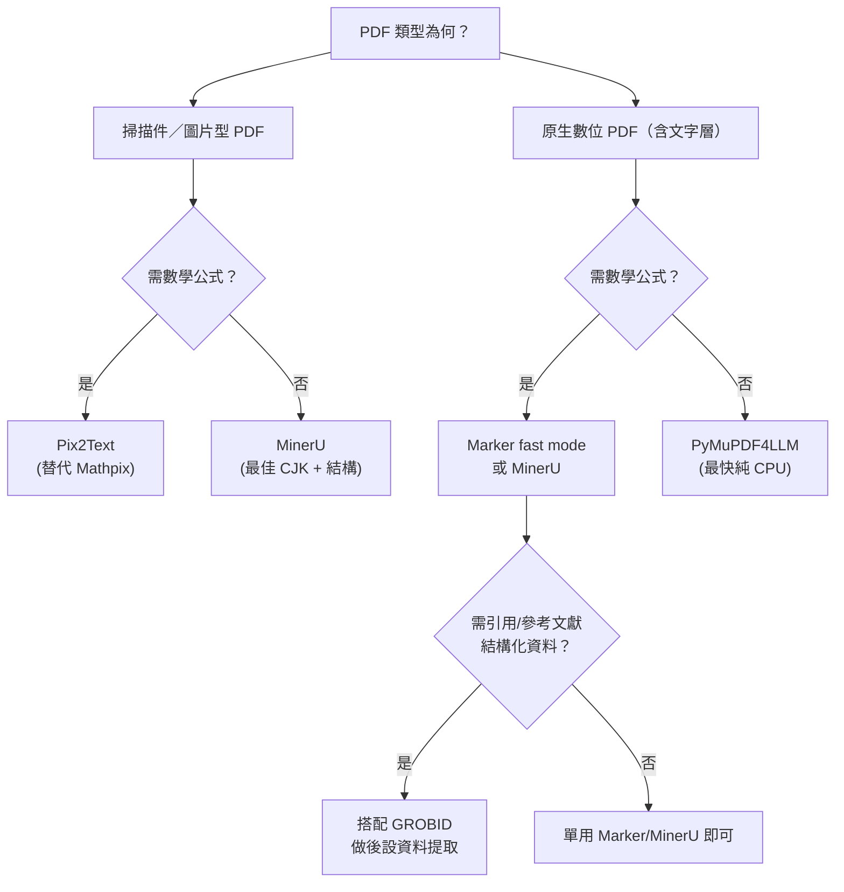

# 學術論文 PDF 轉 Markdown — FOSS 工具調查（CPU only，無 CUDA）

## 概述

學術論文 PDF 轉 Markdown 的需求在近年由於 RAG（檢索增強生成）和 LLM 應用而大幅增加，出現了大量開源工具。本報告聚焦**不需要 CUDA（NVIDIA GPU）**即可運作的工具，涵蓋純 CPU 推論、無 ML 模型、以及可選 GPU 加速但不強制依賴 CUDA 的解決方案。

---

## 工具一覽

### 1. Marker — 綜合推薦（CPU 模式）[^marker]

| 屬性 | 內容 |
|---|---|
| 倉庫 | `github.com/datalab-to/marker` |
| ⭐ | ~40k |
| 語言 | Python 3.10+ / PyTorch |
| 介面 | CLI (`marker_single`)、Streamlit GUI (`marker_gui`)、FastAPI server (`marker_server`)、Python library (`PdfConverter`) |
| 許可證 | 程式碼 Apache-2.0；模型權重 modified OpenRAIL-M（營收 <500 萬美金可免費使用） |

**CPU 支援程度**：✅ 優秀。Marker 2 版本起有專屬 `fast` 模式，使用輕量級 rf-detr 佈局模型（2000 萬參數），CPU 上可達 ~23.7 頁/秒。`--disable_ocr` 模式完全不啟動推論伺服器，純靠文字層提取。

**學術論文功能**：
- 數學公式：`fast` 模式僅使用 PDF 文字層（品質有限，arXiv 數學類別得分 23.4）；`balanced` 模式（需 GPU）使用 VLM OCR 可達 83.9
- 表格：文字層重建為 HTML `<table>`，掃描件表格 fallback 到 VLM
- 引用/參考文獻：以文字形式保留
- 圖片：自動提取並儲存
- 頁首頁尾：自動去除

**安裝**：`pip install marker-pdf`，需額外安裝 `llama.cpp` 的 `llama-server` 二進位檔。

**注意事項**：若不關閉 OCR，Marker 仍會啟動 llama.cpp 作為 VLM 後端（可在 CPU 上以 Vulkan 模式運行）。純文字 PDF 搭配 `--disable_ocr` 則完全不需 ML。

---

### 2. MinerU — 最佳學術結構保留（CPU 預設支援）[^mineru]

| 屬性 | 內容 |
|---|---|
| 倉庫 | `github.com/opendatalab/MinerU` |
| ⭐ | ~80k |
| 語言 | Python 3.10–3.14 |
| 介面 | CLI (`mineru`/`mineru-kit`)、Python SDK (`DoclibClient`)、Gradio WebUI、API Server |
| 許可證 | 程式碼 AGPL-3.0（模型另計） |

**CPU 支援程度**：✅ 最佳。MinerU 4.0 預設安裝**完全不需要 NVIDIA GPU**——小型模型使用 ONNX CPU 推論，VLM 使用 llama.cpp 的 Vulkan 模式運作。GPU 僅在安裝 `mineru[full]` 時用於最大吞吐量。

**學術論文功能**：
- 數學公式：✅ 最佳之一。公式檢測 + LaTeX 輸出，支援行間公式編號
- 表格：✅ 業界頂尖。複雜表格以 HTML 輸出，包含儲存格合併、跨欄等
- 引用/參考文獻：保留版面定位，支援閱讀順序
- 圖片：自動提取並配對圖說
- 支援 84 種語言 OCR（中/日/韓文為所有工具中最強）
- 四層解析等級：Flash（快速預覽）、Basic（OCR/模型解析）、Standard/Advanced（最高品質）

**安裝**：`uv pip install -U "mineru>=4.0,<5"` 後執行 `mineru-kit parse paper.pdf -o paper.md --tier standard`

**注意事項**：AGPL 授權具 Copyleft 效應；CPU 模式比 GPU 慢很多；建議 16–32GB 系統記憶體。

---

### 3. Docling — IBM Research 出品，MIT 授權 [^docling]

| 屬性 | 內容 |
|---|---|
| 倉庫 | `github.com/docling-project/docling` |
| ⭐ | ~67k |
| 語言 | Python 3.10+ / PyTorch |
| 介面 | CLI (`docling`)、Python library (`DocumentConverter`)、API server (`docling-serve`)、MCP server |
| 許可證 | MIT（程式碼） |

**CPU 支援程度**：✅ 可運作但偏慢。安裝時指定 CPU 版 PyTorch 即可純 CPU 運行。GPU 選用而非必需。

**學術論文功能**：
- 數學公式：⚠️ 基礎支援，不如 Marker/MinerU 成熟
- 表格：✅ 良好。TableFormer 模型處理表格結構
- 引用/參考文獻：❌ 尚未實作（路線圖中）
- 圖片：支援分類與圖說處理
- 頁面佈局/閱讀順序/程式碼區塊：✅

**安裝**：`pip install docling`，CPU 版需加 `--extra-index-url https://download.pytorch.org/whl/cpu`

**注意事項**：olmOCR-bench 總分 50.3（落後 Marker/MinerU），但 MIT 授權無商業限制是其最大優勢。

---

### 4. PyMuPDF4LLM — 最快純 CPU 方案（無 ML 模型）[^pymupdf4llm]

| 屬性 | 內容 |
|---|---|
| 倉庫 | `github.com/pymupdf/pymupdf4llm` |
| ⭐ | ~2k |
| 語言 | Python（底層 C，MuPDF 引擎） |
| 介面 | Python library（主要） |
| 許可證 | AGPL-3.0 |

**CPU 支援程度**：✅✅✅ 完全不需要 GPU、雲端 API 或 Token。零 ML 模型，純規則引擎。速度為 vision-model 管線的約 10 倍。

**學術論文功能**：
- 數學公式：❌ 無法辨識（數學變成亂碼文字）
- 表格：✅ 原生 PDF 表格偵測良好，輸出 GitHub 相容 Markdown
- 引用/參考文獻：❌ 無特別處理
- 圖片：✅ 偵測並匯出
- 標題層級：透過字型大小自動產生 `#` 標題

**安裝**：`pip install pymupdf4llm`

**注意事項**：僅適用於原生（非掃描）PDF；無公式辨識能力使它在數學論文上用途有限；AGPL 授權需注意。

---

### 5. Pix2Text — 開源 Mathpix 替代品 [^pix2text]

| 屬性 | 內容 |
|---|---|
| 倉庫 | `github.com/breezedeus/Pix2Text` |
| ⭐ | ~3.2k |
| 語言 | Python |
| 介面 | Python library、CLI、HTTP service、macOS desktop app |
| 許可證 | MIT |

**CPU 支援程度**：✅ 設計上可在一般硬體運行。使用小型模型（DocLayout-YOLO、MFD-1.5、MFR-1.5），GPU 非必需。

**學術論文功能**：
- 數學公式：✅ 公式檢測 + 辨識轉 LaTeX，聲稱 SOTA
- 表格：✅ 表格辨識
- 文字：支援 80+ 語言（CnOCR/EasyOCR）
- 可將**完整 PDF（含掃描頁面）**轉為 Markdown

**安裝**：`pip install pix2text`（多語言加 `[multilingual]`）

---

### 6. Nougat — Meta 學術論文專用（CPU 可行但慢）[^nougat]

| 屬性 | 內容 |
|---|---|
| 倉庫 | `github.com/facebookresearch/nougat` |
| ⭐ | ~10k |
| 語言 | Python / PyTorch（Donut ViT 架構） |
| 介面 | CLI (`nougat`)、FastAPI (`nougat_api`) |
| 許可證 | 程式碼 MIT；**模型權重 CC-BY-NC（禁止商用）** |

**CPU 支援程度**：⚠️ 可在 CPU 運行（`--full-precision` 幫助有限），但官方文件直言「CPU 轉換非常慢」，實務上僅適合短文件。

**學術論文功能**：
- 數學公式：✅✅ 同類最佳。訓練於 arXiv + PMC，輸出 Mathpix 相容 Markdown (`.mmd`) 含 LaTeX 數學
- 表格：✅ 支援
- 引用：僅保留行內引用標記，無結構化解析
- 跨欄版面：✅ 自動還原

**注意事項**：CC-BY-NC 授權禁止商用；中文/俄文/日文論文失敗率高；CPU 上有 `[MISSING_PAGE]` 誤判問題（可用 `--no-skipping`）。

---

### 7. GROBID — 引用文獻/後設資料專家 [^grobid]

| 屬性 | 內容 |
|---|---|
| 倉庫 | `github.com/grobidOrg/grobid` |
| ⭐ | ~5k |
| 語言 | Java 21（Gradle 建置） |
| 介面 | REST web service、Docker、Java library、batch CLI |
| 許可證 | Apache-2.0 |

**CPU 支援程度**：✅ 預設 CRF 模型完全在 CPU 運作（官方 demo server 也是純 CPU）。CUDA GPU 僅供深度學習模型選用。

**學術論文功能**：
- 數學公式：❌ 非其專長（不轉錄公式）
- 表格：⚠️ 僅提供邊界座標
- 引用/參考文獻：✅✅ 業界標竿。參考文獻解析 F1 ~0.87–0.90，引用上下文解析 F1 0.76–0.91，DOI/PMID 整合 >0.95 F1
- 後設資料：作者、標題、摘要、所屬機構

**輸出格式**：TEI XML（非 Markdown，需用 XSLT 或 client 轉換）。GROBID 官方有 Markdown 輸出端點（`format=markdown`），但表格/圖說排版會遺失。

**安裝**：Docker `grobid/grobid` 或從原始碼建置（需 OpenJDK 21）

---

### 8. Pandoc — 通用文件轉換（**不能直接讀 PDF**）[^pandoc]

| 屬性 | 內容 |
|---|---|
| 倉庫 | `github.com/jgm/pandoc` |
| ⭐ | ~37k |
| 語言 | Haskell |
| 介面 | CLI |
| 許可證 | GPL-2.0+ |

**重要限制**：Pandoc 無法直接讀取 PDF 作為輸入——PDF 僅作為輸出格式存在。常見的 workaround 是 `pdftotext -layout input.pdf - | pandoc -f markdown -t gfm`，但這會**完全失去**方程式（LaTeX）、表格結構、閱讀順序與圖片。

**CPU 支援程度**：✅ 無 ML，資源消耗極低。

**學術適用性**：❌ 不適合直接轉換學術 PDF。但適合將 LaTeX 原始碼轉為 Markdown，或作為其他工具（如 GROBID）的後處理器。

---

### 9. 其他值得一提的工具

| 工具 | 倉庫 | CPU | 數學 | 備註 |
|---|---|---|---|---|
| **MarkItDown** | `github.com/microsoft/markitdown` | ✅ 純 CPU | ❌ | 僅 pdfminer 文字提取，無版面/公式 |
| **pdf2md** | `github.com/opengovsg/pdf2md` | ✅ 純 CPU | ❌ | Node.js，基於 pdf.js，輕量 |
| **LaTeX-OCR (pix2tex)** | `github.com/lukas-blecher/LaTeX-OCR` | ⚠️ 慢 | ✅ | 僅公式圖片→LaTeX，非完整 PDF 工具 |
| **Unstructured** | `github.com/Unstructured-IO/unstructured` | ✅ | ❌ | 分區輸出，適合 RAG 管線 |
| **LiteParse** | `github.com/run-llama/liteparse` | ✅ 純 CPU | ❌ (0.0) | Rust 實作，完全無 ML 模型，不適合數學論文 |

---

## 效能基準（olmOCR-bench 總分）

| 工具 | 模式 | 總分 | 原生數位 | 速度 |
|---|---|---|---|---|
| Marker | balanced (GPU) | 76.0 | 83.5 | — |
| Marker | fast (CPU) | 43.6 | 55.8 | 23.7 pg/s |
| Marker | no-OCR (CPU) | — | 55.8 | 最快 CPU |
| MinerU | GPU pipeline | 72.7 | — | — |
| Docling | GPU | 50.3 | — | — |
| LiteParse | CPU | 39.6–42.2 | — | — |

資料來源：Marker 專案公布的 olmOCR-bench 比較結果[^marker]。

---

## 綜合建議

### 使用場景速查

| 場景 | 推薦工具 | 理由 |
|---|---|---|
| 數學論文，重視公式正確性 | **MinerU** 或 **Marker** (balanced) | MinerU ONNX CPU 預設支援；Marker 需 GPU 才達最佳 |
| 一般論文，快速轉 Markdown | **Marker** (fast 或 disable-ocr) | 品質/速度平衡最佳，Apache-2.0 程式碼 |
| 中文/日文/韓文論文 | **MinerU** | 84 語言 OCR，CJK 最強 |
| 純文字層 PDF，最快速度 | **PyMuPDF4LLM** | 約 vision 管線 10 倍快，無 ML 依賴 |
| 掃描論文，替代 Mathpix | **Pix2Text** | MIT 授權，公式辨識佳 |
| 參考文獻/引用分析 | **GROBID** | 業界標竿 F1 >0.87 |
| 無商業限制需求 | **Docling** (MIT) 或 **Marker** (Apache-2.0) | 注意 Nougat (CC-BY-NC) 與 MinerU (AGPL) |

---

## 參考資料

[^marker]: Datalab. (n.d.). *Marker — Convert PDF to Markdown Quickly and Accurately*. Retrieved 2026-09-20, from https://github.com/datalab-to/marker

[^mineru]: OpenDatalab. (n.d.). *MinerU — High-Quality PDF Parsing*. Retrieved 2026-09-20, from https://github.com/opendatalab/MinerU

[^docling]: IBM Research. (n.d.). *Docling — Document AI for RAG*. Retrieved 2026-09-20, from https://github.com/docling-project/docling

[^pymupdf4llm]: PyMuPDF Team. (n.d.). *PyMuPDF4LLM — PDF to Markdown for LLMs*. Retrieved 2026-09-20, from https://github.com/pymupdf/pymupdf4llm

[^pix2text]: Breezedeus. (n.d.). *Pix2Text — Open Source Mathpix Alternative*. Retrieved 2026-09-20, from https://github.com/breezedeus/Pix2Text

[^nougat]: Facebook Research. (n.d.). *Nougat — Neural Optical Understanding for Academic Documents*. Retrieved 2026-09-20, from https://github.com/facebookresearch/nougat

[^grobid]: Inria. (n.d.). *GROBID — GeneRation Of BIbliographic Data*. Retrieved 2026-09-20, from https://github.com/grobidOrg/grobid

[^pandoc]: MacFarlane, J. (n.d.). *Pandoc — A Universal Document Converter*. Retrieved 2026-09-20, from https://pandoc.org/MANUAL.html

[^markitdown]: Microsoft. (n.d.). *MarkItDown — Convert Files to Markdown*. Retrieved 2026-09-20, from https://github.com/microsoft/markitdown

[^liteparse]: LlamaIndex. (n.d.). *LiteParse — Fast, Model-Free PDF Parsing*. Retrieved 2026-09-20, from https://github.com/run-llama/liteparse