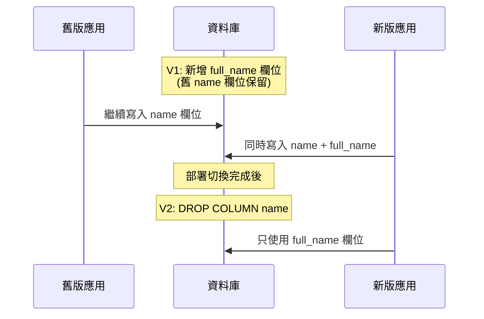

# 資料庫遷移實作計畫

> [!WARNING] 對齊失敗
> 需要 C++ 的計畫而不是 Typescript。

## 概述

本計畫提供一個輕量、無依賴的資料庫遷移 (Migration) 系統實作方針。核心假設是應用程式已具備 Query Builder 抽象層，遷移只實作「向上」(Up) 方向、不處理回退 (Down)，並在應用程式初始化階段執行。

## 核心架構

### 追蹤表 (Tracking Table)

系統需要在資料庫中維護一張記錄已執行遷移的表格，這是所有遷移框架（Flyway、Liquibase）的共通基礎[^flyway-history]。

```sql
CREATE TABLE IF NOT EXISTS schema_migrations (
    version     INTEGER PRIMARY KEY,
    name        TEXT NOT NULL,
    applied_at  TIMESTAMP DEFAULT CURRENT_TIMESTAMP
);
```

### 遷移定義 (Migration Data)

以純資料物件而非類別繼承的方式定義遷移，使 SQL 在 Code Review 中透明可讀[^bargsteen]。

```typescript
interface Migration {
  version: number;   // 版本號，決定執行順序
  name: string;      // 描述名稱
  sql: string;       // 純 SQL 字串
}
```

### Query Builder 介面

遷移系統對 Query Builder 的最小依賴只有三個操作，不需要 ORM 等級的抽象[^golangsqlx]：

```typescript
interface QueryBuilder {
  exec(sql: string, params?: any[]): Promise<void>;
  query(sql: string, params?: any[]): Promise<any[]>;
  transaction<T>(fn: (tx: QueryBuilder) => Promise<T>): Promise<T>;
}
```

## 核心演算法

整個遷移執行邏輯可濃縮為以下步驟：

```
1. 確保 schema_migrations 追蹤表存在
2. 查詢已執行的版本號集合
3. 篩選尚未執行的遷移，按版本遞增排序
4. 若無待執行遷移則結束
5. 逐一在交易中執行遷移 SQL + 寫入記錄
```

## 僅向上 (Up-Only) 的設計哲學

不實作向下遷移 (Down) 是業界已驗證的模式，並非偷工減料。

StackOverflow 的 Nick Craver 指出：「為什麼要回退？向前推進就好 (Why roll back when you can roll forward?)」[^gatlin]。Flyway 官方文件也推薦「向前推進」(rolling forward) 策略——以一個新的遷移來修正出錯的遷移，而非回退[^flyway-forward]。

### 向前推進模式

當某個遷移造成問題時，不要回退，而是撰寫修復遷移：

```sql
-- ❌ 錯誤的遷移 V3 已執行：DROP TABLE users;
-- ✅ 修正方式 V4：重建表格
CREATE TABLE users (id SERIAL PRIMARY KEY, email TEXT NOT NULL);
```

### Expand-Contract 模式

此模式是零停機 (Zero-Downtime) 部署的標準作法，與 Up-Only 完美搭配[^ink-horizon]：



## 初始化階段執行

### 啟動順序

遷移必須在應用程式開始提供服務前執行完畢，確保所有連線都在正確的 Schema 上運作[^k8s-migrations]。

```typescript
async function main() {
  const db = createQueryBuilder(config);

  // 在啟動伺服器之前執行遷移
  await runMigrations(db, allMigrations);

  const server = createServer(db);
  await server.listen(port);
}

main().catch(err => {
  console.error('初始化失敗，遷移錯誤:', err);
  process.exit(1); // 讓容器調度器重啟
});
```

### 崩潰即失敗 (Fail-Fast)

遷移失敗時應用程式必須終止啟動，不可在過期 Schema 上繼續運作。這避免了「殭屍服務」情境——以舊 Schema 提供服務的應用程式對應新版程式碼，可能造成資料損毀。

### 多執行個體併發 (Concurrency)

若有多個應用程式實例同時啟動（如 Kubernetes 擴展），需要鎖定機制避免衝突[^advisory-lock]：

```typescript
async function runMigrations(db: QueryBuilder, migrations: Migration[]) {
  const LOCK_ID = 20240101;

  if (db.supportsAdvisoryLocks) {
    await db.exec(`SELECT pg_advisory_lock(${LOCK_ID})`);
  }

  try {
    // ... 標準遷移邏輯 ...
  } finally {
    if (db.supportsAdvisoryLocks) {
      await db.exec(`SELECT pg_advisory_unlock(${LOCK_ID})`);
    }
  }
}
```

另一種選擇是透過 Kubernetes `initContainer` 將遷移抽離為獨立啟動步驟，等遷移完成後主容器才啟動[^k8s-migrations]。

## 完整實作範例

```typescript
// migrations.ts
import type { QueryBuilder } from './query-builder';

interface Migration {
  version: number;
  name: string;
  sql: string;
}

const allMigrations: Migration[] = [
  {
    version: 1,
    name: 'create_users',
    sql: `
      CREATE TABLE users (
        id SERIAL PRIMARY KEY,
        email VARCHAR(255) NOT NULL UNIQUE,
        name VARCHAR(100) NOT NULL,
        created_at TIMESTAMPTZ DEFAULT NOW()
      );
      CREATE INDEX idx_users_email ON users(email);
    `
  },
  {
    version: 2,
    name: 'add_posts',
    sql: `
      CREATE TABLE posts (
        id SERIAL PRIMARY KEY,
        user_id INTEGER NOT NULL REFERENCES users(id),
        title VARCHAR(200) NOT NULL,
        body TEXT,
        created_at TIMESTAMPTZ DEFAULT NOW()
      );
    `
  }
];

export async function runMigrations(db: QueryBuilder): Promise<void> {
  // 確保追蹤表存在
  await db.exec(`
    CREATE TABLE IF NOT EXISTS schema_migrations (
      version    INTEGER PRIMARY KEY,
      name       TEXT NOT NULL,
      applied_at TIMESTAMPTZ DEFAULT NOW()
    )
  `);

  // 查詢已應用的版本
  const applied = new Set(
    (await db.query('SELECT version FROM schema_migrations ORDER BY version'))
      .map(r => r.version)
  );

  // 篩選並排序待執行遷移
  const pending = allMigrations
    .filter(m => !applied.has(m.version))
    .sort((a, b) => a.version - b.version);

  if (pending.length === 0) return;

  console.log(`正在套用 ${pending.length} 個遷移...`);

  for (const m of pending) {
    await db.transaction(async (tx) => {
      await tx.exec(m.sql);
      await tx.exec(
        'INSERT INTO schema_migrations (version, name) VALUES ($1, $2)',
        [m.version, m.name]
      );
    });
    console.log(`  ✓ ${m.version}: ${m.name}`);
  }
}
```

## 設計決策摘要

| 層面 | 決策 | 理由 |
|------|------|------|
| 版本編號 | 遞增整數 (`1, 2, 3...`) | 簡單明確，Order 等於 Version |
| 遷移形式 | 純 SQL 字串 | 透明、可 Review、不受 Query Builder API 變動影響 |
| 原子性 | 遷移 SQL + 記錄 INSERT 在同一交易 | 遷移失敗自動 Rollback，不會殘留錯誤記錄 |
| 冪等性 | 靠追蹤表 | 同一遷移只會執行一次 |
| 回退 | 不實作 Down | 以向前推進取代回退，避免假安全網造成資料遺失 |
| 時機 | 啟動初始化階段 | 保證啟動前 Schema 已就緒 |
| 鎖定 | Advisory Lock (PostgreSQL) | 防止多實例同時執行同一個遷移 |
| 失敗處理 | 崩潰終止啟動 | 避免在過期 Schema 上運作 |

## 結論

此計畫提供一個不含第三方遷移函式庫、假設 Query Builder 存在、只向上不向下、並在初始化階段執行的資料庫遷移系統。其核心概念與 Flyway、Simple.Migrations 等成熟工具相同，差別只在於將遷移邏輯嵌入應用程式啟動流程而非獨立 CLI。

---

[^flyway-history]: Redgate. (n.d.). Flyway schema history table. Retrieved 2026-09-25, from https://documentation.red-gate.com/flyway/flyway-concepts/migrations/flyway-schema-history-table

[^bargsteen]: Bargsteen. (2020). Simple database migrations. Retrieved 2026-09-25, from https://bargsteen.com/posts/simple-database-migrations/

[^golangsqlx]: Shrivastava, S. (2025). Best database migration tools for Golang. Retrieved 2026-09-25, from https://dev.to/shrsv/best-database-migration-tools-for-golang-ajf

[^gatlin]: Gatlin. (2024). Up-only database migrations. Retrieved 2026-09-25, from https://www.gatlin.io/content/up-only-database-migrations

[^flyway-forward]: Redgate. (n.d.). Flyway migration concepts. Retrieved 2026-09-25, from https://documentation.red-gate.com/flyway/flyway-concepts/migrations

[^ink-horizon]: Ink & Horizon. (n.d.). Database migrations with zero downtime. Retrieved 2026-09-25, from https://www.inkandhorizon.com/blog/database-migrations-zero-downtime

[^k8s-migrations]: freeCodeCamp. (n.d.). How to run database migrations in Kubernetes. Retrieved 2026-09-25, from https://www.freecodecamp.org/news/how-to-run-database-migrations-in-kubernetes/

[^advisory-lock]: Canton, T. (n.d.). Simple.Migrations — advisory lock pattern. Retrieved 2026-09-25, from https://github.com/canton7/Simple.Migrations