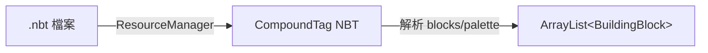
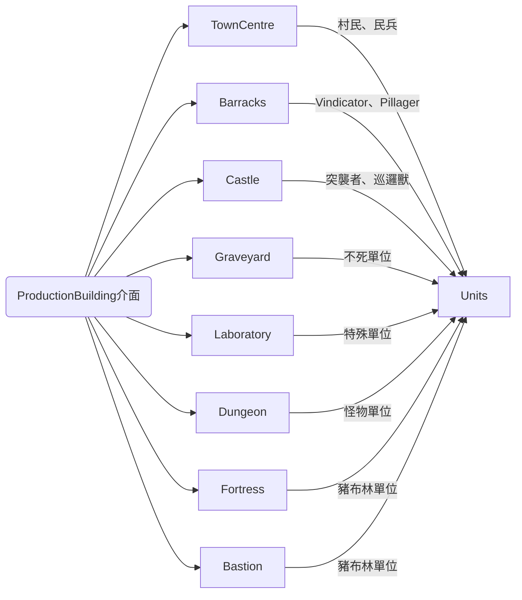

# Reign of Nether — RTS 建築物 3D 模型／檔案識別報告

> 本報告基於 GitHub 上 SoLegendary/reignofnether 儲存庫（分支 `1.20.1-dev`，快照時間 2026-09-22）進行調查，識別該 Minecraft 模組中所有 RTS 建築物的 3D 模型檔案、對應的 Java 類別、陣營分類及技術細節。[^repo]

[^repo]: SoLegendary. (n.d.). *reignofnether*. Retrieved 2026-09-22, from https://github.com/SoLegendary/reignofnether

---

## 1. 檔案總覽

每個 RTS 建築物由以下元件組成：[^tree]

| 元件 | 路徑 | 格式 | 說明 |
|------|------|------|------|
| **3D 結構模型（客戶端）** | `assets/reignofnether/structures/*.nbt` | NBT（結構方塊格式） | 建築物的方塊佈局，共 63 個檔案 |
| **3D 結構模型（伺服端）** | `data/reignofnether/structures/*.nbt` | NBT（結構方塊格式） | 同上，用於資料驅動載入，共 63 個檔案，內容與資產路徑完全一致 |
| **方塊模型** | `assets/reignofnether/models/block/*.json` | JSON（Minecraft 模型） | RTS 輔助方塊的外觀模型 |
| **物品模型** | `assets/reignofnether/models/item/*.json` | JSON（Minecraft 模型） | 生怪蛋、頭顱等物品外觀 |
| **Java 定義** | `src/main/java/.../building/buildings/<陣營>/*.java` | Java | 建築物的邏輯、屬性、生產列表 |
| **紋理** | `assets/reignofnether/textures/**/*.png` | PNG | 建築物相關紋理 |
| **方塊狀態** | `assets/reignofnether/blockstates/*.json` | JSON | 方塊狀態映射 |

[^tree]: GitHub API. (2026-09-22). *reignofnether Git Tree (1.20.1-dev)*. Retrieved 2026-09-22, from https://api.github.com/repos/SoLegendary/reignofnether/git/trees/1.20.1-dev?recursive=1

**共計：63 個 .nbt 結構檔（資料與 assets 各一份相同內容），約 60 個 Java 建築類別。**

---

## 2. 陣營分類

本模組共有 **4 個建築陣營 + 1 個通用類別**：[^buildings]

- **村莊（Villagers — `VILLAGERS`）** — 14 棟建築，15 個 .nbt 檔案
- **豬布林（Piglins — `PIGLINS`）** — 15 棟建築，15 個 .nbt 檔案
- **怪物（Monsters — `MONSTERS`）** — 16 棟建築，19 個 .nbt 檔案
- **中立（Neutral — `NONE`）** — 5 棟建築，10 個 .nbt 檔案
- **通用輔助方塊** — RTS 系統方塊

[^buildings]: SoLegendary. (n.d.). *reignofnether — src/main/java/com/solegendary/reignofnether/building/buildings/*. Retrieved 2026-09-22, from https://github.com/SoLegendary/reignofnether/tree/1.20.1-dev/src/main/java/com/solegendary/reignofnether/building/buildings

---

## 3. 各建築物詳細列表

### 3.1 村莊陣營（Villagers）

位於 `src/main/java/com/solegendary/reignofnether/building/buildings/villagers/`：[^villagers]

[^villagers]: SoLegendary. (n.d.). *reignofnether — villagers building classes*. Retrieved 2026-09-22, from https://github.com/SoLegendary/reignofnether/tree/1.20.1-dev/src/main/java/com/solegendary/reignofnether/building/buildings/villagers

| 建築物 | Java 類別 | `structureName` | .nbt 檔案 | 備註 |
|---------|----------|-----------------|-----------|------|
| 城鎮中心 | `TownCentre.java` | `town_centre` | `town_centre.nbt` | 首都建築，自帶 `NightSourceAddon` |
| 兵營 | `Barracks.java` | `barracks` | `barracks.nbt` | 生產 Vindicator、Pillager |
| 城堡 | `Castle.java` | `castle` | `castle.nbt` | 可駐軍 7 人，另有升級版 `castle_with_flag.nbt` |
| 鐵魔像建築 | `IronGolemBuilding.java` | `iron_golem` | `iron_golem.nbt` | 生產 Iron Golem 單位 |
| 黑森鐺 | `Blacksmith.java` | `blacksmith` | `blacksmith.nbt` | 有上級版 `blacksmith_superior.nbt` |
| 奧術塔 | `ArcaneTower.java` | `arcane_tower` | `arcane_tower.nbt` | 魔法防禦建築 |
| 圖書館 | `Library.java` | `library` | `library.nbt` | 有大型版 `library_grand.nbt` |
| 橡木橋 | `OakBridge.java` | `bridge_oak_orthogonal` / `bridge_oak_diagonal` | `bridge_oak_orthogonal.nbt`、`bridge_oak_diagonal.nbt` | 正交／對角線兩種形態 |
| 橡木倉庫 | `OakStockpile.java` | `stockpile_oak` | `stockpile_oak.nbt` | 資源儲存 |
| 繁榮祭壇 | `ShrineOfProsperity.java` | `shrine_of_prosperity` | `shrine_of_prosperity.nbt` | 增益建築 |
| 村民小屋 | `VillagerHouse.java` | `villager_house` | `villager_house.nbt` | 人口建築 |
| 村民市場 | `VillagerMarket.java` | `market_villagers` | `market_villagers.nbt` | 村民交易市場 |
| 瞭望塔 | `Watchtower.java` | `watchtower` | `watchtower.nbt` | 偵查／防禦 |
| 小麥農場 | `WheatFarm.java` | `wheat_farm` | `wheat_farm.nbt` | 食物生產 |
| 女巫小屋 | `WitchHut.java` | `witch_hut` | `witch_hut.nbt` | 女巫相關 |

### 3.2 豬布林陣營（Piglins）

位於 `src/main/java/com/solegendary/reignofnether/building/buildings/piglins/`：[^piglins]

[^piglins]: SoLegendary. (n.d.). *reignofnether — piglins building classes*. Retrieved 2026-09-22, from https://github.com/SoLegendary/reignofnether/tree/1.20.1-dev/src/main/java/com/solegendary/reignofnether/building/buildings/piglins

| 建築物 | Java 類別 | `structureName` | .nbt 檔案 | 備註 |
|---------|----------|-----------------|-----------|------|
| 堡壘 | `Bastion.java` | `bastion` | `bastion.nbt` | 核心堡壘 |
| 堡壘要塞 | `Fortress.java` | `fortress` | `fortress.nbt` | 高階防禦堡壘 |
| 中央傳送門 | `CentralPortal.java` | `central_portal` | `central_portal.nbt` | 核心傳送門 |
| 基礎傳送門 | `PortalBasic.java` | `portal_basic` | `portal_basic.nbt` | 基本傳送門 |
| 平民傳送門 | `PortalCivilian.java` | `portal_civilian` | `portal_civilian.nbt` | 平民傳送 |
| 軍事傳送門 | `PortalMilitary.java` | `portal_military` | `portal_military.nbt` | 軍事傳送 |
| 運輸傳送門 | `PortalTransport.java` | `portal_transport` | `portal_transport.nbt` | 運輸傳送 |
| 地獄傳送門 | `InfernalPortal.java` | `infernal_portal` | `infernal_portal.nbt` | 地獄傳送門 |
| 黑石橋 | `BlackstoneBridge.java` | `bridge_blackstone_orthogonal` / `bridge_blackstone_diagonal` | `bridge_blackstone_orthogonal.nbt`、`bridge_blackstone_diagonal.nbt` | 正交／對角線兩種形態 |
| 玄武岩泉 | `BasaltSprings.java` | `basalt_springs` | `basalt_springs.nbt` | 資源／環境建築 |
| 烈焰聖殿 | `FlameSanctuary.java` | `flame_sanctuary` | `flame_sanctuary.nbt` | 烈焰相關 |
| 野豬獸畜欄 | `HoglinStables.java` | `hoglin_stables` | `hoglin_stables.nbt` | 生產 Hoglin |
| 地獄疙瘩農場 | `NetherwartFarm.java` | `netherwart_farm` | `netherwart_farm.nbt` | 地獄疙瘩生產 |
| 豬布林市場 | `PiglinMarket.java` | `market_piglins` | `market_piglins.nbt` | 豬布林交易 |
| 凋零神殿 | `WitherShrine.java` | `wither_shrine` | `wither_shrine.nbt` | 凋零相關 |
| 抽象傳送門基底 | `AbstractPortal.java` | —（抽象類） | — | 所有傳送門的父類 |

### 3.3 怪物陣營（Monsters）

位於 `src/main/java/com/solegendary/reignofnether/building/buildings/monsters/`：[^monsters]

[^monsters]: SoLegendary. (n.d.). *reignofnether — monsters building classes*. Retrieved 2026-09-22, from https://github.com/SoLegendary/reignofnether/tree/1.20.1-dev/src/main/java/com/solegendary/reignofnether/building/buildings/monsters

| 建築物 | Java 類別 | `structureName` | .nbt 檔案 | 備註 |
|---------|----------|-----------------|-----------|------|
| 黑暗祭壇 | `AltarOfDarkness.java` | `altar_of_darkness` | `altar_of_darkness.nbt` | 黑暗儀式建築 |
| 黑暗瞭望塔 | `DarkWatchtower.java` | `dark_watchtower` | `dark_watchtower.nbt` | 暗黑防禦 |
| 地城 | `Dungeon.java` | `dungeon` | `dungeon.nbt` | 地下城 |
| 墓地 | `Graveyard.java` | `graveyard` | `graveyard.nbt` | 復活單位，另有 `overflowing_graveyard.nbt` |
| 鬼屋 | `HauntedHouse.java` | `haunted_house` | `haunted_house.nbt` | 幽靈相關 |
| 實驗室 | `Laboratory.java` | `laboratory` | `laboratory.nbt` | 另有閃電版 `laboratory_lightning.nbt` |
| 陵墓 | `Mausoleum.java` | `mausoleum` | `mausoleum.nbt` | 陵墓建築 |
| 怪物市場 | `MonsterMarket.java` | `market_monsters` | `market_monsters.nbt` | 怪物交易 |
| 南瓜農場 | `PumpkinFarm.java` | `pumpkin_farm` | `pumpkin_farm.nbt` | 南瓜生產 |
| Sculk 催化劑 | `SculkCatalyst.java` | `sculk_catalyst` | `sculk_catalyst.nbt` | Sculk 相關 |
| 史萊姆坑 | `SlimePit.java` | `slime_pit` | `slime_pit.nbt` | 史萊姆生產 |
| 蜘蛛巢穴 | `SpiderLair.java` | `spider_lair` | `spider_lair.nbt` | 蜘蛛生產 |
| 雲杉木橋 | `SpruceBridge.java` | `bridge_spruce_orthogonal` / `bridge_spruce_diagonal` | `bridge_spruce_orthogonal.nbt`、`bridge_spruce_diagonal.nbt` | 正交／對角線 |
| 雲杉木倉庫 | `SpruceStockpile.java` | `stockpile_spruce` | `stockpile_spruce.nbt` | 資源儲存 |
| 要塞 | `Stronghold.java` | `stronghold` | `stronghold.nbt` | 最終防禦要塞 |
| **骸骨場** | *尚無獨立 Java 類別* | — | `boneyard.nbt` | 僅有 .nbt 結構檔，無對應建築類別 |

### 3.4 中立建築（Neutral）

位於 `src/main/java/com/solegendary/reignofnether/building/buildings/neutral/`：[^neutral]

[^neutral]: SoLegendary. (n.d.). *reignofnether — neutral building classes*. Retrieved 2026-09-22, from https://github.com/SoLegendary/reignofnether/tree/1.20.1-dev/src/main/java/com/solegendary/reignofnether/building/buildings/neutral

| 建築物 | Java 類別 | `structureName` | .nbt 檔案 | 備註 |
|---------|----------|-----------------|-----------|------|
| 烽火臺 | `Beacon.java` | `beacon_t0` ~ `beacon_t5` | `beacon_t0.nbt` ~ `beacon_t5.nbt` | 6 個等級的烽火臺 |
| 可佔領烽火臺 | `CapturableBeacon.java` | `beacon_t5` | `beacon_t5.nbt` | 可被玩家佔領的 T5 |
| 終界傳送門 | `EndPortal.java` | `end_portal` | `end_portal.nbt` | 終界相關 |
| 治療噴泉 | `HealingFountain.java` | `healing_fountain` | `healing_fountain.nbt` | 治療區域 |
| 中立運輸傳送門 | `NeutralTransportPortal.java` | `neutral_transport_portal` | `neutral_transport_portal.nbt` | 中立傳送門 |

### 3.5 特殊模型變體

以下為非獨立建築類別、但擁有專屬 .nbt 檔案的結構變體：

| .nbt 檔案 | 所屬建築 | 說明 |
|-----------|---------|------|
| `castle_with_flag.nbt` | Castle | 城堡升級版外觀 |
| `blacksmith_superior.nbt` | Blacksmith | 黑森鐺上級版外觀 |
| `library_grand.nbt` | Library | 圖書館大型版外觀 |
| `overflowing_graveyard.nbt` | Graveyard | 墓地溢出狀態外觀 |
| `laboratory_lightning.nbt` | Laboratory | 實驗室閃電變體外觀 |
| `boneyard.nbt` | *無對應類別* | 僅有結構檔，可能為未實裝建築或特殊用途 |

### 3.6 RTS 輔助方塊（系統方塊）

這些不是建築物本身，而是 RTS 系統使用的輔助方塊：[^blocks]

[^blocks]: SoLegendary. (n.d.). *reignofnether — blocks package*. Retrieved 2026-09-22, from https://github.com/SoLegendary/reignofnether/tree/1.20.1-dev/src/main/java/com/solegendary/reignofnether/blocks

| 方塊 | Java 類別 | .json 模型檔案 | 用途 |
|------|----------|---------------|------|
| `rts_structure_block` | `RTSStructureBlock.java` | `models/block/rts_structure_block.json` | RTS 結構標記方塊 |
| `rts_start_block_<16色>` | `RTSStartBlock.java` | `models/block/rts_start_block_<color>.json` | 16 色起始點方塊 |
| `production_spawn_block` | `ProductionSpawnBlock.java` | `models/block/production_spawn_block.json` | 單位出生點方塊 |
| `garrison_entry_block` | `GarrisonEntryBlock.java` | `models/block/garrison_entry_block.json` | 駐軍入口方塊 |
| `garrison_exit_block` | `GarrisonExitBlock.java` | `models/block/garrison_exit_block.json` | 駐軍出口方塊 |
| `garrison_zone_block` | `GarrisonZoneBlock.java` | `models/block/garrison_zone_block.json` | 駐軍區域方塊 |
| `spider_friendly_barrier` | `SpiderFriendlyBarrierBlock.java` | `models/block/spider_friendly_barrier.json` | 蜘蛛通行屏障 |

---

## 4. 技術架構

### 4.1 3D 模型格式：NBT 結構方塊

所有建築物的 3D 模型均為 **Minecraft 結構方塊格式**（`.nbt`），這是一種以方塊為單元的立體像素（voxel）模型：[^buildingblockdata]

- 由 `BuildingBlockData.getBuildingBlocksFromNbt()` 載入（`BuildingBlockData.java:27`）
- 從資源管理器讀取 NBT，解析 `blocks` 列表和 `palette` 調色盤
- 每個方塊記錄：座標（`pos`）、方塊狀態索引（`state`）、可選 NBT 資料
- 轉換為 `ArrayList<BuildingBlock>` 物件

[^buildingblockdata]: SoLegendary. (n.d.). *BuildingBlockData.java*. Retrieved 2026-09-22, from https://github.com/SoLegendary/reignofnether/blob/1.20.1-dev/src/main/java/com/solegendary/reignofnether/building/BuildingBlockData.java

**載入流程：**



### 4.2 NBT 模型存放位置

模型存放於兩個位置，內容經比對為字節級別完全一致：[^tree]

- **資產路徑**：`assets/reignofnether/structures/*.nbt` — 給客戶端渲染使用
- **資料路徑**：`data/reignofnether/structures/*.nbt` — 給伺服端邏輯使用

### 4.3 建築物的生產系統

實作 `ProductionBuilding` 介面的建築物可生產單位：[^prod]



[^prod]: SoLegendary. (n.d.). *ProductionBuilding.java*. Retrieved 2026-09-22, from https://github.com/SoLegendary/reignofnether/blob/1.20.1-dev/src/main/java/com/solegendary/reignofnether/building/production/ProductionBuilding.java

### 4.4 3D 模型與 Java 類別的對應

每個 `Building` 子類別透過 `structureName` 欄位對應 `.nbt` 檔案：[^example]

[^example]: SoLegendary. (n.d.). *TownCentre.java*. Retrieved 2026-09-22, from https://github.com/SoLegendary/reignofnether/blob/1.20.1-dev/src/main/java/com/solegendary/reignofnether/building/buildings/villagers/TownCentre.java

```java
// 範例：TownCentre.java
public final static String structureName = "town_centre";
// 自動對應到：assets/reignofnether/structures/town_centre.nbt
//              data/reignofnether/structures/town_centre.nbt

public TownCentre() {
    super(structureName, cost, true);  // 在父類別中載入 NBT
    this.icon = ResourceLocation.fromNamespaceAndPath("minecraft",
        "textures/block/polished_granite.png");
}
```

### 4.5 特殊模型變體

- **橋樑**：正交（orthogonal）和對角線（diagonal）兩種預設旋轉，每個陣營各有專屬橋樑
- **烽火臺**：6 個等級（T0~T5）各有獨立 `.nbt`
- **城堡**：有升級版 `castle_with_flag.nbt`
- **黑森鐺**：有上級版 `blacksmith_superior.nbt`
- **圖書館**：有大型版 `library_grand.nbt`
- **墓地**：有溢出版 `overflowing_graveyard.nbt`
- **實驗室**：有閃電版 `laboratory_lightning.nbt`
- **骸骨場**（`boneyard.nbt`）：存在於結構目錄中但無對應 Java 建築類別，可能為未實裝功能或第三方調試用途

---

## 5. 結論

Reign of Nether 模組採用 Minecraft 原生結構方塊 `.nbt` 格式作為 RTS 建築物的 3D 模型載體，共計 63 個結構檔案分別存放於資產與資料路徑。建築物邏輯由約 60 個 Java 類別實作，分屬村民、豬布林、怪物與中立四大陣營。模型與程式碼之間透過 `structureName` 字串欄位進行鬆耦合對應，並支援多種外觀變體（升級、溢出、閃電等）。`boneyard.nbt` 是唯一存在結構檔但無對應 Java 類別的異常案例，值得進一步調查。