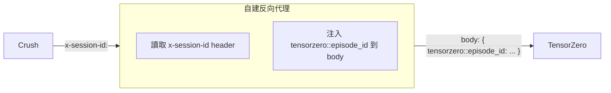

# Crush Session → TensorZero Inference 識別對應研究

## 問題

使用 Crush (https://github.com/charmbracelet/crush) 搭配 TensorZero (https://github.com/tensorzero/tensorzero) 時，
如何讓 Crush 的 Session 被 TensorZero 識別為 Inference（即 `episode_id`）？

## 核心結論

**無法直接透過 HTTP Header 自動對應。** TensorZero 已棄用從 Header 讀取 `episode_id` 的方式，改為要求透過 JSON request body 傳遞。Crush 的 `extra_headers` 只能送出 HTTP Header，無法修改 request body。唯一的方案是：**Crush 每次請求都帶上 `x-session-id` header，然後在 TensorZero 端撰寫反向代理（reverse proxy）中介層，攔截並將 header 轉入 request body 中的 `tensorzero::episode_id` 欄位。**

---

## 為什麼不能直接對應？

### Crush 端：可送出 Header，無法修改 Body

Crush 在每次 LLM 請求時會自動附加兩個 session 相關的 HTTP header[^crush-session-headers]：

```go
// internal/agent/agent.go — sessionHeaders()
func sessionHeaders(sessionID string) map[string]string {
    hash := session.HashID(sessionID)
    return map[string]string{
        "x-session-id":       hash,  // XXH3 hash of the session UUID
        "x-session-affinity": hash,
    }
}
```

這些 header 會合併到每一個 LLM provider 請求中[^crush-header-merge]。

此外，Crush 的 provider 配置支援 `extra_headers`，可以任意指定自訂 header[^crush-extra-headers]：

```json
{
  "providers": {
    "tensorzero": {
      "type": "openai-compat",
      "base_url": "http://localhost:3000/openai/v1",
      "extra_headers": {
        "x-session-id": "$SESSION_ID"
      }
    }
  }
}
```

但 Crush 在目前架構下**無法將 session ID 注入到 request body 中**，因為 LLM 請求的 body 由 `fantasy` 函式庫建構，Crush 僅能控制 header 與 provider options（如 `reasoning_effort` 等），無法干涉 messages 結構以外的頂層 JSON 欄位[^crush-body-limitation]。

### TensorZero 端：episode_id 只能從 Body 傳遞

TensorZero 的 inference API 接收 `episode_id` 的方式：

| 方式 | 狀態 |
|------|------|
| `POST /inference` body 中的 `episode_id` 欄位 | ✅ 現行方式 |
| OpenAI 相容端點 body 中的 `tensorzero::episode_id` 欄位 | ✅ 現行方式 |
| HTTP Header（如 `episode_id` 或 `x-episode-id`） | ❌ 已棄用 |

TensorZero 官方明確指出[^tensorzero-deprecated-headers]：

> When using the OpenAI-compatible inference endpoint, TensorZero-specific arguments (e.g. `episode_id`, `variant_name`) should be provided in the request's body using the `tensorzero::` prefix. Previously, these arguments were provided as headers (without a prefix).

TensorZero 也**沒有任何 middleware 或設定可以將 HTTP header 自動映射到 body 中的 `episode_id`**[^tensorzero-no-header-mapping]。Axum 路由層僅包含 request decompression、logging、authentication 與 version header 四個 middleware，沒有任何 header-to-body 轉換。

---

## 可行方案：自建反向代理

由於 Crush 無法直接寫入 request body、TensorZero 也不支援從 header 讀取，唯一解法是在 Crush 與 TensorZero 之間插入一層輕量反向代理。



代理的邏輯極簡：

1. 接收 Crush 送往 `POST /openai/v1/chat/completions` 的請求
2. 讀取 `x-session-id` header 的值
3. 將其以 TensorZero 格式寫入 JSON request body：
   ```json
   {
     "model": "tensorzero::function_name::my_func",
     "messages": [...],
     "tensorzero::episode_id": "x-session-id-hash-here"
   }
   ```
4. 將修改後的請求轉發至真正的 TensorZero gateway

### 實作建議

最簡單的方式是用 Node.js Express 或 Python FastAPI 寫一個約 30 行的代理：

```python
# proxy.py — 簡易範例
import httpx
from fastapi import FastAPI, Request, Response

app = FastAPI()
client = httpx.AsyncClient(base_url="http://tensorzero:3000")

@app.post("/openai/v1/chat/completions")
async def proxy(request: Request):
    body = await request.json()
    session_id = request.headers.get("x-session-id")
    if session_id and "tensorzero::episode_id" not in body:
        body["tensorzero::episode_id"] = session_id
    resp = await client.post("/openai/v1/chat/completions", json=body)
    return Response(content=resp.content, status_code=resp.status_code)
```

然後將 Crush 的 `base_url` 指向這個代理而非直接指向 TensorZero：

```json
{
  "providers": {
    "tensorzero": {
      "type": "openai-compat",
      "base_url": "http://proxy:8000/openai/v1"
    }
  }
}
```

### 注意事項

1. **UUIDv7 格式：** TensorZero 的 `episode_id` 必須是 UUIDv7。Crush 的 session ID 是隨機 UUIDv4 經 XXH3 hash 後的 hex 字串[^crush-session-hash]（如 `"a1b2c3d4e5f6"`），**不是 UUIDv7 格式**。代理需要將這個 hash 字串轉換為 UUIDv7，或直接使用 Crush session 原始的 UUID（可以修改 Crush 或從 hash 反查資料庫取得）。

2. **episode_id 一致性：** TensorZero 的設計是：同一個對話的多輪 inference 共享同一個 `episode_id`。首次請求若不提供 `episode_id`，TensorZero 會自動產生 UUIDv7 並在 response 中回傳；後續請求必須傳入該 `episode_id`[^tensorzero-episode-guide]。因此代理需要**記住**首次 response 中的 `episode_id`，後續同一 session 的請求對應到該 ID。

3. **替代方案 — tags：** 如果不需要將 session ID 作為 `episode_id`，也可以改存到 `tags` 中。但問題一樣：`tags` 也是 body-only 欄位，同樣需要代理來注入。

4. **Crush 原始碼修改（不建議）：** 理論上可以修改 Crush 的 `internal/agent/coordinator.go`，在 `mergeCallOptions()` 中對特定 provider 注入 `extra_body` 的 `tensorzero::episode_id` 欄位。但這需要 fork 並維護 Crush，不建議作為長期方案。

---

## 總結

| 方案 | 可行性 | 維護成本 |
|------|--------|---------|
| Crush `extra_headers` 直接對應 | ❌ TensorZero 不再支援 | — |
| 反向代理注入 body | ✅ 可行 | 低（~30 行） |
| 修改 Crush 原始碼 | ⚠️ 技術上可行 | 高（需 fork） |
| TensorZero 端加 middleware | ❌ 無此功能 | — |

**推薦方案：建置輕量反向代理**，將 Crush 的 `x-session-id` header 轉寫為 body 中的 `tensorzero::episode_id`，同時處理 UUID 格式轉換與 session ↔ episode 對應邏輯。

---

[^crush-session-headers]: charmbracelet/crush. (n.d.). `internal/agent/agent.go` — `sessionHeaders()` function. Retrieved 2026-09-23, from https://github.com/charmbracelet/crush/blob/main/internal/agent/agent.go
[^crush-header-merge]: charmbracelet/crush. (n.d.). `internal/agent/coordinator.go` — `buildProvider()` function shows headers are cloned from `ProviderConfig.ExtraHeaders` and passed to fantasy provider. Retrieved 2026-09-23, from https://github.com/charmbracelet/crush/blob/main/internal/agent/coordinator.go
[^crush-extra-headers]: charmbracelet/crush. (n.d.). `internal/config/config.go` — `ExtraHeaders` field on `ProviderConfig`. Retrieved 2026-09-23, from https://github.com/charmbracelet/crush/blob/main/internal/config/config.go
[^crush-body-limitation]: charmbracelet/crush. (n.d.). Crush only controls provider options (`reasoning_effort`, `extra_body` with specific keys), not arbitrary top-level JSON body fields. Retrieved 2026-09-23, from https://github.com/charmbracelet/crush/blob/main/internal/agent/coordinator.go
[^crush-session-hash]: charmbracelet/crush. (n.d.). `internal/session/session.go` — `HashID()` uses XXH3 to hash the session UUID. Retrieved 2026-09-23, from https://github.com/charmbracelet/crush/blob/main/internal/session/session.go
[^tensorzero-deprecated-headers]: TensorZero. (n.d.). OpenAI-Compatible API Reference — notes that `tensorzero::episode_id` should be provided in body, not headers. Retrieved 2026-09-23, from https://github.com/tensorzero/tensorzero/blob/main/docs/gateway/api-reference/inference-openai-compatible.mdx
[^tensorzero-no-header-mapping]: TensorZero. (n.d.). `crates/gateway/src/router.rs` — No middleware exists for header-to-body mapping. Retrieved 2026-09-23, from https://github.com/tensorzero/tensorzero/blob/main/crates/gateway/src/router.rs
[^tensorzero-episode-guide]: TensorZero. (n.d.). Episodes Guide — explains episode_id lifecycle and that it should be returned from first inference and reused. Retrieved 2026-09-23, from https://github.com/tensorzero/tensorzero/blob/main/docs/gateway/guides/episodes.mdx
