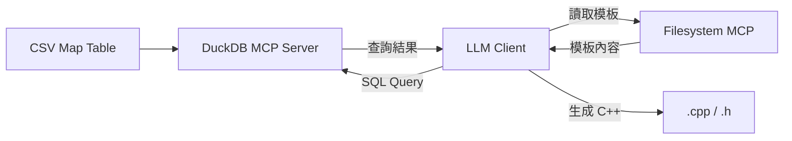
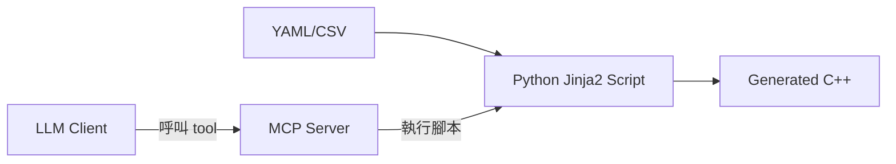
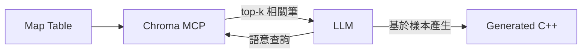

# MCP（Model Context Protocol）解決大型資料與程式碼生成問題的調查

## 問題定義

前一研究（`00119`）指出 LLM 處理大型 C++ map table 的最佳方案是「資料與邏輯分離」——使用 Python 腳本從 CSV/JSON 生成程式碼。本報告調查 MCP 生態系中是否有 FOSS 工具能以更具整合性的方式解決相同問題。

---

## 1. MCP 的架構優勢

MCP（Model Context Protocol）本身提供了一種不同於「把資料塞進提示詞」的資料處理模式[^mcp_spec]：

- **Tools**：LLM 可以「呼叫」工具來查詢資料，而不是被「餵入」資料。這從根本上解決了 token 污染問題——只有查詢結果（而非整個資料集）會進入上下文
- **Resources**：伺服器端暴露讀取資料的 URI，由 LLM 選擇何時讀取
- **ToolAnnotations**：readOnly、idempotent 等標記，使安全的大型資料存取成為可能

也就是說，MCP 提供了一個架構層級的解決方案：大型資料留在伺服器端，LLM 透過工具呼叫取得需要的部分。

---

## 2. 直接相關的 FOSS MCP Servers

### 2.1 DuckDB MCP Server

這是最接近「從結構化資料生成程式碼」需求的單一工具[^duckdb]。

```
原始 CSV/JSON/Parquet → DuckDB MCP → SQL 查詢 → 僅回傳查詢結果
```

DuckDB 本身就是一個專為分析查詢設計的 OLAP 資料庫，能原生查詢 CSV 和 JSON 檔案（不需要事先匯入）。搭配 MCP 後：

- LLM 不必載入整個 CSV 檔案
- 可以透過 SQL 進行篩選、聚合、JOIN，只取需要的資料
- 支援 GB 級以上的資料集
- 完全 FOSS（MIT 授權）

**限制**：LLM 需要自行決定 SQL 查詢的內容，對於常見的查表操作（SELECT key, value FROM map_table WHERE key = X）非常適合，但無法自動化「從整張表生成 C++ 程式碼」的流程。

### 2.2 codebase-memory-mcp (DeusData)

一個 C 語言編寫的單一二進位檔，使用 tree-sitter AST 將程式碼庫索引到持續性的知識圖譜[^codebase_memory]：

- 支援 158 種語言（含 C++）
- 使用 SQLite 儲存索引
- 號稱「減少 99% token 用量」——不將大型檔案傾倒入 LLM 上下文
- 子毫秒查詢速度
- 44.8k GitHub stars

**適用場景**：當你需要在大型 C++ 程式碼庫中查詢類型定義、函數簽名、類別繼承關係時，這個工具比直接餵檔案給 LLM 有效得多。但它處理的是「已存在的程式碼」，而不是「結構化資料生成程式碼」。

### 2.3 context-mode (mksglu)

專注於上下文視窗優化的 MCP server[^context_mode]：

- 號稱「減少 98% context 用量」
- 沙盒化工具輸出
- 持續性 session 記憶
- 過濾工具輸出中不必要的雜訊

**適用場景**：作為一般性的 LLM token 節約工具，間接幫助處理大型資料。

### 2.4 Chroma MCP / Qdrant MCP

向量資料庫的 MCP 整合[^chroma][^qdrant]：

- 將大型資料集先轉換為嵌入向量
- LLM 透過語意檢索取得相關區塊
- 完全 FOSS（Chroma 為 Apache 2.0，Qdrant 為 Apache 2.0）

**適用場景**：當 C++ map table 的 key 是自然語言概念（而非純數字枚舉）時，語意檢索比精確查表更適合。

### 2.5 Filesystem MCP（官方）

基本的檔案讀寫工具[^filesystem]：

- 可設定存取權限範圍
- 支援讀取大型檔案（作為文字）
- fast-filesystem-mcp 變體支援循序讀取大型檔案和串流寫入[^fastfs]

**限制**：單純的檔案讀取，沒有結構化查詢能力。

### 2.6 mxcp（Raw Labs）

一個從 YAML、SQL 和 Python 定義來建立 MCP 工具（tools）的框架[^mxcp]：

```yaml
# mxcp 定義範例
tools:
  - name: query_lookup_table
    sql: |
      SELECT value FROM map_table WHERE key = $key
    parameters:
      - name: key
        type: string
```

這讓開發者可以快速將既有的資料來源包裝為 MCP tools，不需要撰寫完整的 MCP server。

---

## 3. 不存在（但合理的）MCP 工具

調查發現**目前沒有**以下類型的 FOSS MCP server：

| 期望功能 | 現狀 |
|---------|------|
| CSV/YAML/JSON → C++ 程式碼生成 | 不存在。最接近的是 DuckDB MCP + 手動 SQL 查詢 |
| C++ 專用程式碼生成 MCP | 不存在。codebase-memory-mcp 能索引 C++ 但不會生成 |
| 大型 map table 自動分塊 + 增量生成 | 不存在。這是 LLM client 層的責任 |
| 基於 schema 的結構化資料模板渲染 | 不存在。傳統的 Jinja2 腳本模式仍然是最佳選擇 |

MCP 生態系目前偏向「提供資料查詢能力」而非「資料轉換與程式碼生成」。如果你的工作流是：

```
CSV → MCP server → LLM 查詢 → LLM 生成 C++
```

目前可行的 FOSS 組合是 **DuckDB MCP + Filesystem MCP**，由 LLM client（如 Crush 或 Claude Desktop）協調流程。

---

## 4. 推薦的複合方案

### 方案 A：DuckDB MCP + Filesystem MCP（查表生成）



適合場景：LLM 需要參考 map table 來做出生成決策，但不需要整張表。

### 方案 B：Python 腳本 + MCP 觸發（批量生成）



適合場景：LLM 只需要決定「使用哪個模板」和「傳入什麼參數」，實際資料處理由確定性腳本完成。

### 方案 C：向量檢索 MCP + 小樣本生成（近似查表）



適合場景：map table 的 key 是自然語言或模糊匹配。

---

## 5. 結論

MCP 生態系**還沒有專門解決「大型結構化資料生成程式碼」問題的工具**，但提供了有效的架構模式：

1. **資料查詢（而非資料傾倒）**：DuckDB MCP 是現有最接近的工具——讓 LLM 透過 SQL 查詢 CSV/JSON 中的資料，只有查詢結果進入上下文
2. **向量檢索**：Chroma/Qdrant MCP 提供語意檢索，適用於非精確對應場景
3. **自訂工具**：mxcp 讓開發者快速將既有資料來源包裝為 MCP tools
4. **程式碼索引**：codebase-memory-mcp 解決的是「理解既有程式碼」而非「生成新程式碼」

**實務建議**：對於產生大型 C++ map table 的問題，將 Python + Jinja2 腳本包裝為一個 MCP tool（透過 mxcp 或簡易的 Python MCP server）可能是在「保持 MCP 整合性」與「避開 LLM 資料限制」之間最好的平衡點。

---

[^mcp_spec]: Model Context Protocol. (n.d.). Specification: Server Tools. Retrieved 2026-09-24, from https://modelcontextprotocol.io/specification/2025-03-26/server/tools

[^duckdb]: Tanaka, K. (n.d.). mcp-server-duckdb. Retrieved 2026-09-24, from https://github.com/ktanaka101/mcp-server-duckdb

[^codebase_memory]: DeusData. (n.d.). codebase-memory-mcp. Retrieved 2026-09-24, from https://github.com/DeusData/codebase-memory-mcp

[^context_mode]: mksglu. (n.d.). context-mode. Retrieved 2026-09-24, from https://github.com/mksglu/context-mode

[^chroma]: Chroma. (n.d.). chroma-mcp. Retrieved 2026-09-24, from https://github.com/chroma-core/chroma-mcp

[^qdrant]: Qdrant. (n.d.). mcp-server-qdrant. Retrieved 2026-09-24, from https://github.com/qdrant/mcp-server-qdrant

[^filesystem]: Model Context Protocol. (n.d.). Filesystem Server. Retrieved 2026-09-24, from https://github.com/modelcontextprotocol/servers/tree/main/src/filesystem

[^fastfs]: efforthye. (n.d.). fast-filesystem-mcp. Retrieved 2026-09-24, from https://github.com/efforthye/fast-filesystem-mcp

[^mxcp]: Raw Labs. (n.d.). mxcp. Retrieved 2026-09-24, from https://github.com/raw-labs/mxcp