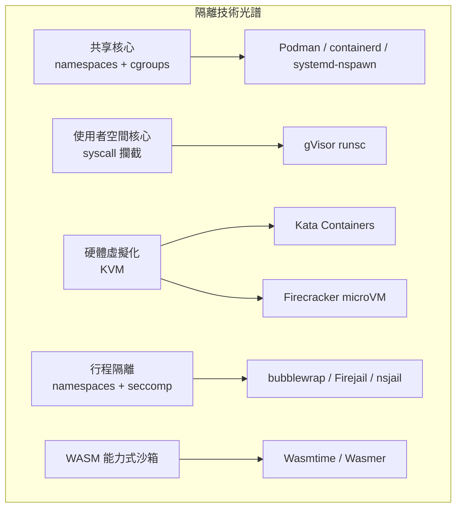

# Docker 沙箱的 FOSS 替代方案

## 摘要

Docker 依賴 Linux namespaces 與 cgroups 進行隔離，與主機共享核心，因此**不適合**直接執行不受信任的程式碼——容器逃逸攻擊已有多起紀錄。本文調查 2024–2026 年間可作為 Docker 沙箱替代方案的開源（FOSS）工具，依隔離技術光譜分為四類：(1) 容器引擎層（Podman、containerd）；(2) 使用者空間核心層（gVisor）；(3) 虛擬機器層（Kata Containers、Firecracker）；(4) 行程隔離層（bubblewrap、Firejail、nsjail、systemd-nspawn、PRoot）；另補充 WebAssembly 沙箱（Wasmtime、Wasmer）與以 Firecracker 為基礎的開源沙箱平台（E2B）。本文逐一說明授權、隔離機制、優缺點與現況，並提供選型建議。

## 1. 背景：為什麼 Docker 本身不是沙箱

Docker 預設使用 runc（OCI runtime），以 Linux namespaces（PID、Mount、Network 等）與 cgroups 達成資源隔離[^containerd]。應用程式與主機**共享同一個 Linux 核心**，任何核心漏洞或錯誤設定都可能導致容器逃逸，使攻擊者取得主機控制權。因此，在執行不受信任程式碼（例如 AI 代理程式、線上評測系統、CTF 題目）時，必須搭配更強的隔離層。

安全強度大致由弱至強：共享核心 < 使用者空間核心 < 硬體虛擬化；但隔離越強，通常伴隨越高的資源與相容性成本。

## 2. 容器引擎層

### 2.1 Podman

- **授權**：Apache 2.0[^podman]
- **隔離機制**：與 Docker 相同——namespaces、cgroups、seccomp、SELinux 標籤、rootless user namespaces，底層使用 runc 或 crun[^podman]。
- **優點**：無守護行程（daemonless），攻擊面較小；預設 rootless；CLI 與 Docker 相容（`alias docker=podman`）；與 systemd 整合；支援 Pod 概念與 REST API[^podman]。
- **缺點**：本質上與 Docker 共享主機核心，**不是**可執行不受信任程式碼的安全沙箱；需搭配 gVisor 或 Kata 才能強化隔離[^podman]。
- **現況**：Red Hat 主導，CNCF 專案，為 RHEL 預設容器引擎，活躍開發中[^podman]。

### 2.2 containerd

- **授權**：Apache 2.0[^containerd]
- **隔離機制**：本身管理容器生命週期，將隔離委派給 runc/crun（namespaces 層級）；支援可插拔 runtime，可換成 gVisor（runsc）、Kata（kata-fc）或 Firecracker 以取得真正的沙箱[^containerd]。
- **優點**：容器生態系的產業標準（CNCF 畢業專案），Docker 底層即為 containerd；極度穩定；支援 Kubernetes CRI[^containerd]。
- **缺點**：單獨使用時隔離強度與 Docker 相同，需要外掛沙箱 runtime[^containerd]。
- **現況**：CNCF 畢業專案，v2.x，大量生產環境使用[^containerd]。

## 3. 使用者空間核心層：gVisor

- **授權**：Apache 2.0[^gvisor]
- **隔離機制**：以 Go（記憶體安全語言）在使用者空間實作 Linux 核心 API，攔截沙箱程式的所有系統呼叫，由 Sentry 自行處理而不直接觸及主機核心；檔案操作經由獨立的 Gofer 行程以 9P 協定中介；並以 seccomp 對自身進行深度防禦[^gvisor-sandbox]。不需硬體虛擬化，x86 與 ARM 皆可運作[^gvisor-sandbox]。
- **優點**：比純容器強得多的隔離（應用程式不直接暴露主機核心）；啟動僅需毫秒級；OCI 相容，`runsc` runtime 可直接整合 Docker、containerd 與 Kubernetes，並支援 rootless Podman[^gvisor]；支援 checkpoint/restore 與 GPU/CUDA[^gvisor-sandbox]。
- **缺點**：每次系統呼叫有額外負擔，系統呼叫密集的工作負載效能可能顯著下降；並非所有 Linux 系統呼叫都已實作，存在相容性缺口[^gvisor-sandbox]。
- **現況**：Google 維護，每週釋出（2026-09 最新為 release-20260921.0），Google 與 Snapchat 等生產環境使用[^gvisor]。

## 4. 虛擬機器層

### 4.1 Kata Containers

- **授權**：Apache 2.0（OpenInfra Foundation 主導）[^kata]
- **隔離機制**：每個容器/每個 Pod 執行在獨立的輕量虛擬機中，擁有各自的客體核心，以 KVM 提供硬體強制隔離；支援多種 hypervisor：QEMU、Cloud-Hypervisor、Firecracker、以及內建以 Rust 撰寫的 Dragonball[^kata-hypervisor][^kata]。
- **優點**：真正的 VM 層級隔離（硬體強制）；執行未修改的 Linux 二進位檔，系統呼叫完整相容；OCI/CRI 相容，可無縫接入 Docker、containerd 與 Kubernetes[^kata]。
- **缺點**：比純容器或 gVisor 有更高的資源開銷（每個 VM 需要客體核心與 agent）；需要硬體虛擬化（KVM）；建置較複雜[^kata]。
- **現況**：活躍開發中（Kata 3.x），AWS 建議用於 EKS 的強隔離場景，NVIDIA 用於安全 AI 部署[^kata-aws]。

### 4.2 Firecracker

- **授權**：Apache 2.0[^firecracker]
- **隔離機制**：AWS 以 Rust 撰寫的精簡 VMM（Virtual Machine Monitor），透過 KVM 產生 microVM；只模擬 5 種裝置（virtio-net、virtio-block、virtio-vsock、序列埠、僅用於關機的最小鍵盤控制器），攻擊面極小；另有 Jailer 行程提供第二道防線[^firecracker-docs]。
- **優點**：業界領先的安全性（AWS Lambda 每月超過 15 兆次呼叫即建構於其上）；開機 <125ms；每個 VM 記憶體開銷 <5 MiB；單一主機每秒可啟動 150 個 microVM；Rust 記憶體安全；內建速率限制器[^firecracker-docs][^firecracker-aws]。
- **缺點**：本身不是容器 runtime，需搭配容器管理器（Kata、firecracker-containerd、Flintlock）；僅支援 Linux 客體；預設無 GPU/USB 裝置[^firecracker-sandbox]。
- **現況**：AWS 支援、活躍開發，已被 AWS Lambda、Fargate 與 Fly.io 使用[^firecracker-docs][^firecracker-sandbox]。

## 5. 行程隔離層

### 5.1 bubblewrap（bwrap）

- **授權**：程式 GPL-2.0 / 函式庫 LGPL-2.1+[^bubblewrap]
- **隔離機制**：以 Linux namespaces（user、mount、PID、network、IPC、UTS）與 seccomp 過濾建立全新且空的 mount namespace；完全無權限執行（不需 setuid）[^bubblewrap]。
- **優點**：極輕量、快速；完全非特權；無守護行程；設計簡單易於稽核；Flatpak 的底層沙箱，生產驗證[^bubblewrap]。
- **缺點**：本身不構成安全邊界，隔離程度取決於使用者設定，容易誤設定；無內建網路過濾或映像檔管理[^bubblewrap]。
- **現況**：containers 組織下的專案，穩定但維護節奏低[^bubblewrap]。

### 5.2 Firejail

- **授權**：GPL-2.0[^firejail]
- **隔離機制**：SUID 沙箱程式，結合 namespaces、seccomp-bpf、Linux capabilities，並實驗性支援 Landlock；內建超過 900 個常見應用程式安全設定檔[^firejail]。
- **優點**：使用簡單（`firejail firefox`）；預設設定檔豐富；與 AppArmor、SELinux、cgroups 整合；低負擔[^firejail]。
- **缺點**：SUID 二進位是較大的攻擊面，歷史上有多起 CVE；namespaces 本身不提供 VM 級隔離；bubblewrap 的 README 明確批評其設計難以稽核[^firejail][^bubblewrap]。
- **現況**：活躍開發（v0.9.8x），持續修補 CVE[^firejail]。

### 5.3 nsjail

- **授權**：Apache 2.0（Google 出品但非官方產品）[^nsjail]
- **隔離機制**：專為執行不受信任程式碼設計：namespaces（UTS、mount、PID、IPC、NET、USER、CGROUPS、TIME）、以 Kafel 語言撰寫政策的 seccomp-bpf、cgroups（v1 與 v2）、rlimits 資源限制（CPU、記憶體、PID、時間等）；支援四種模式：ONCE（執行後退出）、RERUN（重複執行，用於 fuzzing）、LISTEN（inetd 風格 TCP 伺服器）、EXECVE[^nsjail]。
- **優點**：CTF 競賽、線上評測、fuzzing（如 OSS-Fuzz）的實際標準工具；強力的 seccomp 過濾與資源限制[^nsjail]。
- **缺點**：非 OCI 相容，是獨立工具而非容器 runtime；需要 root 或 user namespaces；無映像檔管理[^nsjail]。
- **現況**：活躍維護，最新版 nsjail-3.6（2026-03-18 釋出）[^nsjail]。

### 5.4 systemd-nspawn

- **授權**：LGPL-2.1+/GPL-2.0（systemd 一部分）[^systemd]
- **隔離機制**：以 namespaces（PID、network、UTS、IPC、user、mount、cgroup、time）與 seccomp 執行指令或作業系統映像，類似「強化版 chroot」[^systemd]。
- **優點**：隨 systemd 發行，幾乎所有主流發行版內建；可開機完整 OS 映像；與 machinectl、journald 整合[^systemd]。
- **缺點**：與主機共享核心，**不適合**執行不受信任程式碼；主要為系統管理工具；不直接支援 Docker/OCI 映像[^systemd]。
- **現況**：systemd 持續維護[^systemd]。

### 5.5 PRoot

- **授權**：GPL-2.0+[^proot]
- **隔離機制**：以 ptrace 攔截與轉譯系統呼叫，讓程式以為擁有不同的檔案系統根目錄；不使用 namespaces[^proot]。
- **優點**：完全不需要任何權限（無 root、無 user namespaces）；可跨架構執行（如 x86 上跑 ARM）；用於建置可攜式 Linux 二進位（AppImage、Conda）[^proot]。
- **缺點**：**明確不是安全沙箱**，容易被惡意程式逃脫；ptrace 攔截導致嚴重效能負擔[^proot]。
- **現況**：穩定但低度開發，不適用於不受信任程式碼[^proot]。

## 6. WebAssembly 沙箱

### 6.1 Wasmtime

- **授權**：Apache 2.0（含 LLVM exceptions）[^wasmtime]
- **隔離機制**：WebAssembly 本身即為能力式（capability-based）安全模型——模組無法在未經明確匯入的情況下存取主機系統；Wasmtime 以 Rust + Cranelift 實作 JIT，強制記憶體安全與控制流完整性，實作 WASI 標準化的主機存取[^wasmtime-sandbox]。
- **優點**：近乎零啟動成本、記憶體開銷極低（約 MB 等級）；不需要硬體虛擬化；可嵌入多種語言（Rust、C、Python、Go、.NET）[^wasmtime-sandbox]。
- **缺點**：僅能執行編譯為 WASM 的程式，無法執行任意原生 Linux 二進位[^wasmtime-sandbox]。
- **現況**：Bytecode Alliance 維護，透過 Google OSS-Fuzz 持續模糊測試[^wasmtime-sandbox]。

### 6.2 Wasmer

- **授權**：MIT[^wasmer]
- **隔離機制**：與 Wasmtime 類似，執行 WASM 模組於沙箱環境，支援 WASIX（WASI 擴充）；宣稱冷啟動比 Docker 快 107 倍，單一實例約 20 MB 記憶體[^wasmer-sandbox]。
- **優點**：極輕量、跨基礎設施；支援大量以 WASM 編譯的語言工具（Bash、Python、Node.js、PHP、SQLite 等）[^wasmer-sandbox]。
- **缺點**：同上，僅限 WASM 相容內容[^wasmer-sandbox]。

## 7. 以 Firecracker 為基礎的開源沙箱平台

### 7.1 E2B

- **授權**：執行時（runtime）Apache 2.0，SDK 為 MIT；公司亦提供代管雲端服務[^e2b]
- **隔離機制**：以 Firecracker 建立 microVM，每個 AI 代理程式工作階段擁有獨立核心與客製快照層以加速開機[^e2b]。
- **優點**：超過 10 億個沙箱啟動、快照子秒級開機；提供執行 API、檔案系統、網路控制與機密保險庫；可 BYOC 部署於 AWS/GCP[^e2b]。
- **現況**：熱門的 AI 代理程式程式碼執行沙箱[^e2b]。

## 8. 比較總表

| 工具 | 授權 | 隔離機制 | 硬體虛擬化需求 | 容器/O CI 相容 | 適合不受信任程式碼 |
|---|---|---|---|---|---|
| Docker（runc） | Apache 2.0 | namespaces + cgroups | 否 | 是 | **否**（共享核心） |
| Podman | Apache 2.0 | namespaces + cgroups + rootless | 否 | 是 | 否 |
| containerd | Apache 2.0 | 委派給 runtime | 否 | 是 | 需外掛 runtime |
| gVisor（runsc） | Apache 2.0 | 使用者空間核心（syscall 攔截） | 否 | 是 | 是 |
| Kata Containers | Apache 2.0 | 輕量 VM（KVM） | 是 | 是 | 是 |
| Firecracker | Apache 2.0 | microVM（KVM） | 是 | 需搭配管理器 | 是 |
| bubblewrap | GPL-2.0/LGPL-2.1+ | namespaces + seccomp | 否 | 否 | 需謹慎設定 |
| Firejail | GPL-2.0 | namespaces + seccomp + capabilities | 否 | 否 | 需謹慎設定（SUID 攻擊面） |
| nsjail | Apache 2.0 | namespaces + Kafel seccomp + cgroups + rlimits | 否 | 否 | **是**（專用） |
| systemd-nspawn | LGPL-2.1+ | namespaces | 否 | 部分 | 否 |
| PRoot | GPL-2.0+ | ptrace 轉譯 | 否 | 否 | **否**（非安全設計） |
| Wasmtime | Apache 2.0 | WASM 能力式 | 否 | 否 | 是（僅 WASM） |
| Wasmer | MIT | WASM 能力式 | 否 | 否 | 是（僅 WASM） |
| E2B | Apache 2.0（runtime） | Firecracker microVM | 是 | 部分 | 是 |

## 9. 選型建議

- **需要最強隔離且工作負載為容器/OCI 映像**：Kata Containers（搭配 QEMU 或 Firecracker）或純 Firecracker microVM——硬體強制隔離是執行多租戶不受信任程式碼的黃金標準，AWS Lambda 即以此支撐[^firecracker-docs]。
- **已有 Docker/K8s 生態系、希望最小改動**：gVisor 的 `runsc` 作為 drop-in OCI runtime，毫秒級啟動且不需硬體虛擬化，是多數情境的平衡選擇[^gvisor]。
- **單一不受信任程式（CTF、評測系統、fuzzing）**：nsjail 是為此目的打造的專用工具，seccomp + cgroups + rlimits 齊備[^nsjail]。
- **桌面應用程式沙箱**：bubblewrap（Flatpak 使用）或 Firejail[^bubblewrap][^firejail]。
- **程式可編譯為 WASM**：Wasmtime 或 Wasmer，零硬體依賴、近乎零開銷[^wasmtime-sandbox]。
- **務必避免**：以 vanilla Docker（runc）、Podman、containerd 單獨、systemd-nspawn 或 PRoot 執行不受信任程式碼——它們都與主機共享核心或非安全設計[^proot]。

## 10. 結論

Docker 的隔離設計以共享核心為前提，不構成安全沙箱。若要執行不受信任程式碼，FOSS 生態提供了完整的光譜：gVisor（使用者空間核心）、Kata Containers 與 Firecracker（硬體虛擬化）、nsjail 與 bubblewrap（行程隔離）、Wasmtime/Wasmer（WASM 能力式沙箱）。選擇關鍵在於隔離強度、相容性（是否需 OCI）、硬體虛擬化可用性與資源開銷之間的取捨。

## 參考來源

[^podman]: Red Hat. (n.d.). Podman. Retrieved 2026-09-24, from https://github.com/containers/podman

[^containerd]: CNCF. (n.d.). containerd. Retrieved 2026-09-24, from https://github.com/containerd/containerd

[^gvisor]: Google. (n.d.). gVisor. Retrieved 2026-09-24, from https://github.com/google/gvisor

[^gvisor-sandbox]: gVisor. (n.d.). What is gVisor. Retrieved 2026-09-24, from https://gvisor.dev/docs/

[^kata]: Kata Containers. (n.d.). Kata Containers. Retrieved 2026-09-24, from https://github.com/kata-containers/kata-containers

[^kata-hypervisor]: Kata Containers. (n.d.). Hypervisors. Retrieved 2026-09-24, from https://github.com/kata-containers/kata-containers/blob/main/docs/hypervisors.md

[^kata-aws]: Amazon Web Services. (n.d.). Enhancing Kubernetes workload isolation and security using Kata Containers. Retrieved 2026-09-24, from https://aws.amazon.com/blogs/containers/enhancing-kubernetes-workload-isolation-and-security-using-kata-containers/

[^firecracker]: Firecracker. (n.d.). Firecracker. Retrieved 2026-09-24, from https://github.com/firecracker-microvm/firecracker

[^firecracker-docs]: Firecracker. (n.d.). Firecracker official site. Retrieved 2026-09-24, from https://firecracker-microvm.github.io/

[^firecracker-aws]: Amazon Web Services. (2018, November 27). Firecracker – Lightweight virtualization for serverless computing. Retrieved 2026-09-24, from https://aws.amazon.com/blogs/aws/firecracker-lightweight-virtualization-for-serverless-computing/

[^bubblewrap]: containers. (n.d.). bubblewrap. Retrieved 2026-09-24, from https://github.com/containers/bubblewrap

[^firejail]: netblue30. (n.d.). Firejail. Retrieved 2026-09-24, from https://github.com/netblue30/firejail

[^nsjail]: Google. (n.d.). nsjail. Retrieved 2026-09-24, from https://github.com/google/nsjail

[^systemd]: systemd. (n.d.). systemd. Retrieved 2026-09-24, from https://github.com/systemd/systemd

[^proot]: proot-me. (n.d.). PRoot. Retrieved 2026-09-24, from https://github.com/proot-me/proot

[^wasmtime]: Bytecode Alliance. (n.d.). Wasmtime. Retrieved 2026-09-24, from https://github.com/bytecodealliance/wasmtime

[^wasmtime-sandbox]: Wasmtime. (n.d.). Wasmtime official site. Retrieved 2026-09-24, from https://wasmtime.dev/

[^wasmer]: Wasmer. (n.d.). Wasmer. Retrieved 2026-09-24, from https://github.com/wasmerio/wasmer

[^wasmer-sandbox]: Wasmer. (n.d.). Wasmer official site. Retrieved 2026-09-24, from https://wasmer.io/

[^e2b]: E2B. (n.d.). E2B. Retrieved 2026-09-24, from https://e2b.dev/