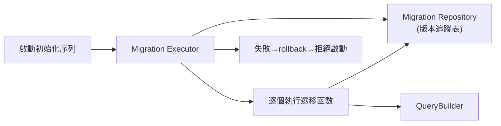
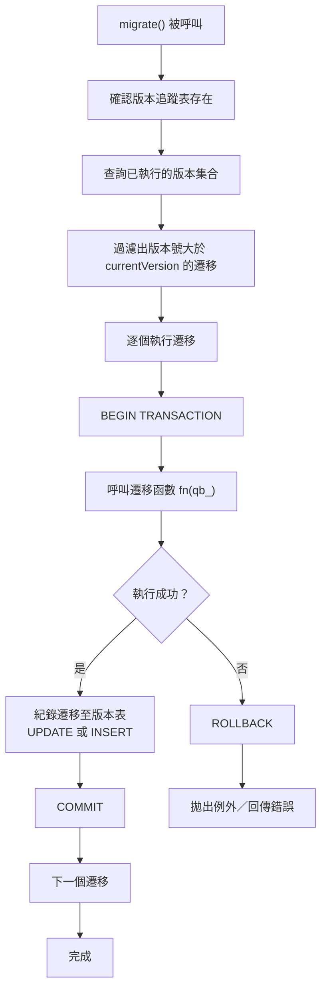

# C++ 資料庫遷移實作設計：無依存、僅 Up、啟動時執行

## 摘要

本報告針對「不依賴第三方遷移函式庫、假設已有 Query Builder、僅需 Up 方向（不含 Down）、遷移執行器為程式啟動時一部分」的 C++ 專案場景，提出一個簡潔且可立即實作的資料庫遷移設計方案。方案核心包含：版本追蹤表（Migration Repository）、遷移函數註冊機制、逐遷移交易保護、以及啟動初始化序列的整合模式。

---

## 1. 核心架構概覽

整體架構由三個元件組成：

| 元件 | 職責 |
|------|------|
| **Migration Repository** | 管理版本追蹤表，紀錄哪些遷移已執行、批次編號為何 |
| **Migration Executor** | 協調遷移執行流程：確認未執行遷移、包裹交易、呼叫遷移函數、紀錄執行狀態 |
| **Migration Functions** | 使用者定義的遷移邏輯，接收 `QueryBuilder&` 參數，描述結構變更 |

三者之間的互動流程如下：



---

## 2. 版本追蹤表（Migration Repository）

遷移系統需要一個持久化機制來記錄哪些遷移已經執行過。最常見的實作是在目標資料庫中建立一張專用表格，通常命名為 `schema_migrations`[^oatpp-schema]。

使用 Query Builder 建立此表格的 SQL 等效於：

```sql
CREATE TABLE IF NOT EXISTS schema_migrations (
    id         BIGINT UNSIGNED AUTO_INCREMENT PRIMARY KEY,
    version    VARCHAR(255) NOT NULL UNIQUE,
    name       VARCHAR(255) NOT NULL,
    batch      INT NOT NULL,
    executed_at TIMESTAMP DEFAULT CURRENT_TIMESTAMP
);
```

備註：若使用 SQLite，可選擇更輕量的 `PRAGMA user_version` 替代[^sqlite-user-version]，但使用獨立表格能支援更細緻的批次控制與日誌查詢。

Migration Repository 提供的查詢方法包括[^tinyorm-repo]：

- **repositoryExists()**：檢查表格是否已存在，不存在則在首次執行前自動建立。
- **getRanVersions()**：取得已執行的遷移版本清單，用以計算待執行遷移。
- **log(version, name, batch)**：在遷移成功後寫入一筆紀錄。
- **getNextBatchNumber()**：傳回下一個批次編號（當前最大批次 + 1）。

自動建立表格的時機點應在 `migrate()` 方法呼叫的最前端：

```cpp
void MigrationExecutor::ensureRepositoryExists()
{
    if (!repository_.repositoryExists()) {
        repository_.createRepository(qb_);
    }
}
```

---

## 3. 遷移函數註冊與結構

### 3.1 函數簽章設計

遷移函數應接收 `QueryBuilder&` 作為唯一參數，讓遷移邏輯可以透過 Query Builder 描述結構變更[^goose-pattern]：

```cpp
using MigrationFn = void(*)(QueryBuilder&);
```

每個遷移條目包含版本號碼與執行函數：

```cpp
struct MigrationEntry {
    int version;        // 版本號，必須唯一且遞增
    std::string name;   // 可讀名稱，用於日誌與追蹤
    MigrationFn up;     // 遷移邏輯
};
```

### 3.2 註冊方式

採用靜態陣列或 `std::vector` 集中註冊所有遷移，並在編譯期透過版本號排序確保順序正確[^tinyorm-registration]：

```cpp
// 使用者定義的遷移函數
void migrate_001_create_users(QueryBuilder& qb) {
    qb.createTable("users", [](TableDefinition& t) {
        t.increments("id").primary();
        t.string("email").unique().notNull();
        t.string("name");
        t.timestamps();
    });
}

void migrate_002_add_posts_table(QueryBuilder& qb) {
    qb.createTable("posts", [](TableDefinition& t) {
        t.increments("id").primary();
        t.string("title").notNull();
        t.text("body");
        t.foreignKey("user_id").references("users", "id");
        t.timestamps();
    });
}

// 集中註冊（版本號需遞增）
const std::vector<MigrationEntry> MIGRATIONS = {
    {1, "create_users_table",     migrate_001_create_users},
    {2, "add_posts_table",        migrate_002_add_posts_table},
    {3, "add_user_role_column",   migrate_003_add_user_role},
};
```

版本號建議從 1 開始遞增，不允許跳號或重複。註冊時的順序檢查可在 `MigrationExecutor` 建構時完成[^tinyorm-validate]：

```cpp
MigrationExecutor(const std::vector<MigrationEntry>& migrations)
    : migrations_(migrations)
{
    for (size_t i = 1; i < migrations_.size(); ++i) {
        assert(migrations_[i].version == migrations_[i-1].version + 1 &&
               "Migrations must be sequential");
    }
}
```

---

## 4. Migration Executor：遷移執行器

Migration Executor 是整個系統的核心，負責「哪些遷移需要執行」的判斷，並在交易中依序執行[^tinyorm-executor]。

完整執行流程：



### 4.1 關鍵實作細節

**交易包裹**：每個遷移應獨立包裹在交易中，失敗時僅 rollback 單一遷移，已成功的遷移不受影響[^fluent-transaction]：

```cpp
void MigrationExecutor::runMigration(const MigrationEntry& entry)
{
    qb_.beginTransaction();
    try {
        entry.up(qb_);
        repository_.log(entry.version, entry.name, currentBatch_);
        qb_.commit();
    } catch (const std::exception& e) {
        qb_.rollback();
        throw MigrationException(entry.version, entry.name, e.what());
    }
}
```

**版本追蹤表更新應與遷移在同一交易內**：這是關鍵的正確性保證——若遷移執行成功但版本更新失敗（極罕見），整筆交易應 rollback 以避免重複執行。

### 4.2 批次編號機制

將所有在單次程式啟動中執行的遷移視為同一「批次」[^tinyorm-batch]，有助於日後除錯與審計：

```cpp
void MigrationExecutor::migrate()
{
    ensureRepositoryExists();
    currentBatch_ = repository_.getNextBatchNumber();

    const auto applied = repository_.getRanVersions();
    for (const auto& entry : migrations_) {
        if (applied.count(entry.version) == 0) {
            runMigration(entry);
        }
    }
}
```

---

## 5. 啟動初始化序列整合

Migration Executor 應在程式啟動的初始化序列中，資料庫連線就緒後、主要業務邏輯啟動前執行[^oatpp-init]：

```cpp
class Application {
public:
    int run() {
        try {
            // 1. 設定資料庫連線
            auto& db = DatabaseManager::instance();
            db.connect("sqlite://data/app.db");

            // 2. 執行資料庫遷移
            auto& qb = db.queryBuilder();
            MigrationExecutor executor(qb, MIGRATIONS);
            executor.migrate();

            // 3. 啟動主要邏輯
            startServer();

        } catch (const MigrationException& e) {
            // 遷移失敗 ⇒ 程式不應啟動
            log("Migration failed: {}", e.what());
            return EXIT_FAILURE;

        } catch (const std::exception& e) {
            log("Startup failed: {}", e.what());
            return EXIT_FAILURE;
        }

        return EXIT_SUCCESS;
    }
};
```

關鍵原則：**遷移失敗 = 程式不啟動**[^tinyorm-error]。資料庫結構是應用程式的基礎假設，若結構無法正確建立，執行業務邏輯只會產生更難除錯的執行時期錯誤。

---

## 6. 交易與錯誤處理

### 6.1 交易策略

| 策略 | 行為 | 適用場景 |
|------|------|----------|
| **逐遷移交易**（預設） | 每個遷移獨立包裹在 `BEGIN/COMMIT` 中，失敗不影響此前已成功的遷移 | 大多數應用程式 |
| **全域交易** | 所有遷移包裹在同一個交易中，任一個失敗即全部 rollback | 全新資料庫初始化、一次性部署 |

預設採用逐遷移交易，因為在已上線的資料庫上追加遷移時，先前的遷移不應受後續失敗影響。

### 6.2 例外安全

遷移系統應保證以下三點[^tinyorm-rollback]：

1. **遷移失敗 ⇒ 完整的 rollback**：交易中未 commit 前發生例外，確保 rollback 被呼叫。
2. **版本紀錄不更新**：遷移函數拋出例外後，`runMigration()` 的 catch 區塊會 rollback，`repository_.log()` 不會被呼叫。
3. **例外向上傳遞**：`migrate()` 收到例外後應停止後續遷移並向上拋出，讓啟動序列的錯誤處理機制決定程式是否終止。

---

## 7. 完整程式碼範例

以下為完整實作的精簡版本：

```cpp
// migration_entry.hpp
#pragma once
#include <string>
#include <functional>

class QueryBuilder; // forward declaration

struct MigrationEntry {
    int version;
    std::string name;
    std::function<void(QueryBuilder&)> up;
};

// migration_repository.hpp
#pragma once
#include <string>
#include <unordered_set>

class QueryBuilder;

class MigrationRepository {
public:
    explicit MigrationRepository(QueryBuilder& qb) : qb_(qb) {}

    bool repositoryExists();
    void createRepository();
    std::unordered_set<int> getRanVersions();
    void log(int version, const std::string& name, int batch);
    int getNextBatchNumber();

private:
    QueryBuilder& qb_;
};

// migration_executor.hpp
#pragma once
#include <vector>
#include <string>
#include <stdexcept>

class QueryBuilder;
struct MigrationEntry;
class MigrationRepository;

class MigrationException : public std::runtime_error {
public:
    MigrationException(int version, const std::string& name, const std::string& what)
        : std::runtime_error("Migration " + name + " (v" +
          std::to_string(version) + ") failed: " + what) {}
};

class MigrationExecutor {
public:
    MigrationExecutor(QueryBuilder& qb,
                      const std::vector<MigrationEntry>& migrations)
        : qb_(qb), migrations_(migrations), repository_(qb)
    {
        validateMigrations();
    }

    void migrate();

private:
    void validateMigrations();
    void ensureRepositoryExists();
    void runMigration(const MigrationEntry& entry);

    QueryBuilder& qb_;
    std::vector<MigrationEntry> migrations_;
    MigrationRepository repository_;
    int currentBatch_ = 1;
};
```

---

## 8. 設計取捨與注意事項

### 8.1 為何不使用檔案系統掃描

有部分實作從 `migrations/*.sql` 目錄讀取 SQL 檔案[^dbmate-pattern]。本設計採用集中註冊方式，原因如下：

- **無檔案系統依賴**：遷移資訊完全內嵌於程式碼，不依賴執行環境的檔案路徑。
- **單元測試友善**：遷移邏輯可單獨測試，不需準備測試資料夾。
- **編譯期驗證**：版本連續性、無重複註冊可在建構期檢查。

### 8.2 僅 Up 的設計限制

本方案不提供 Down（回退）方向——回退應透過撰寫新的反向遷移來達成[^up-only-rule]。此策略適合 CI/CD 驅動的部署流程，避免人為操作 rollback 造成的資料遺失風險。

### 8.3 與 Query Builder 的耦合

假設 Query Builder 提供以下最低能力：

- `beginTransaction()` / `commit()` / `rollback()`
- `statement(std::string)`：執行任意 SQL
- `createTable()` / `alterTable()` 等 DDL 描述方法
- 或至少能傳遞原始 SQL 字串的能力

若 Query Builder 不支援 DDL 操作，可直接透過 `statement()` 下達原生 SQL 作為替代。

---

## 參考文獻

[^oatpp-schema]: Oat++ Framework. (n.d.). *SchemaMigration — ORM — Oat++ 1.3.0*. Retrieved 2026-09-25, from https://oatpp.io/api/latest/oatpp/orm/SchemaMigration/
[^sqlite-user-version]: Branchaud, J. (n.d.). *Manage lightweight schema migrations with user_version*. Retrieved 2026-09-25, from https://github.com/jbranchaud/til/blob/master/sqlite/manage-lightweight-schema-migrations-with-user-version.md
[^tinyorm-repo]: Silverqx. (2025). *TinyORM — MigrationRepository (migrationrepository.cpp)*. Retrieved 2026-09-25, from https://github.com/silverqx/TinyORM/blob/main/tom/src/tom/migrationrepository.cpp
[^goose-pattern]: Pressly. (n.d.). *goose — Database migrations (README)*. Retrieved 2026-09-25, from https://github.com/pressly/goose
[^tinyorm-registration]: Silverqx. (2025). *TinyORM — T_MIGRATION macro and migration registration*. Retrieved 2026-09-25, from https://www.tinyorm.org/building/migrations
[^tinyorm-validate]: Silverqx. (2025). *TinyORM — Migrator (migrator.cpp)*. Retrieved 2026-09-25, from https://github.com/silverqx/TinyORM/blob/main/tom/src/tom/migrator.cpp
[^tinyorm-executor]: Silverqx. (2025). *TinyORM — Migrator runMigration method*. Retrieved 2026-09-25, from https://github.com/silverqx/TinyORM/blob/main/tom/src/tom/migrator.cpp
[^fluent-transaction]: FluentMigrator. (n.d.). *Migration Transaction Behavior*. Retrieved 2026-09-25, from https://github.com/fluentmigrator/documentation/blob/master/articles/migration/migration-transaction-behavior.md
[^tinyorm-batch]: Silverqx. (2025). *TinyORM — MigrationRepository getNextBatchNumber*. Retrieved 2026-09-25, from https://github.com/silverqx/TinyORM/blob/main/tom/src/tom/migrationrepository.cpp
[^oatpp-init]: Oat++ Framework. (n.d.). *SchemaMigration::migrate method*. Retrieved 2026-09-25, from https://github.com/oatpp/oatpp/blob/master/src/oatpp/orm/SchemaMigration.cpp
[^tinyorm-error]: Silverqx. (2025). *TinyORM — Application startup error handling*. Retrieved 2026-09-25, from https://github.com/silverqx/TinyORM/blob/main/tom/src/tom/application.cpp
[^tinyorm-rollback]: Silverqx. (2025). *TinyORM — Transaction rollback on exception in runMigration*. Retrieved 2026-09-25, from https://github.com/silverqx/TinyORM/blob/main/tom/src/tom/migrator.cpp
[^dbmate-pattern]: Macneil, A. (n.d.). *dbmate — A lightweight database migration tool*. Retrieved 2026-09-25, from https://github.com/amacneil/dbmate
[^up-only-rule]: Rõthlisberger, D. (n.d.). *Declarative schema migration for SQLite*. Retrieved 2026-09-25, from https://david.rothlis.net/declarative-schema-migration-for-sqlite/