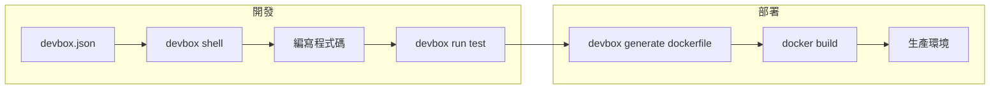

# Devbox：即時、簡單且可預測的開發環境工具

Devbox 是一個由 [Jetify](https://www.jetify.com)（原名 Jetpack）開發的開放原始碼命令列工具，讓開發者能夠在本地端輕鬆建立**隔離、可重現的開發環境**。它的官方口號是「即時、簡單且可預測的開發環境」（Instant, easy, and predictable development environments）[^github]。

## 解決的問題

### 「Works on my machine」症候群
團隊開發中最常見的問題之一：每位開發者的電腦環境不同，導致同一份程式碼在不同機器上行為不一致。Devbox 確保整個團隊使用完全相同的工具版本，消除環境差異[^docs]。

### 跨專案的版本衝突
當你同時維護多個專案時，不同專案可能需要不同版本的工具（例如專案 A 需要 Python 3.7，專案 B 需要 Python 3.11）。Devbox 為每個專案建立隔離的 shell，各自擁有獨立的工具版本[^quickstart]。

### 系統環境汙染
試用新工具時，不再需要 `brew install` 或 `apt-get` 來安裝、不再需要擔心安裝後殘留的套件。用完即可乾淨移除[^docs]。

### Docker 開發環境的效能問題
Docker 提供完整的作業系統隔離，但同時也帶來虛擬化開銷與檔案系統掛載的效能損失。Devbox 直接在宿主機上執行，沒有這些開銷[^blog-speed]。

### Nix 的高學習曲線
Devbox 底層使用 Nix，但提供簡單的 JSON 設定檔介面，使用者無需學習 Nix 語言即可享受 Nix 的生態系[^github]。

## 核心功能

- **宣告式設定檔**（`devbox.json`）：只需列出需要的套件與環境變數
- **版本鎖定**：支援精確版本與 semver 語意化版本（如 `python@3.10`、`go@1.21.4`）
- **隔離 shell**：`devbox shell` 建立一個子 shell，僅包含專案所需的工具
- **腳本自動化**：在 `devbox.json` 中定義腳本，透過 `devbox run <script_name>` 執行
- **環境變數管理**：支援 `.env` 檔案與 Jetify Secrets 整合
- **跨平台支援**：同一份 `devbox.json` 可在 Linux、macOS、WSL2 上運作
- **Dockerfile 產生**：`devbox generate dockerfile` 自動產生以 Nix 為基礎的 Dockerfile
- **Devcontainer 產生**：支援 VSCode Devcontainer / Codespaces
- **Direnv 整合**：進入專案目錄時自動啟用 Devbox shell
- **全域套件模式**：可將 Devbox 當作系統級套件管理器使用
- **內建外掛**：為常見工具（PHP、資料庫等）提供自動設定
- **VS Code 擴充套件**：官方擴充套件簡化工作流程[^docs]

## 架構設計

Devbox **底層完全由 Nix 驅動**，但將其複雜性隱藏起來：

### 核心元件

1. **`devbox.json`**：JSON 格式的設定檔，包含套件列表、環境變數與腳本，是專案的單一事實來源（source of truth）。
2. **`devbox.lock`**：自動產生的鎖定檔（類似 `package-lock.json`），鎖定 Nix store 的精確路徑以確保可重現性。
3. **Nix**：Devbox 將 `devbox.json` 轉譯為 Nix flake（`devShell`），利用 Nix 解析、取得並安裝套件至 Nix store（`/nix/store`）。
4. **Nixhub**：Devbox 自行開發的套件搜尋服務，預先評估熱門套件在各平台的 Nix store 路徑。加入套件時，Devbox 查詢 Nixhub 取得 store path，無需複製並評估整個 Nixpkgs 倉庫。
5. **`fetchClosure` 優化**：跳過 Nix 完整的評估管線（克隆 nixpkgs → 評估 → 檢查快取 → 建置），直接從 Nix 二進位快取下載預先建置好的套件閉包，每次安裝節省約 30 秒以上[^blog-speed]。

### 套件安裝流程

```
devbox.json → Devbox CLI → 查詢 Nixhub（store path） → fetchClosure 從 Nix Cache → Nix Store → 隔離 Shell
```

對於公開快取中沒有的套件，Devbox 會退回標準的 Nix 評估與建置流程。

## 與替代方案比較

| 面向 | Devbox | Docker | asdf | nix-shell | mise |
|---|---|---|---|---|---|
| **抽象層級** | OS 套件 + 語言工具 | 完整作業系統（容器） | 僅語言執行環境 | OS 套件 | 語言執行環境 + 工具 |
| **虛擬化開銷** | 無（原生執行） | 高（VM/容器） | 無 | 無 | 無 |
| **套件數量** | 400,000+（Nixpkgs） | 任何 Docker image | 依外掛而定（有限） | 400,000+ | 依外掛而定 |
| **學習曲線** | 低（JSON 設定） | 中（Dockerfile） | 低 | 高（Nix 語言） | 低 |
| **可重現性** | ✅ 精確（lock file） | ✅ 精確（image digest） | ⚠️ 依版本 | ✅ 精確（derivations） | ⚠️ 依版本 |
| **速度** | 快（原生執行、快取） | 慢（建置/拉取） | 快 | 中（評估階段） | 快 |
| **跨專案隔離** | ✅ Shell 層級 | ✅ 完整容器 | ❌ 全域 | ✅ Shell 層級 | ✅ 專案層級 |
| **Dockerfile 產生** | ✅ 內建 | 不適用 | ❌ | ❌ | ❌ |
| **IDE 整合** | ✅ VSCode、Devcontainer、Direnv | ✅ Devcontainer | ⚠️ 依外掛 | ⚠️ 手動 | ✅ VSCode |

### 各工具重點差異

- **Devbox vs Docker**：Devbox 專為*開發*設計——快速、原生、無需重建。Docker 提供資源隔離，更適合部署。兩者可並用：開發用 Devbox，部署用 `devbox generate dockerfile` 產生 Dockerfile。
- **Devbox vs asdf**：asdf 僅管理語言執行環境（Node、Python、Ruby）。Devbox 同時管理 OS 層級工具（PostgreSQL、Redis、ripgrep 等），且透過 Nix 提供更強的可重現性保證[^docs]。
- **Devbox vs nix-shell**：nix-shell 需要學習 Nix 語言並理解 derivation 概念。Devbox 提供簡單的 JSON 介面。兩者底層都使用 Nix。
- **Devbox vs mise**：mise 是 asdf 的更快重寫版，範疇相似。Devbox 擁有更龐大的套件生態系（Nixpkgs），並透過 lock file 與 store path 提供更強的可重現性。

## 優缺點分析

### 優點 ✅

| 面向 | 說明 |
|--------|--------|
| **容易上手** | 簡單的 JSON 設定，不需 Nix 語言知識 |
| **速度快** | 原生執行，無虛擬化開銷；`fetchClosure` 加速安裝 |
| **龐大套件生態系** | 可存取 Nixpkgs 提供的 400,000+ 套件 |
| **版本鎖定** | 支援 semver；lock file 確保精確可重現 |
| **可攜帶** | 同一份 `devbox.json` 在 Linux、macOS、WSL2 上通用 |
| **Docker / Devcontainer 整合** | 可產生生產環境適用的 Dockerfile |
| **Direnv 整合** | 進入目錄自動啟用開發環境 |
| **團隊友善** | 將 `devbox.json` + `devbox.lock` 納入版控，團隊得到完全相同的環境 |
| **開放原始碼** | Apache 2.0 授權，GitHub 12,400+ stars，社群活躍 |
| **內建外掛** | 為常見工具（資料庫、PHP 等）提供自動設定 |

### 缺點 ❌

| 面向 | 說明 |
|--------|--------|
| **Nix 相依** | 系統需要安裝 Nix（Devbox 可自動安裝，但 Nix 在某些系統上仍有相容問題） |
| **首次安裝較慢** | 初始 Nix 下載與套件取得需要時間 |
| **macOS 二進位快取缺口** | 部分套件在 Apple Silicon 上可能沒有預先建置的二進位檔 |
| **非完整 OS 隔離** | 與 Docker 不同，沒有網路或檔案系統隔離；需要安全沙箱時請用 Docker |
| **Nix store 膨脹** | Nix store 隨時間增長可能佔用大量磁碟空間 |
| **Windows 支援有限** | 僅能透過 WSL2 使用 |
| **自訂套件** | 對於不在 Nixpkgs 中的套件，需要 Nix 知識或 Flake 專業能力 |
| **生態系較年輕** | 社群比 Docker 小；部分外掛仍在發展中 |

## 安裝方式

### 一鍵安裝（建議）
```bash
curl -fsSL https://get.jetify.com/devbox | bash
```

### 透過 Nixpkgs
```bash
nix-env -iA nixpkgs.devbox
```

### 透過 Nix Flake
```bash
nix profile install github:jetify-com/devbox/latest
```

系統需求：Devbox 會在未偵測到 Nix 時自動安裝。支援 Linux、macOS 與 WSL2[^install]。

## 基本使用

### 初始化專案
```bash
mkdir my-project && cd my-project
devbox init         # 建立 devbox.json
```

### 加入套件
```bash
devbox add python@3.10
devbox add go@1.21
devbox add ripgrep
```

### 進入開發 shell
```bash
devbox shell        # 啟動隔離 shell，包含 Python、Go、ripgrep
python --version    # Python 3.10.x
go version          # Go 1.21.x
```

### 不進入 shell 直接執行指令
```bash
devbox run python --version
```

### 設定檔範例（devbox.json）
```json
{
  "packages": ["nodejs@18", "yarn@latest"],
  "shell": {
    "init_hook": ["echo '歡迎！'"],
    "scripts": {
      "start": "yarn dev",
      "test": "yarn test",
      "build": "yarn build"
    }
  }
}
```

接著執行 `devbox run start` 即可。

### 離開 shell
```bash
exit
```

### 進階：產生 Dockerfile
```bash
devbox generate dockerfile
docker build -t my-project .
```

### 進階：Direnv 整合
```bash
devbox generate direnv   # 建立 .envrc
# 之後只要 cd 進入專案目錄，Devbox 就會自動啟動
```

## CLI 指令一覽

| 指令 | 說明 |
|---|---|
| `devbox init` | 初始化 devbox.json |
| `devbox add <pkg>` | 加入套件 |
| `devbox rm <pkg>` | 移除套件 |
| `devbox shell` | 進入互動式 shell |
| `devbox run <script>` | 執行腳本 |
| `devbox install` | 安裝所有套件（不進入 shell） |
| `devbox search <pkg>` | 搜尋套件 |
| `devbox generate dockerfile` | 產生 Dockerfile |
| `devbox generate devcontainer` | 產生 VSCode Devcontainer |
| `devbox generate direnv` | 產生 Direnv 整合 |
| `devbox global` | 管理全域（系統）套件 |
| `devbox services` | 管理背景服務 |

## 適用場景

### ✅ 建議使用 Devbox 的情況

| 場景 | 原因 |
|---|---|
| **團隊專案** | 確保每位開發者擁有完全相同的工具環境 |
| **同時維護多個專案** | 每個專案可獨立設定不同版本的工具 |
| **試用新工具** | 加入/移除套件而不汙染系統 |
| **新人 onboarding** | 新人執行 `devbox shell` 即可開始開發 |
| **CI/CD 管線** | 在 CI 中使用 `devbox run` 執行可重現的建置 |
| **跨語言專案** | 同時管理 Python、Go、Node、Rust 與系統工具 |
| **想要 Nix 的好處但不想學 Nix** | Devbox 隱藏了 Nix 的複雜性 |
| **覺得用 Docker 太大材小用** | 只需要工具隔離，不需要完整 OS 隔離 |
| **已經在使用 Docker** | Devbox + Docker（透過 `devbox generate dockerfile`）兩者兼得 |

### ❌ 不建議使用 Devbox 的情況

| 場景 | 原因 |
|---|---|
| **需要完整安全隔離** | Devbox 沒有網路或檔案系統沙箱，Docker/VM 更適合 |
| **Windows（不含 WSL2）** | Devbox 僅能透過 WSL2 在 Windows 上運作 |
| **只需要管理語言執行環境** | 若只需 nvm（Node）或 pyenv（Python），asdf/mise 更輕量 |
| **部署到正式環境** | Devbox 主要是開發工具，生產環境應使用 Docker 或直接使用 Nix |
| **需要 GUI 應用程式** | Devbox 是命令列工具，不適合桌面應用環境 |
| **磁碟空間有限** | Nix store 隨時間增長可能佔用大量空間 |
| **需要高度自訂的建置系統** | 需要撰寫自訂 Nix derivation 時，直接使用 Nix 彈性更大 |
| **團隊已完美使用 Docker** | 若 Docker 開發流程已順暢，加入 Devbox 可能是多餘的開銷 |

## 建議的工作流程

> **開發用 Devbox，部署用 Docker。** Devbox 提供快速、原生的開發環境；`devbox generate dockerfile` 產生生產環境適用的容器映像檔，在開發速度與部署一致性之間取得最佳平衡。



## 參考資料

[^github]: Jetify. (n.d.). Devbox: Instant, easy, and predictable development environments. Retrieved 2026-09-25, from https://github.com/jetify-com/devbox
[^docs]: Jetify. (n.d.). Devbox Documentation. Retrieved 2026-09-25, from https://www.jetify.com/docs/devbox/
[^quickstart]: Jetify. (n.d.). Devbox Quickstart. Retrieved 2026-09-25, from https://www.jetify.com/docs/devbox/quickstart/
[^install]: Jetify. (n.d.). Installing Devbox. Retrieved 2026-09-25, from https://www.jetify.com/docs/devbox/installing-devbox/
[^blog-speed]: Jetify. (2024). How We Sped Up Nix Package Installs in Devbox. Retrieved 2026-09-25, from https://www.jetify.com/blog/how-we-sped-up-nix-package-installs-in-devbox