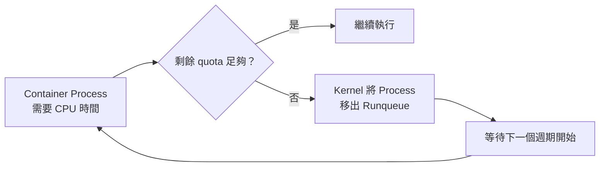
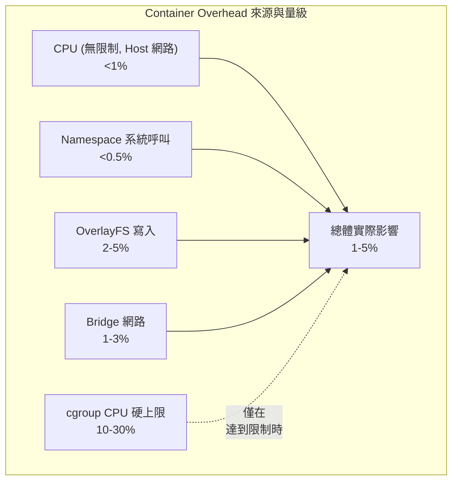

# Docker 的「虛擬化損失」迷思：Container 的本質與實際效能代價

## 摘要

許多人主張「Docker 有虛擬化損失」，但 Container 本質上只是利用 Linux 的 cgroup、namespace 等核心機制對 Process 進行隔離，並不存在如傳統虛擬化（Hypervisor + Guest OS）那般明顯的硬體模擬與資源重複開銷。然而這並不代表 Docker Container 完全沒有效能代價。本報告深入探討 Docker 各個架構層級（cgroup、namespace、Union Filesystem、網路、安全機制）的實際效能影響，並引用 Brendan Gregg、Felter et al. (2015) 等權威研究，說明 Container 的 Overhead 在本質、來源與量級上與傳統虛擬化有根本性的不同。

---

## 1. 核心命題：Container 不是虛擬化

首先必須釐清：Docker Container **不是**虛擬機器。Container 與 Host 共享同一個 Linux Kernel，隔離機制來自 Kernel 內建的：

- **Namespace**：提供隔離視角（PID、Mount、Network、UTS、IPC、User）
- **cgroup (Control Groups)**：提供資源限制與會計（CPU、Memory、I/O）
- **Union Filesystem (OverlayFS)**：提供分層映像檔與寫入層

這些機制都是 Kernel 原生的 Process 管理功能，並非模擬硬體。因此所謂「虛擬化損失 (Virtualization Overhead)」在嚴格定義上並不適用於 Container。但這也帶出了一個常見的誤解：「既然只是 Process，就完全沒有 Overhead」。

事實上，這些隔離與限制機制各有不同程度的效能代價[^brendan-dockercon]。

---

## 2. Docker 各層的效能影響

### 2.1 命名空間 (Namespaces) — 接近零的開銷

Namespace 只是在 Process 的系統呼叫路徑上增加額外的 Kernel 資料結構查找，對每項系統呼叫的影響約在 1% 以下[^kernel-namespaces][^lwn-namespaces]。

| Namespace 類型 | 開銷來源 | 影響程度 |
|---|---|---|
| PID | `fork()`/`clone()` 時進行 PID 映射查詢 | <0.5% |
| Mount | 路徑解析 (`path_openat()`) 時遍歷掛載層級 | <1% |
| Network | Socket 建立、封包收發檢查 namespace 邊界 | <0.5% |
| User | UID/GID 映射額外查詢（選擇性啟用） | <1% |

**結論**：在無資源限制且使用 Host 網路的理想條件下，Container 的 CPU 運算 Overhead 低於 1%，在實際應用中可以忽略[^felter-ibm]。

### 2.2 cgroup (Control Groups) — 資源限制是有代價的

cgroup 是 Container 之所以有意義的關鍵，也是最主要的人為效能影響來源[^cgroup-v2]。

#### CPU cgroup

- **CPU shares（權重模式）**：只在資源競爭時才有效能影響。無競爭時 Overhead 趨近於零。
- **CPU quota（硬上限模式）**：這才是真正的效能殺手。當 Container 耗盡配額時，Kernel 會將其強制閒置到下一個週期開始。Brendan Gregg 指出檢查 `/sys/fs/cgroup/cpu.stat` 中的 `throttled_time` 是診斷 Container CPU 問題的首要步驟[^brendan-cpu]。

具體機制：Kernel 的 CFS 頻寬控制器以 **quota/period** 模型運作，當 cgroup 在給定的 `period`（微秒）內耗盡 `quota` 時，剩餘執行緒會被**節流 (throttled)**，直到下一個週期[^sched-bwc]。



#### Memory cgroup

- 每一頁記憶體分配都需通過 `mem_cgroup_charge()` / `mem_cgroup_uncharge()` 進行會計[^cgroup-v2]。
- 每頁額外維護一個 `page_cgroup` 結構（約 56 bytes）。
- 在達到限制時，Kernel 掃描 cgroup 本地的 LRU 列表進行回收，效率低於全域 LRU。

#### I/O cgroup

- `blkio.throttle` 政策透過計時器延遲超過限制的 I/O 操作。

### 2.3 Union Filesystem (OverlayFS) — 最容易感受到的開銷

Docker 預設使用 OverlayFS 疊加多個唯讀映像層與一個可寫層，這項機制是 **Container 實際使用中最大的效能來源**[^overlayfs]。

#### Copy-on-Write (CoW)

當 Container 首次寫入一個來自底層映像檔的檔案時，OverlayFS 必須將該檔案完整複製到上層（copy-up）。對大型檔案而言，這可能造成明顯的延遲（50-1000ms）。

```
第一次寫入前：Lower Layer (唯讀) ─ 1GB log file
第一次寫入時：Copy-up ─ 將 1GB 檔案複製到 Upper Layer
第一次寫入後：Upper Layer 擁有該檔案的獨立副本
```

#### Metadata Overhead

每個檔案操作（`stat`、`open`、`chmod`）都必須檢查所有層級，對 Metadata 密集的工作負載增加 5-15% 開銷。

#### Docker 官方建議

對於資料庫、日誌等高效能敏感的寫入工作負載，**應使用 Bind Mount 或 Volume** 繞過 Union Filesystem，以獲得原生 I/O 效能[^docker-storage]。

### 2.4 Docker 網路 — 預設 Bridge 模式的開銷

Docker 預設的 Bridge 網路模式加入多層網路處理開銷[^docker-network]：

| 網路模式 | TCP 吞吐量 | 延遲 | 與原生差距 |
|---------|-----------|------|-----------|
| Host (`--net=host`) | ~9.4 Gbps | ~0.12ms | **~0%** |
| Bridge (預設) | ~9.3 Gbps | ~0.16ms | **1-3%** |
| Bridge + 埠映射 | ~9.1 Gbps | ~0.20ms | **3-5%** |
| Overlay (VXLAN) | ~7.5 Gbps | ~0.35ms | **20-25%** |
| Overlay + 加密 | ~4.0 Gbps | ~0.55ms | **55-60%** |

封包路徑：Container eth0 → veth pair → docker0 bridge → iptables NAT (PREROUTING, FORWARD, POSTROUTING) → host eth0

每層都增加了 Kernel 處理成本。

### 2.5 安全機制（seccomp、AppArmor、Capabilities）

- **seccomp-bpf**：每次系統呼叫執行約 50-100 個 BPF 指令（約 100-500ns），開銷低於 0.1%。[^docker-security]
- **AppArmor/SELinux**：LSM Hook 增加 1-5% 檔案操作開銷。
- **Capability 移除**：僅在 exec 時有一次性的權限檢查。

---

## 3. 可量化的效能代價

### 3.1 CPU 計算

| 情境 | 與原生的差距 |
|---|---|
| 原生 Process | 0%（基準） |
| Container，無限制，Host 網路 | **<1%** |
| Container 達到 CPU 硬上限 | **10-30%+** 吞吐量損失 |

Felter et al. (2015) 的 IBM 研究使用 SPEC CPU2006 測試，結果顯示 Container 的 CPU Overhead 在 **1% 以內**[^felter-ibm]。

### 3.2 記憶體

Docker Daemon 本身約耗費 **50-200 MB**（每台 Host 一次），每個 Container 的 cgroup Kernel 結構約 **1-5 MB**。Memcg 會計每頁的 Overhead 約為 1-3%[^cgroup-v2]。

### 3.3 磁碟 I/O

| 場景 | 寫入開銷 | 讀取開銷 |
|---|---|---|
| Overlay2 | 2-5%（冷快取）/ 0-1%（熱快取） | <1% |
| Bind Mount | ~0% | ~0% |

### 3.4 彙整



---

## 4. 傳統虛擬化的架構性開銷

VM 的 Overhead 來自完全不同的根源[^felter-ibm]：

| 面向 | Hypervisor (KVM/Xen) | Docker Container |
|---|---|---|
| CPU 開銷 | 5-15%（Guest OS 排程 + 硬體模擬） | <1%（僅 cgroup 會計） |
| 記憶體開銷 | 10-30%（Guest Kernel + 重複頁面快取） | 1-3%（僅 memcg 結構） |
| I/O 開銷 | 10-20%（VM Exit + I/O 模擬） | 2-5%（僅 CoW 開銷） |
| 啟動時間 | 30-60秒（載入 Guest OS） | <1秒（僅 fork + namespace 隔離） |

VM 的「虛擬化損失」是真實且顯著的，源自於需要模擬完整的硬體並運行第二個作業系統核心。Container 的開銷則主要是 Kernel 隔離機制的會計成本，兩者本質完全不同。

---

## 5. 常見迷思澄清

| 迷思 | 事實 |
|---|---|
| 「Docker 只是 Process，完全沒有效能損失」 | 在無資源限制且使用 Host 網路的純計算情境確實接近零，但使用 cgroup 限額、預設 Bridge 網路、OverlayFS 等 Container 功能時都會引入可測量但微小的開銷。 |
| 「Container 跟裸機一樣快」 | 純 CPU 計算 + Host 網路 + Bind Mount 時確實幾乎一致。但 I/O 密集工作負載（特別是疊加層寫入）或 Bridge 網路模式有 2-5% 的差距。 |
| 「VM 開 20-30%，Container 開 0%」 | VM 的 Overhead（5-15%）確實遠高於 Container（1-5%），但兩者差距來自架構性差異，而非 Container 完全零成本。 |
| 「Container 效能問題一定是應用的問題」 | 不一定。cgroup CPU 硬上限節流可能在無聲中劣化效能，表現得像是應用問題。Brendan Gregg 的整個 DockerCon 演講就是在教如何區分這三種瓶頸來源[^brendan-dockercon]。 |
| 「Mac/Windows 上的 Docker 同樣輕量」 | 錯。Docker Desktop 在 Mac/Windows 上必須在 Linux VM 內運作，這層 VM 疊加本身就引入了 5-15% 的虛擬化損失。WSL2 有所改善但仍非原生。 |

---

## 6. 結論

Docker Container 的效能問題不能被簡單歸類為「虛擬化損失」，因為它從根本上就不是虛擬化。更準確的描述應該是：**Container 引入的隔離與限制機制各有其微小的 Kernel 層級會計成本。**

- **在理想條件下**（Host 網路、Bind Mount、無資源限制、無競爭）：Overhead **<1%**，實際可忽略不計。
- **在典型使用場景**（預設 Bridge 網路 + OverlayFS + CPU/Memory 限制）：Overhead 約 **1-5%**。
- **在極端條件下**（CPU 硬上限、VXLAN Overlay 網路、大量寫入觸發 CoW）：可能達到 **10-30%+**。

因此，說「Docker 有虛擬化損失」是錯誤的框架，但說「Docker 完全沒有效能代價」也是誤解。正確的理解是：**Docker 以極小的效能代價，換取了隔離、可攜性與資源控管等強大的功能。**

---

[^brendan-dockercon]: Gregg, B. (2017). Container Performance Analysis. DockerCon 2017. Retrieved 2026-09-25, from https://brendangregg.com/blog/2017-05-15/container-performance-analysis-dockercon-2017.html

[^felter-ibm]: Felter, W., Ferreira, A., Rajamony, R., & Rubio, J. (2015). An Updated Performance Comparison of Virtual Machines and Linux Containers. ISPASS 2015 — IEEE International Symposium on Performance Analysis of Systems and Software. Retrieved 2026-09-25, from https://ieeexplore.ieee.org/document/7092913

[^cgroup-v2]: Heo, T. (2015). Control Group v2 — cgroup-v2.rst. Linux Kernel Documentation. Retrieved 2026-09-25, from https://www.kernel.org/doc/Documentation/admin-guide/cgroup-v2.rst

[^sched-bwc]: CFS Bandwidth Control — sched-bwc.txt. Linux Kernel Documentation. Retrieved 2026-09-25, from https://www.kernel.org/doc/Documentation/scheduler/sched-bwc.txt

[^overlayfs]: Brown, N. Overlay Filesystem — overlayfs.txt. Linux Kernel Documentation. Retrieved 2026-09-25, from https://www.kernel.org/doc/Documentation/filesystems/overlayfs.txt

[^kernel-namespaces]: Namespaces Compatibility List. Linux Kernel Documentation. Retrieved 2026-09-25, from https://www.kernel.org/doc/html/latest/admin-guide/namespaces/index.html

[^lwn-namespaces]: LWN.net. (2013). Namespaces in operation, part 7: Network namespaces. Retrieved 2026-09-25, from https://lwn.net/Articles/580893/

[^docker-network]: Docker Inc. (n.d.). Networking overview. Retrieved 2026-09-25, from https://docs.docker.com/network/

[^docker-storage]: Docker Inc. (n.d.). Select a storage driver. Retrieved 2026-09-25, from https://docs.docker.com/storage/storagedriver/select-storage-driver/

[^docker-security]: Docker Inc. (n.d.). Docker security. Retrieved 2026-09-25, from https://docs.docker.com/engine/security/