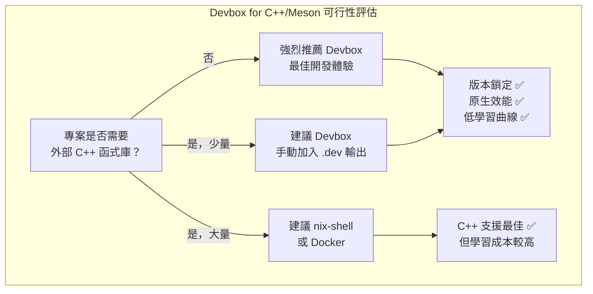

# Devbox 應用於 C++/Meson 專案工具鏈隔離之可行性評估

## 摘要

本報告評估使用 Devbox (Jetify) 在 C++/Meson 專案中隔離編譯器、clang-tidy 等工具鏈的可行性與效益。Devbox 底層使用 Nix 套件管理器，提供宣告式 JSON 設定與隔離 shell，可簡化開發環境配置。然而針對 C++ 開發場景，存在關鍵的 `*-dev` 輸出缺失問題（未自動包含標頭檔），且在 CI/CD 非互動式使用上有待加強。整體而言，對於不涉及複雜 C/C++ 函式庫相依的專案，Devbox 是優秀的方案；對於需要大量 C++ 函式庫標頭檔的專案，需搭配手動 workaround 或考慮使用原生 Nix shell。

## 1. 研究背景

### 1.1 C++/Meson 專案的工具鏈隔離需求

在現代 C++ 開發中，工具鏈隔離解決的核心問題包括[^devbox-intro]：

- **編譯器版本衝突**：不同專案可能要求不同版本的 GCC 或 Clang（如 GCC 12 vs GCC 14）
- **靜態分析工具一致性**：clang-tidy、cppcheck、include-what-you-use 的版本應與 CI/CD 環境一致
- **建置系統版本鎖定**：Meson、Ninja、pkg-config 等工具的版本需統一
- **「在我機器上可以跑」症候群**：消除團隊成員間的環境差異

### 1.2 評估範圍

本報告聚焦於 Devbox 作為 C++ 開發環境隔離方案，評估面向包括：

- 工具鏈支援完整性（編譯器、靜態分析工具、建置系統）
- C++ 開發特有的依賴管理能力（標頭檔、函式庫）
- 易用性（學習曲線、設定複雜度）
- 效能影響（建置速度、I/O 開銷）
- CI/CD 整合成熟度

## 2. Devbox 對 C++/Meson 工具鏈的支援

### 2.1 編譯器

Devbox 透過 Nixpkgs 提供豐富的編譯器版本支援[^nixhub-gcc][^nixhub-clang]：

| 套件 | 可用版本範圍 | 範例 |
|------|-------------|------|
| **GCC** | 4.8.5 ~ 16.2.0 | `gcc@14.2.0`、`gcc@12` |
| **Clang** | 7.1.0 ~ 21.1.8 | `clang@18.1.8`、`clang@latest` |

支援精確版本（如 `gcc@14.2.0`）與 semver 語意版本（如 `gcc@14`）鎖定[^devbox-docs]。

### 2.2 建置系統

Meson 與其生態工具均可透過 Devbox 安裝[^nixhub-meson][^nix-meson]：

| 套件 | 可用版本範圍 | 說明 |
|------|-------------|------|
| **Meson** | 0.54.2 ~ 1.10.2 | C/C++ 建置系統（Python 實作） |
| **Ninja** | latest | Meson 底層的建置執行器 |
| **pkg-config** | latest | 函式庫相依性發現工具 |
| **CMake** | latest | 替代建置系統 |

在 Devbox 中只需加入一行即可：

```json
{
  "packages": ["gcc@14.2.0", "meson@1.10.2", "ninja@latest", "pkg-config@latest"]
}
```

### 2.3 靜態分析與程式碼品質工具

Devbox 完整支援所有常見的 C++ 品質工具[^nixhub-clang-tools][^nixhub-cppcheck][^nixhub-iwyu]：

| 工具 | Nix 套件名稱 | 可用版本範圍 | 說明 |
|------|-------------|-------------|------|
| **clang-tidy** | `clang-tools` | 10.0.0 ~ 21.1.8 | 靜態分析（與 clang-format、clangd 同捆） |
| **clang-format** | `clang-tools` | 同上 | 程式碼格式化 |
| **cppcheck** | `cppcheck` | 2.0 ~ 2.21.1 | C/C++ 靜態分析 |
| **include-what-you-use** | `include-what-you-use` | 0.13 ~ 0.26 | #include 依賴分析 |

完整的 C++ 開發環境範例：

```json
{
  "packages": [
    "gcc@14.2.0",
    "clang-tools@18.1.8",
    "cppcheck@2.16.0",
    "include-what-you-use@0.26",
    "meson@1.10.2",
    "ninja@latest",
    "pkg-config@latest"
  ]
}
```

### 2.4 外掛生態系

Devbox 內建 14 個外掛（apacheHttpd、caddy、elixir、gradle、haskell、mariadb、nodejs、php、poetry、postgresql、python、redis、ruby、rustc、valkey），但**目前沒有針對 Meson、CMake、GCC、Clang 或任何 C/C++ 開發框架的專用外掛**[^devbox-plugins]。由於 Devbox 依賴 Nixpkgs 原生提供 C++ 工具鏈，這些工具不需外掛即可使用，這也是 C/C++ 工具與直譯式語言（如 Python、PHP）的本質差異。

## 3. 關鍵發現：C++ 開發的核心問題

### 3.1 `*-dev` 輸出缺失問題（重大）

這是在 C++ 開發中使用 Devbox 最關鍵的已知問題[^issue-2761][^issue-2757]。

**問題描述**：
在 Nixpkgs 中，函式庫的標頭檔被存放在 `dev` 輸出（output）中。使用 `nix-shell` 時，Nix 會自動將 `dev` 輸出加入建置環境，讓 `#include <yaml.h>` 等運作。但 **Devbox 不會自動拉取 `dev` 輸出**，導致編譯器找不到標頭檔。

**具體範例**：
```json
{
  "packages": ["gcc@latest", "libyaml@latest"]
}
```

```c
// main.c
#include <yaml.h>  // 錯誤：找不到標頭檔
void main(){}
```

**Workaround**：
手動加入 `.dev` 輸出：
```json
{
  "packages": ["gcc@latest", "libyaml@latest", "libyaml.dev"]
}
```

**影響評估**：
- 對於僅使用標準函式庫、不依賴外部 C/C++ 函式庫的專案：**無影響**
- 對於使用系統層級函式庫（如 OpenSSL、libcurl、Boost）的專案：**需逐一手動加入 `.dev` 輸出**
- 對於複雜的多依賴專案：**相當不便**，可能降低 Devbox 的易用性優勢

### 3.2 系統函式庫缺失問題

Devbox 隔離的 shell 無法存取主機系統的函式庫[^issue-2829]：

- 需要 X11、OpenGL、ALSA 等系統層級函式庫的 C++ 專案，必須在 Nixpkgs 中找到對應套件
- 若所需函式庫不在 Nixpkgs 中，開發者需要撰寫自訂 Nix derivation

### 3.3 非互動式 CI/CD 支援待加強

Issue #2797 指出，Devbox 在 CI/CD 環境中存在 PATH 與環境變數未正確應用的問題[^issue-2797]。雖然 `devbox run` 和 `devbox shell -c` 提供了基本支援，但在容器中執行時，環境變數的傳遞仍不夠完善。

## 4. 與替代方案比較

### 4.1 功能對照表

| 面向 | Devbox | Docker | nix-shell | mise |
|------|--------|--------|-----------|------|
| **抽象層級** | 系統套件 + 語言工具 | 完整容器 | 系統套件 | 語言執行環境 |
| **C++ 標頭檔處理** | ⚠️ 需手動 `.dev` | ✅ 清晰（明確安裝） | ✅ 自動包含 | ❌ 不適用 |
| **Meson 支援** | ✅ 可安裝 | ✅ Dockerfile | ✅ 完整 setup hook | ❌ |
| **clang-tidy 等工具** | ✅ 版本鎖定 | ✅ Docker image | ✅ 版本鎖定 | ✅ 部分 |
| **非 C++ 套件生態** | 400,000+ Nixpkgs | 任何 Docker image | 400,000+ | 依外掛 |
| **學習曲線** | 低 (JSON) | 中 (Dockerfile) | 高 (Nix 語言) | 低 |
| **虛擬化開銷** | 無（原生執行） | 1-5%（典型） | 無 | 無 |
| **可重現性** | ✅ 精確 (lock file) | ✅ 精確 (image digest) | ✅ 精確 (flake) | ⚠️ 依版本 |
| **CI/CD 成熟度** | ⚠️ 待加強 | ✅ 業界標準 | ✅ 完善 | ✅ 完善 |

### 4.2 情境建議

| 使用情境 | 推薦方案 | 理由 |
|----------|---------|------|
| 僅編譯器 + clang-tidy（無外部函式庫） | Devbox | 設定最簡單，效能最佳 |
| 需要多個外部 C++ 函式庫 | nix-shell / Docker | Devbox 的 `.dev` 問題增加管理負擔 |
| 團隊新手多、需快速上手 | Devbox | JSON 設定簡單直觀 |
| CI/CD 為核心需求 | Docker | 成熟度最高 |
| 需要完整可重現性且願意投資學習 | nix-shell (Flakes) | 最正確的 C++ 支援 |

## 5. 效益分析

### 5.1 採用 Devbox 的優勢

1. **極低的學習曲線**：JSON 設定檔取代 Nix 語言的複雜語法，團隊成員可快速上手
2. **原生執行效能**：無 Docker 的 OverlayFS CoW 開銷與 Volume Mount 延遲，C++ 編譯（I/O 密集型）可獲得最大效能
3. **跨平台一致性**：同一份 `devbox.json` 在 Linux、macOS、WSL2 上運作
4. **版本精確鎖定**：lock file 機制確保工具版本可重現
5. **Direnv 整合**：進入目錄自動啟用開發環境，降低認知負擔
6. **Dockerfile 產生**：開發用 Devbox，部署用 Docker，流程順暢

### 5.2 採用 Devbox 的劣勢與風險

1. **C++ 函式庫標頭檔問題**：Issue #2761 / #2757 是最大障礙，需要持續關注修復進度
2. **無 C++ 專用範例**：官方範例缺乏 C++ 場景，團隊需要自行摸索最佳實務
3. **CI/CD 成熟度不足**：非互動式環境的支援仍有 gap
4. **Nix Store 磁碟空間**：隨時間累積可能佔用大量空間
5. **專案健康度風險**：核心維護者過度集中（bus factor 高），Jetify 商業模式依賴雲端服務

### 5.3 量化效益預估

| 面向 | 預期效益 | 備註 |
|------|---------|------|
| **新成員 onboarding 時間** | 減少 60-80% | 從手動安裝腳本 → `devbox shell` |
| **環境相關除錯時間** | 減少 90%+ | 消除「在我機器上可以跑」問題 |
| **編譯效能** | 與原生無差異 | 無虛擬化開銷 |
| **工具版本一致性** | 100% | lock file 確保 |
| **切換專案成本** | 趨近於零 | Direnv 自動化 |

## 6. 實作建議

### 6.1 建議的 `devbox.json` 範本

針對 Meson 專案的基本設定：

```json
{
  "packages": [
    "gcc@14.2.0",
    "clang-tools@18.1.8",
    "cppcheck@2.16.0",
    "include-what-you-use@0.26",
    "meson@1.10.2",
    "ninja@latest",
    "pkg-config@latest"
  ],
  "shell": {
    "init_hook": [
      "echo 'C++/Meson dev environment activated'",
      "export CC=gcc",
      "export CXX=g++"
    ],
    "scripts": {
      "configure": "meson setup builddir",
      "build": "meson compile -C builddir",
      "test": "meson test -C builddir",
      "lint": "run-clang-tidy -p builddir",
      "format": "find . -name '*.cpp' -o -name '*.hpp' | xargs clang-format -i",
      "clean": "rm -rf builddir"
    }
  }
}
```

### 6.2 處理外部函式庫依賴

若專案依賴外部 C++ 函式庫，需為每個函式庫手動加入 `.dev` 輸出：

```json
{
  "packages": [
    "gcc@14.2.0",
    "meson@1.10.2",
    "ninja@latest",
    "pkg-config@latest",
    "openssl@latest",
    "openssl.dev",
    "zlib@latest",
    "zlib.dev",
    "boost@latest",
    "boost.dev"
  ]
}
```

或者考慮在專案初期就評估直接使用 Nix Flake（`flake.nix`）搭配 `nix develop`，獲得最佳的 C++ 支援。

### 6.3 建議採用條件

| 條件 | 建議 |
|------|------|
| 專案完全無外部 C++ 函式庫相依 | ✅ 強烈建議採用 Devbox |
| 僅依賴少數（<5 個）外部函式庫 | ✅ 建議採用，手動加入 `.dev` |
| 依賴大量外部函式庫（>10 個） | ⚠️ 考慮 nix-shell 或 Docker |
| 需要 X11/OpenGL 等系統函式庫 | ❌ 不建議，優先使用 Docker |
| CI/CD 完全在容器內執行 | ⚠️ 建議 Devbox + Dockerfile 產生 |

## 7. 結論

Devbox 在 C++/Meson 專案的工具鏈隔離上具有**顯著的潛力**，特別是在工具鏈版本鎖定、原生效能、低學習曲線等方面。然而，**C++ 函式庫標頭檔問題（Issue #2761）是當前最大的採用障礙**，對於需要使用外部 C++ 函式庫的專案，需要手動 workaround 或考慮替代方案。

### 總結評估



### 最終建議

對於評估中的專案，若符合以下條件，強烈建議採用 Devbox：

1. **編譯器與工具鏈版本隔離**是主要需求
2. **不大量依賴外部 C/C++ 函式庫**（或願意手動加入 `.dev` 輸出）
3. **團隊希望快速上手**，不希望學習 Nix 語言
4. **開發環境需要跨平台一致**（Linux/macOS/WSL2）

若專案的 C++ 函式庫依賴非常複雜（如 Boost、OpenGL、GUI 框架），建議考慮使用原生 Nix Flake + `nix develop`，或維持 Docker 方案，待 Devbox 社群解決 `*-dev` 輸出問題後再重新評估。

---

[^devbox-intro]: Jetify Inc. (n.d.). Devbox - Instant, easy, and predictable development environments. Retrieved 2026-09-25, from https://www.jetify.com/devbox/docs/

[^nixhub-gcc]: Jetify Inc. (n.d.). Nixhub - gcc package versions. Retrieved 2026-09-25, from https://nixhub.io/packages/gcc

[^nixhub-clang]: Jetify Inc. (n.d.). Nixhub - clang package versions. Retrieved 2026-09-25, from https://nixhub.io/packages/clang

[^nixhub-meson]: Jetify Inc. (n.d.). Nixhub - meson package versions. Retrieved 2026-09-25, from https://nixhub.io/packages/meson

[^nixhub-clang-tools]: Jetify Inc. (n.d.). Nixhub - clang-tools package versions. Retrieved 2026-09-25, from https://nixhub.io/packages/clang-tools

[^nixhub-cppcheck]: Jetify Inc. (n.d.). Nixhub - cppcheck package versions. Retrieved 2026-09-25, from https://nixhub.io/packages/cppcheck

[^nixhub-iwyu]: Jetify Inc. (n.d.). Nixhub - include-what-you-use package versions. Retrieved 2026-09-25, from https://nixhub.io/packages/include-what-you-use

[^devbox-docs]: Jetify Inc. (n.d.). Devbox - Configuration - devbox.json. Retrieved 2026-09-25, from https://www.jetify.com/devbox/docs/configuration/

[^devbox-plugins]: Jetify Inc. (n.d.). Devbox - Plugins. Retrieved 2026-09-25, from https://github.com/jetify-com/devbox/blob/main/plugins/builtins.go

[^nix-meson]: NixOS. (n.d.). Meson package definition - Nixpkgs. Retrieved 2026-09-25, from https://github.com/NixOS/nixpkgs/blob/master/pkgs/by-name/me/meson/package.nix

[^issue-2761]: Jetify Inc. (2024). GitHub Issue #2761 - Devbox does not pull *-dev outputs into build environment. Retrieved 2026-09-25, from https://github.com/jetify-com/devbox/issues/2761

[^issue-2757]: Jetify Inc. (2024). GitHub Issue #2757 - How are libraries as dependencies supposed to work?. Retrieved 2026-09-25, from https://github.com/jetify-com/devbox/issues/2757

[^issue-2829]: Jetify Inc. (2025). GitHub Issue #2829 - Problems finding files in devbox shell. Retrieved 2026-09-25, from https://github.com/jetify-com/devbox/issues/2829

[^issue-2797]: Jetify Inc. (2025). GitHub Issue #2797 - Non-interactive CI/CD support. Retrieved 2026-09-25, from https://github.com/jetify-com/devbox/issues/2797