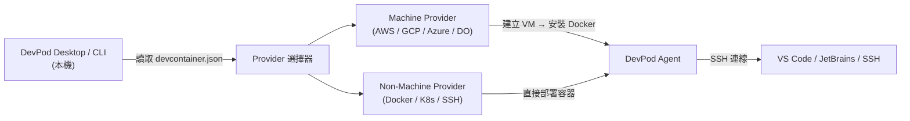

# DevPod 介紹：開源、無供應商鎖定的開發環境管理工具

## 概述

**DevPod** 是由 [Loft Labs](https://loft.sh) 開發的開源工具，旨在建立**可重現的開發者環境**，遵循 [devcontainer.json](https://containers.dev/) 標準。其官方標語為：*"Codespaces but open-source, client-only and unopinionated: Works with any IDE and lets you use any cloud, kubernetes or just localhost docker."*[^gh-readme]

開發者環境的一致性是軟體工程的一大難題。傳統方案各有侷限：GitHub Codespaces 鎖定 Azure、VS Code Dev Containers 限於本機 Docker、Coder 需要部署中央伺服器。DevPod 的設計目標是作為**本機 IDE 與任何後端運算資源之間的膠水**，讓開發者自由選擇環境的運行位置，而不被任何供應商綁定。

## 核心架構

DevPod 採用 **client-only 的 client-agent 架構**，無需伺服器元件：



### 四大元件

**1. DevPod Client（Desktop App + CLI）**

完全在本機執行，無需伺服器後端。提供 Electron 桌面應用程式（支援 macOS、Windows、Linux）與功能完整的命令列工具。負責管理工作區、Provider 與 IDE 連線。

**2. Provider 系統**

Provider 是透過 `provider.yaml` 宣告的小型 CLI 程式，DevPod 呼叫它們來建立、管理與銷毀環境。分為兩種類型：

- **Machine Providers** — 建立完整 VM（如 AWS EC2、GCP Compute Engine、DigitalOcean Droplets），處理完整生命週期：`create` → `start` → `stop` → `delete`
- **Non-Machine Providers** — 直接對現有基礎設施操作容器（如 Docker、Kubernetes、SSH 遠端主機）

`provider.yaml` 可定義 `exec.command`（必填）、`exec.create/delete/start/stop/status`（選填，管理機器生命週期）、`options`（可配置變數如區域、執行個體類型、API 金鑰）、`agent` 與 `binaries` 等設定。[^providers-docs]

**3. DevPod Agent**

當 DevPod 連線到環境時，會將自己注入為 **agent**，負責：

- 在目標上部署容器
- 同步 Git 憑證
- 同步 Docker 憑證
- 執行 SSH 伺服器供 IDE 連線
- 閒置自動關機

**4. Drivers（驅動程式）**

Agent 使用 Driver 來部署工作區容器：

- **Docker driver**（預設）— 透過目標機器上的 Docker 執行容器
- **Kubernetes driver** — 將容器以 Pod 形式部署到 Kubernetes 叢集，可選用 BuildKit 進行映像建置

## 主要功能

| 功能 | 說明 |
|------|------|
| **DevContainer 標準** | 使用開放的 devcontainers.org 標準，與 GitHub Codespaces 及 VS Code Dev Containers 相容 |
| **多後端支援** | 可在本機 Docker、Kubernetes、SSH 或任何雲端 Provider 上執行 |
| **跨 IDE 支援** | VS Code（Remote SSH）、完整 JetBrains 套件（CLion、GoLand、PyCharm、IntelliJ 等）、VS Code Browser（openvscode-server）及任何支援 SSH 的 IDE |
| **自動閒置關機** | 可設定閒置時間（預設 5-10 分鐘）後自動停止 VM/容器，節省成本 |
| **預建（Prebuilds）** | 預先建置 dev container 映像，加速工作區啟動 |
| **憑證同步** | 自動將本機 Git 憑證、Docker 憑證與 GPG 金鑰注入遠端環境 |
| **Dotfiles 支援** | 自動將 dotfiles 儲存庫複製並套用到工作區 |
| **語言自動偵測** | 若無 `devcontainer.json`，自動偵測語言並提供合適的模板 |
| **多工作區** | 可從同一儲存庫建立多個工作區（使用 `--id` 旗標） |[^docs-what-is-devpod]

## 支援的 Provider

### 官方 Provider（由 Loft Labs 維護）

| Provider | 類型 | 說明 |
|----------|------|------|
| Docker | Non-Machine | 本機 Docker 或 Podman，最簡單的 Provider |
| Kubernetes | Non-Machine | 使用本機 kubeconfig 部署到任何 K8s 叢集 |
| SSH | Non-Machine | 透過 SSH 連線到任何可存取的遠端機器 |
| AWS | Machine | EC2 執行個體（預設 c5.xlarge，40GB 磁碟） |
| Google Cloud | Machine | GCP Compute Engine VM（預設 c2-standard-4，40GB 磁碟） |
| Azure | Machine | Azure VM |
| DigitalOcean | Machine | DigitalOcean Droplet |

### 社群 Provider

Cloudbit、Flow、Hetzner、OVHcloud、Scaleway、Exoscale、Multipass、Open Telekom Cloud、Vultr、STACKIT，以及 Terraform Provider。[^providers-list]

## 與替代方案比較

| 面向 | DevPod | GitHub Codespaces | Coder | VS Code Dev Containers |
|------|--------|-------------------|-------|------------------------|
| **架構** | Client-only，無伺服器 | SaaS（GitHub 代管） | Server-based（coderd） | Client-only，本機 Docker |
| **後端** | 任何雲端、K8s、SSH、本機 Docker | 僅 Azure VM | K8s 或 VM（透過 Coder agent） | 僅本機 Docker |
| **IDE** | VS Code、JetBrains、任何 SSH IDE | VS Code 為主 | VS Code、JetBrains | 僅 VS Code |
| **供應商鎖定** | **無** — 可自由切換 Provider | **高** — 鎖定 GitHub/Azure | **中** — 需執行 Coder 伺服器 | **無** — 只需 Docker |
| **成本** | 5-10 倍便宜（直接使用雲端 VM + 自動關機） | 有限免費時數，之後約 $0.50+/hr | 自架免費（負擔基礎設施成本） | 免費（僅用本機運算） |
| **設定複雜度** | 低（下載 App，加入 Provider） | 低（SaaS） | 中高（需部署伺服器） | 低（安裝 Docker） |
| **開源** | ✅ MPL-2.0 | ❌ 專有軟體 | ✅ AGPL | ✅ MIT（核心） |
| **預建** | ✅ 有 | ✅ 有 | ✅ 有 | ❌ 無 |
| **自動關機** | ✅ 可設定 | ✅ 有 | ✅ 有 | ❌ 無 |

### 關鍵差異

- **vs Codespaces**：DevPod 是 **client-only**（無伺服器），允許使用**任何後端**而非鎖定 Azure。官方宣稱成本可降低 5-10 倍。
- **vs Coder**：Coder 需要執行中央伺服器（coderd）與 agent。DevPod **無需伺服器**，純客戶端架構。Coder 較適合大規模企業多租戶場景；DevPod 更簡單、更具可攜性。
- **vs VS Code Dev Containers**：Dev Containers 僅能搭配本機 Docker 且僅支援 VS Code。DevPod 將相同的 `devcontainer.json` 標準擴展到**任何後端**與**任何 IDE**。

## 適用對象

### 個人開發者
- 在多台機器間需要**一致開發環境**的開發者
- 需要比筆電更強運算能力的開發者（如機器學習、大型編譯）
- 想嘗試雲端開發但不想被供應商綁定的開發者

### 開發團隊
- 想要**可重現環境**但不想強迫所有人使用同一種雲端的團隊
- 想要**成本控制**的團隊 — 自動關閉閒置 VM 可顯著節省開支
- 已經使用 `devcontainer.json`，想將相同配置用在任何後端的團隊

### 平台 / DevOps 工程師
- 需要**建置自訂基礎設施整合**的工程師（Provider 系統開放且可程式化）
- 管理 Kubernetes 叢集、想提供**自助式開發者環境**的團隊
- 有**合規/安全要求**而無法使用代管服務的組織

## 專案狀態

| 指標 | 數值 |
|------|------|
| GitHub Stars | **15.2k** ⭐ |
| Forks | ~590 |
| Commits | 2,413+ |
| 授權條款 | MPL-2.0（Mozilla Public License） |
| 最新版本 | v0.7.0-alpha.34（2025-06-23） |
| 近期活動 | 持續活躍開發中 |

該專案**積極維護中**，15.2k 星對於開發者工具而言是相當強勁的信號。Loft Labs 是一家資金充裕的新創公司，同時也開發了知名的 Kubernetes 虛擬叢集工具 vCluster，因此 DevPod 有穩固的商業支援。[^gh-releases][^gh-commits]

## Quick Start

```bash
# CLI 安裝（Linux）
curl -L -o devpod "https://github.com/loft-sh/devpod/releases/latest/download/devpod-linux-amd64" && sudo install -c -m 0755 devpod /usr/local/bin && rm -f devpod

# 加入 Docker Provider 並建立工作區
devpod provider add docker
devpod up github.com/microsoft/vscode-remote-try-node
```

或從 [GitHub Releases](https://github.com/loft-sh/devpod/releases) 下載桌面應用程式。[^install-docs]

## 結論

DevPod 填補了開發環境管理工具中的一個明確空白：它提供了一個**開源、無供應商鎖定、client-only** 的方案，讓開發者可以自由選擇環境的運行位置。其 Provider 系統使其極具擴展性，而與 devcontainer.json 標準的相容性則降低了既有專案的遷移成本。對於追求成本效益與靈活性的團隊，DevPod 是目前市場上最具吸引力的選項之一。

---

[^gh-readme]: loft-sh. (n.d.). _DevPod – GitHub Repository_. Retrieved 2026-09-25, from https://github.com/loft-sh/devpod
[^docs-what-is-devpod]: DevPod. (n.d.). _What is DevPod?_. Retrieved 2026-09-25, from https://devpod.sh/docs/what-is-devpod
[^providers-docs]: DevPod. (n.d.). _What are Providers?_. Retrieved 2026-09-25, from https://devpod.sh/docs/managing-providers/what-are-providers
[^providers-list]: DevPod. (n.d.). _Add a Provider_. Retrieved 2026-09-25, from https://devpod.sh/docs/managing-providers/add-provider
[^install-docs]: DevPod. (n.d.). _Install DevPod_. Retrieved 2026-09-25, from https://devpod.sh/docs/getting-started/install
[^gh-releases]: GitHub – loft-sh/devpod. (n.d.). _Releases_. Retrieved 2026-09-25, from https://github.com/loft-sh/devpod/releases
[^gh-commits]: GitHub – loft-sh/devpod. (n.d.). _Commit History_. Retrieved 2026-09-25, from https://github.com/loft-sh/devpod/commits/main