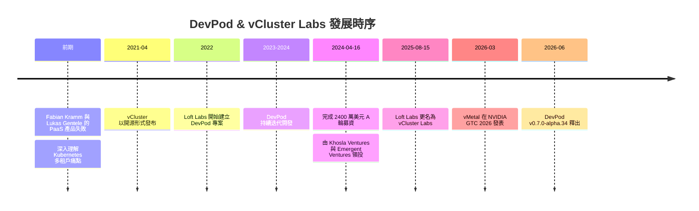

# DevPod 專案背景調查報告

## 概述

DevPod 是一個開源的遠端開發環境工具，被稱為「開源版的 GitHub Codespaces」，由 vCluster Labs（原名 Loft Labs）開發與維護。本報告針對該專案背後的公司、創辦團隊、資金來源、社群規模及生態系進行調查。

---

## 1. 公司背景：vCluster Labs（原名 Loft Labs）

### 基本資訊

vCluster Labs（法律名稱：Loft Labs, Inc. dba vCluster Labs）[^privacy] 是一家總部位於美國的遠端優先（remote-first）新創公司，專注於 Kubernetes 多租戶（multi-tenancy）與開發者環境基礎設施。公司團隊擁有 40 多名基礎設施工程師[^careers]。

### 轉型與更名

2025 年 8 月 15 日，公司從 **Loft Labs** 更名為 **vCluster Labs**，將公司名稱與其旗艦專案 vCluster 對齊。CEO Lukas Gentele 表示：「隨著時間推移，vCluster 已不僅是我們的專案之一，而是定義我們的品牌。」[^rebrand]

### 公司願景與產品線

公司目標是「打造在自有硬體上運行生產級 Kubernetes 與 AI 基礎設施的開源基礎」[^orgprofile]。旗下產品包括：

| 專案 | 說明 |
|------|------|
| **vCluster** | Kubernetes 虛擬集群，隔離的 Tenant Clusters |
| **DevPod** | 開源遠端開發環境工具 |
| **vind** | 基於 Docker 的 Kubernetes 叢集（替代 KinD） |
| **vNode** | 執行時期層級隔離（Kernel-enforced boundaries） |
| **vMetal** | Bare metal 機器管理層 |
| **jsPolicy** | Kubernetes 政策引擎 |
| **vBilling** | AI Cloud 計費管線（Pipeline） |
| **DevSpace** | Kubernetes 開發工具 |

### 客戶與採用情況

公司官網顯示其服務規模與客戶包括[^orgprofile]：

- **1 億+** Tenant Clusters 已部署
- **30K+** GitHub Stars（全專案合計）
- **5K+** Slack 社群成員
- **10 萬+** GPUs 驅動
- **100 萬+** CPUs 驅動
- **50+** GPU 雲端與財富 500 大企業客戶

主要客戶包含：**NVIDIA**（GTC 大會合作、DGX 參考架構）、**Adobe**（KubeCon 分享如何使用 vCluster 交付隔離 Kubernetes 環境給內部團隊）、**CoreWeave**、**JPMorganChase**、**Deloitte**、**Nebius**、**Atlan**、**Aussie Broadband**、**Lintasarta** 等[^blog][^customers]。

---

## 2. 創辦團隊

### Lukas Gentele — CEO 與共同創辦人

- **GitHub**: [@LukasGentele](https://github.com/LukasGentele)[^lgentele]
- **所在地**: 美國舊金山
- **背景**: 與 Fabian Kramm 共同創立公司之前，曾開發一款失敗的 PaaS 產品，這個經歷讓他們深刻理解 Kubernetes 多租戶的痛點，並催生了 vCluster 的理念[^seriesa]。

### Fabian Kramm — CTO 與共同創辦人

- **GitHub**: [@FabianKramm](https://github.com/FabianKramm)[^fkramm]
- **所在地**: 德國
- **頭銜**: 「CTO & Co-Founder @loft-sh, Creator of vCluster, vNode, DevPod, DevSpace, jsPolicy & loft」[^fkramm]
- **角色**: 公司多個旗艦開源專案的原始架構師與主要技術負責人

### 其他關鍵維護者

根據 DevPod 的釋出版本記錄與 COMMUNITY.md[^devpodreleases][^community]：

- **Pascal Breuninger**（@pascalbreuninger）— DevPod 的主要活躍維護者，負責多數版本釋出
- **bkneis**（@bkneis）— DevPod 活躍維護者
- **janekbaraniewski**（@janekbaraniewski）— 貢獻者（例如 Docker credentials 支援）
- **Hrittik Roy**（@hrittikhere）— 團隊成員，社群事件報告聯絡人

---

## 3. 資金與投資者

### 已知融資歷程

**種子輪（Seed Round）**：公司曾完成種子輪募資（金額未公開揭露），用於建構 Kubernetes 多租戶工具並從隱身模式（stealth mode）中推出[^seriesa]。

**A 輪 — 2400 萬美元（2024 年 4 月 16 日）**[^seriesa]：

| 項目 | 內容 |
|------|------|
| **主導投資者** | **Khosla Ventures**（合夥人 Jon Chu 參與） |
| **參與投資者** | **Emergent Ventures**（合夥人 Anupam Rastogi 參與） |
| **募資金額** | 2400 萬美元 |
| **募資目的** | 擴展 vCluster 開發、壯大 DevPod、擴增團隊 |

A 輪宣布時公司狀態：
- 過去 12 個月經常性收入成長 **4.6 倍**
- 團隊規模翻倍
- 客戶從快速成長的新創（CoreWeave、Atlan）到 5 家全球財富 500 大公司
- vCluster 達到 **5,000+ GitHub Stars**、**100+ 貢獻者**、**3,000+ Slack 成員**、**4000 萬+ 虛擬叢集部署**

### 財務健康指標

- 2025 年公司收入「幾乎成長三倍」，團隊規模翻倍[^blog2026]
- 公司職缺頁面自稱為「VC-backed tech startup in hyper-growth」（風險投資支持的高速成長科技新創）[^careers]
- 截至 2026 年 9 月，未發現新的融資輪或收購消息

---

## 4. DevPod 專案概況

### 專案定位

DevPod 被描述為：「Codespaces but open-source, client-only, and unopinionated: Works with any IDE and lets you use any cloud, Kubernetes, or just localhost docker.」[^devpodrepo]

### 核心架構

- **Client-only**：無需伺服器端設定，所有操作在本機執行
- **Provider 模型**：提供者為簡單的 CLI 程式，負責建立、管理與連接工作區。分為 Machine Providers（管理 VM）與 Non-machine Providers（直接操作容器）
- **DevContainer 標準**：採用開放的 `devcontainer.json` 規範（與 GitHub Codespaces 及 VS Code DevContainers 相同），確保環境可重現性[^devpoddocs]

### 支援的後端

官方維護的 Provider[^devpodproviders]：

| Provider | 後端 |
|----------|------|
| **Docker** | 本機 Docker daemon |
| **Kubernetes** | 任何 Kubernetes 叢集 |
| **SSH** | 任何可連線的遠端機器 |
| **AWS** | EC2 執行個體 |
| **Google Cloud** | GCP Compute Engine |
| **Azure** | Azure VM |
| **DigitalOcean** | DigitalOcean Droplets |

社群維護的 Provider 包含：Hetzner、OVHcloud、Scaleway、Exoscale、Multipass、Vultr、STACKIT、Nomad、Oracle Cloud 等十餘種第三方整合[^communityproviders]。

### IDE 支援

- **VS Code** — 完整原生支援
- **JetBrains Suite** — 完整原生支援（IntelliJ、PyCharm、GoLand 等）
- **任何 IDE via SSH** — 支援 SSH 連線的工具均可使用

### 相對於競品的定位

| 比較對象 | DevPod 優勢 |
|----------|------------|
| GitHub Codespaces | 便宜 5-10 倍、無廠商鎖定、可使用任何雲端或後端 |
| JetBrains Spaces | Client-only、無需伺服器、開源 |
| Google Cloud Workstations | 支援所有 IDE（VS Code + JetBrains）、可進行本機開發 |

---

## 5. 社群規模

### GitHub 統計數據

| 指標 | 數值 |
|------|------|
| **GitHub Stars** | **15,200**（15.2K） |
| **Forks** | **588** |
| **Commits** | **2,413** |
| **相依儲存庫** | 45 repositories、39 packages |
| **授權條款** | **MPL-2.0**（Mozilla Public License 2.0） |
| **釋出版本** | 21 頁以上的釋出記錄 |

最新版本：**v0.7.0-alpha.34**（2026 年 6 月 23 日）[^devpodreleases]

### 語言組成

主要使用 **Go**（核心 CLI/後端）、**TypeScript**（透過 Electron 的桌面應用程式），以及 Shell、Dockerfile、HCL、Rust 等。

### 社群管道

- **Slack**：[slack.loft.sh](https://slack.loft.sh/) — 活躍的社群聊天
- **Twitter/X**：[@loft_sh](https://x.com/loft_sh)
- **部落格**：[loft.sh/blog](https://loft.sh/blog)
- **官方網站**：[devpod.sh](https://devpod.sh)
- **維護者社群會議**：定期舉行，記錄於 COMMUNITY.md

---

## 6. 生態系與第三方擴展

### Provider 生態

DevPod 的 Provider 模型使其具備高度可擴展性。社群已建立超過 10 個第三方 Provider，涵蓋各大雲端服務商、VPS 供應商，以及 Nomad 等調度平台[^communityproviders]：

- **Hetzner**（@mrsimonemms, 49 stars）
- **OVHcloud**（@alexandrevilain, 17 stars）
- **Scaleway / Exoscale**（@dirien）
- **Multipass**（@minhio, 16 stars）
- **Oracle Cloud / OCI**（@ken-tolwyn, @haroondilshad）
- 以及其他多個 Provider

### 依賴生態

根據 GitHub 相依網路，有 45 個儲存庫與 39 個套件依賴於 DevPod[^devpoddeps]，顯示該專案已被廣泛整合於其他工具鏈中。

---

## 7. 時序發展

---

## 8. 資料來源反思

本報告的資訊主要來自 GitHub 儲存庫、公司官方部落格、公司官網及職缺頁面。多數資訊屬於公司自行發布的一手資料（尤其是客戶名單、資金資訊與社群數據），可能存在一定程度的選擇性呈現偏誤（selection bias）與正向偏差（optimism bias）。客戶規模與採用數據缺乏第三方獨立驗證。GitHub Stars、Forks、Commits 等公開數據則可在 GitHub 平台上獨立驗證，可信度較高。

---

[^privacy]: vCluster Labs. (n.d.). Privacy Policy. Retrieved 2026-09-25, from https://loft.sh/legal/privacy

[^rebrand]: vCluster Labs. (2025-08-15). Loft Labs is now vCluster Labs. Retrieved 2026-09-25, from https://loft.sh/blog/loftlabs-is-now-vcluster-labs

[^careers]: vCluster Labs. (n.d.). Careers. Retrieved 2026-09-25, from https://loft.sh/company/careers

[^orgprofile]: vCluster Labs. (n.d.). vCluster Labs GitHub Organization Profile. Retrieved 2026-09-25, from https://github.com/loft-sh/.github/tree/main/profile/README.md

[^customers]: vCluster Labs. (n.d.). Customers & Case Studies. Retrieved 2026-09-25, from https://loft.sh

[^blog]: vCluster Labs. (n.d.). Blog. Retrieved 2026-09-25, from https://loft.sh/blog

[^lgentele]: GitHub. (n.d.). Lukas Gentele Profile. Retrieved 2026-09-25, from https://github.com/LukasGentele

[^fkramm]: GitHub. (n.d.). Fabian Kramm Profile. Retrieved 2026-09-25, from https://github.com/FabianKramm

[^community]: loft-sh. (n.d.). DevPod COMMUNITY.md. Retrieved 2026-09-25, from https://github.com/loft-sh/devpod/blob/main/COMMUNITY.md

[^devpodrepo]: loft-sh. (n.d.). DevPod GitHub Repository. Retrieved 2026-09-25, from https://github.com/loft-sh/devpod

[^devpoddocs]: DevPod. (n.d.). What is DevPod?. Retrieved 2026-09-25, from https://devpod.sh/docs/what-is-devpod

[^devpodproviders]: DevPod. (n.d.). What are Providers?. Retrieved 2026-09-25, from https://devpod.sh/docs/managing-providers/what-are-providers

[^devpodreleases]: loft-sh. (n.d.). DevPod Releases. Retrieved 2026-09-25, from https://github.com/loft-sh/devpod/releases

[^devpoddeps]: GitHub. (n.d.). DevPod Dependency Graph. Retrieved 2026-09-25, from https://github.com/loft-sh/devpod/network/dependents

[^seriesa]: vCluster Labs. (2024-04-16). Our $24M Series A led by Khosla Ventures. Retrieved 2026-09-25, from https://loft.sh/blog/our-24m-series-a-led-by-khosla-ventures

[^blog2026]: vCluster Labs. (2026-01). 2025 Recap & 2026 Outlook. Retrieved 2026-09-25, from https://loft.sh/blog

[^communityproviders]: DevPod. (n.d.). Community Providers. Retrieved 2026-09-25, from https://devpod.sh/docs/managing-providers/add-provider