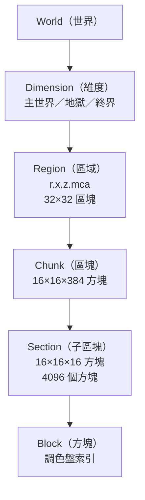

# Minecraft 世界領域模型：World、Map、Chunk 與相關概念

## 概述

Minecraft 是一款沙盒遊戲，其世界由數百萬個方塊（Block）構成，並以層級化的資料結構進行儲存與管理。本文整理 Minecraft 的「世界」（World）領域模型，涵蓋從最頂層的 World 概念到底層的方塊儲存格式，並釐清 World 與 Map 的區別。

## 一、「World」與「Map」的區別

Minecraft 官方文件對這兩個概念有明確區分[^world_vs_map]：

- **World（世界／Level）**：一個獨立的 Minecraft「宇宙」，包含所有方塊、實體（Entity）以及三個維度（Dimension）。世界是頂層容器，由程式生成、以資料夾形式儲存，並可從世界選擇畫面選取。
- **Map（地圖）**：一個具體的遊戲內物品（`minecraft:map` / `minecraft:filled_map`），可繪製 128×128 或 256×256 方塊範圍的 2D 俯視圖。地圖是玩家可合成、手持、複製與縮放的物品，並非結構性概念，純屬視覺表現工具。

Minecraft Wiki 在 World 頁面頂部設有消歧義提示：「**Not to be confused with Map.**」[^world_page]

## 二、維度（Dimension）

一個世界包含三個標準維度（以及透過資料包自訂的維度）[^dimension]：

1. **主世界（Overworld）** — 主要維度，1.18+ 版本後高度為 384 格（Y=-64 到 Y=319）
2. **地獄（The Nether）** — 地獄維度，高度 256 格；座標與主世界的比例為 1:8
3. **終界（The End）** — 最終維度，高度 256 格

## 三、區塊（Chunk）

區塊是 Minecraft 世界的最小載入、渲染與儲存單位[^chunk]。

### 基本規格

- **水平範圍**：16×16 方塊（X×Z）
- **垂直範圍**：取決於維度與版本
  - 主世界（1.18+）：384 格 → 每個區塊 98,304 個方塊
  - 地獄／終界：256 格
  - 1.18 以前：256 格（Y=0 到 Y=255）

### 區塊座標

區塊座標由方塊座標計算而得[^chunk_coord]：

```
ChunkX = floor(BlockX / 16)
ChunkZ = floor(BlockZ / 16)
```

方塊在區塊內的偏移量為方塊座標對 16 取餘數。

### 區塊載入系統（Ticket System）

Java Edition 使用「票證系統」（Ticket System）管理區塊載入，以「載入等級」（Load Level）控制優先級[^chunk_loading]：

| 載入類型 | 等級範圍 | 行為 |
|---------|---------|------|
| **Entity Ticking** | ≤31 | 所有遊戲機制啟動，實體運作、生怪 |
| **Block Ticking** | 32 | 方塊更新（紅石、流體），無實體處理 |
| **Border** | 33 | 方塊/實體可存取但不處理，世界生成發生 |
| **Inaccessible** | ≥34 | 完全不可存取 |

票證從來源區塊向外傳播（相鄰區塊等級 +1）。關鍵票證類型包括：玩家載入/模擬距離、`/forceload` 指令、傳送門（15 秒超時）、終界珍珠（2 秒）、臨時一次性存取（1 tick）。

## 四、子區塊（Section / Sub-Chunk）

子區塊是 16×16×16 的立方體（4,096 個方塊），為方塊儲存與渲染的粒度單位[^section]。一個完整的區塊柱由多個子區塊垂直堆疊而成（主世界 1.18+ 共 24 個子區塊）。

### 子區塊 NBT 結構

| 標籤 | 類型 | 說明 |
|------|------|------|
| `Y` | Byte | 子區塊垂直索引（1.18+ 可為負值） |
| `block_states` | Compound | 方塊調色盤 + 封裝資料陣列 |
| `biomes` | Compound | 生態域調色盤 + 封裝資料陣列 |
| `BlockLight` | Byte Array | 2048 位元組，每方塊 4 位元方塊光源 |
| `SkyLight` | Byte Array | 2048 位元組，每方塊 4 位元天空光源 |

方塊在子區塊內的索引順序為 **YZX**（Y 變化最慢，X 最快）[^block_order]：

```
index = y * 16 * 16 + z * 16 + x
```

空的子區塊（全為空氣）在儲存時可省略以節省空間。

## 五、方塊儲存：調色盤系統（Palette System）

自 1.13「平面化」（Flattening）以來，方塊採用基於調色盤的壓縮系統儲存[^palette]：

### 三種調色盤格式

| 每項位元數（方塊） | 每項位元數（生態域） | 格式 | 說明 |
|------------------|--------------------|------|------|
| 0 | 0 | **單值（Single valued）** | 全區塊同一方塊，省略資料陣列 |
| 4–8 | 1–3 | **間接（Indirect）** | 區域調色盤映射到全域 ID |
| 15（原版） | 7（原版） | **直接（Direct）** | 直接儲存全域 ID |

### 運作方式

1. **調色盤**：該子區塊中出現的唯一方塊狀態 ID 列表
   - 例如：`["minecraft:stone", "minecraft:dirt", "minecraft:air"]`
2. **資料陣列**：4,096 個索引值的封裝長整數陣列
   - 位元寬度 = `ceil(log2(palette_size))`，最小值 4 位元
   - 索引值緊密封裝到 64 位元長整數中，不可跨長整數

**範例**：一個僅含石頭、礫石、空氣（3 種）的子區塊使用 2 位元索引，而非 15 位元全域 ID，每個子區塊節省約 6.5 KB。

### 方塊狀態格式

```nbt
{
  Name: "minecraft:stone",
  Properties: {}  // 可選的方塊狀態屬性如 facing、lit 等
}
```

## 六、生態域（Biome）儲存

生態域以 **4×4×4 網格**（每子區塊 64 個單元）的解析度儲存[^biome]：

1. **調色盤**：生態域資源位置列表，如 `["minecraft:plains", "minecraft:forest"]`
2. **資料陣列**：封裝索引值（位元寬度 = `ceil(log2(palette_size))`，無最小值）

方塊層級的生態域資料由這些 4×4×4 單元內插而得。1.18 以前，生態域以每個區塊 16×16 位元組的平面陣列儲存。

## 七、高度圖（Heightmap）

每個區塊儲存六種類型的高度圖，以 37 個 64 位元長整數封裝（每行 9 位元，每個長整數容納 7 行）[^heightmap]：

| 類型 | 說明 | 使用時機 |
|------|------|---------|
| `WORLD_SURFACE` | 最高非空氣方塊 | 兩者 |
| `WORLD_SURFACE_WG` | 最高非空氣方塊 | 世界生成專用 |
| `OCEAN_FLOOR` | 最高阻擋運動的方塊 | 伺服器端 |
| `OCEAN_FLOOR_WG` | 最高阻擋運動的方塊 | 世界生成專用 |
| `MOTION_BLOCKING` | 最高阻擋運動或含流體的方塊 | 兩者 |
| `MOTION_BLOCKING_NO_LEAVES` | 同 MOTION_BLOCKING 但排除樹葉 | 伺服器端（如巡邏生怪） |

9 位元數值表示方塊在世界底部以上的偏移量（1.18+ 比 1.18 前多 64）。

## 八、區域（Region）與 Anvil 格式

### 區域概念

一個區域（Region）是 512×512 方塊的範圍（32×32 個區塊），儲存在單一 `.mca` 檔案中[^region]。Anvil 格式（`.mca`）於 Java Edition 1.2.1（快照 12w07a）取代了舊版 MCRegion 格式（`.mcr`）[^anvil]。

### 區域檔案命名

```
r.<regionX>.<regionZ>.mca
```

區域座標計算方式：

```
RegionX = floor(ChunkX / 32) = floor(BlockX / 512)
RegionZ = floor(ChunkZ / 32) = floor(BlockZ / 512)
```

### 檔案結構

檔案以 **4 KiB（4,096 位元組）的磁區（Sector）** 為單位[^region_struct]：

**標頭（Header）**（前 2 個磁區 = 8 KiB）：

1. **位置表（Location Table）**（磁區 0）：1024 × 4 位元組（32×32 區塊網格）
   - 前 3 位元組：磁區偏移量
   - 最後 1 位元組：該區塊佔用的磁區數（最大 255 = 1020 KiB）
2. **時間戳表（Timestamp Table）**（磁區 1）：1024 × 4 位元組，最後修改時間

**資料區（Payload）**：

每個區塊資料以：
- 4 位元組 big-endian 長度
- 1 位元組壓縮類型：
  - 1 = GZip（實務上不使用）
  - 2 = Zlib（標準，官方客戶端使用）
  - 3 = 未壓縮
  - 4 = LZ4（24w04a 起）
  - 127 = 自訂演算法（24w05a 起）
- 壓縮後的 NBT 資料

## 九、實體（Entity）儲存

### 實體檔案

自 21w43a（1.18）起，實體儲存在**獨立的區域檔案**中[^entity_storage]，與地形資料分離：

- 路徑：`dimensions/minecraft/<dimension>/entities/r.<x>.<z>.mca`
- 使用與地形相同的 `.mca` 區域格式
- 每個實體區塊 NBT 包含 `DataVersion`、`Position` 及 `Entities` 列表

### 方塊實體（Block Entity）

仍儲存在區塊 NBT 的 `block_entities` 列表中（如箱子、熔爐、告示牌等需要額外資料的方塊），每個方塊實體至少包含 `id`、`x`、`y`、`z` 標籤。

### 興趣點（Point of Interest, POI）

儲存在 `poi/r.<x>.<z>.mca` 中，管理村民工作站、床、鐘、蜂箱、地獄傳送門、磁石等，包含 `pos`、`type`、`free_tickets` 等資料。

## 十、世界存檔格式

### 目錄結構（現代版本）[^world_save]

```
<world>/
├── level.dat                     # 全域世界元資料（NBT）
├── level.dat_old                 # 前次備份
├── session.lock                  # 寫入鎖檔案
├── players/
│   ├── data/<uuid>.dat
│   ├── advancements/<uuid>.json
│   └── stats/<uuid>.json
├── data/
│   └── minecraft/
│       ├── game_rules.dat
│       ├── scoreboard.dat
│       ├── weather.dat
│       └── ...
├── dimensions/
│   └── minecraft/
│       ├── overworld/
│       │   ├── region/           # r.<x>.<z>.mca
│       │   ├── entities/         # 實體檔案
│       │   └── poi/              # 興趣點檔案
│       ├── the_nether/
│       └── the_end/
└── datapacks/
```

### level.dat 關鍵內容

- `DataVersion`：資料版本號
- `LevelName`：世界名稱
- `Time`：世界啟動以來的 tick 數
- `GameType`：0=生存、1=創造、2=冒險、3=旁觀
- `difficulty`：和平/簡單/普通/困難
- `Spawn`：重生維度、座標、視角
- `DataPacks`：啟用/停用的資料包

## 十一、區塊生成管線

區塊在生成過程中經歷多個狀態（儲存在 `Status` 標籤中）[^chunk_status]：

| 狀態 | 說明 |
|------|------|
| `empty` | 無資料，需完整生成 |
| `structure_starts` | 計算結構起點 |
| `structure_references` | 跨區塊結構參考 |
| `biomes` | 生成生態域地圖 |
| `noise` | 地形噪聲（密度函數） |
| `surface` | 放置地表方塊（草地、沙、礫石等） |
| `carvers` / `liquid_carvers` | 洞穴與水下洞穴 |
| `features` | 植被、礦物、泉湧等 |
| `light` / `initialize_light` | 光照引擎計算 |
| `spawn` | 初始怪物生成 |
| `full` | 區塊完成，可供遊戲 |

未完成生成的區塊稱為**原始區塊（Proto-chunk）**，攜帶 `CarvingMasks`、`Lights`、`PostProcessing` 等額外元資料。

## 十二、世界邊界（World Border）

世界邊界位於距離原點 ±29,999,984 方塊處，技術上限為 ±3,000 萬方塊（因浮點數精度問題）[^world_border]。

## 總結

Minecraft 的世界領域模型呈現清晰的層級結構：



此模型經過多次版本演進（從 MCRegion 到 Anvil、從固定 ID 到調色盤系統、從實體內嵌到分離儲存），反映了 Mojang 持續最佳化儲存效率與擴展性的設計思路。

---

[^world_vs_map]: Minecraft Wiki. (n.d.). World. Retrieved 2026-09-25, from https://minecraft.wiki/w/World

[^world_page]: Minecraft Wiki. (n.d.). World. Retrieved 2026-09-25, from https://minecraft.wiki/w/World

[^dimension]: Minecraft Wiki. (n.d.). Dimension. Retrieved 2026-09-25, from https://minecraft.wiki/w/Dimension

[^chunk]: Minecraft Wiki. (n.d.). Chunk. Retrieved 2026-09-25, from https://minecraft.wiki/w/Chunk

[^chunk_coord]: Minecraft Wiki. (n.d.). Chunk § Coordinates. Retrieved 2026-09-25, from https://minecraft.wiki/w/Chunk#Coordinates

[^chunk_loading]: GGServers. (n.d.). Chunk Loading and Lazy Chunks in Minecraft Java Edition. Retrieved 2026-09-25, from https://ggservers.com/knowledgebase/article/chunk-loading-and-lazy-chunks-in-minecraft-java-edition/

[^section]: Minecraft Wiki. (n.d.). Chunk format § Section structure. Retrieved 2026-09-25, from https://minecraft.wiki/w/Chunk_format#Section_structure

[^block_order]: Minecraft Wiki. (n.d.). Chunk format § Block order and palette. Retrieved 2026-09-25, from https://minecraft.wiki/w/Chunk_format#Block_order_and_palette

[^palette]: Minecraft Wiki. (n.d.). Chunk format § Paletted container. Retrieved 2026-09-25, from https://minecraft.wiki/w/Chunk_format#Paletted_container

[^biome]: Minecraft Wiki. (n.d.). Chunk format § Biomes. Retrieved 2026-09-25, from https://minecraft.wiki/w/Chunk_format#Biomes

[^heightmap]: Minecraft Wiki. (n.d.). Heightmap. Retrieved 2026-09-25, from https://minecraft.wiki/w/Heightmap

[^region]: Minecraft Wiki. (n.d.). Region file format. Retrieved 2026-09-25, from https://minecraft.wiki/w/Region_file_format

[^anvil]: Mojang. (2012, February 2). New Minecraft Map Format: Anvil. Retrieved 2026-09-25, from https://web.archive.org/web/20120302221152/https://www.mojang.com/2012/02/new-minecraft-map-format-anvil/

[^region_struct]: FileFormat.Info. (n.d.). MCA File Format. Retrieved 2026-09-25, from https://docs.fileformat.com/game/mca/

[^entity_storage]: Minecraft Wiki. (n.d.). Java Edition level format § Entity storage. Retrieved 2026-09-25, from https://minecraft.wiki/w/Java_Edition_level_format#Entity_storage

[^world_save]: Minecraft Wiki. (n.d.). Java Edition level format. Retrieved 2026-09-25, from https://minecraft.wiki/w/Java_Edition_level_format

[^chunk_status]: Minecraft Wiki. (n.d.). Chunk format § Chunk status. Retrieved 2026-09-25, from https://minecraft.wiki/w/Chunk_format#Chunk_status

[^world_border]: Minecraft Wiki. (n.d.). World Border. Retrieved 2026-09-25, from https://minecraft.wiki/w/World_border