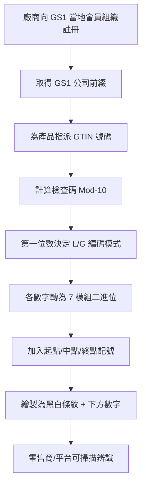

# EAN 條碼運作邏輯、註冊方式與資料庫獲取指南

## 1. 什麼是 EAN 條碼？

EAN（International Article Number，原稱 European Article Number）是 GS1 系統下的全球商品條碼標準，定義了**唯一的編號體系**與**條碼編碼格式**。常見的有 EAN-13（13 碼）和 EAN-8（8 碼）兩種規格。[^wiki]

## 2. EAN-13 的編號結構

EAN-13 號碼由 13 位數字組成，分為四個部分：[^wiki]

| 組成 | 位數 | 說明 |
|------|------|------|
| **GS1 前綴** | 3 碼 | 代表 GS1 會員組織（國家/地區註冊單位），例如 `471` = 台灣、`978`/`979` = 書籍（ISBN） |
| **廠商代碼** | 可變長度 | 由各國編碼機構分配給個別製造商 |
| **產品代碼** | 可變長度 | 由製造商自行為產品指派 |
| **檢查碼** | 1 碼 | 加權模數 10 計算得出 |

**注意**：以 `0` 開頭的 EAN-13 其實就是 12 碼的 UPC-A（美加地區條碼）前方加上一個 `0`，因此所有 UPC 條碼也都可視為有效的 EAN-13。

### EAN-8 結構

EAN-8 是供小包裝使用的壓縮版本：[^wiki]

| 組成 | 位數 |
|------|------|
| GS1 前綴 | 2–3 碼 |
| 產品/廠商資料 | 4–5 碼 |
| 檢查碼 | 1 碼 |

## 3. 檢查碼的計算邏輯

檢查碼使用**模數 10（Modulo 10）加權求和**演算法。從右邊（不含檢查碼本身）開始算：**[^wiki]**

- **奇數位置**（從右數）：權重 = **3**
- **偶數位置**（從右數）：權重 = **1**

### EAN-13 計算步驟

以條碼 `400638133393X` 為例：

1. 將 12 位數字由右到左對應權重相乘後加總

| 位 | 12 | 11 | 10 | 9 | 8 | 7 | 6 | 5 | 4 | 3 | 2 | 1 |
|:--:|---|---|---|---|---|---|---|---|---|---|---|---|
| 數字 | 4 | 0 | 0 | 6 | 3 | 8 | 1 | 3 | 3 | 3 | 9 | 3 |
| 權重 | 1 | 3 | 1 | 3 | 1 | 3 | 1 | 3 | 1 | 3 | 1 | 3 |
| 積 | 4 | 0 | 0 | 18 | 3 | 24 | 1 | 9 | 3 | 9 | 9 | 9 |

2. 總和 = 89
3. 檢查碼 = (10 - (89 mod 10)) mod 10 = **1**

### 錯誤偵測能力

- **100%** 可偵測出**單一數字錯誤**
- **90%** 可偵測出**相鄰數字互換錯誤**

## 4. EAN-13 的二進位編碼邏輯（黑條/白空如何代表數字）

EAN-13 條碼是一種線性 1D 條碼，由 **95 個模組**（modules）組成，每個模組為黑條（bar=1）或白空（space=0）。[^wiki]

### 條碼布局

```
| 101 | 42 模組 (7×6 碼) | 01010 | 42 模組 (7×6 碼) | 101 |
| 起始 |     左側群組     |  中   |     右側群組     | 結束 |
```

- **起始記號**：`101`（3 模組）
- **中間記號**：`01010`（5 模組）
- **結束記號**：`101`（3 模組）

每個數字以 **7 個模組**編碼，使用 **2 個黑條和 2 個白空**（每個寬度 1–4 模組）。

### 三種編碼表：L、G、R

| 數字 | L-碼（奇數同位） | G-碼（偶數同位） | R-碼 |
|:----:|:---------------:|:---------------:|:----:|
| 0 | `0001101` | `0100111` | `1110010` |
| 1 | `0011001` | `0110011` | `1100110` |
| 2 | `0010011` | `0011011` | `1101100` |
| 3 | `0111101` | `0100001` | `1000010` |
| 4 | `0100011` | `0011101` | `1011100` |
| 5 | `0110001` | `0111001` | `1001110` |
| 6 | `0101111` | `0000101` | `1010000` |
| 7 | `0111011` | `0010001` | `1000100` |
| 8 | `0110111` | `0001001` | `1001000` |
| 9 | `0001011` | `0010111` | `1110100` |

**關係**：
- **R-碼** = L-碼的**位元反向**
- **G-碼** = R-碼的**倒序讀取**

### 第一位數字的間接編碼

EAN-13 的**第一位數字並不直接畫成黑條白空**，而是透過**左側 6 碼的 L/G 編碼組合模式**來表示：[^wiki]

| 第一位數 | 左側編碼模式 |
|:--------:|:----------:|
| 0 | LLLLLL |
| 1 | LLGLGG |
| 2 | LLGGLG |
| 3 | LLGGGL |
| 4 | LGLLGG |
| 5 | LGGLLG |
| 6 | LGGGLL |
| 7 | LGLGLG |
| 8 | LGLGGL |
| 9 | LGGLGL |

右側群組（第 8–13 碼）則固定全部使用 **RRRRRR**（R-碼）。

### EAN-8 的編碼（較簡單）

EAN-8 **不使用間接編碼**，所有 8 碼直接編碼：左側 4 碼 = LLLL、右側 4 碼 = RRRR。

## 5. EAN-13 vs EAN-8 差異

| 項目 | EAN-13 | EAN-8 |
|------|--------|-------|
| 總位數 | 13 碼 | 8 碼 |
| 第一位編碼 | 間接（L/G 模式） | 直接 |
| 用途 | 標準零售商品 | 小型包裝（口紅、口香糖等） |
| 總寬度 | 95 模組 | 67 模組 |

## 6. 產品要向誰註冊？

必須向 **GS1 在各國的當地會員組織** 註冊。GS1 是唯一授權的 GTIN（產品條碼號碼）發行機構。[^gs1reg]

### 台灣註冊單位

在台灣需向 **GS1 台灣（財團法人中華民國商品條碼策進會）** 註冊：[^gs1tw]

- 網址：https://www.gs1tw.org
- 電話：+886-2-2545-0011
- 地址：台北市松山區南京東路四段 1 號 13 樓

### 全球註冊流程

| 步驟 | 內容 |
|------|------|
| 1. 選擇所在國家 GS1 辦公室 | gs1.org 查詢 |
| 2. 選擇方案 | 根據需要的 GTIN 數量 |
| 3. 註冊公司資訊 | 營業登記、稅務資料等 |
| 4. 繳費 | 首次註冊費 + 年費 |
| 5. 取得 GS1 公司前綴 | 獲得專屬公司識別碼 |
| 6. 為產品指派 GTIN | 使用前綴建立產品號碼 |
| 7. 生成條碼圖檔 | 轉換成可掃描之條碼 |
| 8. 印製包裝 | 依 GS1 尺寸/顏色/位置規範 |

### 台灣費用標準（依公司資本額）

| 公司資本額 | 註冊費（一次） | 3 年年費 | 營業稅 5% | **總計** |
|-----------|:------------:|:--------:|:--------:|:--------:|
| 未滿 NT$1,000 萬 | NT$5,000 | NT$21,000 | NT$1,300 | **NT$27,300** |
| NT$1,000 萬–5,000 萬 | NT$5,000 | NT$45,000 | NT$2,500 | **NT$52,500** |
| NT$5,000 萬–1 億 | NT$5,000 | NT$75,000 | NT$4,000 | **NT$84,000** |
| NT$1 億–5 億 | NT$5,000 | NT$96,000 | NT$5,000 | **NT$106,650** |
| 超過 NT$5 億 | NT$5,000 | NT$117,000 | NT$6,100 | **NT$128,100** |

**關鍵資訊**：
- 台灣會員期為 **3 年**（一次性預付）
- 期滿後續約只需繳年費 + 稅金（不需再繳註冊費）
- 台灣國家前綴碼為 **471**

### 重要警告

避免向第三方轉售商購買「便宜的條碼」。Amazon 與大型零售通路現在會核對條碼是否來自 GS1 官方資料庫，只有直接向 GS1 取得的條碼才能確保被接受。[^gs1reg]

## 7. 如何獲得條碼資料庫？

### 官方 GS1 資料庫

| 服務 | 費用 | 說明 |
|------|------|------|
| **Verified by GS1**（全球） | 免費（網頁查詢） | GS1 官方最權威的全域註冊資料庫[^vbgs1] |
| **GS1 US GEPIR** | 每日最多 30 次免費查詢 | 可查詢 GTIN、GLN 等，付費升級每年 US$500（無限查詢）[^gs1gepir] |
| **GS1 US API** | 每年 US$6,500 | 9 支 REST API，支援批次查詢（每次最多 1,000 筆 GTIN）[^gs1api] |

### 第三方免費/付費 API

| 服務 | 免費額度 | 付費方案 | 資料量 |
|------|---------|---------|--------|
| **upc.dev** | 100 次/天 | Pro US$49/月（5K/天） | 590 萬產品，台灣約 19,900+ 筆 |
| **BarcodeFinder** | 1,000 次/天，免 API Key | 無 | 數百萬產品 |
| **Barcode Lookup** | 有限免費 | 付費 API | 約 5 億產品 |
| **Go-UPC** | 有限 | 付費 API / 批次 | 號稱 10 億+ 項 |
| **EcomSource.ai** | 10–100 次/天 | 付費方案 | 16 億+ 產品 |

### 台灣特定資源

| 資源 | 說明 |
|------|------|
| **upc.dev/country/taiwan** | 台灣前綴 471 產品資料庫，約 19,900+ 筆，免費 100 次/天查詢[^upcdev] |
| **GS1 台灣驗證服務** | 條碼印刷品質測試，線性 NT$1,000/件，2D NT$2,000/件[^gs1tw2] |

### 現狀總結

**不存在完整、免費、可公開取得的所有 EAN 條碼資料庫。**[^opendata]

GS1 的資料分散在各國會員組織且屬專有財產。過去曾有的開源專案（如 Datakick/gtinsearch.org、Brocade.io、Open Product Data）不是已關閉就是多年未更新，目前已無法使用。[^brocade]

## 8. 完整流程總結



## 參考文獻

[^wiki]: Wikimedia Foundation. (n.d.). International Article Number. Retrieved 2026-09-25, from https://en.wikipedia.org/wiki/International_Article_Number

[^gs1reg]: GS1 AISBL. (n.d.). Get a barcode. Retrieved 2026-09-25, from https://www.gs1.org/standards/get-barcodes

[^gs1tw]: GS1 Taiwan (財團法人中華民國商品條碼策進會). (n.d.). Get barcodes. Retrieved 2026-09-25, from https://www.gs1tw.org/twct/en/get-barcodes.jsp?menuactive=1

[^vbgs1]: GS1 AISBL. (n.d.). Verified by GS1. Retrieved 2026-09-25, from https://www.gs1.org/services/verified-by-gs1

[^gs1gepir]: GS1 US. (n.d.). GS1 Company Database (GEPIR). Retrieved 2026-09-25, from https://www.gs1us.org/tools/gs1-company-database-gepir

[^gs1api]: GS1 US. (n.d.). GS1 US APIs. Retrieved 2026-09-25, from https://www.gs1us.org/tools/gs1-us-data-hub/gs1-us-apis

[^upcdev]: upc.dev. (n.d.). Barcodes from Taiwan. Retrieved 2026-09-25, from https://upc.dev/country/taiwan

[^gs1tw2]: GS1 Taiwan. (n.d.). Barcode Verification (Linear). Retrieved 2026-09-25, from https://www.gs1tw.org/twct/en/linear.jsp?menuactive=2

[^opendata]: Open Data Stack Exchange. (n.d.). Is there a global database of all products with EAN-13 barcodes? Retrieved 2026-09-25, from https://opendata.stackexchange.com/questions/562/is-there-a-global-database-of-all-products-with-ean-13-barcodes

[^brocade]: Brocade.io (EventideSystems). (n.d.). Open GTIN / barcode database. Retrieved 2026-09-25, from https://github.com/EventideSystems/brocade.io