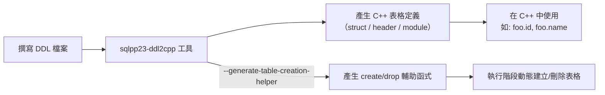

# sqlpp23 建立資料表（CREATE TABLE）的方法

## 概述

[sqlpp23][repo] 是一個型別安全的 C++ 嵌入式 SQL 查詢語言。它並非 ORM，而是透過 C++ 模板元程式設計讓編譯器在編譯期檢查 SQL 語句的正確性。建立資料表（`CREATE TABLE`）在 sqlpp23 中**不直接由 C++ 程式碼完成**，而是透過以下兩個層次處理：

1. **離線階段**：撰寫 SQL DDL 檔案，再用 `sqlpp23-ddl2cpp` 工具產生 C++ 表格定義（struct）
2. **執行階段**：若需要在執行時實際建立/刪除資料表，可透過 `--generate-table-creation-helper` 選項產生輔助函式

## 流程圖



## 第一種方法：DDL 轉 C++（推薦）

這是 sqlpp23 官方建議的方法。流程：

### 步驟 1：撰寫 DDL 檔案

建立一個 `.sql` 檔案，內容為標準 SQL `CREATE TABLE` 語句。例如：

```sql
CREATE TABLE foo (
    id bigint NOT NULL AUTO_INCREMENT,
    name varchar(50),
    hasFun bool NOT NULL
);
```

支援的 SQL 型別對應至 `sqlpp23` 的 C++ 型別如下[^data-types]：

| SQL 型別 | sqlpp23 型別 | C++ 型別 |
|----------|--------------|----------|
| `BOOL` | `sqlpp::boolean` | `bool` |
| `INTEGER`, `INT`, `BIGINT` | `sqlpp::integral` | `int64_t` |
| `UNSIGNED INTEGER` 等 | `sqlpp::unsigned_integral` | `uint64_t` |
| `FLOAT`, `DOUBLE` | `sqlpp::floating_point` | `double` |
| `CHAR`, `VARCHAR`, `TEXT` | `sqlpp::text` | `std::string` / `std::string_view` |
| `BLOB` 等 | `sqlpp::blob` | `std::vector<uint8_t>` / `std::span<uint8_t>` |
| `DATE` | `sqlpp::date` | `std::chrono::sys_days` |
| `TIMESTAMP` | `sqlpp::timestamp` | `std::chrono::sys_time<microseconds>` |
| `TIME` | `sqlpp::time` | `std::chrono::microseconds` |

可空（nullable）的欄位以 `std::optional` 表示[^data-types]。

### 步驟 2：使用 sqlpp23-ddl2cpp 產生 C++ 程式碼

```bash
scripts/sqlpp23-ddl2cpp \
    --path-to-ddl my_project/tables.ddl \
    --namespace my_project \
    --path-to-header my_project/tables.h
```

產生的 C++ 程式碼範例：

```cpp
namespace test {
  struct TabFoo_ {
    struct Id {
      SQLPP_CREATE_NAME_TAG_FOR_SQL_AND_CPP(id, id);
      using data_type = ::sqlpp::integral;
      using has_default = std::true_type;
    };
    struct Name {
      SQLPP_CREATE_NAME_TAG_FOR_SQL_AND_CPP(name, name);
      using data_type = std::optional<::sqlpp::text>;
      using has_default = std::true_type;
    };
    struct HasFun {
      SQLPP_CREATE_NAME_TAG_FOR_SQL_AND_CPP(has_fun, hasFun);
      using data_type = ::sqlpp::boolean;
      using has_default = std::false_type;
    };
    SQLPP_CREATE_NAME_TAG_FOR_SQL_AND_CPP(tab_foo, tabFoo);
    template<typename T>
    using _table_columns = sqlpp::table_columns<T, Id, Name, HasFun>;
    using _required_insert_columns = sqlpp::detail::type_set<
               sqlpp::column_t<sqlpp::table_t<TabFoo_>, HasFun>>;
  };
  using TabFoo = ::sqlpp::table_t<TabFoo_>;
}
```

欄位命名風格有兩種選擇：
- `--naming-style camel-case`（預設）：表格名轉為 `UpperCamelCase`，欄位名轉為 `lowerCamelCase`
- `--naming-style identity`：保留原 SQL 名稱

### 步驟 3：在 C++ 程式中使用

```cpp
#include "my_project/tables.h"
#include <sqlpp23/sqlpp23.h>
#include <sqlpp23/sqlite3/sqlite3.h>  // 舉例使用 SQLite

int main() {
    auto db = sqlpp::sqlite3::connection{};
    constexpr auto foo = my_project::TabFoo{};

    // 查詢
    for (const auto& row :
         db(select(foo.id, foo.name, foo.hasFun)
                .from(foo)
                .where(foo.name.like("%bar%")))) {
        std::cout << row.id << "\n";
        std::cout << row.name.value_or("NULL") << "\n";
    }
}
```

## 第二種方法：執行階段動態建立/刪除表格

若需要在執行時依據 DDL 動態建立或刪除資料表（例如單元測試的 setUp/tearDown），可使用 `--generate-table-creation-helper` 選項：

```bash
scripts/sqlpp23-ddl2cpp \
    --path-to-ddl my_project/tables.ddl \
    --namespace my_project \
    --path-to-header my_project/tables.h \
    --generate-table-creation-helper
```

此選項會為每個表格產生類似以下的輔助函式：

```cpp
template<typename Connection>
void create_table(Connection& db) {
    db.execute(R"(CREATE TABLE foo (
        id bigint NOT NULL AUTO_INCREMENT,
        name varchar(50),
        hasFun bool NOT NULL
    ))");
}

template<typename Connection>
void drop_table(Connection& db) {
    db.execute("DROP TABLE IF EXISTS foo");
}
```

使用範例：

```cpp
auto db = /* 建立連線 */;
my_project::create_table(db);
// ... 進行操作 ...
my_project::drop_table(db);
```

## 第三方方法：手動定義表格（不建議）

理論上也可以手寫 C++ 的表格 struct，但這對開發者不友善且容易出錯。官方強烈建議使用 DDL 產生器。

## 限制與注意事項

- sqlpp23 在編譯期檢查語句的正確性（如 `from()` 省略表格、欄位型別不符等），但不負責執行階段的 `CREATE TABLE`
- `--generate-table-creation-helper` 會讓產生的 header 引入 `<string>`，因為函式需要回傳 SQL 字串
- 自訂型別對映可透過 CSV 檔案、SQL 註解或 MySQL `COMMENT` 子句指定[^custom-type-mapping]
- NULL 值統一以 `std::nullopt` 表示[^data-types]

## 參考資料

[^data-types]: rbock. (n.d.). sqlpp23 Data Types. Retrieved 2026-09-25, from https://github.com/rbock/sqlpp23/blob/main/docs/data_types.md
[^table-docs]: rbock. (n.d.). sqlpp23 Tables. Retrieved 2026-09-25, from https://github.com/rbock/sqlpp23/blob/main/docs/tables.md
[^ddl2cpp]: rbock. (n.d.). sqlpp23 Code Generation (ddl2cpp). Retrieved 2026-09-25, from https://github.com/rbock/sqlpp23/blob/main/docs/ddl2cpp.md
[^custom-type-mapping]: rbock. (n.d.). sqlpp23 Custom Type Mapping. Retrieved 2026-09-25, from https://github.com/rbock/sqlpp23/blob/main/docs/custom_type_mapping.md
[^setup]: rbock. (n.d.). sqlpp23 Setup. Retrieved 2026-09-25, from https://github.com/rbock/sqlpp23/blob/main/docs/setup.md

[repo]: https://github.com/rbock/sqlpp23