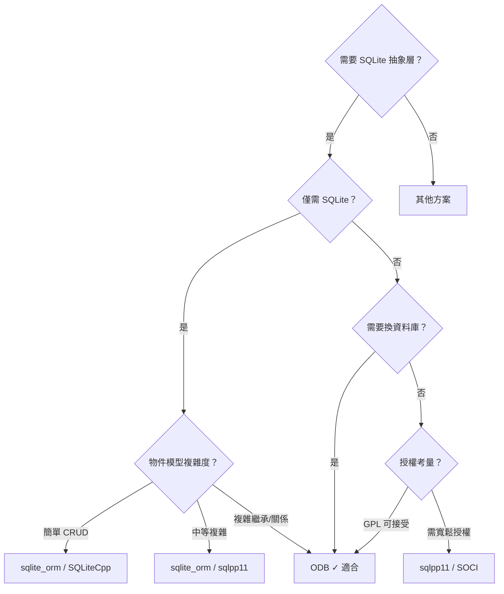

# ODB（C++ ORM）作為 SQLite 抽象層函式庫之評估

## 概述

ODB 是一套**跨平台、跨資料庫**的 C++ 物件關聯映射（ORM）系統，由 Code Synthesis 開發，最新版本為 **2.6.0**（2026 年 7 月釋出）[^odb-main]。不同於大多數 C++ 資料庫函式庫，ODB 採用**程式碼生成（code generation）** 而非標頭檔模板（header-only templates）實作：它提供一個基於 GCC 插件實作的 ODB 編譯器，解析你標註過的 C++ 類別並產生資料庫持久化的 C++ 程式碼，再與執行時期函式庫一起編譯[^odb-features]。

ODB 支援的資料庫包含 SQLite、PostgreSQL、MySQL/MariaDB、Oracle 和 Microsoft SQL Server；對於 SQLite，它提供專用的 `libodb-sqlite` 執行時期函式庫[^odb-sqlite]。

## 技術架構

```
+------------------+      +------------------+      +------------------+
|  你的 C++ 標頭檔    |      |                  |      |  產生的 C++ 程式碼   |
|  (#pragma db ...) |----->|  ODB Compiler    |----->|  (標準 C++11+)    |
+------------------+      |  (GCC Plugin)     |      +------------------+
                          +------------------+              |
                                                            v
+------------------+      +------------------+      +------------------+
|  你的應用程式碼    |----->|  你的 C++ 編譯器   |<-----|  ODB Runtime     |
|                  |      |  (GCC/Clang/MSVC) |      |  libodb +         |
+------------------+      +------------------+      |  libodb-sqlite    |
                                                    +------------------+
                                                             |
                                                             v
                                                    +------------------+
                                                    |    SQLite 資料庫   |
                                                    +------------------+
```

## 對 SQLite 的支援細節

`libodb-sqlite` 基於原生 SQLite3 C API，最低要求 SQLite 3.7.4+（2011 年釋出），支援以下 SQLite 特有功能[^odb-features]：

- **預備陳述式快取**（prepared statement caching）
- **WAL 模式並發**（Write-Ahead Logging concurrency）
- **共享快取／解鎖通知**（shared cache / unlock notification）並發
- **附加其他 SQLite 資料庫**（`ATTACH DATABASE`）
- **增量 BLOB/TEXT I/O**（incremental BLOB/TEXT I/O）
- **混合自動／手動 ID 指派**（mixed auto/manual id assignment）
- 額外型別對應：`TEXT` ↔ `std::wstring` / `QString`；`BLOB` ↔ `std::vector<char>` / `std::array<char,N>` / `char[N]` / `QByteArray`；Boost/Qt 日期時間型別

## ODB 的優點

### 1. 完整的 ORM 功能
ODB 是 C++ 生態系中少數能與 Java Hibernate 或 .NET Entity Framework 相提並論的**完整 ORM**[^pistack]。包含：
- 自動綱要生成（schema generation）
- 物件關係：一對一、一對多、多對多（雙向／單向）
- 懶載入（lazy loading）與即時載入（eager loading），以及**直接載入（direct loading）** 策略解決 N+1 問題
- 繼承支援：以表格為基礎的物件復用（table-per-object）與多型（table-per-difference）
- 自動資料庫綱要遷移（schema evolution / migration）[^odb-features]
- 變更追蹤容器（change-tracking containers）實現高效更新

### 2. 高效能
- **每個物件零記憶體負擔**（zero per-object memory overhead）——沒有隱藏的「資料庫」成員變數[^odb-features]
- 全面快取：連線、陳述式、緩衝區快取
- 預備陳述式重複使用
- 使用原生資料庫 API（無中介層）
- 批次操作支援
- ODB 官方效能測試（2012 年）顯示 SQLite 物件載入約 **17–30 μs**，比客戶端-伺服器資料庫（MySQL/PostgreSQL 約 55–160 μs）快 **5–10 倍**[^odb-benchmark]

### 3. 型別安全查詢 API
查詢以 C++ 表達式撰寫，而非原始 SQL 字串：

```cpp
query q = query::age < 30 && query::name.like("%John%");
```

這在編譯期就能捕捉欄位名稱錯誤和型別不匹配[^odb-features]。

### 4. 非侵入式設計
可將 `#pragma db` 放在分離的標頭檔中，不污染原始類別定義。類別可以在沒有 ODB 的情況下獨立使用[^odb-quotes]。

### 5. 多資料庫支援
同一套程式碼可無痛切換 SQLite、PostgreSQL、MySQL、Oracle、MSSQL，適合需要開發期用 SQLite、生產期用 PostgreSQL 的情境。

### 6. 優異的文件品質
多位真實使用者（包含 KDE、Sandia National Laboratories）特別稱讚 ODB 的文件有如書籍般完整且易於理解[^odb-quotes][^reddit-quotes]。

### 7. Boost 與 Qt 整合
原生支援 Boost 智慧指標、容器、日期時間，以及 Qt5/Qt6 的 `QString`、`QByteArray`、`QSharedPointer`、日期時間型別等[^odb-features]。

### 8. 持續維護
自 2010 年起持續開發，2026 年 7 月釋出 2.6.0 版，提供 Debian、Ubuntu、Fedora、RHEL、Windows 的二進位套件[^odb-download]。

## ODB 的缺點

### 1. 建置流程複雜度
ODB 最大的缺點是需要在建置流程中**加入程式碼生成步驟**（code generation build step）[^pistack]：
- 需要執行 ODB 編譯器（GCC 插件）來處理標頭檔
- 需要整合產生的 C++ 程式碼到建置系統中
- CMake 整合有一定複雜度
- 對比 header-only 函式庫（如 sqlite_orm），建置流程的簡單性差距顯著

### 2. GCC 版本耦合
ODB 編譯器具現為 GCC 插件，每個版本綁定特定 GCC 版本。雖然官方提供預編譯二進位套件，但若要從原始碼建置，需要完全匹配 GCC 版本與插件 API[^odb-download]。

### 3. 授權條款複雜
ODB 採用**雙重授權模式**，這是社群中經常討論的議題[^odb-license]：

| 授權類型 | 適用情境 | 費用 |
|---------|---------|------|
| **GPL v2** | SQLite/PostgreSQL/MySQL，內部使用或 GPL 專案 | 免費 |
| **NCUEL** | Oracle/SQL Server 非商業用途 | 免費 |
| **FPL（免費專有授權）** | ≤ 10,000 行生成碼（約 10–20 個類別） | 免費 |
| **CPL（商業專有授權）** | 閉源商用、任意規模 | 約 $1,500 USD 起 |

對於閉源商用專案，若不滿足 FPL 門檻，則需要購買 CPL 授權。相較之下，sqlpp11（BSD-2-Clause）和 SOCI（BSL-1.0）的授權寬鬆許多。

### 4. 較小的社群規模
GitHub 鏡像僅約 **63 顆星**，遠低於 sqlite_orm（~2,700）、sqlpp11（~2,600）或 SOCI（~1,600）[^github-odb][^github-sqlite-orm]。這意味著：
- 較少的第三方資源、教學和 Stack Overflow 解答
- 較小的貢獻者社群
- 遇到問題時自主除錯的可能性較高

### 5. 不適合僅 SQLite 的輕量專案
如果專案只需要 SQLite 且規模不大，ODB 的完整 ORM 功能可能**矯枉過正**[^pistack]。引入程式碼生成工具鏈的成本遠高於使用 header-only 的 sqlite_orm 或輕量的 SQLiteCpp。

### 6. 學習曲線
雖然文件品質優秀，但 ODB 的元件多（ODB 編譯器 + 共用執行時期 + 資料庫特定執行時期 + Boost/Qt 設定檔），需要理解的概念比單純的 SQL 封裝函式庫多得多。

## 與其他 C++ SQLite 函式庫的比較

| 面向 | **ODB** | **sqlite_orm** | **sqlpp11** | **SOCI** | **SQLiteCpp** |
|------|---------|---------------|-------------|----------|---------------|
| **實作方式** | 程式碼生成（GCC 插件） | Header-only 模板 | 模板 EDSL（嵌入式 SQL） | SQL 封裝層 | SQLite C API 包裝 |
| **型別安全** | ✅ 編譯期（生成碼） | ✅ 編譯期 | ✅ 完整編譯期 | ❌ 執行期 | ❌ 執行期 |
| **支援資料庫數** | 5 種 | SQLite 僅 | SQLite + 3 種 | 6 種 | SQLite 僅 |
| **完整 ORM**（關係、惰性載入等） | ✅ 完整 | ⚠️ 基本 | ⚠️ SQL DSL | ❌ 資料存取層 | ❌ 薄包裝 |
| **綱要遷移** | ✅ 自動 | ❌ 手動 | ❌ 手動 | ❌ 手動 | ❌ 手動 |
| **建置步驟** | 需額外步驟 | 無（header-only） | 無 | 無 | 無 |
| **授權** | GPLv2 / 商用 | AGPL / MIT ($50) | BSD-2-Clause | BSL-1.0 | MIT |
| **GitHub 星數** | ~63 | ~2,700 | ~2,600 | ~1,600 | ~1,000+ |
| **學習曲線** | 中高 | 低中 | 高 | 低 | 低 |
| **Boost/Qt 整合** | ✅ 原生 | ❌ | ❌ | ❌ | ❌ |

*註：sqlite_orm 的比較表曾標示 ODB「無綱要同步」，但 ODB 自 2.3.0 版起已支援自動綱要遷移[^sqlite-orm-compare]。*

## 總結與建議



### 選擇 ODB 的時機

- ✅ 專案需要**多資料庫支援**（開發用 SQLite、生產用 PostgreSQL 等）
- ✅ 物件模型**複雜**，包含繼承關係、多對多關聯、巢狀容器
- ✅ 需要**自動資料庫綱要遷移**
- ✅ 專案已在使用 GCC 工具鏈，接受程式碼生成步驟
- ✅ 需要 Boost 或 Qt 的深度整合
- ✅ 效能是關鍵考量，且想要零負擔的 ORM 層
- ✅ GPL 授權對專案可接受（開源／內部使用），或願意購買商用授權

### 不適合 ODB 的時機

- ❌ 僅需 SQLite，且物件模型簡單（→ 選 sqlite_orm 或 SQLiteCpp）
- ❌ 希望 header-only、零建置配置（→ 選 sqlite_orm）
- ❌ 授權必須寬鬆（BSD/MIT/BSL），無法接受 GPL 或付費（→ 選 sqlpp11 或 SOCI）
- ❌ 專案使用 Clang 或 MSVC 為主，且不想在工具鏈中引入 GCC
- ❌ 社群規模和第三方資源是重要考量

### 綜合評價

ODB 是 C++ 生態系中**功能最完整的 ORM 方案**，技術成熟、文件優異、效能出色。但它的程式碼生成架構和 GPL 授權模式使其**不是一個「輕量級」的選擇**。對於只需要 SQLite 簡單存取的專案，ODB 的引入成本可能超過效益；但對於需要完整 ORM 功能、多資料庫彈性或複雜物件模型的專案，ODB 是 C++ 領域目前最成熟的選擇。

---

## 參考資料

[^odb-main]: Code Synthesis. (n.d.). ODB — C++ Object-Relational Mapping. Retrieved 2026-09-25, from https://www.codesynthesis.com/products/odb/

[^odb-features]: Code Synthesis. (n.d.). ODB Features. Retrieved 2026-09-25, from https://www.codesynthesis.com/products/odb/features.xhtml

[^odb-sqlite]: Code Synthesis. (n.d.). ODB SQLite Runtime. Retrieved 2026-09-25, from https://www.codesynthesis.com/products/odb/sqlite/

[^odb-license]: Code Synthesis. (n.d.). ODB License. Retrieved 2026-09-25, from https://www.codesynthesis.com/products/odb/license.xhtml

[^odb-quotes]: Code Synthesis. (n.d.). ODB User Quotes. Retrieved 2026-09-25, from https://www.codesynthesis.com/products/odb/quotes.xhtml

[^odb-download]: Code Synthesis. (n.d.). ODB Download. Retrieved 2026-09-25, from https://www.codesynthesis.com/products/odb/download.xhtml

[^odb-benchmark]: Code Synthesis. (2012-02-02). Updated ODB Benchmark Results. Retrieved 2026-09-25, from https://www.codesynthesis.com/~boris/blog/2012/02/02/updated-odb-benchmark-results/

[^github-odb]: codesynthesis-com. (n.d.). ODB — GitHub Mirror. Retrieved 2026-09-25, from https://github.com/codesynthesis-com/odb

[^github-sqlite-orm]: fnc12. (n.d.). sqlite_orm. Retrieved 2026-09-25, from https://github.com/fnc12/sqlite_orm

[^pistack]: pistack.xyz. (2026-06-26). C++ ORM Libraries: hiberlite, sqlite_orm, sqlpp11. Retrieved 2026-09-25, from https://www.pistack.xyz/posts/2026-06-26-cpp-orm-libraries-hiberlite-sqliteorm-sqlpp11/

[^sqlite-orm-compare]: sqlite_orm GitHub Repository. (n.d.). Comparison table with ODB and other libraries. Retrieved 2026-09-25, from https://github.com/fnc12/sqlite_orm

[^reddit-quotes]: r/cpp. (n.d.). Reddit search results for "odb orm". Retrieved 2026-09-25, from https://www.reddit.com/r/cpp/search/?q=odb+orm