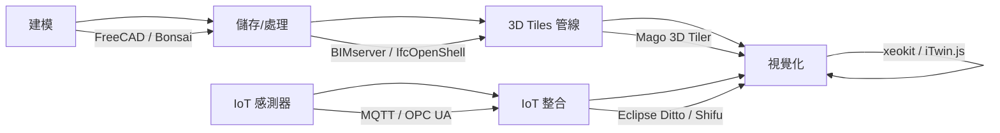

# FOSS 室內數位雙胞胎解決方案調查

## 概述

本報告調查市面上可取得的自由開源（FOSS）室內數位雙胞胎解決方案，涵蓋完整數位雙胞胎框架、BIM（建築資訊模型）平台、3D 室內地圖/檢視器、地理空間轉換工具及 IoT 整合平台等五大類別，提供技術選型參考。

## 一、完整數位雙胞胎框架

### Eclipse Ditto

Eclipse Ditto 是 Eclipse IoT 基金會專案，提供雲端 IoT 數位雙胞胎框架。每個已連線的真實裝置（如感測器、智慧照明、聯網汽車等）在雲端以「Thing」為單位建立數位表徵，並透過 CRUD API 管理。採用 MongoDB 後端儲存，支援 Docker Compose 一鍵部署。[^ditto-gh]

- **授權**：EPL-2.0
- **語言**：Java
- **GitHub Stars**：~928
- **適用場景**：大規模 IoT 裝置的數位雙胞胎後端，非特定針對室內空間，但可作為室內感測器資料的抽象層。

### iTwin.js（Bentley Systems）

iTwin.js 是由 Bentley Systems 開源的基礎設施數位雙胞胎函式庫，可建立、查詢、修改與顯示大型基礎設施的數位雙胞胎。支援聚合工程模型、實景資料、GIS 及 IoT 資料。[^itwin-gh]

- **授權**：MIT
- **語言**：TypeScript
- **GitHub Stars**：~732
- **適用場景**：大型建築與基礎設施數位雙胞胎，支援 WebGL 3D 顯示、真實世界座標系統及雙精度浮點運算。

### DGIOT

DGIOT 是一款工業 IoT 聚合引擎，內建裝置影子（device shadow，即數位雙胞胎）功能。支援 300 種以上協定（MQTT、Modbus、OPC UA 等），搭配 TDengine 時序資料庫，可達百萬級裝置規模。[^dgiot-gh]

- **授權**：Apache 2.0
- **語言**：Erlang
- **GitHub Stars**：~4,800
- **適用場景**：工業 IoT 場景下的裝置建模與即時監控。

## 二、BIM 建築資訊模型平台

### BIMserver

BIMserver 是歷史最悠久的開源 BIM 伺服器之一，以 IFC（Industry Foundation Classes）開放標準儲存與管理建築專案資訊。採用模型驅動架構（model-driven architecture，非單純檔案伺服器），提供版本控制、合併、過濾、查詢及外掛系統。[^bimserver-gh]

- **授權**：AGPL-3.0
- **語言**：Java
- **GitHub Stars**：~1,800
- **適用場景**：協作式 BIM 模型管理與版本控制。

### IfcOpenShell / Bonsai

IfcOpenShell 是處理 IFC 檔案的開源標準函式庫，提供完整的 IFC2x3/IFC4/IFC4x3 解析與幾何計算。其衍生專案 Bonsai 是 Blender 的 BIM 建模外掛，可在 Blender 內直接進行圖形化 IFC 建模與編輯。附帶 15 個以上子工具（ifcconvert、ifcclash、ifcdiff、ifctester 等）。[^ifcopenshell-gh]

- **授權**：LGPL-3.0（函式庫）、GPL-3.0（Bonsai 外掛）
- **語言**：C++、Python
- **GitHub Stars**：~2,800
- **適用場景**：IFC 檔案解析、格式轉換、BIM 模型編輯（透過 Blender）。

### FreeCAD BIM Workbench

FreeCAD 是最受歡迎的開源參數化 3D CAD 平台，其 BIM 工作檯（Workbench）提供完整的建築資訊建模功能，支援 IFC 匯入/匯出。[^freecad-gh]

- **授權**：LGPL-2.1
- **語言**：C++、Python
- **GitHub Stars**：~33,800
- **適用場景**：參數化建築建模與 BIM 模型建立。

### Xbim Toolkit

Xbim Toolkit 是 .NET 生態系下的 IFC 工具組，支援 IFC2x3/IFC4/IFC4x3 的讀寫、驗證與幾何生成，並提供 Windows 桌面檢視器（Xplorer）與 WebGL 檢視器（WeXplorer）。[^xbim-gh]

- **授權**：CDDL（允許商業使用）
- **語言**：C#（.NET）
- **GitHub Stars**：~576
- **適用場景**：.NET / C# 開發者的 BIM 應用。

## 三、3D 室內地圖/BIM 網頁檢視器

### xeokit SDK

xeokit 是一套高效能 WebGL SDK，專為在瀏覽器中顯示大型 BIM/IFC 模型與點雲而設計。不依賴 Three.js，自行實作 WebGL 渲染管線，支援雙精度浮點數座標與真實世界座標。另提供 xeokit-bim-viewer 立即可用的檢視器套件。[^xeokit-gh]

- **授權**：AGPL-3.0（商業授權另行提供）
- **語言**：JavaScript（ES Modules）
- **GitHub Stars**：~939
- **適用場景**：高效能瀏覽器端 BIM 3D 模型展示。

### IFC.js / That Open Components

IFC.js（現稱 That Open Components）提供基於 Three.js 的瀏覽器端 BIM 工具庫。內建 IFC 解析器（透過 WebAssembly，無需伺服器支援），可直接在瀏覽器中載入 IFC 檔案並進行 3D 顯示、尺寸測量、剖面裁剪、2D 平面圖生成等操作。[^ifcjs-gh]

- **授權**：MIT
- **語言**：TypeScript、JavaScript
- **GitHub Stars**：~705（engine_components）、~592（web-ifc-three）
- **適用場景**：瀏覽器端 BIM 應用開發。

### BIMsurfer

BIMsurfer 是以 WebGL 2.0 重新實作的輕量級 IFC 模型檢視器，最初為 BIMserver 而開發，v3 版本針對大型模型效能進行了最佳化。[^bimsurfer-gh]

- **授權**：MIT
- **語言**：JavaScript
- **GitHub Stars**：~430
- **適用場景**：輕量級 IFC 模型瀏覽。

## 四、地理空間轉換（3D Tiles）

### Mago 3D Tiler

Mago 3D Tiler 是由 Gaia3D 開發的 Java 開源工具，可將多種空間資料格式（3DS、OBJ、FBX、Collada、glTF/GLB、CityGML、IFC、LAS/LAZ、SHP、GeoJSON 等）轉換為 OGC 3D Tiles 標準格式，供 Cesium.js 或其他 3D Tiles 檢視器使用。[^mago-gh]

- **授權**：MPL-2.0
- **語言**：Java
- **GitHub Stars**：~359
- **適用場景**：將 BIM/GIS 室內模型轉換為 3D Tiles 管線，銜接視覺化平台。

## 五、IoT 整合平台

### Shifu（CNCF 專案）

Shifu 是雲原生（Kubernetes-native）IoT 閘道器，透過 Kubernetes CRD（Custom Resource Definition）為每個連線裝置建立 DeviceShifu（即數位雙胞胎）。支援多種協定（HTTP、MQTT、RTSP、Siemens S7、TCP Socket、OPC UA）。CNCF Landscape 專案。[^shifu-gh]

- **授權**：Apache 2.0
- **語言**：Go
- **GitHub Stars**：~1,400
- **適用場景**：Kubernetes 環境下的 IoT 裝置抽象與數位雙胞胎。

### Eclipse Thingweb node-wot

node-wot 實作 W3C Web of Things（WoT）標準，提供標準化的 Thing Description（TD）中繼資料格式來描述 IoT 裝置。支援 HTTP、CoAP、MQTT、OPC UA、Modbus、WebSockets 等協定。可在瀏覽器中執行。[^nodewot-gh]

- **授權**：EPL-2.0 / W3C Software License（雙重授權）
- **語言**：TypeScript、JavaScript
- **GitHub Stars**：~194
- **適用場景**：標準化物聯網裝置通訊抽象層。

## 六、技術選型建議

以建築室內數位雙胞胎場景而言，建議的開源堆疊組合如下：

- **室內 BIM 模型建立**：FreeCAD + BIM Workbench 或 Bonsai（Blender 外掛）
- **IFC 檔案處理與協作**：BIMserver 或 IfcOpenShell
- **3D Tiles 管線**：Mago 3D Tiler（若需與 Cesium.js 等 GIS 平台銜接）
- **瀏覽器 3D 展示**：xeokit SDK 或 iTwin.js（大型專案）、IFC.js/That Open Components（快速原型）
- **IoT 感測器即時資料**：Eclipse Ditto（後端 API）、Shifu（K8s 環境）、node-wot（標準化物聯網通訊）

## 參考資料

[^ditto-gh]: Eclipse Ditto. (n.d.). GitHub repository. Retrieved 2026-09-25, from https://github.com/eclipse-ditto/ditto

[^itwin-gh]: iTwin.js. (n.d.). GitHub repository. Retrieved 2026-09-25, from https://github.com/iTwin/itwinjs-core

[^dgiot-gh]: DGIOT. (n.d.). GitHub repository. Retrieved 2026-09-25, from https://github.com/dgiot/dgiot

[^bimserver-gh]: BIMserver. (n.d.). GitHub repository. Retrieved 2026-09-25, from https://github.com/opensourceBIM/BIMserver

[^ifcopenshell-gh]: IfcOpenShell. (n.d.). GitHub repository. Retrieved 2026-09-25, from https://github.com/IfcOpenShell/IfcOpenShell

[^freecad-gh]: FreeCAD. (n.d.). GitHub repository. Retrieved 2026-09-25, from https://github.com/FreeCAD/FreeCAD

[^xbim-gh]: Xbim Toolkit. (n.d.). GitHub repository. Retrieved 2026-09-25, from https://github.com/xBimTeam/XbimEssentials

[^xeokit-gh]: xeokit SDK. (n.d.). GitHub repository. Retrieved 2026-09-25, from https://github.com/xeokit/xeokit-sdk

[^ifcjs-gh]: That Open Components. (n.d.). GitHub repository. Retrieved 2026-09-25, from https://github.com/ThatOpen/engine_components

[^bimsurfer-gh]: BIMsurfer. (n.d.). GitHub repository. Retrieved 2026-09-25, from https://github.com/opensourceBIM/BIMsurfer

[^mago-gh]: Mago 3D Tiler. (n.d.). GitHub repository. Retrieved 2026-09-25, from https://github.com/Gaia3D/mago-3d-tiler

[^shifu-gh]: Shifu. (n.d.). GitHub repository. Retrieved 2026-09-25, from https://github.com/Edgenesis/shifu

[^nodewot-gh]: Eclipse Thingweb node-wot. (n.d.). GitHub repository. Retrieved 2026-09-25, from https://github.com/eclipse-thingweb/node-wot