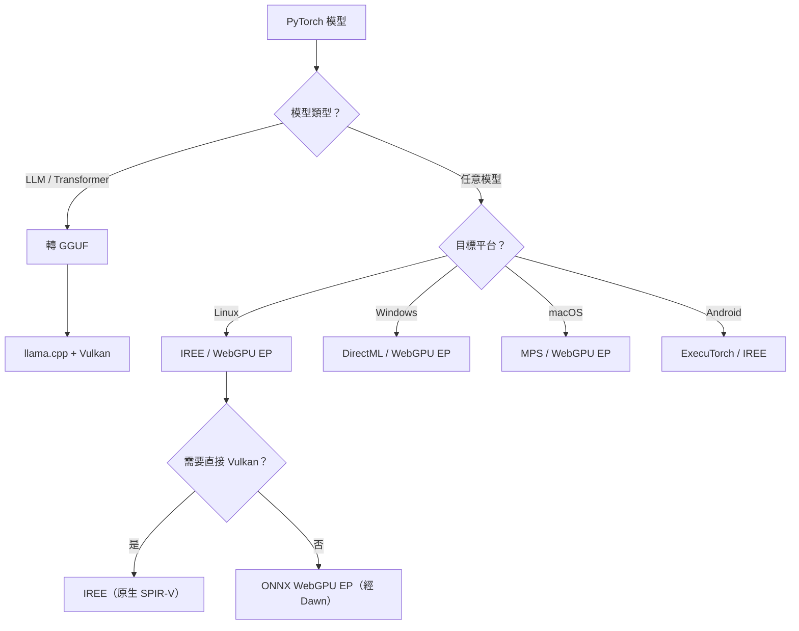

# PyTorch 模型去 CUDA 化：模型轉換路線與 Vulkan 推論研究

## 摘要

將 PyTorch 模型「去 CUDA」化的方式可分為兩大類：一是直接在 PyTorch 內使用非 CUDA 後端（如 MPS、ROCm、XPU），二是將模型轉換為其他格式後交由支援 Vulkan 的推論引擎執行。本報告聚焦**後者——模型轉換（model conversion）路線**。研究發現五條可行方案：(1) **ONNX Runtime + WebGPU EP**（最通用，Linux 上經 Dawn → Vulkan）；(2) **llama.cpp + GGUF + Vulkan**（LLM 專用，最成熟）；(3) **IREE**（任意模型 → Vulkan SPIR-V，最有彈性）；(4) **Apache TVM**（功能強大但學習曲線陡峭）；(5) **DirectML**（Windows 限定）。不存在一條「一鍵轉換即可在任何 GPU 上跑 Vulkan」的完美方案。

---

## 1. 前言：為何需要模型轉換

PyTorch 主線本身缺乏可用的 Vulkan 後端（不存在 `torch.device("vulkan")` 的 Python API，原始碼中的 Vulkan 實作僅為 Android 推論設計且未達生產標準）。因此，「去 CUDA」的另一條路是**放棄 PyTorch 作為執行引擎**，將模型轉換為其他框架或格式，再由那些框架的 Vulkan 後端執行推論。這條路的核心權衡是：

- **優點**：可繞過 PyTorch 的後端限制，利用其他專案成熟的 Vulkan 實作
- **缺點**：轉換可能引入精度損失、運算子支援缺口、以及 Pipeline 複雜度

---

## 2. 路線一：PyTorch → ONNX → ONNX Runtime + WebGPU EP（→ Dawn → Vulkan）

### 2.1 路線說明

這是最通用的路線，適用於任意模型架構（不限於 LLM）。ONNX Runtime 本身**沒有**原生的 Vulkan Execution Provider（EP），但它的 **WebGPU EP** 在 Linux 上透過 Google Dawn 函式庫轉譯為 Vulkan。[^onnx-webgpu]

```
PyTorch 模型 → ONNX 格式 → ONNX Runtime WebGPU EP → Dawn → Vulkan (Linux)
                                                      → D3D12 (Windows)
                                                      → Metal (macOS)
```

### 2.2 實作步驟

**Step 1：PyTorch → ONNX**

```python
import torch

torch.onnx.export(
    model,
    torch.randn(1, 3, 224, 224),  # 範例輸入
    "model.onnx",
    input_names=['input'],
    output_names=['output'],
    dynamic_axes={'input': {0: 'batch_size'}, 'output': {0: 'batch_size'}}
)

# 驗證
import onnx
onnx_model = onnx.load("model.onnx")
onnx.checker.check_model(onnx_model)
```

**Step 2：安裝 WebGPU EP**

```bash
pip install onnxruntime onnxruntime-ep-webgpu
```

**Step 3：ONNX Runtime 推論（Vulkan via Dawn）**

```python
import onnxruntime as ort
import onnxruntime_ep_webgpu as webgpu_ep

ort.register_execution_provider_library(
    "webgpu_ep_registration", webgpu_ep.get_library_path()
)

webgpu_devices = [
    d for d in ort.get_ep_devices()
    if d.ep_name == webgpu_ep.get_ep_name()
]

sess_options = ort.SessionOptions()
sess_options.add_provider_for_devices(webgpu_devices, {
    "preferredLayout": "NHWC",
    "enableGraphCapture": "1",
})

session = ort.InferenceSession("model.onnx", sess_options=sess_options)
outputs = session.run(None, {'input': input_data.numpy()})
```

### 2.3 優缺點

| 面向 | 評估 |
|------|------|
| **模型支援** | ✅ 任意 ONNX 可導出的模型（CNN、Transformer、等） |
| **Vulkan 真實性** | ⚠️ 間接 — 經 WebGPU → Dawn → Vulkan，非直接 Vulkan |
| **成熟度** | 🟡 WebGPU EP 較新，不如 CUDA/DirectML EP 成熟 |
| **平台** | ✅ Linux (Vulkan)、Windows (D3D12)、macOS (Metal) |
| **精度** | ✅ 支援 FP32/FP16 |
| **已知限制** | WebGPU 靜態圖捕獲（graph capture）僅適用於固定形狀模型 |

---

## 3. 路線二：PyTorch → GGUF → llama.cpp + Vulkan 後端

### 3.1 路線說明

llama.cpp 是目前**最成熟的 Vulkan 推論引擎**。它基於 GGML 張量函式庫，將運算編譯為 Vulkan Compute Shader（SPIR-V），直接在 GPU 上執行。模型需先轉換為 GGUF 格式。[^llamacpp-vulkan]

```
PyTorch / HuggingFace 模型 → GGUF 格式 → llama.cpp → GGML Vulkan 後端 → Vulkan GPU
```

### 3.2 實作步驟

**Step 1：編譯 llama.cpp 啟用 Vulkan**

```bash
git clone https://github.com/ggml-org/llama.cpp
cd llama.cpp
cmake -B build -DGGML_VULKAN=ON
cmake --build build --config Release
```

**Step 2：轉換模型至 GGUF**

```bash
# 從 HuggingFace 轉換
python convert_hf_to_gguf.py \
    --model /path/to/hf_model \
    --outfile model.gguf
```

**Step 3：Vulkan 推論**

```bash
# -ngl 99 表示將所有層 offload 至 GPU
./build/bin/llama-cli -m model.gguf -p "Hello" -ngl 99

# 查看可用 Vulkan 裝置
./build/bin/llama-cli --list-devices

# 指定特定裝置
./build/bin/llama-cli -m model.gguf -ngl 99 --device 0
```

### 3.3 支援的 GPU 後端一覽

llama.cpp 支援同時編譯多個後端，執行時可選擇。[^llamacpp-build]

| 後端 | GPU 類型 | 編譯參數 |
|------|----------|----------|
| **Vulkan** | **任意 Vulkan GPU**（NVIDIA, AMD, Intel, Qualcomm） | `-DGGML_VULKAN=ON` |
| CUDA | NVIDIA | `-DGGML_CUDA=ON` |
| HIP | AMD | `-DGGML_HIP=ON` |
| Metal | Apple Silicon | 預設啟用 |
| SYCL | Intel GPU | `-DGGML_SYCL=ON` |
| OpenCL | Qualcomm/Adreno | `-DGGML_OPENCL=ON` |
| OpenVINO | Intel CPU/GPU/NPU | `-DGGML_OPENVINO=ON` |
| WebGPU | 瀏覽器／任意 (via Dawn) | `-DGGML_WEBGPU=ON` |
| CANN | 華為 Ascend NPU | `-DGGML_CANN=ON` |

### 3.4 優缺點

| 面向 | 評估 |
|------|------|
| **模型支援** | ❌ **僅 LLM /  transformer 架構**（Llama, Mistral, Qwen, Gemma, Phi, DeepSeek 等） |
| **Vulkan 真實性** | ✅ **原生 Vulkan Compute Shader**，最直接 |
| **成熟度** | ✅ 生產等級，社群廣泛使用 |
| **平台** | ✅ Linux, Windows, Android（Vulkan 原生） |
| **量化支援** | ✅ Q4_0 ~ Q8_0, K-quant 等全系列 |
| **混合推論** | ✅ CPU + GPU 協同（VRAM 不足時自動回退 CPU） |
| **非 LLM 模型** | ❌ ResNet、YOLO、Stable Diffusion、Whisper encoder 等無法直接轉換 |

---

## 4. 路線三：PyTorch → IREE → Vulkan SPIR-V

### 4.1 路線說明

IREE（Intermediate Representation Execution Environment）是 Google 開發的 MLIR 基礎編譯器，可將模型編譯為 Vulkan SPIR-V 並直接執行。這是一條**任意模型都適用的路線**，且不依賴 WebGPU 抽象層。[^iree-vulkan]

```
PyTorch 模型 → Torch-MLIR / iree-turbine → IREE 編譯 → .vmfb → IREE Vulkan HAL → Vulkan GPU
```

### 4.2 硬體需求

IREE Vulkan 後端最低要求 Vulkan 1.3，且需支援以下功能[^iree-vulkan]：
- `timelineSemaphore`
- `scalarBlockLayout`
- `synchronization2`

各 GPU 廠商支援程度：

| GPU 廠商 | 類別 | 效能表現 |
|----------|------|----------|
| ARM Mali | 行動 | 良好（Valhall+) |
| Qualcomm Adreno | 行動 | 可接受（640+) |
| AMD | 桌上/伺服器 | 良好（RDNA+) |
| NVIDIA | 桌上/伺服器 | 可接受（Turing+) |

### 4.3 實作步驟

**Step 1：安裝 IREE + iree-turbine**

```bash
pip install iree-compiler iree-runtime iree-turbine
```

**Step 2：AOT 編譯 PyTorch 模型至 Vulkan**

```python
import torch
import iree.turbine as turbine

# 匯出模型
exported = torch.export.export(model, sample_inputs)

# 編譯為 IREE 模組（目標 Vulkan）
module = turbine.export(
    exported,
    target_backend="vulkan"  # 關鍵參數
)

# 儲存為 .vmfb（IREE 的可部署格式）
with open("model_vulkan.vmfb", "wb") as f:
    f.write(module)

# 執行推論
iree_module = iree_runtime.load_vmfb("model_vulkan.vmfb")
result = iree_module["main"](input_tensor)
```

### 4.4 優缺點

| 面向 | 評估 |
|------|------|
| **模型支援** | ✅ 任意 PyTorch 模型（CNN, Transformer, 等） |
| **Vulkan 真實性** | ✅ **原生 SPIR-V** |
| **成熟度** | 🟡 積極開發中，生產就緒但社群較小 |
| **平台** | ✅ Linux, Android, Windows（Vulkan 原生） |
| **效能** | ✅ 可達接近原生 Vulkan 效能 |
| **學習曲線** | ⚠️ 需要理解 IREE 生態系與 MLIR 基礎概念 |
| **JIT 支援** | ⚠️ 目前 JIT (`torch.compile`) 僅支援 CPU |

---

## 5. 路線四：PyTorch → Apache TVM → Vulkan SPIR-V

### 5.1 路線說明

Apache TVM 擁有成熟的 Vulkan SPIR-V 程式碼產生器（`target.build.vulkan`），可將模型編譯為 Vulkan Compute Shader。[^tvm-vulkan]

```
PyTorch 模型 → TorchScript/TorchDynamo → TVM Relay/Relax IR → Auto-tuning → Vulkan SPIR-V
```

### 5.2 特色

- **Auto-tuning**：TVM 可針對特定 GPU 架構自動調校 shader 參數
- **雙後端輸出**：同時支援 `target.build.vulkan`（SPIR-V）與 `target.build.webgpu`（WGSL）
- **ONNX Runtime TVM EP**：社群維護的 ONNX Runtime EP，可將 TVM 作為 ORT 的後端

### 5.3 優缺點

| 面向 | 評估 |
|------|------|
| **模型支援** | ✅ 任意模型 |
| **Vulkan 真實性** | ✅ **原生 SPIR-V** |
| **成熟度** | ✅ TVM Vulkan 後端成熟，但整體專案社群萎縮中 |
| **實用性** | ❌ 學習曲線陡峭，需理解 Relay/Relax IR 與 Auto-tuning Pipeline |
| **生態系** | ⚠️ TVM 社群規模縮小，較推薦 IREE |

---

## 6. 路線五：PyTorch → ONNX → DirectML EP（Windows 限定）

### 6.1 路線說明

雖然 DirectML 不是 Vulkan，但它**涵蓋與 Vulkan 相同的 GPU 範圍**（任何 DirectX 12 GPU），且設定最簡單。[^directml-ep]

```
PyTorch 模型 → ONNX → ONNX Runtime DirectML EP → DirectX 12 GPU
```

### 6.2 實作

```python
import onnxruntime as ort

session = ort.InferenceSession(
    "model.onnx",
    providers=['DmlExecutionProvider']
)
outputs = session.run(None, {'input': input_data.numpy()})
```

### 6.3 優缺點

| 面向 | 評估 |
|------|------|
| **模型支援** | ✅ 任意 ONNX 模型 |
| **平台** | ❌ **Windows 限定** |
| **成熟度** | ✅ 穩定，但已進入**維護模式**（無新功能）[^directml-repo] |
| **Microsoft 建議** | Windows 11 24H2+ 改用 Windows ML（WinML） |
| **Vulkan 關聯性** | ❌ 非 Vulkan，但覆蓋相同硬體 |

---

## 7. 其他轉換路線

### 7.1 OpenVINO（Intel GPU 限定）

Intel OpenVINO **不支援 Vulkan**。其 GPU 後端使用 Intel 專屬的 OpenCL 與 Level Zero 驅動程式，僅適用於 Intel GPU。[^openvino-arch]

### 7.2 TensorRT（NVIDIA 限定）

NVIDIA GPU 專用，無 Vulkan 路徑。

### 7.3 CoreML（Apple 限定）

僅適用於 macOS/iOS。[^coreml-ep]

### 7.4 TFLite GPU Delegate

使用 OpenGL ES 或 OpenCL，無 Vulkan 支援。

---

## 8. 綜合比較與決策指南

### 8.1 所有 Vulkan 相關路線總表

| 路線 | Vulkan 真實性 | 模型架構限制 | 成熟度 | 平台 | 推薦場景 |
|------|-------------|-------------|--------|------|---------|
| **ONNX + WebGPU EP** | 間接 (Dawn) | 無 | 🟡 較新 | Linux/Android/Win/macOS | 任意模型、跨平台 |
| **GGUF + llama.cpp** | **直接 SPIR-V** | ❌ 僅 LLM | ✅ 生產級 | Linux/Win/Android | LLM 推論 |
| **IREE** | **直接 SPIR-V** | 無 | 🟡 發展中 | Linux/Android/Win | 任意模型、Linux Vulkan |
| **TVM** | **直接 SPIR-V** | 無 | ✅ 成熟但複雜 | 全平台 | 需 Auto-tuning 的場景 |
| **DirectML** | ❌ (D3D12) | 無 | ✅ 穩定（維護模式） | Windows | Windows 任意 GPU |
| **ROCm** | ❌ (HIP) | 無 | ✅ 穩定 | Linux (AMD GPU) | AMD GPU Linux 用戶 |
| **MPS** | ❌ (Metal) | 無 | ✅ 穩定 | macOS | Apple Silicon |

### 8.2 決策流程



### 8.3 實務建議

1. **若模型是 LLM** → **GGUF + llama.cpp Vulkan** 是目前最成熟、最簡單的路線
2. **若模型非 LLM，且在 Linux** → **IREE** 是唯一能直接產出 Vulkan SPIR-V 的可行方案；**ONNX WebGPU EP** 是更簡易但間接的替代
3. **若模型非 LLM，且在 Windows** → **ONNX DirectML EP** 最簡單（雖非 Vulkan，但覆蓋相同硬體）
4. **若需要絕對跨平台且不介意抽象層** → **ONNX + WebGPU EP**（Linux Vulkan / Windows D3D12 / macOS Metal）
5. **避免的路線**：TVM（除非已有 TVM 經驗）、OpenCL（PyTorch 無支援）、自行撰寫 Vulkan Compute Shader（除非模型極簡單）

---

## 參考文獻

[^onnx-webgpu]: ONNX Runtime. (n.d.). WebGPU Execution Provider. Retrieved 2026-09-25, from https://onnxruntime.ai/docs/execution-providers/WebGPU-ExecutionProvider.html

[^llamacpp-vulkan]: llama.cpp. (n.d.). Build Documentation — Vulkan. Retrieved 2026-09-25, from https://github.com/ggml-org/llama.cpp/blob/master/docs/build.md

[^llamacpp-build]: llama.cpp. (n.d.). Supported backends. Retrieved 2026-09-25, from https://github.com/ggml-org/llama.cpp

[^iree-vulkan]: IREE. (n.d.). GPU Vulkan Deployment Configurations. Retrieved 2026-09-25, from https://iree.dev/guides/deployment-configurations/gpu-vulkan/

[^iree-pytorch]: IREE. (n.d.). PyTorch Integration with iree-turbine. Retrieved 2026-09-25, from https://iree.dev/guides/ml-frameworks/pytorch/

[^tvm-vulkan]: Apache TVM. (n.d.). Code Generation Architecture — target.build.vulkan. Retrieved 2026-09-25, from https://tvm.apache.org/docs/arch/codegen.html

[^directml-ep]: ONNX Runtime. (n.d.). DirectML Execution Provider. Retrieved 2026-09-25, from https://onnxruntime.ai/docs/execution-providers/DirectML-ExecutionProvider.html

[^directml-repo]: Microsoft. (n.d.). DirectML (maintenance mode). Retrieved 2026-09-25, from https://github.com/microsoft/DirectML

[^openvino-arch]: OpenVINO. (n.d.). Architecture Documentation. Retrieved 2026-09-25, from https://raw.githubusercontent.com/openvinotoolkit/openvino/master/src/docs/architecture.md

[^coreml-ep]: ONNX Runtime. (n.d.). CoreML Execution Provider. Retrieved 2026-09-25, from https://onnxruntime.ai/docs/execution-providers/CoreML-ExecutionProvider.html

[^onnx-eps]: ONNX Runtime. (n.d.). Summary of Supported Execution Providers. Retrieved 2026-09-25, from https://onnxruntime.ai/docs/execution-providers/