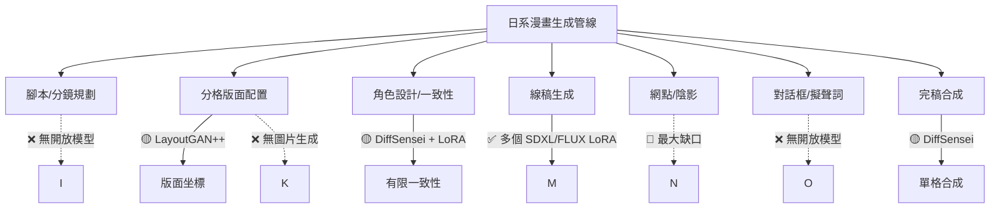

# 生成式 AI 在日系漫畫的當前進展：開放權重模型焦點

> 本報告聚焦於**日系漫畫風格**（黑白線稿、網點、分鏡格、連續敘事）的開放權重（open weight）生成式 AI 模型生態調查，時間截至 2026 年 9 月。日系漫畫在此定義為視覺風格（相對於韓系條漫與美式漫畫），不討論日本政府政策或產業組織立場。

---

## 1. 開放權重模型生態總覽

截至 2026 年 9 月，日系漫畫相關的開放權重模型可歸為以下幾類：

| 類別 | 開放權重模型數量 | 成熟度 |
|------|----------------|--------|
| 全文生成（多格、角色一致） | 1（DiffSensei） | 🟡 研究級，可推論 |
| 線稿上色 | 6+ 個模型 | ✅ 成熟 |
| B&W 風格微調（Full / LoRA） | ~20+ 個 | ✅ 豐富 |
| 網點生成專用模型 | 0（僅 LoRA） | 🔴 欠缺 |
| 分格版面生成 | 2（LayoutGAN++） | 🟡 僅版面坐標 |
| 漫畫修復/Inpainting | 2 個 | ✅ 成熟 |
| 漫畫檢測/OCR | 5+ 個 | ✅ 成熟 |

核心發現：**真正能端到端生成日系漫畫頁面的開放權重模型只有一篇——DiffSensei（CVPR 2025）。** 其餘多為 LoRA 微調、ControlNet、或輔助工具。

---

## 2. 全文生成：DiffSensei（唯一開放權重的端到端解決方案）

DiffSensei 是目前唯一完整開放權重與程式碼的**多格漫畫全文生成模型**。[^diffsensei]

**基本資訊：**
- 論文：CVPR 2025 Highlight，「Bridging Multi-Modal LLMs and Diffusion Models for Customized Manga Generation」
- 組織：北京大學、MMLab
- 程式碼：[github.com/jianzongwu/DiffSensei](https://github.com/jianzongwu/DiffSensei)（925 stars, 101 forks）
- 權重：[huggingface.co/jianzongwu/DiffSensei](https://huggingface.co/jianzongwu/DiffSensei)
- 資料集：[MangaZero](https://huggingface.co/datasets/jianzongwu/MangaZero)（43,264 頁漫畫、427,147 個標註分格）
- 架構：SDXL + IP-Adapter + SEED-X MLLM

**能力：**
- 支援可變解析度生成（64–2048px）
- 角色一致性黑白漫畫生成
- 真實人物照片轉漫畫風格
- MLLM-free 模式可在單張 24GB VRAM（RTX 4090）上運行
- 三階段訓練：text-to-image → 條件控制 → MLLM 訓練，全部開放

**限制：**
- 產生的是單格漫畫，而非完整頁面
- 角色一致性跨格仍需提示詞或參考圖維持
- 授權條款不明確（repo 未標示）

---

## 3. 黑白漫畫風格微調模型

### 3.1 SDXL 系列

| 模型 | 類型 | 釋出日期 | 授權 | 下載量/月 |
|------|------|---------|------|----------|
| alvdansen/BandW-Manga[^bandw] | Full fine-tune | 2024-06 | 研究用途 | 56 |
| Kojimber/Mangabase[^mangabase] | Full fine-tune (Illustrious) | 2025-03 | 未標示 | 16 |
| John6666/manga-vision-il-v1-sdxl[^mangavision] | Full fine-tune (Illustrious) | 2025-02 | FAIPL-1.0-sd | 10 |
| Sexiam/Obsidian_Anise_v1 & v2[^obsidian] | Full SDXL merge | — | 未標示 | — |
| Chan-Y/BoldLine-Manga[^boldline] | LoRA | 2024 | 未標示 | 38 |
| strkyyy/manga-ink-screentone[^screentone] | LoRA | 2026-05 | 未標示 | **298** ⭐ |
| artificialguybr/LineAniRedmond-LinearMangaSDXL-V2[^lineani] | LoRA | — | 未標示 | **736** ⭐ |
| s3ren1ty/MANGA_style_LoRA[^mangastyle] | LoRA | — | 未標示 | 9 |
| leonel4rd/MangaRedux / Manga[^mangaredux] | LoRA | — | 未標示 | 7 |

`BandW-Manga` 是最受歡迎的 SDXL 黑白漫畫全模型，但授權僅供研究。`strkyyy/manga-ink-screentone` 是唯一在命名與觸發詞中明確提及「網點」（screentone）的 LoRA，觸發詞為 `m4ng41nk`。

### 3.2 SD 1.5 / SD2 / SD3 系列

| 模型 | 基礎架構 | 釋出日期 | 授權 |
|------|---------|---------|------|
| parsee-mizuhashi/mangaka[^mangaka] | SD 1.5（hnnng-dx） | 2024-03 | 未標示 |
| aipicasso/manga-diffusion-poc[^mdpoc] | SD 2.0（0.9B） | **2023-09** | Mitsua Open RAIL-M |
| Chan-Y/MangaDF[^mangadf] | SD3 Medium | 2024-07 | 未標示 |

`manga-diffusion-poc` 是最早的開放權重漫畫生成模型，基於 Manga109-s 資料集訓練，授權允許商業使用。`MangaDF` 是以 `BandW-Manga` 的輸出進一步訓練 SD3 Medium 的模型。

### 3.3 FLUX.1 / FLUX.2 系列（LoRA 為主）

**重要發現：FLUX 系列目前沒有任何日系漫畫專屬的全模型微調（full fine-tune），僅有 LoRA。**

| 模型 | 基礎 | 說明 | 授權 | 下載/月 |
|------|------|------|------|--------|
| glif/001_Detailed_Manga_Style-v2_1[^fluxmanga] | FLUX.1-dev | B&W 漫畫，含精細陰影網點 | 非商業 | 207 |
| Muapi/manga-style-lora-flux.1[^muapiflora] | FLUX.1-dev | 通用漫畫風格 | — | 26 |
| Muapi/berserk-manga-style-flux-lora | FLUX.1-dev | 烙印勇士風格 | — | 31 |
| Muapi/one-piece-manga-style-flux1-dev-lora | FLUX.1-dev | 海賊王風格 | — | 18 |
| Muapi/comic-book-page-style | FLUX.1-dev | 漫畫頁面版面風格 | — | 77 |
| thedeoxen/FLUX.2-klein-manga-colorization-LORA[^fluxcol] | FLUX.2 Klein 9B | 參考圖黑白上色 | **Apache 2.0** | **1198** ⭐ |

FLUX.2 Klein 的漫畫上色 LoRA 是 2026 年 6 月發布的最新模型，也是唯一採用 Apache 2.0 授權的 FLUX 漫畫模型。觸發詞 `mngclranm`，支援多角色上色並附帶 ComfyUI 工作流程。

---

## 4. 線稿上色模型

這是開放權重最豐富的類別，共有 6+ 個模型：

| 模型 | 方法 | 授權 | 說明 |
|------|------|------|------|
| MangaNinja[^manganinja] | Reference-guided + Point Control | CC BY-NC 4.0 | **CVPR 2025 Highlight**，ali-vilab 開發，最強參考圖上色 |
| SubMaroon/ControlNet-manga-recolor[^controlcolor] | ControlNet（SDXL） | **MIT** | 6000 張 Danbooru 漫畫掃描訓練，黑白→彩色 |
| thedeoxen/FLUX.2-klein-manga-colorization-LORA[^fluxcol] | FLUX.2 LoRA | **Apache 2.0** | 參考圖色彩轉移，多角色支援 |
| Keiser41/Example_Based_Manga_Colorization[^cgan] | cGAN（VGG19+U-Net+PatchGAN） | — | 基於參考圖的學習式上色，含完整程式碼 |
| lookx2/manga-colorization | ONNX INT8 | — | 輕量級上色，適合低資源設備 |
| Gllangnallg/Flux_Kontext_Manga_Colorization_LoRA | FLUX.1-Kontext LoRA | — | 18 組漫畫頁面對訓練 |

**MangaNinja** 細節：
- 論文：[arxiv.org/abs/2501.08332](https://arxiv.org/abs/2501.08332)
- 程式碼：[github.com/ali-vilab/MangaNinjia](https://github.com/ali-vilab/MangaNinjia)
- 權重：[huggingface.co/Johanan0528/MangaNinjia](https://huggingface.co/Johanan0528/MangaNinjia)
- 核心創新：Patch Shuffling + Point-driven Control，可精確指定上色區域
- 授權為 **CC BY-NC 4.0**（非商業），若需商業使用需另行授權
- 作者表示未來可能移植至 SD3 / FLUX

---

## 5. 網點生成——最大的開放權重缺口

**截至 2026 年 9 月，沒有任何專用於網點（screentone）生成的開放權重模型或 ControlNet。** 網點只能透過以下間接方式達成：

| 方式 | 效果 | 限制 |
|------|------|------|
| `strkyyy/manga-ink-screentone` SDXL LoRA[^screentone] | 🟡 部分模擬 | LoRA 的點密度不可控 |
| `glif/001_Detailed_Manga_Style-v2_1` FLUX LoRA[^fluxmanga] | 🟡 部分陰影 | 非真正網點，是擴散模型模擬的紋理 |
| 傳統影像後製（Clip Studio Paint/GIMP） | ✅ 完全可控 | 非 AI 生成 |
| DiffSensei 生成的黑白結果含網點質感 | 🟡 非目標性 | 不可預測、不可控 |

這是一個值得注意的市場缺口——商業工具如 Clip Studio Paint 已有 AI 輔助網點，但開放權重模型領域完全空白。

---

## 6. 分格版面生成

存在兩個開放原始碼專案，均基於 LayoutGAN++：[^layoutgan1][^layoutgan2]

- **koesan/Manga-Panel-LayoutGAN**（MIT 授權，2025-10 釋出）
- **asmaends/Manga-Panel-LayoutGAN**（MIT 授權，fork，含桌面應用）

**重要限制**：這兩個專案**僅生成版面坐標（bounding box），不生成圖片內容**。輸出為 `.pkl` 格式的格位資料。訓練資料來自 MangaZero。有 HuggingFace Spaces 展示頁面。

---

## 7. 漫畫輔助工具（開放權重）

### 7.1 檢測與分割

| 模型 | 任務 | 授權 | 釋出 | 下載/月 |
|------|------|------|------|--------|
| leoxs22/manga-panel-detector-yolo26n[^yolo] | 分格檢測 | **AGPL-3.0** | 2026-03 | 1024 |
| deepghs/manga109_yolo[^yolo109] | 人臉/身體/文字檢測 | — | — | — |
| huyvux3005/manga109-segmentation-bubble[^bubble] | 對話框分割 | **Apache 2.0** | — | **4844** ⭐ |

### 7.2 修復與 Inpainting

| 模型 | 授權 | 說明 |
|------|------|------|
| mayocream/lama-manga[^lama] | **MIT** | Big-LaMa 在 30 萬張漫畫/動畫影像上微調，可移除文字填補遮罩區域 |

### 7.3 OCR 與翻譯

| 模型 | 說明 |
|------|------|
| kha-white/manga-ocr-base[^mangaocr] | 日本漫畫專用 OCR，**111 萬次下載** |
| fumetodev/Hy-MT2-1.8B-JP-Manga-Finetune-v5-GGUF | 日漫翻譯微調模型 |

---

## 8. 關鍵學術論文（未開放權重）

以下論文在日系漫畫生成領域有重大貢獻，但**截至 2026 年 9 月尚未釋出權重或程式碼**：

| 論文 | 會議/年份 | 貢獻 | 開放狀態 |
|------|----------|------|---------|
| MangaDiffusion[^mangadiff] | arXiv 2024-12 | 多格文字生成，格內/格間資訊交互 | ❌ 原始碼與權重均未釋出 |
| Towards Intelligent Manga Generation | IEEE 2025 | GAN/CNN/擴散模型/MLLM 綜述 | — |

DiffSensei 是**唯一**成功兌現開放承諾的頂會論文。

---

## 9. 開放權重生態的關鍵缺口

**六大缺口：**
1. **網點生成的專用模型**——完全空白，可能是最有價值的填補方向
2. **角色跨頁/跨章一致性**——DiffSensei 僅解決單頁內的一致性，LoRA 訓練成本過高
3. **分格版面到圖片的端到端生成**——LayoutGAN 只產生坐標，無模型能依坐標生成對應內容
4. **對話框與擬聲詞生成**——完全無開放模型
5. **腳本到漫畫的規劃層**——無開放模型
6. **FLUX 系列無漫畫全模型微調**——只有 LoRA，無 full fine-tune

---

## 10. 與韓系條漫 AI 的比較

| 維度 | 日系漫畫（開放權重） | 韓系條漫 |
|------|-------------------|---------|
| 端到端開放模型 | 1 個（DiffSensei） | 0 個（Dashtoon 已關閉） |
| 黑白專用模型 | ~20+ 個 | 無（條漫全彩） |
| 網點模型 | 0 個 | 不適用 |
| 頁面編排模型 | 2 個（僅坐標） | 無（垂直捲動無版面問題） |
| 商業工具 | Clip Studio Paint AI | Webtoon AI Painter（封閉） |

日系漫畫在開放權重模型數量上豐富許多，但這是因為 SD/FLUX 等通用擴散模型生態本就龐大，並非漫畫生成技術本身更成熟。韓系條漫有 Naver 等大型平台投入封閉工具，而日系漫畫的文化保守性與技術難度（網點、黑白精度）導致開放權重成為社群驅動的碎片化努力。

---

## 11. 總結

開放權重生成式 AI 在日系漫畫領域的進展，截至 2026 年 9 月：

- **可實際使用**：黑白漫畫風格生成（多個 SDXL/FLUX LoRA）、線稿上色（MangaNinja + ControlNet + FLUX LoRA）、分格檢測與 OCR（成熟工具生態）、Inpainting（lama-manga）
- **研究級可用**：DiffSensei 全文角色一致生成（需手動調整）
- **完全欠缺**：網點專用模型、頁面版面到圖片的端到端生成、對話框/擬聲詞生成、跨章一致性方案

與報告 00192 中提及的商用工具（Comistitch、Anifusion、Comicory）相比，開放權重模型在網點處理與角色一致性的管線整合上明顯落後，但在**模型自由度、研究透明度、資料集開放性**上具有不可取代的優勢。DiffSensei + MangaZero 的完整開放為後續研究提供了堅實基礎。

---

## 參考資料

[^diffsensei]: Jianzun Wu, Chao Tang, Jingbo Wang, et al. (2025). DiffSensei: Bridging Multi-Modal LLMs and Diffusion Models for Customized Manga Generation. *CVPR 2025*. Retrieved 2026-09-25, from https://arxiv.org/abs/2412.07589

[^bandw]: alvdansen. (2024). BandW-Manga. Retrieved 2026-09-25, from https://huggingface.co/alvdansen/BandW-Manga

[^mangabase]: Kojimber. (2025). Mangabase. Retrieved 2026-09-25, from https://huggingface.co/Kojimber/Mangabase

[^mangavision]: John6666. (2025). manga-vision-il-v1-sdxl. Retrieved 2026-09-25, from https://huggingface.co/John6666/manga-vision-il-v1-sdxl

[^obsidian]: Sexiam. (n.d.). Obsidian_Anise_v1. Retrieved 2026-09-25, from https://huggingface.co/Sexiam/Obsidian_Anise_v1

[^boldline]: Chan-Y. (2024). BoldLine-Manga. Retrieved 2026-09-25, from https://huggingface.co/Chan-Y/BoldLine-Manga

[^screentone]: strkyyy. (2026). manga-ink-screentone. Retrieved 2026-09-25, from https://huggingface.co/strkyyy/manga-ink-screentone

[^lineani]: artificialguybr. (n.d.). LineAniRedmond-LinearMangaSDXL-V2. Retrieved 2026-09-25, from https://huggingface.co/artificialguybr/LineAniRedmond-LinearMangaSDXL-V2

[^mangastyle]: s3ren1ty. (n.d.). MANGA_style_LoRA. Retrieved 2026-09-25, from https://huggingface.co/s3ren1ty/MANGA_style_LoRA

[^mangaredux]: leonel4rd. (n.d.). MangaRedux. Retrieved 2026-09-25, from https://huggingface.co/leonel4rd/MangaRedux

[^mangaka]: parsee-mizuhashi. (2024). mangaka. Retrieved 2026-09-25, from https://huggingface.co/parsee-mizuhashi/mangaka

[^mdpoc]: aipicasso. (2023). manga-diffusion-poc. Retrieved 2026-09-25, from https://huggingface.co/aipicasso/manga-diffusion-poc

[^mangadf]: Chan-Y. (2024). MangaDF. Retrieved 2026-09-25, from https://huggingface.co/Chan-Y/MangaDF

[^fluxmanga]: glif-loradex-trainer. (2025). 001_Detailed_Manga_Style-v2_1. Retrieved 2026-09-25, from https://huggingface.co/glif-loradex-trainer/001_Detailed_Manga_Style-v2_1

[^muapiflora]: Muapi. (n.d.). manga-style-lora-flux.1. Retrieved 2026-09-25, from https://huggingface.co/Muapi/manga-style-lora-flux.1

[^fluxcol]: thedeoxen. (2026). FLUX.2-klein-9B-manga-colorization-by-reference-LORA. Retrieved 2026-09-25, from https://huggingface.co/thedeoxen/FLUX.2-klein-9B-manga-colorization-by-reference-LORA

[^manganinja]: Zhiheng Liu, Ka Leong Cheng, Xi Chen, et al. (2025). MangaNinja: Line Art Colorization with Precise Reference Following. *CVPR 2025 Highlight*. Retrieved 2026-09-25, from https://arxiv.org/abs/2501.08332

[^controlcolor]: SubMaroon. (2025). ControlNet-manga-recolor. Retrieved 2026-09-25, from https://huggingface.co/SubMaroon/ControlNet-manga-recolor

[^cgan]: Keiser41. (n.d.). Example_Based_Manga_Colorization. Retrieved 2026-09-25, from https://huggingface.co/Keiser41/Example_Based_Manga_Colorization

[^layoutgan1]: koesan. (2025). Manga-Panel-LayoutGAN. Retrieved 2026-09-25, from https://github.com/koesan/Manga-Panel-LayoutGAN

[^layoutgan2]: asmaends. (2025). Manga-Panel-LayoutGAN. Retrieved 2026-09-25, from https://github.com/asmaends/Manga-Panel-LayoutGAN

[^yolo]: leoxs22. (2026). manga-panel-detector-yolo26n. Retrieved 2026-09-25, from https://huggingface.co/leoxs22/manga-panel-detector-yolo26n

[^yolo109]: deepghs. (n.d.). manga109_yolo. Retrieved 2026-09-25, from https://huggingface.co/deepghs/manga109_yolo

[^bubble]: huyvux3005. (n.d.). manga109-segmentation-bubble. Retrieved 2026-09-25, from https://huggingface.co/huyvux3005/manga109-segmentation-bubble

[^lama]: mayocream. (2025). lama-manga. Retrieved 2026-09-25, from https://huggingface.co/mayocream/lama-manga

[^mangaocr]: kha-white. (n.d.). manga-ocr-base. Retrieved 2026-09-25, from https://huggingface.co/kha-white/manga-ocr-base

[^mangadiff]: Siyu Chen, Dengjie Li, Zenghao Bao, et al. (2024). MangaDiffusion: Multi-panel Manga Generation with Layout-controllable Diffusion. Retrieved 2026-09-25, from https://arxiv.org/abs/2412.19303

[^kuroboo]: Kuro.boo. (2026). The Reality of AI Manga Production: A 2026 Analysis. Retrieved 2026-09-25, from https://kuro.boo/blog/reality-of-ai-manga-production-2026-analysis/?lang=en

[^comistitch]: Comistitch. (n.d.). AI Manga Shading and Screentones Guide. Retrieved 2026-09-25, from https://comistitch.com/blog/manga-shading-and-screentones-with-ai/