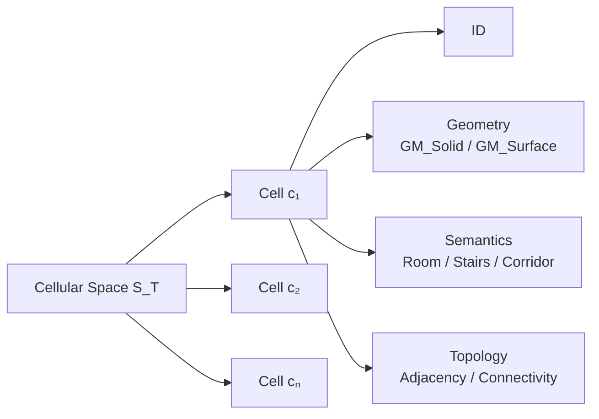
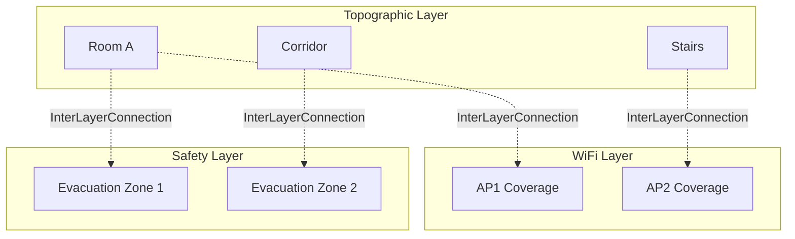
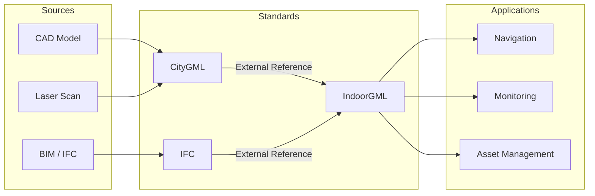

# IndoorGML 的三維空間處理能力：樓梯、地下道等垂直連接元件

## 摘要

IndoorGML 是 OGC（Open Geospatial Consortium）制定的室內空間資料標準，專注於室內空間的表示、拓撲關係與導航應用。本文探討 IndoorGML 是否能夠處理三維（3D）空間資訊，特別是樓梯、地下道、斜坡等立體垂直連接元件，並說明其 Cellular Space 模型、Multi-Layered Space Model（MLSM）以及與 CityGML、BIM（IFC）等其他標準的搭配方式。

---

## 一、IndoorGML 的 3D 支援能力

IndoorGML 明確支援三維空間資訊的建模與表示，其核心模型設計上即可處理 2D 或 3D 空間資訊。

**幾何表示支援 3D**：IndoorGML 標準指出，每個 cell 的幾何可以定義為 3D 立體（solids）或 2D 面（surfaces）。標準原文明確說明 *"Cell geometry is defined in 2-dimensional or 3-dimensional Euclidean space"*[^geom] 以及 *"every cell in a cellular space can have... a geometry (e.g., solids in 3D or surfaces in 2D)"*[^geom]。

**GM_Solid 支援**：若選擇在 IndoorGML 文件內直接表達幾何，標準指定使用 ISO 19107 規範的 `GM_Solid`（3D）或 `GM_Surface`（2D），且允許帶孔（with holes）的立體或面[^geom]。

**Poincaré 對偶（Duality）支援 3D**：IndoorGML 的核心拓撲模型基於 Poincaré 對偶性，標準明確討論了 3D Primal Space 到 Dual Space 的映射：*"A k-dimensional object in N-dimensional Primal Space is mapped to (N-k) dimensional object in Dual Space. Thus, solid 3D objects in 3D Primal space, such as rooms within a building, are mapped to nodes (0D object) in dual space. A 2D surface shared by two 3D objects is transformed into an edge (1D) linking the two nodes in Dual space."*[^poincare]

---

## 二、垂直連接元件：樓梯、地下道、斜坡

IndoorGML 完全能夠處理樓梯、電梯、手扶梯、斜坡等垂直連接元件，這些甚至是 IndoorGML 的核心設計考量之一。

**垂直連接器是重要動機**：標準的 Motivation 章節明確指出建築物是 *"multi-levelled and reachable via different vertical connectors such as stairs, elevators, escalators, and ramps"*[^motivation]。

**樓梯視為空間（Space）而非牆體**：IndoorGML 的重點是「空間」而非「建築構件」。標準指出 *"IndoorGML is not concerned about architectural components themselves (e.g., roofs, ceilings, walls), but instead the spaces (e.g., rooms, corridors, stairs) defined by architectural components, where objects can be located and navigate."*[^space] 也就是說，樓梯（stairs）被視為 CellSpace 的一種，而非牆體等不可導航元素。同樣地，電梯（elevators）也被視為空間的一部分。

**Navigation Module 中的 AnchorSpace 與 ConnectionSpace**：在 IndoorGML 的導航擴充模組中，ConnectionSpace 用於表示連接不同空間的過渡區域（如門、樓梯口、電梯口），而 AnchorSpace 則用於室內外空間的連接點（如建築物入口）[^navigation]。這些概念可直接用於建模垂直過渡。

**State-Transition 機制**：NRG（Node-Relation Graph）中的節點稱為 State（狀態），邊稱為 Transition（轉換），用於表示物體從一個空間移動到另一個空間的動作。這在導航中可直接用於建模「上樓梯」、「搭電梯」等垂直移動事件[^nrg]。

---

## 三、Cellular Space 模型

Cellular Space（細胞空間）是 IndoorGML 的基礎概念。

**定義**：Cellular Space S 是一組 Cell 的集合，根據某個主題 T 分組，表示為 **S_T = \{c₁, c₂, …, cₙ\}**[^cellular]。

**Cell 的屬性**：每個 cell 擁有：
- 唯一識別碼（ID）
- 名稱（如房間號碼）
- 幾何（3D 立體或 2D 面）
- 語義（分類與解釋）
- 拓樸關係（相鄰、連通等）[^cellular]

**Cell 的特性**：
- 同一 Cellular Space 內的 cell 不重疊
- Cell 之間可以有共同邊界（adjacency）
- 一個 Cellular Space 可以是不完整的覆蓋（cell 之間可以有間隙）
- Cell 可被進一步細分（subdivision）或聚合（aggregation）[^cellular]

---

## 四、Layer 概念與 Multi-Layered Space Model

IndoorGML 的核心創新之一是 Multi-Layered Space Model（MLSM，多層空間模型）。

**定義**：MLSM 是 *"a model representing multiple themes of cellular spaces and/or graphs and inter-layer connections between them"*[^mlsm]。

**不同主題的層**：同一個室內空間可以同時用不同的語義進行分解，形成不同的層：
- **Topographic space layer**（地形空間層）：由房間、走廊、樓梯等組成
- **WiFi sensor space layer**：由 WiFi 訊號覆蓋區域組成
- **RFID sensor space layer**：由 RFID 標籤讀取範圍組成
- 其他可能的空間層：安全空間、移動空間、活動空間、視覺空間等[^mlsm]

**Inter-Layer Connections（層間連接）**：不同層之間透過 `InterLayerConnection` 類別進行連接。標準將層之間的空間關係定義為 joint edges，透過幾何交集決定[^interlayer]。

**MultiSpaceLayer 類別**：`MultiSpaceLayer` 是 `SpaceLayer` 和 `InterLayerConnection` 的聚合，用於實現多層空間表示的整合[^mlsm]。

---

## 五、與 CityGML 或 BIM（IFC）等其他標準的搭配方式

IndoorGML 被設計為補充性標準，而非取代其他標準，與 CityGML、IFC（BIM）、KML、LADM、IMDF 等標準形成生態系統。

**明確定位為補充標準**：標準指出 *"While there are several standards supporting 3D modelling concepts such as CityGML, KML, IFC, LADM, and IMDF that deal with interiors of buildings from geometric, cartographic, and semantic viewpoints, IndoorGML focuses on modeling indoor spaces and their neighborhood relationships to support indoor location-based services."*[^complement]

**三種幾何表示選項**[^geomopt]：
1. **External Reference**（外部參考）：IndoorGML 文件中不直接包含幾何，而是透過外部連結參考 CityGML、IFC 等資料集中的物件
2. **Geometry in IndoorGML**：直接在 IndoorGML 文件中嵌入 GM_Solid（3D）或 GM_Surface（2D）幾何
3. **No Geometry**：不包含任何幾何資訊，僅用識別碼定義 cell

**與 CityGML LoD 4 的整合**：CityGML Level of Detail 4（LoD 4）包含建築物室內的詳細 3D 幾何資訊，IndoorGML 可透過外部參考機制引用這些幾何，然後專注於空間間的拓撲與導航關係[^extref]。

**與 IFC（BIM）的整合**：IFC 提供的 BIM 模型中詳細建築構件資訊，可被 IndoorGML 透過外部參考引用，而 IndoorGML 則補充 IFC 較缺乏的空間拓撲關係與導航網路模型[^extref]。

---

## 結論

| 問題 | 答案 |
|------|------|
| IndoorGML 能否處理 3D 資訊？ | 可以。支援 GM_Solid（3D 立體）幾何、3D Primal Space 的 Poincaré 對偶映射 |
| 能處理樓梯、地下道、斜坡？ | 可以。這些被視為「垂直連接器」（vertical connectors），建模為 CellSpace 或 ConnectionSpace |
| Cellular Space 模型是什麼？ | 以「細胞/空間單元」為最小單位的空間分解模型，cell 不重疊，可細分或聚合 |
| Layer 概念是什麼？ | 同一個室內空間可根據不同主題（地形、WiFi、安全等）有多個空間層，層間透過 InterLayerConnection 連接 |
| 與 CityGML / BIM 的搭配？ | IndoorGML 是補充標準，透過外部參考引用 CityGML/IFC 的詳細幾何，自身專注於空間拓撲與導航 |

IndoorGML 雖能處理 3D 空間與垂直連接元件，但其核心優勢在於空間拓撲與導航建模，而非精細的 3D 幾何表達。對於需要高精度 3D 幾何的場景，建議搭配 CityGML LoD 4 或 IFC（BIM）使用，透過外部參考機制互補。

---

## 參考文獻

[^geom]: OGC. (2022). IndoorGML 2.0 Part 1 – Conceptual Model, Clause 7.2.1 Cell geometry. Retrieved 2026-09-25, from https://docs.ogc.org/is/22-045r5/22-045r5.html
[^poincare]: OGC. (2022). IndoorGML 2.0 Part 1 – Conceptual Model, Clause 7.3 Poincaré Duality. Retrieved 2026-09-25, from https://docs.ogc.org/is/22-045r5/22-045r5.html
[^motivation]: OGC. (2022). IndoorGML 2.0 Part 1 – Conceptual Model, Clause 6.1 Motivation. Retrieved 2026-09-25, from https://docs.ogc.org/is/22-045r5/22-045r5.html
[^space]: OGC. (2019). IndoorGML 1.1 Specification, Clause 7.1.1 Overview. Retrieved 2026-09-25, from https://docs.ogc.org/is/19-011r4/19-011r4.html
[^navigation]: OGC. (2022). IndoorGML 2.0 Part 1 – Conceptual Model, Navigation Module. Retrieved 2026-09-25, from https://docs.ogc.org/is/22-045r5/22-045r5.html
[^nrg]: OGC. (2022). IndoorGML 2.0 Part 1 – Conceptual Model, Clause 7.3.3 Logical NRG. Retrieved 2026-09-25, from https://docs.ogc.org/is/22-045r5/22-045r5.html
[^cellular]: OGC. (2022). IndoorGML 2.0 Part 1 – Conceptual Model, Clause 4.2 Cellular Space. Retrieved 2026-09-25, from https://docs.ogc.org/is/22-045r5/22-045r5.html
[^mlsm]: OGC. (2022). IndoorGML 2.0 Part 1 – Conceptual Model, Clause 4.8 Multi-Layered Space Model. Retrieved 2026-09-25, from https://docs.ogc.org/is/22-045r5/22-045r5.html
[^interlayer]: OGC. (2022). IndoorGML 2.0 Part 1 – Conceptual Model, Clause 7.3.2 InterLayerConnection. Retrieved 2026-09-25, from https://docs.ogc.org/is/22-045r5/22-045r5.html
[^complement]: OGC. (2022). IndoorGML 2.0 Part 1 – Conceptual Model, Abstract and Preface. Retrieved 2026-09-25, from https://docs.ogc.org/is/22-045r5/22-045r5.html
[^geomopt]: OGC. (2022). IndoorGML 2.0 Part 1 – Conceptual Model, Clause 7.2.1 Geometry Representation Options. Retrieved 2026-09-25, from https://docs.ogc.org/is/22-045r5/22-045r5.html
[^extref]: OGC. (2022). IndoorGML 2.0 Part 1 – Conceptual Model, Clause 7.4 External Reference. Retrieved 2026-09-25, from https://docs.ogc.org/is/22-045r5/22-045r5.html