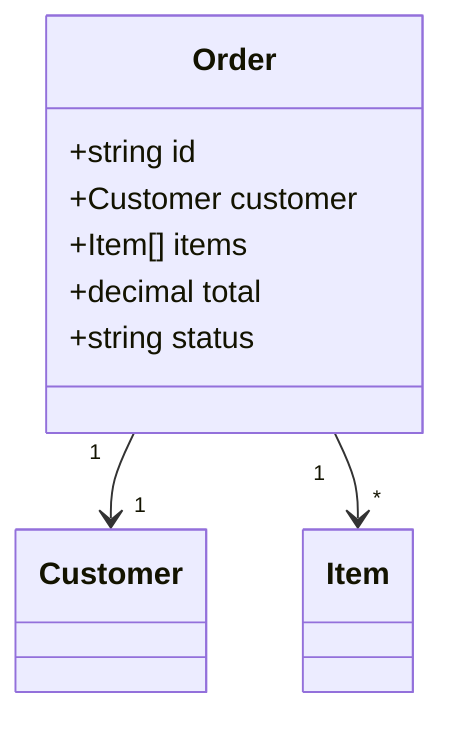

# 讓 LLM 理解 XSD（XML Schema Definition）的最佳方式

## 概述

XSD（XML Schema Definition）是一種用於定義 XML 文件結構、資料類型與約束條件的 W3C 標準語言[^xsd-wiki]。當需要讓 LLM（大型語言模型）處理基於 XSD 的資料時，如何有效地將 schema 資訊傳遞給 LLM 是一個關鍵挑戰。本文統整多種策略與工具的優劣，並提出最佳實踐建議。

## 主要策略比較

### 1. 直接餵入原始 XSD

將 `.xsd` 檔案內容直接作為 LLM 輸入，必要時搭配特殊提示詞。

**優點：**
- 零轉換成本，無前處理需求
- 無資訊遺失——所有細節、標註、命名空間均保留

**缺點：**
- LLM 對 XSD 語法的訓練資料遠少於 JSON，理解能力較弱
- XSD 極度冗長——即使簡單的資料模型也需大量 token，浪費上下文視窗
- Token 效率差——`<xs:element name="foo" type="xs:string"/>` 比 `{"foo": "string"}` 耗費更多 token
- 命名空間機制（targetNamespace、qualified/unqualified locals）易混淆 LLM
- XSD 是驗證語言而非描述語言——若缺乏 `<xs:annotation><xs:documentation>`，schema 不提供語義線索

**適合場景：** 小型（< 50 行）、有完善註解的 schema，且 LLM 僅需執行簡單的驗證或生成任務。

### 2. 轉換為 JSON Schema

使用轉換工具將 XSD 轉為 JSON Schema，再餵入 LLM。這是最普遍也最推薦的單一策略。

**可用工具：**

| 工具 | 語言 | 說明 |
|------|------|------|
| **benscott/xsdtojson** | Python | CLI + Python 函式庫，轉換 XSD 為 JSON Schema，支援資料類型映射與限制式 |
| **lcahlander/xsd2json** | XQuery (Saxon) | 支援限制性/非限制性兩種模式 |
| **pacs008/xsd2json** | Go | 用於 ISO20022 金融訊息標準，支援 `$ref`、`oneOf`、choice、限制式 |
| **Newtonsoft.Json.Schema** | .NET | 企業級 JSON Schema 框架，具 XSD 轉換能力 |
| **Liquid Studio** | 商業軟體 | 圖形化編輯器，內建 XSD→JSON Schema 轉換 |
| **Oxygen XML Editor** | 商業軟體 | 內建 XSD 轉 JSON Schema 功能 |

**映射對照：**

| XSD 概念 | 對應 JSON Schema |
|---|---|
| `xs:element` with `type="xs:string"` | `{"type": "string"}` |
| `xs:complexType` with `xs:sequence` | `{"type": "object", "properties": {...}}` |
| `xs:restriction` with `xs:enumeration` | `{"enum": [...]}` |
| `xs:minOccurs`/`xs:maxOccurs` | `minItems`/`maxItems`（陣列）或 `required` |
| `xs:annotation/xs:documentation` | `"description"` 欄位 |

**優點：**
- LLM 對 JSON 的訓練資料遠多於 XML，理解表現顯著更好
- JSON Schema 比同等 XSD 節省 50–70% 的 token
- 具自我文件化能力——`"description"`、`"title"`、`"examples"`、`"default"` 自然承載語義
- 許多 LLM 平台（OpenAI function calling、Anthropic tool use、Structured Output）原生支援 JSON Schema

**缺點：**
- XSD 部分功能無 JSON Schema 直接對應，包括：`xs:any`/`xs:anyAttribute`（萬用字元）、`xs:union`（型別聯集）、`xs:list`、XSD 1.1 assertions（XPath-based）、substitution groups、identity constraints（`xs:unique`/`xs:key`/`xs:keyref`）、mixed content models
- 命名空間資訊可能遺失或扁平化
- 部分轉換工具產出需要人工清理

### 3. 轉換為 Python 類別定義（KnowCoder 方法）

將 XSD 中的 complexType/simpleType 轉換為 Python 類別階層架構，搭配型別註釋。

**範例：**
```python
class Book:
    title: str          # max_length=50, "書名"
    author: AuthorName
    price: float        # required
    genre: Optional[str]
```

根據 KnowCoder 論文（arXiv:2403.07969），此方法比直接餵入原始 schema 在 F1 分數上提升 **49.8%**[^knowcoder]。

**優點：**
- Python 程式碼在 LLM 訓練資料中佔比極高，理解度最佳之一
- 型別註釋與繼承結構自然對應 XSD 的 type hierarchy
- 對程式碼生成任務尤其有效

### 4. 自然語言描述生成

將 XSD 前處理為結構化的自然語言描述，由另一 LLM 或人工產出。

**範例輸出：**
```
「Order」型別包含：
  - id（必填，字串，格式：ORD-\d{6}）
  - customer（必填，Customer 型別物件）
  - items（Item 物件陣列，1–100 項）
  - total（小數，由 items 計算）
  - status（列舉：pending、confirmed、shipped、delivered）
```

**優點：**
- Token 用量最少——去除所有語法負擔
- 可包含業務語義——不只是結構約束，還包括意涵
- 適合嵌入 system prompt 或 few-shot 範例

**缺點：**
- 需前置作業——schema 必須先轉換為 NL
- 複雜約束（正則表達式、複雜型別推導鏈）可能被過度簡化
- 大型 schema（如 UBL、HL7 FHIR）不適合手動建立

### 5. 轉換為 Schematron（斷言式驗證）

使用 `xsd2sch` XSLT 轉換器將 XSD 轉為 Schematron——一種以 XPath 斷言搭配自然語言診斷訊息的規則式驗證語言[^xsd2sch]。

**範例輸出：**
```xml
<sch:pattern id="Elements-ns">
  <sch:rule context="ord:Order">
    <sch:assert test="ord:id" diagnostics="d1">
      Element "Order" should have an "id" child.
    </sch:assert>
  </sch:rule>
</sch:pattern>
```

**優點：**
- Schematron 強制要求撰寫人類可讀的斷言訊息——這是其核心設計理念
- XPath 規則接近查詢語言，LLM 較易推理
- ISO 標準（ISO/IEC 19757-3），成熟且文件完善

**缺點：**
- 增加一個轉換步驟
- `xsd2sch` 轉換器最後更新約 2009 年，可能不支援 XSD 1.1

### 6. 圖形化表示（Mermaid、PlantUML、ASCII 樹）

將 XSD 轉為 Mermaid.js class/ER 圖、PlantUML 或 ASCII 樹狀結構。

**Mermaid 範例：**


**優點：**
- Token 效率極高
- LLM 能從結構圖理解資料層級關係
- Mermaid 在 GitHub 上有數百萬個圖表，LLM 訓練資料充分

**缺點：**
- 遺失詳細約束（正則表達式、列舉值、facets）
- 不可程式化使用——無法用於驗證或生成 XML

### 7. 混合策略（推薦）

**同時餵入多種表示形式**，各司其職：

```
[System Prompt 中的 XSD 上下文]

--- JSON Schema 版本 ---
{...JSON Schema 表示...}

--- 自然語言描述 ---
Order schema 定義採購訂單結構：
- Order.id: 唯一識別碼，字串，格式 ORD-\d{6}
- Order.customer: 參考 Customer 型別（name、email、shippingAddress）
- Order.items: 1–100 個 Item 物件的陣列

--- 關鍵結構規則 ---
- 根元素為 <Order>
- 命名空間：http://example.com/orders
- Customer 必須有 email 或 phone（共存約束）
```

**優勢：**
- JSON Schema 提供機器可操作的結構（用於 tool use/structured output）
- 自然語言提供語義理解
- 明確規則覆蓋無法乾淨對應至任一種格式的邊界情況
- 多重表示互相校驗——若 LLM 誤解其中一種，另一種提供檢查

## 學術研究成果

| 論文 | 發表處 | 關鍵發現 |
|------|--------|---------|
| **KnowCoder** (2403.07969)[^knowcoder] | ACL 2024 | Python 類別 schema 表示最有效；比 LLaMA2 提升 49.8% F1 |
| **DBAutoDoc** (2603.23050)[^dbautodoc] | 2026 | 透過 schema 依賴圖進行迭代 LLM 精煉；達 96.1% 準確率 |
| **ICSU** (2310.14174)[^icsu] | 2024 | 情境內 schema 理解搭配註解範例；可與顯式 schema 注入匹敵 |
| **MCP-Bench** (2508.20453)[^mcp-bench] | 2025 | LLM Agent 的工具層級 schema 理解基準 |
| **X-SQL** (2509.05899)[^xsql] | 2025 | 透過 SFT + 抽象 schema 連結使用者問題的 schema linking |

## 適用場景建議

| 場景 | 推薦策略 | 理由 |
|------|---------|------|
| 一般用途 | **JSON Schema 轉換** | 最佳平衡 token 效率、忠實度與 LLM 理解度 |
| 驗證 + 錯誤解釋 | **Schematron** | 斷言式規則 + 自然語言診斷訊息 |
| 程式碼生成 | **Python 類別定義**（KnowCoder） | 程式碼格式最適合 code generation 任務 |
| 大型企業 schema | **RAG 管線**（分塊 + JSON Schema + NL） | 避免超出上下文視窗 |
| 快速原型/簡單任務 | **Markdown 大綱** 或 **Mermaid 圖** | Token 效率極高 |
| 少量樣本提示 | **自然語言描述** | 語義理解最直接 |

## 總結建議

1. **首選策略**：將 XSD 轉換為 **JSON Schema**，並由 LLM 協助生成一份**自然語言摘要**加在提示詞開頭。
2. **驗證任務**：使用 **Schematron** 取得斷言式規則與自然語言錯誤訊息。
3. **大型 schema**：建立 **RAG 管線**，將 schema 分塊，每塊以 JSON Schema + NL 呈現。
4. **簡單/快速任務**：**結構化 Markdown 大綱**或 **Mermaid 圖**即足夠，token 效率極高。
5. **應避免**：除非 schema 小於 50 行且註解完善，否則不建議直接餵入原始 XSD。

## 參考文獻

[^xsd-wiki]: W3C. (n.d.). XML Schema (W3C). Retrieved 2026-09-25, from https://en.wikipedia.org/wiki/XML_Schema_(W3C)
[^knowcoder]: KnowCoder Team. (2024). KnowCoder: A Unified Approach for Schema Understanding and Linking. *Proceedings of ACL 2024*. Retrieved 2026-09-25, from https://arxiv.org/abs/2403.07969
[^dbautodoc]: DBAutoDoc Authors. (2026). DBAutoDoc: Iterative Schema Documentation via LLM Refinement. Retrieved 2026-09-25, from https://arxiv.org/abs/2603.23050
[^icsu]: ICSU Authors. (2024). In-Context Schema Understanding. Retrieved 2026-09-25, from https://arxiv.org/abs/2310.14174
[^mcp-bench]: MCP-Bench Authors. (2025). MCP-Bench: A Benchmark for Tool-Level Schema Understanding in LLM Agents. Retrieved 2026-09-25, from https://arxiv.org/abs/2508.20453
[^xsql]: X-SQL Authors. (2025). X-SQL: Schema Linking via SFT. Retrieved 2026-09-25, from https://arxiv.org/abs/2509.05899
[^xsd2sch]: Jelliffe, R. (n.d.). xsd2sch: XSD to Schematron Converter. Retrieved 2026-09-25, from https://github.com/Schematron/schematron/tree/master/trunk/xsd2sch
[^liquid-studio]: Liquid Technologies. (n.d.). Convert XSD to JSON Schema. Retrieved 2026-09-25, from https://www.liquid-technologies.com/convert-xsd-to-json-schema
[^benscott-xsdtojson]: Scott, B. (n.d.). xsdtojson: Convert XSD to JSON Schema. Retrieved 2026-09-25, from https://github.com/benscott/xsdtojson
[^lcahlander-xsd2json]: Cahlander, L. (n.d.). xsd2json: XSD to JSON Schema conversion in XQuery. Retrieved 2026-09-25, from https://github.com/lcahlander/xsd2json