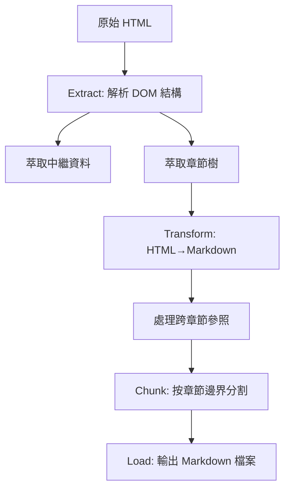

# IndoorGML 1.1 規格書 HTML 轉 Markdown ETL 計畫

## 摘要

本計畫針對 OGC IndoorGML 1.1 標準文件 (19-011r4) 的 HTML 版本，制定一套完整的 ETL (Extract, Transform, Load) 流程，將其轉換為結構清晰、易於檢索的 Markdown 區塊 (chunked Markdown)，適合用於 RAG (Retrieval-Augmented Generation)、LLM 分析及後續處理。

## 1. 來源文件分析

### 1.1. 文件概覽

IndoorGML 1.1 是 OGC (Open Geospatial Consortium) 制定的室內空間資訊開放資料模型與 XML Schema 標準，用於室內導航應用[^ogc_intro]。該規範涵蓋核心資料模型 (Core Module) 與室內導航擴充模組 (Indoor Navigation Module)[^ogc_scope]。

### 1.2. HTML 結構特徵

經過對來源 HTML 進行取樣分析，歸納出以下特徵：

| 特徵 | 數量 |
|------|------|
| 總行數 | 3,571 |
| 標題標籤 (h1-h6) | 103 |
| 表格 | 26 |
| 圖片/圖表 | 38 |
| 程式碼區塊 (pre/code) | 24 |

### 1.3. 文件章節結構

來源文件層級結構如下[^ogc_toc]：

```
層級 1 (h1) — 主要章節
├── 1. Scope
├── 2. Conformance
├── 3. Normative references
├── 4. Terms and definitions
├── 5. Conventions
├── 6. Overview of IndoorGML
├── 7. General characteristics of IndoorGML
├── 8. IndoorGML Core Module
├── 9. Indoor Navigation Module
├── Annex A (normative)
└── Annex B (informative)

層級 2 (h2) — 次章節 (如 5.1 Symbols, 7.1 Representation)
層級 3 (h3) — 子章節 (如 7.1.1 Definition of Indoor Space)
層級 4 (h4) — 詳細條目 (如 8.1 `<State>`)
```

### 1.4. HTML 標籤分布

| 內容類型 | HTML 元素 | 處理策略 |
|----------|-----------|----------|
| 章節標題 | `<h1>` 到 `<h6>` | 轉換為 Markdown ATX headings (`#` to `######`) |
| 段落 | `<p>` | 轉換為 Markdown 段落 |
| 表格 | `<table>` | 簡單表格轉 pipe table，複雜表格保留 raw HTML |
| 圖表 | ``, `<figure>`, `<svg>` | 圖表為示意圖 (UML 圖、結構圖)，轉為 `` |
| 程式碼 | `<pre><code>` | 轉換為 fenced code block，推導語言標註 |
| 列表 | `<ul>`, `<ol>` | 轉換為 Markdown 列表 |
| 定義 | `<dl>` | 轉換為 Markdown 定義列表或粗體 + 段落 |
| 內部參照 | `<a href="#...">` | 解析為章節編號連結 |
| 註腳 | `<sup>` + `<a>` | 保留為 APA 格式註腳 |

## 2. ETL 流程設計

### 2.1. 整體流程圖



### 2.2. 第一階段：Extract

#### 2.2.1. DOM 解析與結構萃取

使用 Python BeautifulSoup 4 + lxml 解析器進行 HTML 解析[^beautifulsoup]：

1. **移除干擾元素**：移除 `<nav>`、`<script>`、`<style>`、`<header>`、`<footer>`、`<aside>` 等非正文標籤
2. **萃取目錄樹**：遍歷所有 `<h1>` 至 `<h6>` 標籤，建立章節樹狀結構
3. **萃取中繼資料**：從文件前段萃取文件編號 (19-011r4)、版本 (1.1)、出版日期 (2020-11-05)、標題

```python
from bs4 import BeautifulSoup

def extract_metadata(soup):
    doc_id = "19-011r4"
    title = soup.find('h1').get_text(strip=True) if soup.find('h1') else ""
    version = "1.1"
    return {"doc_id": doc_id, "title": title, "version": version}

def extract_section_tree(soup):
    sections = []
    for heading in soup.find_all(['h1', 'h2', 'h3', 'h4', 'h5', 'h6']):
        level = int(heading.name[1])
        section_id = heading.get('id', '')
        text = heading.get_text(strip=True)
        content_html = collect_siblings_until_next_heading(heading)
        sections.append({
            'id': section_id,
            'level': level,
            'title': text,
            'html': content_html
        })
    return sections
```

#### 2.2.2. 特殊元素萃取

在 Extract 階段同時萃取以下特殊元素清單：

- **所有表格**：記錄 `<table>` 位置與欄數
- **所有圖片**：記錄 `` 的 `src`、`alt`、`title`
- **所有內部參照**：記錄 `<a href="#xxx">` 與其錨點目標
- **所有程式碼區塊**：記錄 `<pre><code>` 的 class 屬性 (用於語言推導)

### 2.3. 第二階段：Transform

#### 2.3.1. HTML 轉 Markdown

使用 **markdownify** 作為主要轉換引擎，並透過自訂轉換器處理特殊元素[^markdownify]：

```python
import markdownify

class IndoorGMLConverter(markdownify.MarkdownConverter):
    def convert_pre(self, el, text, parent_tags):
        """偵測 XML/JSON 語言並加註"""
        code = el.find('code')
        if not code:
            return super().convert_pre(el, text, parent_tags)
        classes = code.get('class', [])
        lang = ''
        for c in classes:
            if c in ('xml', 'json', 'xsd', 'xs'):
                lang = 'xml'
                break
        return f'```{lang}\n{code.get_text()}\n```\n'

    def convert_table(self, el, text, parent_tags):
        """複雜表格保留為 raw HTML"""
        if is_complex_table(el):
            return str(el)
        return super().convert_table(el, text, parent_tags)

def is_complex_table(table):
    rows = table.find_all('tr')
    for cell in table.find_all(['td', 'th']):
        if cell.get('colspan', 1) != 1 or cell.get('rowspan', 1) != 1:
            return True
    return len(rows) > 20  # 超長表格
```

#### 2.3.2. 表格處理策略

根據 IndoorGML HTML 中的表格類型[^ogc_tables]，採用三層處理：

| 表格複雜度 | 範例 | 處理方式 |
|------------|------|----------|
| 簡單 (≤6 欄，無合併儲存格) | 縮寫表 (5.1)、模組名稱表 (Table 1) | 轉換為 Markdown pipe table |
| 中等 (有合併儲存格) | 測試套件表 (Annex A) | 保留為 raw HTML `<table>` |
| 複雜 (文件資訊表) | 文件中繼資料表 | 轉換為 YAML frontmatter 或 key-value 列表 |

#### 2.3.3. 程式碼區塊處理

IndoorGML 主要包含 XML Schema 定義，需特別注意：

1. 偵測 `class` 屬性含有 `xsd`、`xs`、`xml` 的 `<code>` 區塊，加註 ` ```xml `
2. 保留原始縮排（規範性內容）
3. 長程式碼區塊 (如 8.1 至 8.9 的 XSD 定義) 保持完整不分割

#### 2.3.4. 圖表/圖片處理

IndoorGML 含有大量 UML 圖與結構示意圖 (Figure 1-29)[^ogc_figures]：

1. 解析 `` 的 `src` 屬性，記錄圖片路徑
2. 使用 `alt` 或鄰近 `<figcaption>` 作為圖說
3. 轉換為 Markdown 圖片語法：``
4. 若圖片為 SVG，保留為原始 SVG 文字或另存為獨立檔案

### 2.4. 第三階段：Chunk

#### 2.4.1. 區塊策略

採用 **heading-boundary chunking**，以章節邊界為分割點[^chunking]：

| 層級 | 區塊策略 |
|------|----------|
| h1 (主章節) | 每個 h1 為獨立區塊，含其下所有子章節 |
| h2/h3/h4 | 若 h1 區塊超過 token 上限，依 h2/h3 邊界再分割 |
| Annex | 每個 Annex 為獨立區塊 |

#### 2.4.2. YAML Frontmatter 設計

每個區塊附加中繼資料 frontmatter：

```markdown
---
doc_id: "19-011r4"
title: "IndoorGML 1.1"
section: "7.1.5"
section_path: ["7. General characteristics", "7.1.5 Network Representation of Cellular Space"]
level: 3
parent_context: "7. General characteristics > 7.1 Representation of Indoor Objects"
cross_refs: ["7.2 Structured Space Model", "8.1 <State>"]
normative_refs: ["ISO 19107:2003", "OGC 07-036"]
keywords: ["NRG", "Node-Relation Graph", "Poincaré duality", "topology"]
---
```

#### 2.4.3. 跨章節參照解析

在 IndoorGML 中有大量跨章節參照（如 "as explained in section 7.3"、"see Figure 14"），必須：

1. 建立從錨點 ID 到章節標題的對照表
2. 在每個 chunk 生成時，解析內部連結並替換為章節路徑
3. 將解析結果寫入 `cross_refs` 欄位

#### 2.4.4. 重疊區塊

為確保 RAG 檢索的穩健性，相鄰區塊之間保留 1-2 句的重疊內容（前一區塊的結尾 + 後一區塊的開頭）[^rag_chunking]。

### 2.5. 第四階段：Load

#### 2.5.1. 輸出格式

```yaml
輸出目錄: ./output/
命名規則: "{doc_id}_chunk_{number:04d}_{section_slug}.md"
輸出格式: Markdown with YAML frontmatter
```

#### 2.5.2. 預估產出

| 指標 | 預估值 |
|------|--------|
| 總區塊數 | 約 50-80 個 |
| 每區塊大小 | 500-2000 tokens |
| 總轉換後大小 | 約 100-200 KB |
| 圖片檔案 | 約 30-40 張 |

## 3. 實作規範

### 3.1. 工具推薦

| 用途 | 工具 | 說明 |
|------|------|------|
| HTML 解析 | BeautifulSoup 4 + lxml | Python 生態系最穩定的 HTML 解析組合 |
| HTML→Markdown | markdownify | 可高度自訂各標籤的轉換行為 |
| 批次轉換備用 | pandoc | `pandoc -f html -t markdown --wrap=preserve` |
| XML Schema 格式化 | Python xml.etree.ElementTree 或 lxml | 規範性 XSD 需保留結構 |
| 區塊分割 | 自訂 Python 指令稿 | 基於 heading 邊界進行分割 |

### 3.2. 自訂轉換規則

| 規則編號 | 規則說明 |
|----------|----------|
| R1 | 所有 h1-h6 轉為 ATX headings (`#` 語法) |
| R2 | 簡單表格 (≤6 欄，無 colspan) 轉 pipe table |
| R3 | 複雜表格保留 raw HTML |
| R4 | XML Schema 程式碼加註 ` ```xml ` |
| R5 | 圖片路徑重新對應至 `./figures/` 目錄 |
| R6 | 內部參照解析為章節編號 |
| R7 | 每個區塊附加 YAML frontmatter |
| R8 | 區塊間重疊 1-2 句 |

### 3.3. 品質檢查清單

- [ ] 所有章節編號是否保留 (1, 2, 3... 7.1.1, 7.1.2...)
- [ ] 表格內容是否完整，無資料遺失
- [ ] 圖片是否可正確引用
- [ ] 內部參照是否已解析
- [ ] 程式碼區塊縮排是否保留
- [ ] YAML frontmatter 是否完整
- [ ] 區塊大小是否在 token 上限內
- [ ] 規範性文字 (shall/must/should) 是否未遺失

## 4. 建議實施路徑


**Phase 1** (約 1 小時)：
- 開發 DOM 解析與結構萃取指令稿
- 建立章節樹、中繼資料對照表

**Phase 2** (約 2-3 小時)：
- 開發自訂 markdownify 轉換器
- 實作表格複雜度判斷邏輯
- 實作內部參照解析

**Phase 3** (約 1 小時)：
- 開發區塊分割與 frontmatter 生成
- 輸出驗證

**總估計時間**：約 4-5 小時

## 參考資料

[^ogc_intro]: Open Geospatial Consortium. (2020). OGC® IndoorGML 1.1 (Document No. 19-011r4). Retrieved 2026-09-25, from https://docs.ogc.org/is/19-011r4/19-011r4.html

[^ogc_scope]: Open Geospatial Consortium. (2020). OGC® IndoorGML 1.1, Clause 1. Scope. Retrieved 2026-09-25, from https://docs.ogc.org/is/19-011r4/19-011r4.html

[^ogc_toc]: Open Geospatial Consortium. (2020). OGC® IndoorGML 1.1, Table of Contents. Retrieved 2026-09-25, from https://docs.ogc.org/is/19-011r4/19-011r4.html

[^ogc_tables]: Open Geospatial Consortium. (2020). OGC® IndoorGML 1.1, Tables in Clauses 5, 7, 8, Annex A. Retrieved 2026-09-25, from https://docs.ogc.org/is/19-011r4/19-011r4.html

[^ogc_figures]: Open Geospatial Consortium. (2020). OGC® IndoorGML 1.1, Figures 1-29. Retrieved 2026-09-25, from https://docs.ogc.org/is/19-011r4/19-011r4.html

[^beautifulsoup]: Richardson, L. (n.d.). Beautiful Soup Documentation — HTML parsing in Python. Retrieved 2026-09-25, from https://www.crummy.com/software/BeautifulSoup/bs4/doc/

[^markdownify]: Becker, M. (n.d.). markdownify — Python HTML to Markdown converter. Retrieved 2026-09-25, from https://pypi.org/project/markdownify/

[^chunking]: Unstructured.io. (n.d.). Document chunking and partitioning for RAG. Retrieved 2026-09-25, from https://docs.unstructured.io/welcome

[^rag_chunking]: LangChain. (n.d.). How to split text into chunks — Text splitters. Retrieved 2026-09-25, from https://python.langchain.com/docs/how_to/#text-splitters