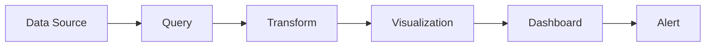

# Grafana 入門者必備的領域知識與核心概念

## 前言

Grafana 是一個開源的視覺化與可觀測性（Observability）平台，能夠串接眾多資料來源，將資料轉化為圖表、儀表板（Dashboard）與警示通知。本文整理 Grafana 初學者必須理解的領域知識與核心概念，涵蓋從基礎名詞到實務設計原則的完整脈絡。

---

## 一、Grafana 是什麼？

Grafana 是一個**可觀測性與資料視覺化平台**，它本身**不儲存資料**，而是透過 Plugin 連接到外部資料來源，在每次開啟儀表板時即時查詢並呈現資料。[^grafana-intro]

Grafana 分為三個版本：

- **Grafana Open Source（OSS）**：免費、自託管的開源版本。
- **Grafana Cloud**：由 Grafana Labs 提供的全託管雲端服務，有免費方案。
- **Grafana Enterprise**：商業版本，提供額外的資料來源、驗證方式、權限管理與技術支援。[^grafana-editions]

相較於 Datadog（全家桶 SaaS）或 Kibana（僅限 Elasticsearch），Grafana 的核心差異在於**資料來源無關性（Data Source Agnosticism）**——能同時串接 Prometheus、Loki、PostgreSQL、CloudWatch 等 100+ 種資料來源，在同一儀表板中混用不同來源的資料。[^grafana-fundamentals]

---

## 二、可觀測性的三大支柱（Three Pillars of Observability）

理解可觀測性（o11y）是使用 Grafana 的前置領域知識。可觀測性指的是透過系統產出的資料來理解系統內部狀態的能力。[^observability-three-pillars]

### 📊 Metrics（指標）

指標是隨時間收集的**數值量測**，例如 CPU 使用率、請求數量、錯誤計數。它們：

- 以固定間隔收集（如每 15 秒）
- 儲存在**時間序列資料庫（Time Series Database, TSDB）**，如 Prometheus、Graphite、InfluxDB
- 適合觀察趨勢、偵測異常、設定警示

Grafana 中最常見的 Metrics 資料來源是 Prometheus，查詢語言為 **PromQL**。

### 📝 Logs（日誌）

日誌是系統中事件的**時間戳文字記錄**。日誌的體積大、內容詳細，儲存成本高。**Grafana Loki** 是 Grafana 生態系的日誌聚合系統，只索引元資料（Labels）而不索引全文，成本較低。查詢語言為 **LogQL**。

### 🔍 Traces（追蹤）

追蹤記錄**一個請求在分散式系統中的完整路徑**——從前端到微服務、資料庫、佇列等。每個追蹤由多個 Spans（工作單元）組成，對於微服務架構的延遲瓶頸分析至關重要。**Grafana Tempo** 是 Grafana 的分散式追蹤後端，查詢語言為 **TraceQL**。

### 🔬 Profiles（效能剖析，第四支柱）

Grafana 透過 **Pyroscope** 增加了第四根支柱：持續效能剖析（Continuous Profiling）。它能告訴你資源（CPU、記憶體）被消耗在「哪一行程式碼」。[^grafana-pyroscope]

> **實務應用**：這三大支柱（加上 Profile）的威力在於**互相關聯**——從 Metrics 儀表板的異常峰值，可以跳到對應時間的 Logs 查看細節，再進一步跳到該請求的 Trace 來找出根因。

---

## 三、LGTM Stack（Grafana 生態系）

Grafana Labs 的四個開源專案合稱 **LGTM Stack**，構成完整的可觀測性解決方案：[^lgtm-stack]

| 元件 | 角色 | 查詢語言 |
|------|------|----------|
| **L** - **Loki** | 日誌聚合 | LogQL |
| **G** - **Grafana** | 視覺化與儀表板 | N/A（UI 層） |
| **T** - **Tempo** | 分散式追蹤 | TraceQL |
| **M** - **Mimir** | 指標儲存（相容 Prometheus） | PromQL |

另外，**Grafana Alloy** 是 Grafana 的 OTel Collector 發行版，用於收集和轉送遙測資料；**Grafana Beyla** 則提供 eBPF 為基礎的自動儀器化，無需修改程式碼。[^grafana-alloy]

---

## 四、核心概念（Core Concepts）

### 4.1 Data Source（資料來源）

資料來源是 Grafana 與外部資料庫或監控系統之間的**已設定連線**。[^datasource-concepts]

- 所有資料來源背後都由一個 **Plugin** 驅動
- 先**安裝 Plugin**，再**設定 Data Source**
- 常見的資料來源：Prometheus、Loki、Tempo、Mimir、InfluxDB、PostgreSQL、MySQL、CloudWatch 等
- 一個儀表板可以同時使用**多個資料來源**

### 4.2 Dashboard（儀表板）

儀表板是若干 Panel（面板）的集合，提供「一覽無遺」的系統狀態總覽。[^dashboards-overview]

- 儀表板本身是一個 **JSON 模型**，可進行版本控制（Git）
- 所有 Panel 共享同一個**時間範圍**
- 支援**模板變數（Template Variables）** 實現互動式過濾
- 支援**註釋（Annotations）** 在圖表上標記事件

### 4.3 Panel（面板）

Panel 是儀表板的最小視覺化單元。每個 Panel 包含兩個部分：[^panels-overview]

1. **Query（查詢）**：用資料來源的查詢語言定義要取什麼資料
2. **Visualization（視覺化）**：定義資料如何呈現

常見的視覺化類型：

| 類型 | 適用場景 |
|------|----------|
| **Time series** | 趨勢、速率、延遲隨時間變化（折線圖／面積圖） |
| **Stat** | 單一 KPI（錯誤率、正常運行時間）——一個大數字 + 迷你趨勢線 |
| **Gauge** | 數值對比閾值／最大值（儀表盤） |
| **Bar gauge** | 同時比較多個數列（排序長條） |
| **Table** | 每個目標的詳細資料、Top-N 列表 |
| **Heatmap** | 延遲分布隨時間變化（密度桶） |
| **Bar chart** | 類別資料比較 |
| **Logs** | 顯示日誌資料 |
| **State timeline** | 狀態隨時間變化 |
| **Geomap** | 地理空間資料 |

### 4.4 Query（查詢）

查詢是以資料來源的查詢語言撰寫的問題。每種資料來源有專屬的查詢編輯器。[^queries-editor]

範例（PromQL）：
```promql
rate(tns_request_duration_seconds_count[5m])
```
計算過去 5 分鐘內每秒請求速率。

### 4.5 Transformation（轉換）

轉換是用於在**視覺化之前**操作查詢回傳資料的步驟。當原始資料格式不符合視覺化需求時使用。[^transformations]

常見用途：
- 過濾、排序、重新命名欄位
- 合併多個查詢結果
- 計算新欄位
- 分組聚合

### 4.6 Template Variable（模板變數）

變數讓儀表板**可重複使用於不同環境**。例如用 `$server` 變數取代寫死的伺服器名稱，使用者可從下拉選單切換不同的伺服器值。[^template-variables]

變數可以從資料來源動態取得（如 Prometheus 的 `label_values(up, job)`），不必手動輸入。

### 4.7 Annotation（註釋）

註釋讓你能在圖表上**標記事件時間點**——例如部署、資料庫遷移、事件。註釋可以手動添加，也可以從資料來源自動取得。[^annotations]

### 4.8 Explore（探索模式）

Explore 是 Grafana 的**臨時查詢工作區**，適合除錯、臨時調查。與儀表板不同，Explore 不要求你先建立一個永久檢視。[^explore]

### 4.9 Plugin（外掛）

Plugin 擴展 Grafana 的核心功能，分三類：[^plugins]

| 類型 | 功能 |
|------|------|
| **Data source plugins** | 連接新的資料儲存服務 |
| **Panel plugins** | 新增視覺化類型 |
| **App plugins** | 將資料來源、面板、自訂頁面打包成套件 |

---

## 五、Alerting（警示系統）

Grafana Alerting 讓你能**在問題發生後立即偵測**。它是基於 Prometheus 警示模型建構的。[^alerting-fundamentals]

### 核心元件

| 概念 | 說明 |
|------|------|
| **Alert Rule** | 一條查詢 + 一個條件（閾值）。定期評估。 |
| **Alert Instance** | 符合規則的具體發生——每條時間序列／維度一個（多維度）。 |
| **Evaluation** | 規則的定期檢查（例如每 10 秒一次）。 |
| **Contact Point** | 定義通知**去哪**（Email、Slack、PagerDuty、Webhook、Telegram 等）。 |
| **Notification Policy** | 透過 Label 匹配將警示路由到不同 Contact Point（樹狀結構）。 |
| **Silences / Mute Timings** | 暫時暫停通知（維護時段）或排程暫停（週末）。 |

### 評估流程

1. Grafana 週期性評估規則的查詢條件
2. 若條件被觸發 → Alert Instance 進入 **Firing** 狀態
3. 發送通知（或經由 Notification Policy 路由）
4. 當條件不再滿足 → Alert Instance 進入 **Resolved** 狀態

---

## 六、儀表板設計原則

Grafana 官方文件建議的儀表板設計原則：[^dashboard-best-practices]

### 1. 每個儀表板只回答一個問題

在建立前問自己：「這個儀表板要回答什麼問題？」沒有明確目標的儀表板應考慮不建立。

### 2. 降低認知負載

讓儀表板在**一瞥之間**就能被理解。凌晨 2 點值班時，是否清楚每個圖表代表什麼？

### 3. 善用顏色

透過 Thresholds（閾值）設定讓顏色傳達意義——綠色 = 正常，紅色 = 異常。

### 4. 分層設計（Hierarchical Design）

上層儀表板提供總覽，透過 Drill-down 連結深入到特定服務或元件的詳細儀表板。

### 5. 使用模板變數減少儀表板爆炸

與其複製儀表板為每台伺服器各一份，不如使用變數做成一份可重複使用的儀表板。

### 6. 資料流要清晰



### 7. 儀表板管理成熟度

Grafana 定義了三個管理層次：[^dashboard-maturity]

- **低階（預設狀態）**：人人可改、大量複製、無版本控制、無清理
- **中階（系統化）**：使用模板變數、遵守 USE/RED 策略、分層設計、JSON 納入版本控制
- **高階（最佳化）**：定期清理廢棄儀表板、用程式產生儀表板（grafonnet/grafanalib）、變更僅在測試環境進行

---

## 七、常見監控策略

### USE 方法

適用於**基礎設施／硬體資源**監控：[^use-method]

| 字母 | 代表 | 範例 |
|------|------|------|
| **U** | Utilization（使用率） | CPU 使用率 |
| **S** | Saturation（飽和度） | 佇列長度 |
| **E** | Errors（錯誤） | 錯誤事件計數 |

USE 報告的是**原因**（cause）——「機器怎麼了？」

### RED 方法

適用於**服務／微服務**監控：

| 字母 | 代表 | 範例 |
|------|------|------|
| **R** | Rate（速率） | 每秒請求數 |
| **E** | Errors（錯誤） | 失敗請求數 |
| **D** | Duration（持續時間） | 請求延遲分布 |

RED 報告的是**症狀**（symptom）——「使用者體驗如何？」

> **實務建議**：針對症狀（RED）設警示，再從原因（USE）找根因。[^symptom-vs-cause]

### Google SRE 四大黃金信號

1. **Latency**（延遲）——服務回應時間
2. **Traffic**（流量）——系統需求總量
3. **Errors**（錯誤）——請求失敗率
4. **Saturation**（飽和度）——系統「多滿」

---

## 八、時間序列資料模型（Time Series Data Model）

時間序列是 Grafana 最核心的資料模型。[^timeseries-model]

每個樣本包含：
- **Value**（數值，通常為 float64）
- **Timestamp**（時間戳，毫秒精度）

以 Prometheus 為例，時間序列的標記法為：
```
<metric_name>{<label_name>="<label_value>", ...}
```

例如：
```
http_requests_total{method="POST", handler="/api/tracks", status_code="200"}
```

每組 metric_name + label 的唯一組合構成**一條時間序列**。Labels 讓你能過濾和聚合——例如「所有 POST 方法到 /api/tracks 的請求」。

---

## 九、Provisioning（自動佈建）

Provisioning 讓你能透過設定檔**自動建立資料來源和儀表板**，適合大規模部署場景。[^provisioning]

- 放在 Grafana 設定目錄的 `provisioning/` 子目錄
- 使用 YAML 檔案定義資料來源和儀表板
- 搭配 GitOps 流程：修改 YAML → 自動更新所有 Grafana 實例

---

## 十、初學者建議學習路徑

1. **先理解可觀測性三大支柱**（Metrics、Logs、Traces）
2. **熟悉 Grafana 資料流**：Data Source → Query → Transform → Visualization
3. **挑一個資料來源學習查詢語言**（首推 Prometheus + PromQL 基礎）
4. **從 Explore 開始**，熟悉後再建立儀表板
5. **使用模板變數做第一份可重複使用的儀表板**
6. **設定第一個 Alert Rule + Contact Point**
7. **學習 USE 與 RED 方法**來設計有效的監控儀表板
8. **了解 LGTM Stack** 各元件的定位
9. **學習 Dashboard JSON 模型與 Provisioning**（進階）

---

## 參考資料

[^grafana-intro]: Grafana Labs. (n.d.). About Grafana. Retrieved 2026-09-26, from https://grafana.com/docs/grafana/latest/introduction/
[^grafana-editions]: Grafana Labs. (n.d.). Grafana editions. Retrieved 2026-09-26, from https://grafana.com/docs/grafana/latest/introduction/#editions
[^grafana-fundamentals]: Grafana Labs. (n.d.). Grafana fundamentals. Retrieved 2026-09-26, from https://grafana.com/docs/grafana/latest/fundamentals/
[^observability-three-pillars]: Grafana Labs. (n.d.). Introduction to observability. Retrieved 2026-09-26, from https://grafana.com/docs/grafana/latest/fundamentals/
[^grafana-pyroscope]: Grafana Labs. (n.d.). Grafana Pyroscope. Retrieved 2026-09-26, from https://grafana.com/oss/pyroscope/
[^lgtm-stack]: Grafana Labs. (n.d.). Getting started with the LGTM Stack. Retrieved 2026-09-26, from https://grafana.com/go/webinar/getting-started-with-grafana-lgtm-stack/
[^grafana-alloy]: Grafana Labs. (n.d.). Grafana Alloy. Retrieved 2026-09-26, from https://grafana.com/docs/alloy/latest/
[^datasource-concepts]: Grafana Labs. (n.d.). Data sources — concepts. Retrieved 2026-09-26, from https://grafana.com/docs/grafana/latest/datasources/concepts/
[^dashboards-overview]: Grafana Labs. (n.d.). Dashboards overview. Retrieved 2026-09-26, from https://grafana.com/docs/grafana/latest/dashboards/
[^panels-overview]: Grafana Labs. (n.d.). Panels and visualizations. Retrieved 2026-09-26, from https://grafana.com/docs/grafana/latest/panels-visualizations/
[^queries-editor]: Grafana Labs. (n.d.). Query and transform data. Retrieved 2026-09-26, from https://grafana.com/docs/grafana/latest/panels-visualizations/query-transform-data/
[^transformations]: Grafana Labs. (n.d.). Transformations. Retrieved 2026-09-26, from https://grafana.com/docs/grafana/latest/panels-visualizations/query-transform-data/#transformations
[^template-variables]: Grafana Labs. (n.d.). Template variables. Retrieved 2026-09-26, from https://grafana.com/docs/grafana/latest/dashboards/variables/
[^annotations]: Grafana Labs. (n.d.). Annotations. Retrieved 2026-09-26, from https://grafana.com/docs/grafana/latest/dashboards/annotations/
[^explore]: Grafana Labs. (n.d.). Explore. Retrieved 2026-09-26, from https://grafana.com/docs/grafana/latest/explore/
[^plugins]: Grafana Labs. (n.d.). Plugins. Retrieved 2026-09-26, from https://grafana.com/docs/grafana/latest/plugins/
[^alerting-fundamentals]: Grafana Labs. (n.d.). Alerting fundamentals. Retrieved 2026-09-26, from https://grafana.com/docs/grafana/latest/alerting/fundamentals/
[^dashboard-best-practices]: Grafana Labs. (n.d.). Dashboard best practices. Retrieved 2026-09-26, from https://grafana.com/docs/grafana/latest/dashboards/best-practices/
[^dashboard-maturity]: Grafana Labs. (n.d.). Dashboard management maturity model. Retrieved 2026-09-26, from https://grafana.com/docs/grafana/latest/dashboards/best-practices/#dashboard-management-maturity-model
[^use-method]: Grafana Labs. (n.d.). USE and RED methods. Retrieved 2026-09-26, from https://grafana.com/docs/grafana/latest/dashboards/best-practices/#use-and-red-methods
[^symptom-vs-cause]: Grafana Labs. (n.d.). Symptoms vs causes. Retrieved 2026-09-26, from https://grafana.com/docs/grafana/latest/dashboards/best-practices/#symptoms-vs-causes
[^timeseries-model]: Grafana Labs. (n.d.). Introduction to time series. Retrieved 2026-09-26, from https://grafana.com/docs/grafana/latest/fundamentals/timeseries/
[^provisioning]: Grafana Labs. (n.d.). Provisioning. Retrieved 2026-09-26, from https://grafana.com/docs/grafana/latest/administration/provisioning/