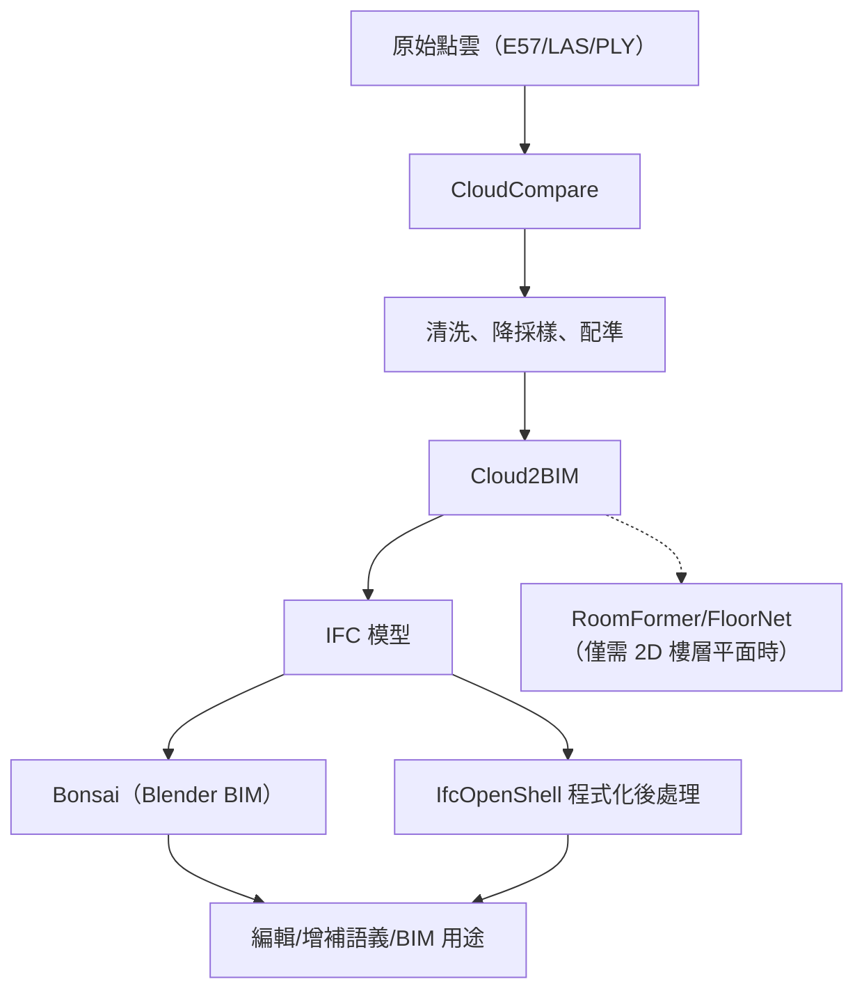

# FOSS Scan-to-BIM 室內解決方案調查

## 摘要

本報告調查自由開源（FOSS）的「Scan-to-BIM」解決方案，重點關注能將 3D 點雲掃描資料（LiDAR、RGB-D、攝影測量）自動轉換為建築資訊模型（BIM），特別是 IFC 格式的室內工具與流程。

---

## 1. 概論

「Scan to BIM」指將實體建物的 3D 掃描資料（如 E57、LAS、PLY 點雲）經自動或半自動流程轉換為語義豐富的 BIM 模型的技術。商用主導的解決方案包括 Autodesk Revit + 外掛、EdgeWise、ClearEdge3D 等，但在自由開源領域仍處於發展階段[^cloud2bim]。

本調查針對**室內環境**（牆、樓板、門窗、房間）的開源方案進行系統性梳理，分為端到端工具、基礎元件庫、研究原型、以及建議的 FOSS 流程鏈。

---

## 2. 端到端（End-to-End）FOSS Scan-to-BIM 工具

### 2.1 Cloud2BIM（⭐ 最佳推薦）

- **倉庫**：[VaclavNezerka/Cloud2BIM](https://github.com/VaclavNezerka/Cloud2BIM)[^cloud2bim]
- **授權**：MIT License
- **最後更新**：2026-08-10（活躍維護中，持續更新）
- **論文**：發表於 *Automation in Construction*（Elsevier, 2025）[^cloud2bim_paper]
- **輸入**：E57、XYZ 點雲
- **輸出**：IFC 4 ADD2 TC1 模型（完整樓板、牆、門窗、房間分區）
- **語言**：純 Python（Open3D、NumPy、OpenCV、IfcOpenShell）
- **準確度**：論文報告非正交牆體處理成功，速度約為競品的 **7 倍**，不需 RANSAC 參數調整
- **限制**：僅支援 E57/XYZ 格式；僅矩形開口（無拱形/不規則）；需針對不同資料集調整參數；某些進階功能僅在付費 Cloud2BIM-AI 版本提供

**流程**：
1. 密度直方圖檢測樓板（Slab Detection）
2. 按樓層分割（Storey Segmentation）
3. 2D 直方圖 + 型態學操作 + Douglas-Peucker 輪廓提取檢測牆體
4. 2D 二值遮罩分析檢測門窗開口
5. 從實際牆面生成房間分區/區域
6. 匯出 IFC4 格式

**優點**：非正交牆體支援、多樓層、速度領先、避開繁瑣的 RANSAC 調參。

### 2.2 pointcloud2ifc

- **倉庫**：[rsasaki0109/pointcloud2ifc](https://github.com/rsasaki0109/pointcloud2ifc)[^pointcloud2ifc]
- **授權**：MIT License
- **最後更新**：~2025（狀況不明，7 次提交，極早期）
- **輸入**：PLY、PCD、LAS/LAZ
- **輸出**：IFC（IfcExtrudedAreaSolid 為基礎）
- **特點**：獨特的 **CI/CD 整合** — 將掃描丟進 GitHub 倉庫，透過 GitHub Actions 自動產出 IFC 作為建置產物
- **支援三種分割方法**：DBSCAN、RANSAC、ML PointNet
- **語義標籤**：BIMNet 14 類別（牆、樓板、天花板、門、窗、柱、樑、樓梯、欄杆、家具、帷幕牆、屋頂）
- **限制**：極早期專案，無顯著使用者群落，實用性待驗證

### 2.3 scan_to_bim_pipeline

- **倉庫**：[mac999/scan_to_bim_pipeline](https://github.com/mac999/scan_to_bim_pipeline)[^sbdl]
- **授權**：MIT License
- **最後更新**：2026-07（Python 3.11 相容更新）
- **輸入**：LAS 點雲
- **輸出**：IFC BIM 物件（室內 + 室外）
- **核心技術**：自訂 **SBDL（Scan to BIM Description Language）**，以 JSON 腳本定義處理步驟
- **支援**：Docker、深度學習（Open3D-ML）、C++ PCL 模組、室外立面 + 室內房間分類
- **語言**：C++（PCL）+ Python
- **限制**：依賴繁重（PCL、GDAL、PDAL、PyTorch、Docker）；文檔薄弱；起源於韓國研究（KICT 資助）
- **評估**：功能完整但上手門檻高，適合有 DevOps 能力的團隊

---

## 3. 中繼流程庫與框架

這些工具**不直接提供端到端轉換**，而是 FOSS 流程鏈中的關鍵元件。

### 3.1 OpenBIMxD

- **倉庫**：[humantecheu/openbimxd](https://github.com/humantecheu/openbimxd)[^openbimxd]
- **授權**：MIT License（v0.5.0 從 GPL-3 轉換為 MIT）
- **最後更新**：2026-09-02（活躍開發中，50 次提交，6 個版本）
- **定位**：Python 函式庫，幫助將重建幾何轉換為 IFC 模型，或將 IFC 語義標籤標註到點雲上
- **EU 資助**：HumanTech Project（GA 101058236，歐盟 Grant）
- **8 個模組**：ifcfile（建立專案/場地/建築/樓層層級）、elements（從 BBox 建立牆/柱/門）、ifcmaterial（建材）、filtering（查詢/篩選/匯出 IFC）、geometry、ifctolabel（IFC → 點雲標註）、ifcupdate、parsers
- **限制**：**非端到端** — 需要外部提供分割/重建結果；API 標示為「尚未穩定」；僅 2 顆星，社群極小；無 GUI

### 3.2 IfcOpenShell / Bonsai（BlenderBIM）

- **倉庫**：[IfcOpenShell/IfcOpenShell](https://github.com/IfcOpenShell/IfcOpenShell)[^ifcopenshell]
- **授權**：LGPL-2.1（核心）/ GPL-3.0（Bonsai）
- **狀態**：**極度活躍**（2.8k 星，持續維護）
- **定位**：FOSS IFC 生態系的**核心基礎設施**，所有上述工具都依賴它產生/操作 IFC
- **Bonsai**：Blender 的 BIM 外掛，原生 IFC 讀寫（無需轉換匯出），支援建模、圖紙生成、結構分析、MEP、成本估算、設施管理
- **應用建議**：Cloud2BIM 產出 IFC 後，用 Bonsai 檢視、編輯、增補語義

### 3.3 BIMserver

- **倉庫**：[opensourceBIM/BIMserver](https://github.com/opensourceBIM/BIMserver)[^bimserver]
- **授權**：AGPL-3.0
- **狀態**：維護模式（1.8k 星，最後主要更新 2026-03）
- **定位**：Java 為基礎的 IFC 模型伺服器，支援查詢、合併、篩選、版本控制、碰撞檢查。可作為 Scan-to-BIM 產出模型的後端管理平台。

---

## 4. 深度學習研究原型

這些專案展現了尖端技術，但多數仍處於研究階段，尚不宜直接導入生產使用。

### 4.1 Deep3D-FloorPlan-Net

- **倉庫**：[Parikshit00/Deep3D-FloorPlan-Net](https://github.com/Parikshit00/Deep3D-FloorPlan-Net)[^deep3d]
- **授權**：未設定（無 LICENSE 檔案，使用限制不明）
- **狀態**：研究階段（42 星，21 次提交）
- **輸入**：PLY 點雲 → 輸出：DXF + IFC + PDF 樓層平面圖
- **三階段流程**：
  1. RandLA-Net 語義分割（S3DIS 13 類別：牆/樓板/天花板/門/窗/柱/雜物等）
  2. RANSAC 迭代幾何修正（從雜物池回收誤分類結構點）
  3. Manhattan 框架對齊 → 樓層足跡柵格化 → 形態學孔洞填充 → 門窗/圓柱檢測 → DXF/PDF 出圖 + IFC
- **限制**：需 Python 3.8 + Conda + GPU（PyTorch）；僅支援 Manhattan 正交假設；無授權文件；無 CI/CD；僅展示單房間

### 4.2 RoomFormer（CVPR 2023）

- **倉庫**：[ywyue/RoomFormer](https://github.com/ywyue/RoomFormer)[^roomformer]
- **授權**：MIT License
- **狀態**：研究穩定（339 星）
- **輸入**：點雲頂視密度圖 → 輸出：2D 多邊形樓層平面圖
- **核心技術**：Transformer 架構，雙層查詢（多邊形 + 角點），端到端多邊形匹配
- **可擴展**：可同時預測房間類型、門、窗
- **限制**：僅 2D 輸出（非 3D BIM）；需要 Structured3D / SceneCAD 格式預處理；需 GPU（PyTorch）

### 4.3 FloorNet（ECCV 2018）

- **倉庫**：[art-programmer/FloorNet](https://github.com/art-programmer/FloorNet)[^floornet]
- **授權**：MIT License
- **狀態**：研究存檔（255 星）
- **輸入**：RGBD 影片 → 輸出：向量式 2D 樓層平面圖
- **三分支架構**：PointNet + 2D 密度 CNN + RGB 影像 CNN
- **附帶資料集**：155 張註釋住宅掃描
- **限制**：TensorFlow 1.3 + Python 2.7（極舊）；僅 2D；需 Gurobi 非商用授權（可選）

### 4.4 BIMNet（資料集/基準）

- **倉庫**：[LydJason/BIMNet](https://github.com/LydJason/BIMNet)[^bimnet]
- **授權**：MIT License（資料集部分）
- **狀態**：97 星，2025 年獲得 **buildingSMART openBIM 最佳學生研究獎**
- **定位**：**資料集與評測基準**，非自動轉換工具。基於 Matterport3D，提供 14 類 IFC 語義標籤點雲與人工建模 BIM 模型供訓練/評測
- **論文**：發表於 *Automation in Construction*（2025）[^bimnet_paper]

### 4.5 VecIM

- **倉庫**：[3dv-casia/VecIM](https://github.com/3dv-casia/VecIM)[^vecim]
- **授權**：GPL-3.0
- **狀態**：存檔/穩定（58 星）。論文見 ISPRS JPRS 2021[^vecim_paper]
- **輸入**：預分割點雲（facade/floor/ceiling/cylinder）→ 輸出：LoD2 向量化室內模型
- **核心技術**：不依賴 Manhattan/Atlanta 世界假設，透過多步驟 2D 全域優化處理任意角度牆體
- **限制**：C++（CGAL、OpenCV）建置複雜；需預先分割；不直接輸出 IFC（產出向量化網格，需後處理）

### 4.6 FloorSAM

- **倉庫**：[Silentbarber/FloorSAM](https://github.com/Silentbarber/FloorSAM)[^floorsam]
- **狀態**：研究預告（32 星），程式碼尚未完整釋出
- **技術**：利用 SAM（Segment Anything Model）零樣本分割 + 點雲密度圖進行室內樓層平面重建
- **評估**：有潛力但尚不可用

---

## 5. 基礎建築元件庫

| 工具 | 用途 | 授權 | 活躍度 |
|------|------|------|--------|
| **Open3D**[^open3d] | 點雲 IO、降採樣、RANSAC 分割、Open3D-ML 深度學習 | MIT | 極度活躍（14k 星） |
| **PCL**[^pcl] | RANSAC 平面/圓柱擬合、聚類、濾波 | BSD | 穩定（11k 星） |
| **CloudCompare**[^cc] | GUI 點雲清洗、配準、分割、可視化 | GPL | 活躍（4.8k 星） |
| **CGAL**[^cgal] | RANSAC 形狀檢測、多邊形曲面重建、Alpha Wrapping | GPL/商 | 活躍 |
| **PDAL**[^pdal] | CLI 點雲格式轉換與處理 | BSD | 活躍 |

---

## 6. 推薦 FOSS 流程鏈

根據本調查，最完整的純開源室內 Scan-to-BIM 流程如下：

- **端到端首選**：**Cloud2BIM**（MIT 授權、活躍維護、發表於頂級期刊）
- **CI/CD 自動化**：**pointcloud2ifc**（極早期但有獨特價值）
- **IFC 編輯/增補**：**Bonsai（Blender BIM）**
- **自建流程**：**OpenBIMxD** + **IfcOpenShell**
- **深度學習研究**：**RoomFormer**（CVPR 2023 SOTA）或 **Deep3D-FloorPlan-Net**

---

## 7. 方法學與限制

- **來源偏誤**：部分專案（scan2bim-web）原始碼未公開，僅有發行檔與網站，無法驗證其實現細節與宣稱的準確度
- **成熟度差異大**：Cloud2BIM 是最成熟的端到端方案，但多數其他專案仍為研究原型或極早期開發
- **授權關注**：Deep3D-FloorPlan-Net 無 LICENSE 檔案，使用限制不明確，應謹慎使用
- **格式支援有限**：多數 FOSS 工具輸入格式侷限於 E57/XYZ/PLY，缺乏對 Faro FLS/FWS、Leica RISCAN 等商用掃描器原生格式的支援
- **BIM 語義深度不足**：自動生成的 IFC 模型通常只包含幾何與基本語義（牆/樓板/門/窗），缺少 MEP、結構細節、材質強度等完整 BIM 資訊
- **學術與實務落差**：部分論文宣稱的準確度是在受控資料集上測得，實際工地現場表現可能顯著下降
- **來源時效**：本調查基於 2026-09-25 的公開資訊，開源專案狀態可能隨時間變化

---

## 參考文獻

[^cloud2bim]: VaclavNezerka. (n.d.). Cloud2BIM. Retrieved 2026-09-25, from https://github.com/VaclavNezerka/Cloud2BIM
[^cloud2bim_paper]: Nezerka, V. (2025). Cloud2BIM: Automated point cloud to IFC conversion. *Automation in Construction*, 177, 106303. Retrieved 2026-09-25, from https://arxiv.org/abs/2503.11498
[^pointcloud2ifc]: rsasaki0109. (n.d.). pointcloud2ifc. Retrieved 2026-09-25, from https://github.com/rsasaki0109/pointcloud2ifc
[^sbdl]: mac999. (n.d.). scan_to_bim_pipeline. Retrieved 2026-09-25, from https://github.com/mac999/scan_to_bim_pipeline
[^openbimxd]: humantecheu. (n.d.). OpenBIMxD. Retrieved 2026-09-25, from https://github.com/humantecheu/openbimxd
[^ifcopenshell]: IfcOpenShell. (n.d.). IfcOpenShell. Retrieved 2026-09-25, from https://github.com/IfcOpenShell/IfcOpenShell
[^bimserver]: opensourceBIM. (n.d.). BIMserver. Retrieved 2026-09-25, from https://github.com/opensourceBIM/BIMserver
[^deep3d]: Parikshit00. (n.d.). Deep3D-FloorPlan-Net. Retrieved 2026-09-25, from https://github.com/Parikshit00/Deep3D-FloorPlan-Net
[^roomformer]: Yue, Y. (n.d.). RoomFormer. Retrieved 2026-09-25, from https://github.com/ywyue/RoomFormer
[^floornet]: Liu, C., Wu, J., & Furukawa, Y. (2018). FloorNet. Retrieved 2026-09-25, from https://github.com/art-programmer/FloorNet
[^bimnet]: LydJason. (n.d.). BIMNet. Retrieved 2026-09-25, from https://github.com/LydJason/BIMNet
[^bimnet_paper]: Jason, L., et al. (2025). BIMNet: A dataset and benchmark for as-built BIM reconstruction. *Automation in Construction*. Retrieved 2026-09-25, from https://github.com/LydJason/BIMNet
[^vecim]: 3dv-casia. (n.d.). VecIM. Retrieved 2026-09-25, from https://github.com/3dv-casia/VecIM
[^vecim_paper]: 3dv-casia. (2021). Vectorized indoor surface reconstruction. *ISPRS Journal of Photogrammetry and Remote Sensing*. Retrieved 2026-09-25, from https://github.com/3dv-casia/VecIM
[^floorsam]: Silentbarber. (n.d.). FloorSAM. Retrieved 2026-09-25, from https://github.com/Silentbarber/FloorSAM
[^open3d]: isl-org. (n.d.). Open3D. Retrieved 2026-09-25, from https://github.com/isl-org/Open3D
[^pcl]: PointCloudLibrary. (n.d.). PCL. Retrieved 2026-09-25, from https://github.com/PointCloudLibrary/pcl
[^cc]: CloudCompare. (n.d.). CloudCompare. Retrieved 2026-09-25, from https://github.com/CloudCompare/CloudCompare
[^cgal]: CGAL. (n.d.). Computational Geometry Algorithms Library. Retrieved 2026-09-25, from https://www.cgal.org/
[^pdal]: PDAL. (n.d.). Point Data Abstraction Library. Retrieved 2026-09-25, from https://pdal.io/